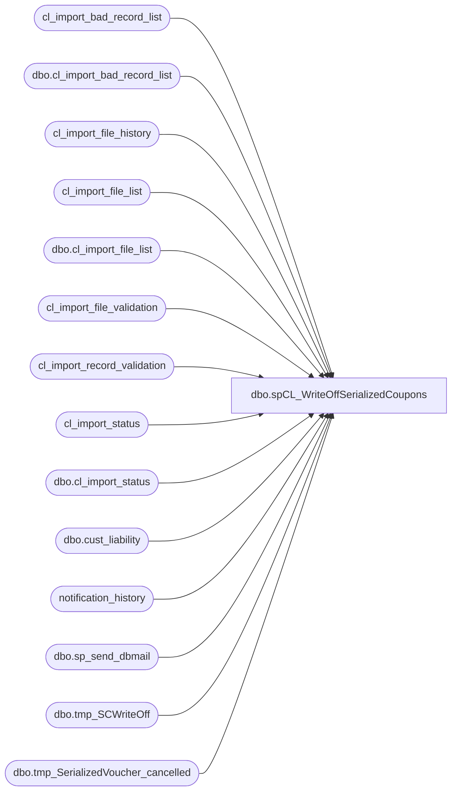

# dbo.spCL_WriteOffSerializedCoupons

**Database:** auditworks  
**Server:** bedrockdb01  

## Architecture Diagram



## Table Dependencies

| Referenced Table |
|---|
| cl_import_bad_record_list |
| dbo.cl_import_bad_record_list |
| cl_import_file_history |
| cl_import_file_list |
| dbo.cl_import_file_list |
| cl_import_file_validation |
| cl_import_record_validation |
| cl_import_status |
| dbo.cl_import_status |
| dbo.cust_liability |
| notification_history |
| dbo.sp_send_dbmail |
| dbo.tmp_SCWriteOff |
| dbo.tmp_SerializedVoucher_cancelled |

## Stored Procedure Code

```sql
--DROP PROC [dbo].[spCL_WriteOffSerializedCoupons]
--GO

CREATE PROC [dbo].[spCL_WriteOffSerializedCoupons]
-- =============================================================================================================
-- Name: [dbo].[spCL_WriteOffSerializedCoupons]
--
-- Description:	Creates files and starts CL Serialized Coupon Write-Off process & notifies via email accordingly
--
--
-- Output: N/A
--
-- Dependencies: 
--
-- Revision History
--		Name:			Date:			Comments:
--		Paul Beckman	12/13/2011		Created SP
--		Paul Beckman	01/13/2012		Updated expiry_date criteria from 30 to 60 per the request of Linda K
--		Paul Beckman	04/10/2012		Updated ROWCOUNT from 500000 to 250000
--		Paul Beckman	07/02/2013		Updated expiry_date criteria from 60 to 90 per the request of Linda K
--		Paul Beckman	10/02/2013		Added validation for SC starting with 2
--		Paul Beckman	07/19/2015		Updated from POSDBSSA to BEDROCKDB01
--		Paul Beckman	08/31/2016		Updated profile_name from 'POSadmin' to 'SAAdmin'
--		Paul Beckman	08/15/2017		Corrected issue with last_name varchar from 20 to 40
--		Paul Beckman	08/15/2017		Updated email body to HTML
--		Paul Beckman	08/22/2017		Added reference_no NOT LIKE '1%' criteria from 'Bad Srlzd Cpn format' validation
--		Paul Beckman	02/13/2018		Removed old non-HTML code for email body
--		Paul Beckman	06/12/2019		Added reference_no NOT LIKE '4%' criteria from 'Bad Srlzd Cpn format' validation
--		Paul Beckman	10/17/2019		Updated to use notification_history table
--		Paul Beckman	12/30/2019		Set [country] [varchar](4) in tmp_SCWriteOff creation.  4 was set to 3.  Needed to account for NULL text
--		Paul Beckman	02/05/2020		Updated email profile to 'EntSysSupport'
--		
--
-- exec spCL_WriteOffSerializedCoupons
-- =============================================================================================================
AS
SET NOCOUNT ON


--###############################################
-- CL SERIALIZED COUPON WRITE-OFF PROCESS STEPS
--###############################################


--####################################################
-- Confirm cl_load_status NOT IN "import in progress" status AND import_end IS NOT NULL in cl_import_status table

IF (Object_ID('tempdb..#status') IS NOT NULL) DROP TABLE #status

SELECT cl_load_status
INTO #status
FROM cl_import_status
WHERE cl_load_status = 'import in progress' OR cl_load_status = 'validating files' OR import_end IS NULL

IF (SELECT COUNT(*) FROM #status) = 1
GOTO FINISH

--####################################################
-- Check if there are files to write-off

IF (SELECT COUNT(*) FROM auditworks.dbo.cust_liability (nolock)
			WHERE   liability_amount > 0
					AND expiry_date < CONVERT(varchar,dateadd(day,-80,getdate()),111)
					AND reference_type = 35
					AND forfeited_flag = 0
					AND amount_7 = 0
					AND amount_4 = 0
					AND amount_3 = liability_amount
					AND pos_status = 30
					AND pos_amount_1 = liability_amount

						and reference_no in
					(
					select [SerializedNumber] from [dbo].[tmp_SerializedVoucher_cancelled] --where SerializedNumber not like '5%'
					)

						) = 0
						
	GOTO FINISH

--####################################################
-- Create files for write-off process

DECLARE @processing_rule varchar(3)
SET @processing_rule = 'S90' -- enter processing rule here

SET ROWCOUNT 500000

    IF EXISTS ( SELECT  *
                FROM    sysobjects
                WHERE   id = OBJECT_ID(N'[tmp_SCWriteOff]')
                        AND type in ( N'U' ) ) 
        DROP TABLE dbo.[tmp_SCWriteOff]

    CREATE TABLE [dbo].[tmp_SCWriteOff]
        (
          [processing_rule] [varchar](3) NULL,
          [reference_no] [varchar](20) NULL,
          [date_issued] [varchar](30) NULL,
          [liability_amount] [numeric](6, 2) NULL,
          [col990] [varchar](3) NULL,
          [blank1] [varchar](1) NULL,
          [blank2] [varchar](1) NULL,
          [blank3] [varchar](1) NULL,
          [customer_no] [numeric](20, 0) NULL,
          [blank4] [varchar](1) NULL,
          [blank5] [varchar](1) NULL,
          [first_name] [varchar](20) NULL,
          [last_name] [varchar](40) NULL,
          [address_1] [varchar](40) NULL,
          [address_2] [varchar](1) NULL,
          [city] [varchar](40) NULL,
          [blank6] [varchar](1) NULL,
          [state] [varchar](40) NULL,
          [country] [varchar](4) NULL,
          [post_code] [varchar](20) NULL,
          [blank7] [varchar](1) NULL,
          [blank8] [varchar](1) NULL,
          [blank9] [varchar](1) NULL,
          [blank10] [varchar](1) NULL,
          [blank11] [varchar](1) NULL,
          [blank12] [varchar](1) NULL,
          [blank13] [varchar](1) NULL,
          [currentdate] [varchar](30) NULL,
        ) 

    INSERT  auditworks.dbo.tmp_SCWriteOff
            SELECT DISTINCT
                    @processing_rule AS processing_rule,
                    reference_no,
                    convert(varchar, date_issued, 101) AS date_issued,
                    liability_amount,
                    '990' AS col990,
                    NULL AS blank1,
                    NULL AS blank2,
                    NULL AS blank3,
                    customer_no,
                    NULL AS blank4,
                    NULL AS blank5,
                    first_name,
                    last_name,
                    address_1,
                    NULL AS address_2,
                    city,
                    NULL AS blank6,
                    state,
                    country,
                    post_code,
                    NULL AS blank7,
                    NULL AS blank8,
                    NULL AS blank9,
                    NULL AS blank10,
                    NULL AS blank11,
                    NULL AS blank12,
                    NULL AS blank13,
                    convert(varchar, getdate(), 101) AS currentdate
            FROM    auditworks.dbo.cust_liability (nolock)
            WHERE   liability_amount > 0
					AND expiry_date < CONVERT(varchar,dateadd(day,-80,getdate()),111)
					AND reference_type = 35
					AND forfeited_flag = 0
					AND amount_7 = 0
					AND amount_4 = 0
					AND amount_3 = liability_amount
					AND pos_status = 30
					AND pos_amount_1 = liability_amount

						and reference_no in
					(
					select [SerializedNumber] from [dbo].[tmp_SerializedVoucher_cancelled] --where SerializedNumber not like '5%'
					)


DECLARE @filename varchar(100)
DECLARE @sql varchar(8000)
DECLARE @cmd varchar(4000)

select  @filename = 'CL' + CONVERT(VARCHAR(8), GETDATE(), 112) + RIGHT('00' + CAST(CONVERT(VARCHAR(2),DATEPART(hh, getdate())) AS VARCHAR),2) + RIGHT('00' + CAST(CONVERT(VARCHAR(2),DATEPART(mi, getdate())) AS VARCHAR),2) + '.tab'
select  @sql = 'SELECT * FROM auditworks.dbo.tmp_SCWriteOff'

select  @cmd = 'bcp "' + @sql + '" queryout "' + '\\saapp01\CL_IMPORT\WriteOff_Serialized_Cpn_Files_for_Processing\' + @filename + '" -T -c'
    select  @cmd
    exec master..xp_cmdshell @cmd


IF (Object_ID('tempdb..##startupload') IS NOT NULL) DROP TABLE ##startupload

CREATE TABLE ##startupload (
COL1 VARCHAR(300)
)

INSERT INTO ##startupload
SELECT 'Serialized Coupon write-off file created on ' + CONVERT(VARCHAR(10), GETDATE(), 101) + ' ' + CONVERT(VARCHAR(8), GETDATE(), 108)

SET @filename = 'start.upload'
SET @sql = 'SELECT * FROM ##startupload'
SET @cmd = 'bcp "' + @sql + '" queryout "\\saapp01\CL_IMPORT\WriteOff_Serialized_Cpn_Files_for_Processing\' + @filename + '" -T -c'
SELECT  @cmd
EXEC master..xp_cmdshell @cmd

DROP TABLE ##startupload

WAITFOR DELAY '00:00:10'

--####################################################
-- Confirm start.upload flag file exists to start the process

IF (Object_ID('tempdb..#startupload') IS NOT NULL) DROP TABLE #startupload
IF (Object_ID('tempdb..#filetext') IS NOT NULL) DROP TABLE #filetext
CREATE TABLE #startupload (dirtext VARCHAR(25))
CREATE TABLE #filetext (dirtext VARCHAR(90))

SET NOCOUNT ON  
DECLARE @drive VARCHAR(5)  
DECLARE @command VARCHAR(200)
DECLARE @backupfolder VARCHAR(20)

SET @drive = 'z:'  
SET @command = 'net use ' + @drive + ' /d'  
EXEC master..xp_cmdshell @command  
SET @command = 'net use ' + @drive + ' \\saapp01\CL_IMPORT\WriteOff_Serialized_Cpn_Files_for_Processing'  
EXEC master..xp_cmdshell @command  
SET @command = 'dir /B ' + @drive + '\start.upload'  
INSERT INTO #startupload (dirtext)
EXEC master..xp_cmdshell @command 

DELETE FROM #startupload WHERE dirtext IS NULL OR dirtext = 'File Not Found'

IF (SELECT COUNT(*) FROM #startupload) = 0
GOTO FINISH

SET @command = 'dir /B ' + @drive + '\*.tab'  
INSERT INTO cl_import_file_list (file_name)
EXEC master..xp_cmdshell @command  
DELETE FROM cl_import_file_list WHERE file_name IS NULL OR file_name = 'File Not Found'

IF (SELECT COUNT(*) FROM cl_import_file_list) = 0
GOTO FINISH
 
BULK INSERT #filetext
    FROM '\\saapp01\CL_IMPORT\WriteOff_Serialized_Cpn_Files_for_Processing\start.upload'


--####################################################
-- Create data in cl_import_status

TRUNCATE TABLE cl_import_status

INSERT INTO cl_import_status VALUES ('process started',CONVERT(VARCHAR(19),GETDATE(),120),NULL,NULL,NULL,NULL,0,0,NULL,NULL)

UPDATE cl_import_status
SET startupload_text = (SELECT *
FROM #filetext)

UPDATE cl_import_status
SET backup_folder = 'WriteOff_SerialCpn'
--'CL' + CONVERT(CHAR(8), GETDATE(), 112) + REPLACE(CONVERT(CHAR(8), GETDATE(), 108), ':', '')


--####################################################
-- Create import.inprogress flag file

--SET @command = 'echo.> "' + @drive + '\import.inprogress"'
--EXEC master..xp_cmdshell @command 


--####################################################
-- Set CL_Import backup folder for original *.tab files

SET @backupfolder = (select backup_folder from cl_import_status)


--####################################################
-- Copy files from files for processing folder to backup folder on POSappSA01

SET @command = 'xcopy /y /v /f ' + @drive + '\*.tab' + ' \\saapp01\CL_IMPORT\Backup\' + @backupfolder + '\'
EXEC master..xp_cmdshell @command 


--####################################################
-- Truncate tables for incoming records for validation

TRUNCATE TABLE cl_import_file_list
TRUNCATE TABLE cl_import_bad_record_list
TRUNCATE TABLE cl_import_file_validation
TRUNCATE TABLE cl_import_record_validation


--####################################################
-- Change cl_load_status

UPDATE cl_import_status
SET cl_load_status = 'validating files'


--####################################################
-- Log file names into cl_import_file_list table

SET @command = 'dir /B ' + @drive + '\*.tab'  
INSERT INTO cl_import_file_list (file_name)
EXEC master..xp_cmdshell @command  
DELETE FROM cl_import_file_list WHERE file_name IS NULL OR file_name = 'File Not Found'

UPDATE cl_import_file_list
SET backup_folder = @backupfolder


--####################################################
-- Update file count in cl_import_status table

UPDATE cl_import_status
SET file_count = 
(select count(*) from cl_import_file_list)


--####################################################
-- Loop through files in cl_import_file_list to perform validations and file renames

--declare cursor  
DECLARE @clfilename VARCHAR(20)
DECLARE @fileid VARCHAR(2)
DECLARE fileid CURSOR FOR  
SELECT file_id
FROM cl_import_file_list 
ORDER BY file_id  
  
--open cursor  
OPEN fileid  
  
FETCH next  
 FROM fileid  
 INTO @fileid  

WHILE @@fetch_status = 0  

BEGIN  

--Sub-Step a

UPDATE cl_import_file_list
SET ict_import_filename = 'CL' + CONVERT(VARCHAR(8), GETDATE(), 112) + RIGHT('00' + CAST(CONVERT(VARCHAR(2),DATEPART(hh, getdate())) AS VARCHAR),2) + RIGHT('00' + CAST(CONVERT(VARCHAR(2),DATEPART(mi, getdate())) AS VARCHAR),2)
FROM cl_import_file_list 
WHERE file_id = @fileid
AND LEN(file_id) = 1

--Sub-Step b

TRUNCATE TABLE cl_import_file_validation


SET @filename = 
(SELECT file_name FROM cl_import_file_list 
WHERE file_id = @fileid)

SET @clfilename = 
(SELECT ict_import_filename FROM cl_import_file_list 
WHERE file_id = @fileid)

    select  @cmd = 'bcp auditworks.dbo.cl_import_file_validation in "\\saapp01\CL_IMPORT\Backup\' + @backupfolder + '\' + @filename + '" -T -c'
    exec master..xp_cmdshell @cmd

--Sub-Step c

UPDATE cl_import_file_list
SET record_count =
(SELECT COUNT(*)
FROM cl_import_file_validation)
WHERE file_id = @fileid

--Sub-Step d

INSERT INTO cl_import_bad_record_list (reference_no)
SELECT reference_no
FROM cl_import_file_validation
WHERE type = 'S90'
AND LEN(reference_no) <> 17
UPDATE cl_import_bad_record_list
SET error_reason = 'Voucher Num length'
WHERE error_reason IS NULL

INSERT INTO cl_import_bad_record_list (reference_no)
SELECT reference_no
FROM cl_import_file_validation
WHERE type = 'S90'
AND reference_no NOT LIKE '1%'
AND reference_no NOT LIKE '2%'
AND reference_no NOT LIKE '4%'
AND reference_no NOT LIKE '5%'
AND reference_no NOT LIKE '6%'
UPDATE cl_import_bad_record_list
SET error_reason = 'Bad Srlzd Cpn format'
WHERE error_reason IS NULL

INSERT INTO cl_import_bad_record_list (reference_no)
SELECT reference_no
FROM cl_import_file_validation
WHERE expiry_date IS NULL
UPDATE cl_import_bad_record_list
SET error_reason = 'Expiry date missing'
WHERE error_reason IS NULL

INSERT INTO cl_import_bad_record_list (reference_no)
SELECT reference_no
FROM cl_import_file_validation
WHERE LEN(email_address) > 50
UPDATE cl_import_bad_record_list
SET error_reason = 'Email too long'
WHERE error_reason IS NULL

INSERT INTO cl_import_bad_record_list (reference_no)
SELECT reference_no
FROM cl_import_file_validation
WHERE expiry_date <> CONVERT(char,DATEADD(day,-0,GETDATE()),101)
UPDATE cl_import_bad_record_list
SET error_reason = 'Bad Expiry date'
WHERE error_reason IS NULL

IF (SELECT COUNT(*) FROM cl_import_bad_record_list WHERE file_name IS NULL) > 0
GOTO BADFILEDATA

--Sub-Step e

/*
UPDATE cl_import_file_validation
SET reference_no = '0' + reference_no
WHERE reference_no like '1%'
AND type = 'R'
AND LEN(reference_no) = 15
*/

--Sub-Step f

UPDATE cl_import_file_list
SET validate_status = 'Passed'
WHERE file_id = @fileid

INSERT INTO cl_import_record_validation SELECT * FROM cl_import_file_validation

SET @command = 'rename "' + @drive + '\' + @filename + '" ' + @clfilename + '.tab'
EXEC master..xp_cmdshell @command 

SET @command = 'echo.> "' + @drive + '\' + @clfilename + '.GO"'
EXEC master..xp_cmdshell @command 

GOTO PASSED

BADFILEDATA:

UPDATE cl_import_bad_record_list
SET file_name = @filename
WHERE file_name IS NULL

UPDATE cl_import_file_list
SET validate_status = 'Failed'
WHERE file_id = @fileid
--AND LEN(file_id) = 1

SET @command = 'rename "' + @drive + '\' + @filename + '" "' + @filename + '.ERROR"'
EXEC master..xp_cmdshell @command 

PASSED:

FETCH next  
 FROM fileid  
 INTO @fileid  
END  
  
CLOSE fileid  
DEALLOCATE fileid


--####################################################
-- Update Failed Files Count in Status

UPDATE cl_import_status
SET failed_files =
(SELECT COUNT(*)
FROM cl_import_file_list
WHERE validate_status = 'Failed')


--####################################################
-- Insert cl_import_file_list into History table

INSERT INTO cl_import_file_history SELECT * FROM cl_import_file_list


--####################################################
-- Update records_to_load in cl_import_status table

UPDATE cl_import_status
SET records_to_load =
(SELECT COUNT(*)
FROM cl_import_record_validation)


--####################################################
-- Update cl_import_status status

UPDATE cl_import_status
SET cl_load_status = 'import in progress'


--####################################################
-- Move .tab & .GO files for importing

SET @command = 'move /Y "' + @drive + '\CL20*.tab" \\saapp01\d$\EPICOR\auditworks\ICT_IMPORT\'
EXEC master..xp_cmdshell @command 

SET @command = 'move /Y "' + @drive + '\CL20*.GO" \\saapp01\d$\EPICOR\auditworks\ICT_IMPORT\'
EXEC master..xp_cmdshell @command 


--####################################################
-- Send Emails

DECLARE @recipients VARCHAR(4000)
DECLARE @copy_recipients VARCHAR(4000)
DECLARE @Subject VARCHAR(80)
DECLARE @query VARCHAR(8000)
DECLARE @text nvarchar(max)

IF (SELECT COUNT(*) FROM auditworks.dbo.cl_import_status WHERE records_to_load = 0 AND failed_files > 0) > 0
GOTO ERROREMAILCHECK

--SET @recipients = 'paulb@buildabear.com'
SET @recipients = 'VoucherWriteOff@buildabear.com'
--SET @copy_recipients = 'BIAdmin@buildabear.com'
--SET @copy_recipients = 'posadmin@buildabear.com'

SET @text = 
		'<font face =arial size = 2>' +
		'Serialized coupon write-off files have been generated and the write-off process has been initiated. <br>' +
		'<br>' +
		'<table border="1">' + 
		'<font face =arial size = 2>' +
		'<tr bgcolor=#D5D5F7><th>Write-off Started</th><th>Total Vouchers</th><th>Notes</th></tr>' +
		CAST ( ( SELECT [td/@align]='center',
						td = CONVERT(VARCHAR(19), import_start, 120), '',
						[td/@align]='right',
						td = FORMAT(SUM(records_to_load),'#,###'), '',
						td = startupload_text, ''
				FROM auditworks.dbo.cl_import_status
				GROUP BY import_start,startupload_text
				FOR xml path ('tr'), type
		) AS NVARCHAR(MAX) ) +
		'</table>' +
		'<br><br>' +
		'The following files found in \\saapp01\CL_IMPORT\WriteOff_Serialized_Cpn_Files_for_Processing are being processed for write-off in Sales Audit... <br>' +
		'<br>' +
		'<table border="1">' + 
		'<font face =arial size = 2>' +
		'<tr bgcolor=#D5D5F7><th>File ID</th><th>Record Count</th><th>Validation Status</th><th>File Name</th></tr>' +
		CAST ( ( SELECT [td/@align]='center',
						td = file_id, '',
						[td/@align]='right',
						td = FORMAT(record_count,'#,###'), '',
						td = validate_status, '',
						td = file_name, ''
				FROM auditworks.dbo.cl_import_file_list
				WHERE validate_status = 'Passed'
				FOR xml path ('tr'), type
		) AS NVARCHAR(MAX) ) +
		'</table>' +
		'<br>' +
		'Files backed up to \\saapp01\CL_IMPORT\Backup\WriteOff_SerialCpn <br>' +
		'<font face =arial size = 1 color="#C0C0C0">' +
		'<br><br><br><br>' +
		'Server:  BEDROCKDB01 <br>' +
		'Job Name:  CL_Serialized_Cpn_WriteOff <br>' +
		'Stored Proc:  BEDROCKDB01.auditworks.dbo.spCL_WriteOffSerializedCoupons <br>' +
		'Created by:  Paul Beckman <br>' +
		'Team Ownership:  Enterprise Systems <br>'

SET @Subject = 'Voucher write-off process STARTED - Serialized Coupon'
	EXEC msdb.dbo.sp_send_dbmail  
	@profile_name = 'EntSysSupport',
	@recipients = @recipients,
	@copy_recipients = @copy_recipients,
	@subject=@Subject,
	@body = @text,
	@body_format = 'HTML'
	--@query_result_width = 250,
	--@query= @query
	
	INSERT INTO notification_history
	(stored_proc_name,
	record_logged_datetime,
	issues_found,
	action_required,
	notification_sent,
	email_type,
	email_to,
	email_cc,
	email_subject,
	comment
	)
	VALUES (
	'spCL_WriteOffSerializedCoupons', --<< Stored Proc name
	GETDATE(),
	'No', --<< Issues found - Yes / No
	'No', --<< Action required - Yes / No
	'Yes', --<< Notification sent - Yes / No
	'Notification Only', --<< Email type - Notification Only / Alert / Warning
	@recipients, --<< Email TO
	NULL, --<< Email CC
	@Subject, --<< Email Subject
	'Serialized coupon write-off files have been generated and the write-off process has been initiated' --<< Comment
	)


ERROREMAILCHECK:
IF (SELECT COUNT(*) FROM auditworks.dbo.cl_import_status WHERE failed_files > 0) = 0
GOTO SKIPERROREMAIL

SET @recipients = 'EntSysSupport@buildabear.com'
--SET @copy_recipients = 'BIAdmin@buildabear.com'
--SET @copy_recipients = 'posadmin@buildabear.com'

SET @text = 
		'<font face =arial size = 2 color="Red">' +
		'Serialized Coupon write-off files have been found with errors <br>' +
		'<br>' +
		'Files that failed validation and will NOT be processed and need to be corrected. <br>' +
		'These files have been renamed to .ERROR and can be found in \\saapp01\CL_IMPORT\WriteOff_Serialized_Cpn_Files_for_Processing for correction <br>' +
		'<table border="1">' + 
		'<font face =arial size = 2>' +
		'<tr bgcolor=#D5D5F7><th>File ID</th><th>Record Count</th><th>Validation Status</th><th>File Name</th></tr>' +
		CAST ( ( SELECT [td/@align]='center',
						td = file_id, '',
						[td/@align]='right',
						td = FORMAT(record_count,'#,###'), '',
						[td/@align]='center',
						td = validate_status, '',
						td = file_name, ''
				FROM auditworks.dbo.cl_import_file_list
				WHERE validate_status = 'Failed'
				FOR xml path ('tr'), type
		) AS NVARCHAR(MAX) ) +
		'</table>' +
		'<br>' +
		'<table border="1">' + 
		'<font face =arial size = 2>' +
		'<tr bgcolor=#D5D5F7><th>Record count NOT being processed</tr>' +
		CAST ( ( SELECT [td/@align]='right',
						td = FORMAT(SUM(record_count),'#,###'), ''
				FROM auditworks.dbo.cl_import_file_list
				WHERE validate_status = 'Failed'
				FOR xml path ('tr'), type
		) AS NVARCHAR(MAX) ) +
		'</table>' +
		'<br>' +
		'Below is a list of the top 100 records that failed.  The full list of failed reference numbers can be found in auditworks.dbo.cl_import_bad_record_list. <br>' +
		'<table border="1">' + 
		'<font face =arial size = 2>' +
		'<tr bgcolor=#D5D5F7><th>Reference Number</th><th>Error Reason</th><th>File Name</th></tr>' +
		CAST ( ( SELECT TOP (100) [td/@align]='right',
						td = reference_no, '',
						[td/@align]='left',
						td = error_reason, '',
						[td/@align]='left',
						td = file_name, ''
				FROM auditworks.dbo.cl_import_bad_record_list
				FOR xml path ('tr'), type
		) AS NVARCHAR(MAX) ) +
		'</table>' +
		'<font face =arial size = 1 color="#C0C0C0">' +
		'<br><br><br><br>' +
		'Server:  BEDROCKDB01 <br>' +
		'Job Name:  CL_Serialized_Cpn_WriteOff <br>' +
		'Stored Proc:  BEDROCKDB01.auditworks.dbo.spCL_WriteOffSerializedCoupons <br>' +
		'Created by:  Paul Beckman <br>' +
		'Team Ownership:  Enterprise Systems <br>'

SET @Subject = 'ALERT - Write-off Serialized Coupon process files failed'
	EXEC msdb.dbo.sp_send_dbmail  
		@profile_name = 'EntSysSupport',
		@recipients = @recipients,
		@copy_recipients = @copy_recipients,
		@subject=@Subject,
		@body = @text,
		@body_format = 'HTML'
		--@query_result_width = 250,
		--@query= @query
	
	INSERT INTO notification_history
	(stored_proc_name,
	record_logged_datetime,
	issues_found,
	action_required,
	notification_sent,
	email_type,
	email_to,
	email_cc,
	email_subject,
	comment
	)
	VALUES (
	'spCL_WriteOffSerializedCoupons', --<< Stored Proc name
	GETDATE(),
	'Yes', --<< Issues found - Yes / No
	'Yes', --<< Action required - Yes / No
	'Yes', --<< Notification sent - Yes / No
	'Alert', --<< Email type - Notification Only / Alert / Warning
	@recipients, --<< Email TO
	NULL, --<< Email CC
	@Subject, --<< Email Subject
	'Serialized Coupon write-off files have been found with errors' --<< Comment
	)

SKIPERROREMAIL:

--####################################################
-- Delete start.upload flag file

SET @command = 'del /Q ' + @drive + '\start.upload'  
EXEC master..xp_cmdshell @command 


--####################################################
-- Delete Mapped drive

SET @command = 'net use ' + @drive + ' /d'
EXEC master..xp_cmdshell @command


--####################################################
FINISH:
```

