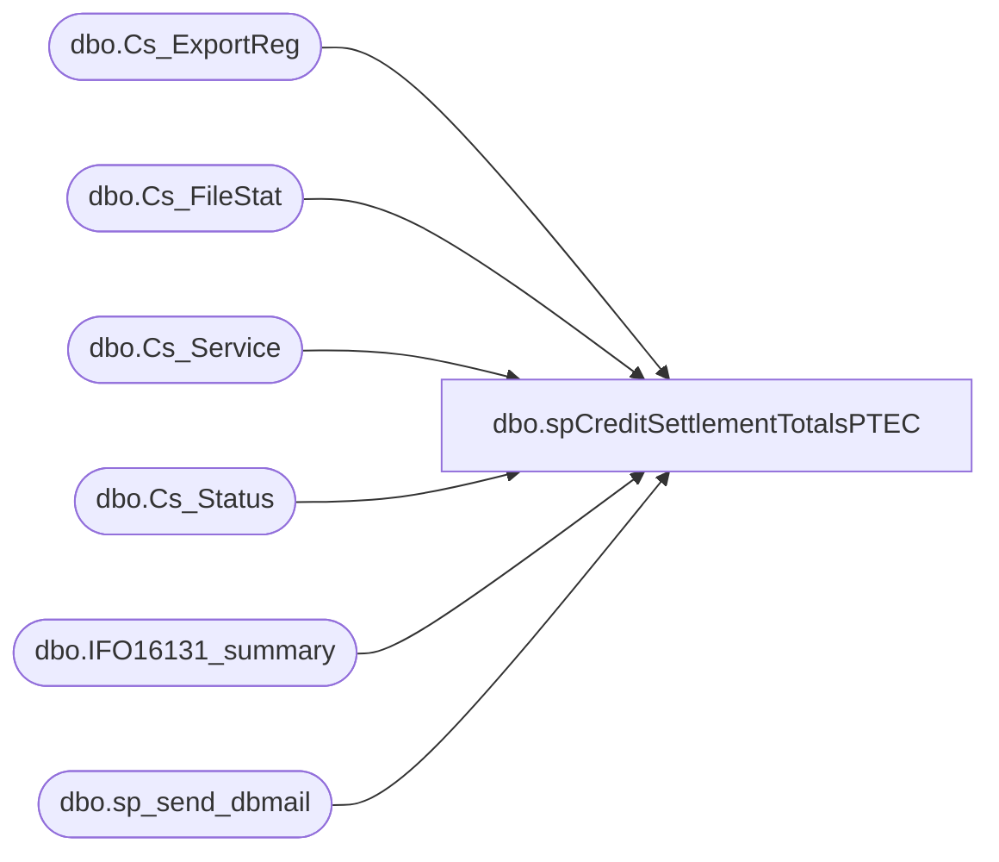

# dbo.spCreditSettlementTotalsPTEC

**Database:** auditworks  
**Server:** bedrockdb01  

## Architecture Diagram



## Table Dependencies

| Referenced Table |
|---|
| dbo.Cs_ExportReg |
| dbo.Cs_FileStat |
| dbo.Cs_Service |
| dbo.Cs_Status |
| dbo.IFO16131_summary |
| dbo.sp_send_dbmail |

## Stored Procedure Code

```sql
CREATE proc [dbo].[spCreditSettlementTotalsPTEC]  
  
-- =====================================================================================================
-- Name: spCreditSettlementTotalsPTEC
--
-- Description:	
--
-- Input:	
--			
--
-- Output: Resultset with the following columns:
--			
--
-- Dependencies: None
--
-- Revision History
--		Name:			Date:			Comments:
--		Garyd			08/30/2010		Initial version in source control
--		Garyd			08/30/2010		Change db named from smartview to foundation.  Change from sendmail to dbmail.
--		Garyd			09/01/2010		Change folder path to new SA server for settlement files.
--		Garyd			10/14/2010		Change admin share path.
--		PaulB			11/08/2010		Changed SP from usp_CreditSettlementTotalsPTEC to spCreditSettlementTotalsPTEC
--		PaulB			11/08/2010		Removed .DONE file validation as this is no longer needed per Epicor (Roula O)
--		PaulB			03/27/2014		Changed email from PaulB to POSADMIN
--		Paul Beckman	07/18/2015		Updated from POSDBSSA to BEDROCKDB01
--		Paul Beckman	08/31/2016		Updated recipients from posadmin@buildabear.com to SAAdmin@buildabear.com
--		Paul Beckman	08/31/2016		Updated profile_name from 'POSadmin' to 'SAAdmin'
--		Paul Beckman	08/31/2016		Removed notification section for poll@buildabear.com
--		Paul Beckman	01/11/2017		Updated email body to HTML
--		Paul Beckman	06/29/2017		Corrected message body text
--
-- exec spCreditSettlementTotalsPTEC
-- =====================================================================================================
AS

set nocount on  
declare @transmissionid char(4)  
declare @from_id char(8)  
declare @to_id char (8)  
declare @recipients varchar(8000)  
declare @Subject varchar(70)  
declare @sql varchar(8000)  
declare @drive varchar(5)  
declare @command varchar(100)
declare @query varchar(8000)
declare @text nvarchar(max)
  
set @sql = ''  
set @Subject = ''  
--set @recipients = 'paulb@buildabear.com'
--prod emails:
--set @recipients = 'lindak@buildabear.com; paulb@buildabear.com'
set @recipients = 'lindak@buildabear.com; jeffa@buildabear.com; SAAdmin@buildabear.com'
  
if (Object_ID('tempdb..##cs_summary') IS NOT NULL) DROP TABLE ##cs_summary  
CREATE TABLE ##cs_summary (  
   TranID CHAR (4),  
   Status char (30),  
   Transmission_Date char (10),  
   Amount money
)  
  
if (Object_ID('tempdb..#cs_temp') IS NOT NULL) DROP TABLE #cs_temp
select c.transmission_id,
	d.status_description_1,
	c.status_id,
	convert(char(11),c.found_datafile_datetime,101) + convert(char(8),c.found_datafile_datetime,8)as found_datafile_datetime,
	c.from_execution_id,
	c.to_execution_id  
into #cs_temp
from foundation.dbo.Cs_Service a,
	 foundation.dbo.Cs_ExportReg b,
	 foundation.dbo.Cs_FileStat c,
	 foundation.dbo.Cs_Status d
where c.cs_file_id = b.cs_file_id
	and a.service_id = b.service_id
	AND b.db_group_id = 1400 
	AND c.status_id = d.status_id 
	AND c.found_datafile_datetime >= convert(char,getdate(),111)
	AND c.retransmitted_datetime is NULL
group by c.transmission_id,
	d.status_description_1,
	c.status_id,
	c.found_datafile_datetime,
	c.to_execution_id,
	c.from_execution_id
order by c.transmission_id desc  
--select * from #cs_temp

--declare cursor  
declare tranid cursor for  
select transmission_id
from #cs_temp  
order by transmission_id  
  
--open cursor  
open tranid  
  
fetch next  
 from tranid  
 into @transmissionid  

while @@fetch_status = 0  

begin  
	select @from_id = from_execution_id, @to_id = to_execution_id
	from #cs_temp  
	where transmission_id = @transmissionid  
	insert into ##cs_summary  
	select cs.transmission_id,
		cs.status_description_1 as Status,
		substring(convert(char,cs.found_datafile_datetime,111),1,10) as Transmission_Date,
		SUM(aip.amount) as Amount
 	from auditworks.dbo.IFO16131_summary aip,
		#cs_temp cs
	where execution_id BETWEEN @from_id AND @to_id  
	 	and cs.transmission_id = @transmissionid  
	group by cs.transmission_id,
		cs.status_description_1,
		cs.found_datafile_datetime  --select * from ##cs_summary
	  
fetch next  
 	from tranid  
 	into @transmissionid  
end  
  
close tranid  
deallocate tranid
  
if (select count(*) from #cs_temp where status_id = '4') = 0  
begin  
 set @Subject = 'WARNING - USA PTEC Credit Settlement Problem'  
end
else
begin  
 set @Subject = 'USA PTEC Credit Settlement Summary'  
end

set @text = 
				'<font face =arial size = 2>' +
				'Below is the status for the Credit Settlement batch send... <br>' +
				'<br>' +
				'<table border="1">' + 
				'<font face =arial size = 2>' +
				'<tr bgcolor=#D5D5F7><th>Tran ID</th><th>Status</th><th>Transmission Date</th><th>Amount</th></tr>' +
				CAST ( ( SELECT [td/@align]='center',
								td = TranID, '',
								[td/@align]='center',
								td = Status, '',
								td = Transmission_Date, '',
								td = Amount, ''
					  FROM ##cs_summary
					  FOR xml path ('tr'), type
				) AS NVARCHAR(MAX) ) +
				'</table>' +
				'<font face =arial size = 1>' +
				'<br><br><br><br>' +
				'Server:  BEDROCKDB01 <br>' +
				'Job Name:  CreditSettlementTotals <br>' +
				'Stored Proc:  BEDROCKDB01.auditworks.dbo.spCreditSettlementTotalsPTEC <br>' +
				'Created by:  Paul Beckman <br>' +
				'Team Ownership:  SAadmin <br>'


exec msdb.dbo.sp_send_dbmail
@profile_name = 'SAAdmin',
@recipients = @recipients,
@subject=@Subject, 
@body = @text,
@body_format = 'HTML'
```

