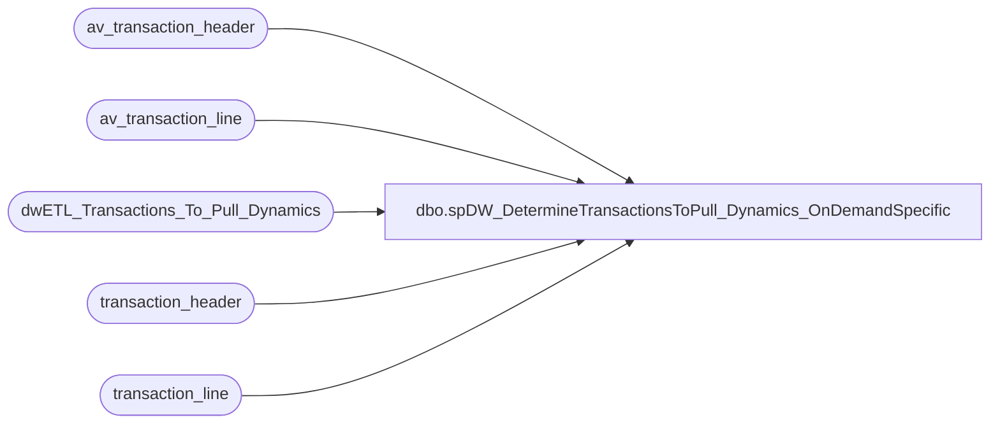

# dbo.spDW_DetermineTransactionsToPull_Dynamics_OnDemandSpecific

**Database:** auditworks  
**Server:** bedrockdb01  

## Architecture Diagram



## Table Dependencies

| Referenced Table |
|---|
| av_transaction_header |
| av_transaction_line |
| dwETL_Transactions_To_Pull_Dynamics |
| transaction_header |
| transaction_line |

## Stored Procedure Code

```sql
CREATE PROCEDURE [dbo].[spDW_DetermineTransactionsToPull_Dynamics_OnDemandSpecific]
    @numDaysHorizon int = 15
AS
	-- =====================================================================================================
	-- Name: spAuditReload
	--
	-- Description:	Determine the transactions which need to be pulled back to the Data Warehouse.
	--				They are stored in the table dwETL_Transactions_To_Pull
	--
	-- Input:	
	--			Days Horizon - The number of days to go back
	--
	-- Output: Resultset with the following columns:
	--			N/A
	--
	-- Dependencies: None
	--
	--GRANT  SELECT ,  UPDATE ,  INSERT ,  DELETE  ON [dbo].[dwETL_Transactions_To_Pull]  TO [pm_repo]
	--GRANT  SELECT ,  UPDATE ,  INSERT ,  DELETE  ON [dbo].[dwETL_Transactions_To_Pull]  TO [link_readonly]
	--
	-- Revision History
	--		Name:			Date:			Comments:
	--		Gary Murrish	7/8/2013		Initial Deployment
	--		Gary Murrish	12/31/2013		Added two stage insert because of dups.
	--		Dan Tweedie		06/15/2016		Added inclusion of transaction_series 'C' when the line_object is 106 and line_action in (8,90,99) (Enterprise Selling)
	--		Tim Callahan	12/15/2022		Created off of original proc, added a where clausse to target specific transactions 
	-- =====================================================================================================

DECLARE @asOfDate datetime
--,@numDaysHorizon int  
--set @numDaysHorizon = '1036'

SET @asOfDate = DATEADD(D, -1 * @numDaysHorizon, DATEDIFF(dd, 0, GETDATE()))

-- NOTE THAT THERE ARE TWO SETS OF EXTRACTION FROM AUDITWORKS,
--	1. The current records
--	2. The archived records

-- ---------------------------------------------------------
-- Get the records from the "Active" tables
-- ---------------------------------------------------------
SELECT
	th.transaction_id,
	th.store_no,
	th.register_no,
	th.transaction_no,
	th.cashier_no,
	th.transaction_category,
	th.transaction_series,
	th.transaction_date,
	th.entry_date_time,
	th.tender_total
INTO #tmpTrans
FROM
	transaction_header th WITH (NOLOCK)
	--WHERE
	--	th.transaction_date >= @asOfDate
	--	AND th.transaction_series IN ('P', '', 'D', 'F', 'W', 'A')
	--	AND th.transaction_void_flag = 0
	--	AND th.transaction_category IN (1, 2, 10)
	--	AND NOT (th.store_no = 13
	--	AND th.register_no = 3
	--	AND th.transaction_date <= '1/31/2012'
	--	) -- Block for Web transactions per Jack McCormick 12/8/2011
WHERE
	(th.transaction_date >= @asOfDate) --or th.transaction_id=446853867)
	AND th.transaction_series IN ('P', '', 'D', 'F', 'W', 'A', 'C','B') --2022-10-30-- added B for Dynamics--2016-04-19 - Added C, Customer Liability (Customer Liability Maintenance), which happens when ES order is shipped (not picked up) 
	AND th.transaction_void_flag = 0
	AND th.transaction_category IN (1, 2, 10, 242) --2016-04-19 - Added 242 (C/L Import)
	AND NOT (th.store_no = 13 AND th.register_no = 3 AND th.transaction_date <= '1/31/2012') -- Block for Web transactions per Jack McCormick 12/8/2011
	and th.transaction_id<>458164492
	-- Below is for AdHoc specific targeted transactions 
	--and th.transaction_id in ('445530260','445532413','445533821','445521171','445864979','450547996','447974050','449683383','450693682','448460254','450734674','452093385','450734682','452100720','451992197','415185156','451995268','451490651','448377116','445504561','445564084','445526683','446870232','449182098','448060545','449214514','449175830','451287766','452237484','451062109','447355553','448911292','445550437','445550440','445644625','446714970','445777666','445783946','450279768','447945235','449150097','450054158','431233780','451317913','451493062','452026528','447920976','447979911','445493748','445495947','446943003','446942992','449671490','448397175','449473638','450102040','451314319','452081109','451792528','449004495','447845608')
	and th.transaction_id in ('481347182','481464873','481355369','481432651')

-- Now only pull the ones which have at least one of a certain type
-- drop table #hasLineObjects
SELECT
	t.transaction_id
INTO #hasLineObjects
FROM
	#tmpTrans t WITH (NOLOCK)
	INNER JOIN transaction_line tl WITH (NOLOCK)
		ON t.transaction_id = tl.transaction_id
		AND tl.line_void_flag = 0
	--WHERE
	--	(t.transaction_category IN (1, 2)
	--	AND tl.line_object_type <> 12)
	--	OR (t.transaction_category IN (10)
	--	AND (tl.line_object_type = 7
	--	OR tl.line_object BETWEEN 700 AND 799))
	--GROUP BY t.transaction_id
WHERE
	(t.transaction_category IN (1, 2) AND tl.line_object_type <> 12 and t.transaction_series <> 'C')
	OR 
	(t.transaction_category IN (10) AND (tl.line_object_type = 7 OR tl.line_object BETWEEN 700 AND 799) and t.transaction_series <> 'C')
	OR
	(t.transaction_category = 242 and tl.line_object = 106 and tl.line_action in (8,90,99) and t.transaction_series = 'C')  --new to include shipment cancels, fulfillments, returns
GROUP BY t.transaction_id

-- ---------------------------------------------------------
-- Get the records from the "Archive" tables
-- ---------------------------------------------------------
SELECT
	th.av_transaction_id AS transaction_id,
	th.store_no,
	th.register_no,
	th.transaction_no,
	th.cashier_no,
	th.transaction_category,
	th.transaction_series,
	th.transaction_date,
	th.entry_date_time,
	th.tender_total
INTO #tmpTransARC
FROM
	av_transaction_header th WITH (NOLOCK)
	--WHERE
	--	th.transaction_date >= @asOfDate
	--	AND th.transaction_series IN ('P', '', 'D', 'F', 'W', 'A')
	--	AND th.transaction_void_flag = 0
	--	AND th.transaction_category IN (1, 2, 10)
	--	AND NOT (th.store_no = 13
	--	AND th.register_no = 3
	--	AND th.transaction_date <= '1/31/2012'
	--	) -- Block for Web transactions per Jack McCormick 12/8/2011
WHERE
	(th.transaction_date >= @asOfDate) --or th.av_transaction_id=446853867)
	AND th.transaction_series IN ('P', '', 'D', 'F', 'W', 'A','C','B') --2016-04-19 - Added C, Customer Liability (Customer Liability Maintenance), which happens when ES order is shipped (not picked up) )
	AND th.transaction_void_flag = 0
	AND th.transaction_category IN (1, 2, 10, 242) --2016-04-19 - Added 242 (C/L Import)
	AND NOT (th.store_no = 13 AND th.register_no = 3 AND th.transaction_date <= '1/31/2012') -- Block for Web transactions per Jack McCormick 12/8/2011
	-- Below is for AdHoc specific targeted transactions 
	--and th.av_transaction_id in ('445530260','445532413','445533821','445521171','445864979','450547996','447974050','449683383','450693682','448460254','450734674','452093385','450734682','452100720','451992197','415185156','451995268','451490651','448377116','445504561','445564084','445526683','446870232','449182098','448060545','449214514','449175830','451287766','452237484','451062109','447355553','448911292','445550437','445550440','445644625','446714970','445777666','445783946','450279768','447945235','449150097','450054158','431233780','451317913','451493062','452026528','447920976','447979911','445493748','445495947','446943003','446942992','449671490','448397175','449473638','450102040','451314319','452081109','451792528','449004495','447845608')
	--and th.av_transaction_id in ('481347182','481464873','481355369','481432651')
	and th.av_transaction_id in ('517032733','517032734','517032735','517032736','517032737','517032738')

-- Now only pull the ones which have at least one of a certain type
SELECT
	t.transaction_id
INTO #hasLineObjectsARC
FROM
	#tmpTransARC t WITH (NOLOCK)
	INNER JOIN av_transaction_line tl WITH (NOLOCK)
		ON t.transaction_id = tl.av_transaction_id
		AND tl.line_void_flag = 0
	--WHERE
	--	(t.transaction_category IN (1, 2)
	--	AND tl.line_object_type <> 12)
	--	OR (t.transaction_category IN (10)
	--	AND (tl.line_object_type = 7
	--	OR tl.line_object BETWEEN 700 AND 799))
	--GROUP BY t.transaction_id
WHERE
	(t.transaction_category IN (1, 2) AND tl.line_object_type <> 12 and t.transaction_series <> 'C')
	OR 
	(t.transaction_category IN (10) AND (tl.line_object_type = 7 OR tl.line_object BETWEEN 700 AND 799) and t.transaction_series <> 'C')
	OR 
	(t.transaction_category = 242 and tl.line_object = 106 and tl.line_action in (8,90,99) and t.transaction_series = 'C')  --new to include shipment cancels, fulfillments, returns
GROUP BY t.transaction_id

-- ---------------------------------------------------------
--	Now put the surviving records into 
--		dwETL_Transactions_To_Pull to get them working
-- ---------------------------------------------------------

TRUNCATE TABLE dwETL_Transactions_To_Pull_Dynamics

INSERT INTO dwETL_Transactions_To_Pull_Dynamics
	(	transaction_id,
		store_no,
		register_no,
		transaction_no,
		cashier_no,
		transaction_category,
		transaction_series,
		transaction_date,
		entry_date_time,
		tender_total)
	SELECT
		t.*
	FROM
		#tmpTrans t
		INNER JOIN #hasLineObjects lo WITH (NOLOCK)
			ON t.transaction_id = lo.transaction_id

-- Now insert the records from the archive table. It is done this way
--		because of duplicate transactions in the archive tables and the primary tables
INSERT INTO dwETL_Transactions_To_Pull_Dynamics
	(	transaction_id,
		store_no,
		register_no,
		transaction_no,
		cashier_no,
		transaction_category,
		transaction_series,
		transaction_date,
		entry_date_time,
		tender_total)
	SELECT
		t.*
	FROM
		#tmpTransARC t
		INNER JOIN #hasLineObjectsARC lo WITH (NOLOCK)
			ON t.transaction_id = lo.transaction_id
		--LEFT JOIN dwETL_Transactions_To_Pull ettp WITH (NOLOCK)
		LEFT JOIN dwETL_Transactions_To_Pull_Dynamics ettp WITH (NOLOCK) -- Replaced above on 1/11/2023
		ON t.transaction_id = ettp.transaction_id
		WHERE ettp.transaction_id IS null
			
--temp fix to prevent known bad transactions from going to DW
if (select count(*) from dwETL_Transactions_To_Pull_Dynamics where transaction_id = 378671016) > 0
	begin

		delete 
		from dwETL_Transactions_To_Pull_Dynamics
		where transaction_id = 378671016

	end
```

