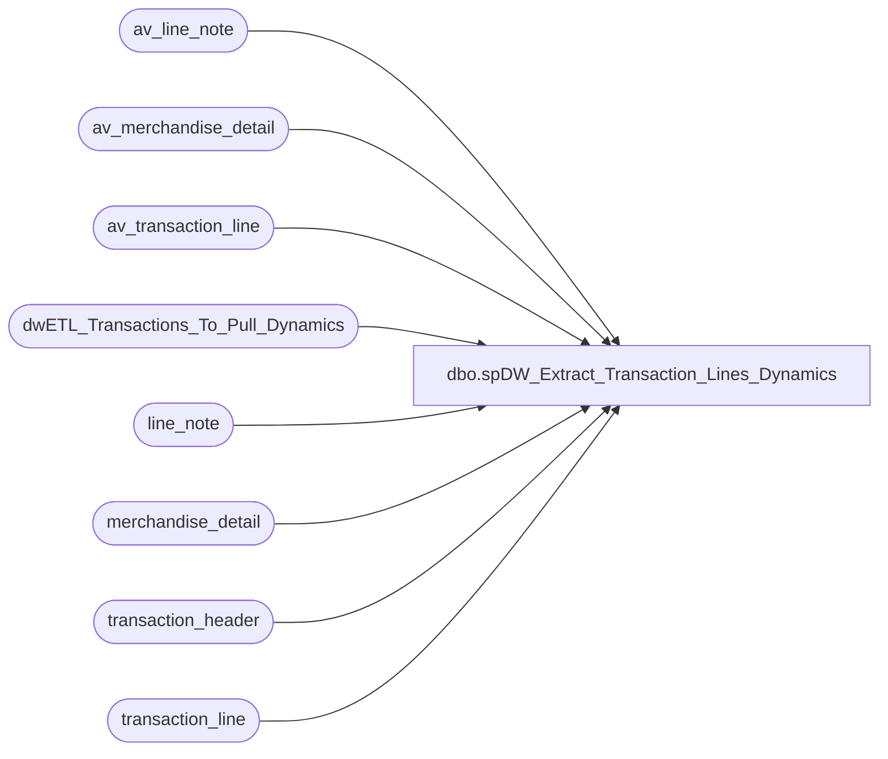

# dbo.spDW_Extract_Transaction_Lines_Dynamics

**Database:** auditworks  
**Server:** bedrockdb01  

## Architecture Diagram



## Table Dependencies

| Referenced Table |
|---|
| av_line_note |
| av_merchandise_detail |
| av_transaction_line |
| dwETL_Transactions_To_Pull_Dynamics |
| line_note |
| merchandise_detail |
| transaction_header |
| transaction_line |

## Stored Procedure Code

```sql
CREATE proc [dbo].[spDW_Extract_Transaction_Lines_Dynamics]

--======================================================================================
--	Dan Tweedie	2021-08-02	Created proc to replace view VWDW_Extract_Transaction_Lines
--======================================================================================

AS


set nocount on

IF (Object_ID('tempdb..#NoChange') IS NOT NULL) DROP TABLE #NoChange
SELECT distinct
	tl.transaction_id,
	tl.line_id,
	tl.line_sequence,
	tl.line_object_type,
	tl.line_object,
	tl.line_action,
	tl.gross_line_amount,
	tl.pos_discount_amount,
	tl.db_cr_none,
	tl.reference_type,
	convert(varchar, tl.reference_no) as reference_no,
	tl.voiding_reversal_flag
into #NoChange
FROM
	dwETL_Transactions_To_Pull_Dynamics trig WITH (NOLOCK)
	INNER JOIN transaction_line tl WITH (NOLOCK) ON tl.transaction_id = trig.transaction_id
WHERE tl.line_void_flag = 0
UNION ALL
SELECT distinct
	tl.av_transaction_id AS transaction_id,
	tl.line_id,
	tl.line_sequence,
	tl.line_object_type,
	tl.line_object,
	tl.line_action,
	tl.gross_line_amount,
	tl.pos_discount_amount,
	tl.db_cr_none,
	tl.reference_type,
	convert(varchar, tl.reference_no) as reference_no,
	tl.voiding_reversal_flag
FROM
	dwETL_Transactions_To_Pull_Dynamics trig WITH (NOLOCK)
	INNER JOIN av_transaction_line tl WITH (NOLOCK) ON tl.av_transaction_id = trig.transaction_id
	LEFT JOIN transaction_header th WITH (NOLOCK) ON trig.transaction_id = th.transaction_id
WHERE tl.line_void_flag = 0
		AND th.transaction_id IS NULL


IF (Object_ID('tempdb..#UPC') IS NOT NULL) DROP TABLE #UPC
SELECT distinct
	tl.transaction_id,
	tl.line_id,
	convert(varchar, md.upc_no) as reference_no
into #UPC
FROM
	dwETL_Transactions_To_Pull_Dynamics trig WITH (NOLOCK)
	INNER JOIN transaction_line tl WITH (NOLOCK) ON tl.transaction_id = trig.transaction_id
join merchandise_detail md with (nolock) on tl.transaction_id = md.transaction_id
	and tl.line_id = md.line_id
WHERE tl.line_void_flag = 0
UNION ALL
SELECT distinct
	tl.av_transaction_id AS transaction_id,
	tl.line_id,
	convert(varchar, md.upc_no) as reference_no
FROM
	dwETL_Transactions_To_Pull_Dynamics trig WITH (NOLOCK)
	INNER JOIN av_transaction_line tl WITH (NOLOCK) ON tl.av_transaction_id = trig.transaction_id
	LEFT JOIN transaction_header th WITH (NOLOCK) ON trig.transaction_id = th.transaction_id
join av_merchandise_detail md with (nolock) on tl.av_transaction_id = md.av_transaction_id
	and tl.line_id = md.line_id
WHERE tl.line_void_flag = 0
		AND th.transaction_id IS NULL
  

IF (Object_ID('tempdb..#Coupon') IS NOT NULL) DROP TABLE #Coupon
SELECT distinct
	tl.transaction_id,
	tl.line_id,
	--convert(varchar, sum(dd.pos_discount_amount)) as reference_no
	convert(varchar, ln.line_note) as reference_no
into #Coupon
FROM
	dwETL_Transactions_To_Pull_Dynamics trig WITH (NOLOCK)
	JOIN transaction_line tl WITH (NOLOCK) ON tl.transaction_id = trig.transaction_id
	join line_note ln with (nolock) on tl.transaction_id = ln.transaction_id
		and tl.line_id = ln.line_id
		and ln.note_type = '9006'
WHERE
	tl.line_void_flag = 0
UNION ALL
SELECT distinct
	tl.av_transaction_id AS transaction_id,
	tl.line_id,
	convert(varchar, ln.line_note) as reference_no
FROM
	dwETL_Transactions_To_Pull_Dynamics trig WITH (NOLOCK)
	JOIN av_transaction_line tl WITH (NOLOCK) ON tl.av_transaction_id = trig.transaction_id
	LEFT JOIN transaction_header th WITH (NOLOCK) ON trig.transaction_id = th.transaction_id
	join av_line_note ln with (nolock) on tl.av_transaction_id = ln.av_transaction_id
	and tl.line_id = ln.line_id
	and ln.note_type = '9006'
WHERE tl.line_void_flag = 0
		AND th.transaction_id IS NULL
  

IF (Object_ID('tempdb..#Merchandise') IS NOT NULL) DROP TABLE #Merchandise
SELECT distinct
	tl.transaction_id,
	tl.line_id,
	convert(varchar, ln.line_note) as reference_no
into #Merchandise
FROM
	dwETL_Transactions_To_Pull_Dynamics trig WITH (NOLOCK)
	INNER JOIN transaction_line tl WITH (NOLOCK)
		ON tl.transaction_id = trig.transaction_id
join line_note ln with (nolock) on tl.transaction_id = ln.transaction_id
	and tl.line_id = ln.line_id
	and ln.note_type = '39'
WHERE
	tl.line_void_flag = 0
UNION ALL
SELECT distinct
	tl.av_transaction_id AS transaction_id,
	tl.line_id,
	convert(varchar, ln.line_note) as reference_no
FROM
	dwETL_Transactions_To_Pull_Dynamics trig WITH (NOLOCK)
	INNER JOIN av_transaction_line tl WITH (NOLOCK)
		ON tl.av_transaction_id = trig.transaction_id
	LEFT JOIN transaction_header th WITH (NOLOCK)
		ON trig.transaction_id = th.transaction_id
join av_line_note ln with (nolock) on tl.av_transaction_id = ln.av_transaction_id
	and tl.line_id = ln.line_id
	and ln.note_type = '39'
WHERE
	tl.line_void_flag = 0
	AND th.transaction_id IS NULL 

IF (Object_ID('tempdb..#Promo') IS NOT NULL) DROP TABLE #Promo
SELECT distinct
	tl.transaction_id,
	tl.line_id,
	convert(varchar, ln.line_note) as reference_no
into #Promo
FROM
	dwETL_Transactions_To_Pull_Dynamics trig WITH (NOLOCK)
	INNER JOIN transaction_line tl WITH (NOLOCK)
		ON tl.transaction_id = trig.transaction_id
join line_note ln with (nolock) on tl.transaction_id = ln.transaction_id
	and tl.line_id = ln.line_id
	and ln.note_type = '20'
WHERE
	tl.line_void_flag = 0
UNION ALL
SELECT distinct
	tl.av_transaction_id AS transaction_id,
	tl.line_id,
	convert(varchar, ln.line_note) as reference_no
FROM
	dwETL_Transactions_To_Pull_Dynamics trig WITH (NOLOCK)
	INNER JOIN av_transaction_line tl WITH (NOLOCK)
		ON tl.av_transaction_id = trig.transaction_id
	LEFT JOIN transaction_header th WITH (NOLOCK)
		ON trig.transaction_id = th.transaction_id
join av_line_note ln with (nolock) on tl.av_transaction_id = ln.av_transaction_id
	and tl.line_id = ln.line_id
	and ln.note_type = '20'
WHERE
	tl.line_void_flag = 0
	AND th.transaction_id IS NULL 
  

IF (Object_ID('tempdb..#TaxExempt') IS NOT NULL) DROP TABLE #TaxExempt
SELECT distinct
	tl.transaction_id,
	tl.line_id,
	convert(varchar, ln.line_note) as reference_no
into #TaxExempt
FROM
	dwETL_Transactions_To_Pull_Dynamics trig WITH (NOLOCK)
	INNER JOIN transaction_line tl WITH (NOLOCK)
		ON tl.transaction_id = trig.transaction_id
join line_note ln with (nolock) on tl.transaction_id = ln.transaction_id
	and tl.line_id = ln.line_id
	and ln.note_type = '38'
WHERE
	tl.line_void_flag = 0
UNION ALL
SELECT distinct
	tl.av_transaction_id AS transaction_id,
	tl.line_id,
	convert(varchar, ln.line_note) as reference_no
FROM
	dwETL_Transactions_To_Pull_Dynamics trig WITH (NOLOCK)
	INNER JOIN av_transaction_line tl WITH (NOLOCK)
		ON tl.av_transaction_id = trig.transaction_id
	LEFT JOIN transaction_header th WITH (NOLOCK)
		ON trig.transaction_id = th.transaction_id
join av_line_note ln with (nolock) on tl.av_transaction_id = ln.av_transaction_id
	and tl.line_id = ln.line_id
	and ln.note_type = '38'
WHERE
	tl.line_void_flag = 0
	AND th.transaction_id IS NULL
  
IF (Object_ID('auditworks..tmpTransactionLinesStage_Dynamics') IS NOT NULL) DROP TABLE tmpTransactionLinesStage_Dynamics;
with 
Summary as 
	(
		select distinct 
				a.transaction_id,
				a.line_id,
				a.line_sequence,
				a.line_object_type,
				a.line_object,
				a.line_action,
				a.gross_line_amount,
				a.pos_discount_amount,
				a.db_cr_none,
				a.reference_type,
				coalesce(nullif(a.reference_no, ''), 
						nullif(right('000000' + b.reference_no, 6), ''),
						nullif(e.reference_no, ''),
						nullif(f.reference_no, ''),
						nullif(d.reference_no, ''),
						nullif(c.reference_no, '')
						) as reference_no,
				a.voiding_reversal_flag

		from  #NoChange a
		left join #UPC b on a.transaction_id = b.transaction_id and a.line_id = b.line_id
		left join #Coupon c on a.transaction_id = c.transaction_id and a.line_id = c.line_id
		left join #Merchandise d on a.transaction_id = d.transaction_id and a.line_id = d.line_id
		left join #Promo e on a.transaction_id = e.transaction_id and a.line_id = e.line_id
		left join #TaxExempt f on  a.transaction_id = f.transaction_id and a.line_id = f.line_id
   )

SELECT 
	transaction_id,
	line_id,
	line_sequence,
	line_object_type,
	line_object,
	line_action,
	gross_line_amount,
	pos_discount_amount,
	db_cr_none,
	reference_type,
	--replace(replace(replace(reference_no, 'PRM',''), 'DM',''), 'CPN','') as reference_no,
	--replace(replace(replace(replace(reference_no, 'PRM',''), 'DM',''), 'CPN',''),'SALEPRICE','') as reference_no, -- Replaced Above on 11/1/2023 as related to JIRA BIB-656
	replace(replace(replace(replace(replace(replace(reference_no, 'PRM',''), 'DM',''), 'CPN',''),'SALEPRICE',''),'LOY',''),'RWD','') as reference_no, -- Replace Above on Apr 24 2025 per findings from an  Issue Raised by David Walsh 
	voiding_reversal_flag
into tmpTransactionLinesStage_Dynamics
from Summary
```

