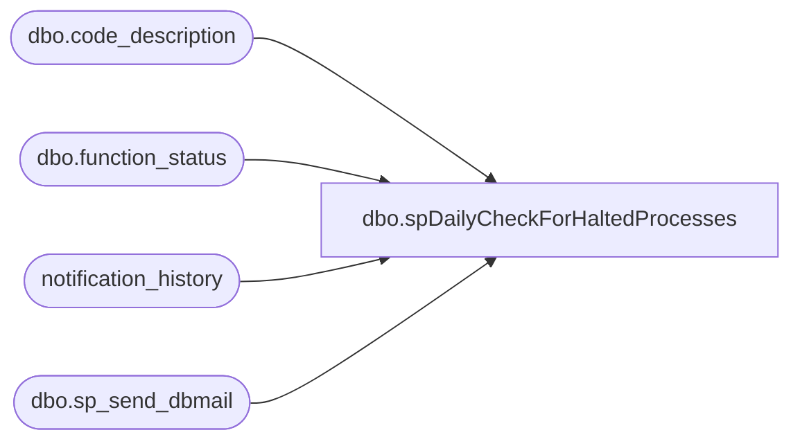

# dbo.spDailyCheckForHaltedProcesses

**Database:** auditworks  
**Server:** bedrockdb01  

## Architecture Diagram



## Table Dependencies

| Referenced Table |
|---|
| dbo.code_description |
| dbo.function_status |
| notification_history |
| dbo.sp_send_dbmail |

## Stored Procedure Code

```sql
--DROP PROC [dbo].[spDailyCheckForHaltedProcesses]
--GO

CREATE PROC [dbo].[spDailyCheckForHaltedProcesses]
-- =============================================================================================================
-- Name: [dbo].[spDailyCheckForHaltedProcesses]
--
-- Description:	Alerts of any outstanding unverified Process Errors
--
-- Input:	@filelocation	varchar(100)	path to drop files
--			@rowcount		int				total number of records to process
--
-- Output: N/A
--
-- Dependencies: 
--
-- Revision History
--		Name:			Date:			Comments:
--		Paul Beckman	10/20/2010		Created SP
--		Paul Beckman	07/18/2015		Updated from POSDBSSA to BEDROCKDB01
--		Paul Beckman	08/31/2016		Updated profile_name from 'POSadmin' to 'SAAdmin'
--		Paul Beckman	01/11/2017		Updated email body to HTML
--		Paul Beckman	02/13/2018		Removed old non-HTML code for email body
--		Paul Beckman	10/03/2019		Updated recipient from 'SAAdmin' to 'EntSysSupport'
--		Paul Beckman	10/17/2019		Updated to use notification_history table
--		Paul Beckman	02/05/2020		Updated email profile to 'EntSysSupport'
--
-- exec spDailyCheckForHaltedProcesses
-- =============================================================================================================
AS
SET NOCOUNT ON

declare @sql varchar(8000)
declare @recipients varchar(8000)
declare @Subject varchar(40)
declare @query varchar(8000)
declare @text nvarchar(max)

if (select count(*) from auditworks.dbo.function_status) > 0    -- where verified = 0) > 0
-- send the email if we have anything to report
begin

set @text = 
				'<font face =arial size = 2>' +
				'Below are the following unverified Halted Processes in Sales Audit... <br>' +
				'These need to be investigated, resolved and verified.<br>' +
				'<br>' +
				'<table border="1">' + 
				'<font face =arial size = 2>' +
				'<tr bgcolor=#D5D5F7><th>Entry DateTime</th><th>Function Description</th><th>Process ID</th></tr>' +
				CAST ( ( SELECT td = convert(varchar(25),entry_date), '',
								td = convert (varchar(30),code_display_descr), '',
								td = process_id, ''
					  FROM auditworks.dbo.function_status,auditworks.dbo.code_description
					  WHERE function_status.function_no = code_description.code
					  ORDER BY entry_date
					  FOR xml path ('tr'), type
				) AS NVARCHAR(MAX) ) +
				'</table>' +
				'<font face =arial size = 1 color="#C0C0C0">' +
				'<br><br><br><br>' +
				'Server:  BEDROCKDB01 <br>' +
				'Job Name:  Daily check for Process Errors <br>' +
				'Stored Proc:  BEDROCKDB01.auditworks.dbo.spDailyCheckForHaltedProcesses <br>' +
				'Created by:  Paul Beckman <br>' +
				'Team Ownership:  Enterprise Systems <br>'

set @Subject = 'ALERT - Auditworks Halted Process'
set @recipients = 'EntSysSupport@buildabear.com'
--set @recipients = 'paulb@buildabear.com'

	exec msdb.dbo.sp_send_dbmail  
		@profile_name = 'EntSysSupport',
		@recipients = @recipients,
		@subject=@Subject, 
		@body = @text,
		@body_format = 'HTML'
	
	INSERT INTO notification_history
	(stored_proc_name,
	record_logged_datetime,
	issues_found,
	action_required,
	notification_sent,
	email_type,
	email_to,
	email_cc,
	email_subject,
	comment
	)
	VALUES (
	'spDailyCheckForHaltedProcesses', --<< Stored Proc name
	GETDATE(),
	'Yes', --<< Issues found - Yes / No
	'Yes', --<< Action required - Yes / No
	'Yes', --<< Notification sent - Yes / No
	'Alert', --<< Email type - Notification Only / Alert / Warning
	@recipients, --<< Email TO
	NULL, --<< Email CC
	@Subject, --<< Email Subject
	'Unverified Halted Processes found in Sales Audit' --<< Comment
	)

end
```

