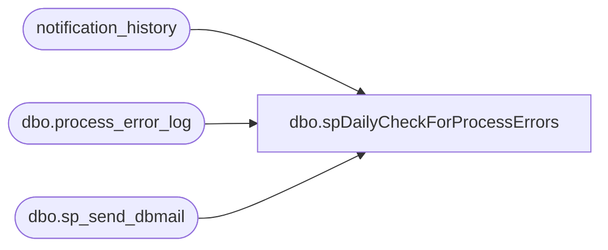

# dbo.spDailyCheckForProcessErrors

**Database:** auditworks  
**Server:** bedrockdb01  

## Architecture Diagram



## Table Dependencies

| Referenced Table |
|---|
| notification_history |
| dbo.process_error_log |
| dbo.sp_send_dbmail |

## Stored Procedure Code

```sql
--DROP PROC [dbo].[spDailyCheckForProcessErrors]
--GO

CREATE PROC [dbo].[spDailyCheckForProcessErrors]
-- =============================================================================================================
-- Name: [dbo].[spDailyCheckForProcessErrors]
--
-- Description:	Alerts of any outstanding unverified Process Errors
--
-- Input:	@filelocation	varchar(100)	path to drop files
--			@rowcount		int				total number of records to process
--
-- Output: N/A
--
-- Dependencies: 
--
-- Revision History
--		Name:			Date:			Comments:
--		Paul Beckman	10/20/2010		Created SP
--		Paul Beckman	07/18/2015		Updated from POSDBSSA to BEDROCKDB01
--		Paul Beckman	07/26/2015		Updated to alert of BCP issues
--		Paul Beckman	08/31/2016		Updated profile_name from 'POSadmin' to 'SAAdmin'
--		Paul Beckman	01/11/2017		Updated email body to HTML
--		Paul Beckman	02/16/2017		Changed @alertrecipients from POSAlert to SAAlert
--		Paul Beckman	02/13/2018		Removed old non-HTML code for email body
--		Paul Beckman	01/25/2019		Added two additional verifications for error_code 201068
--		Paul Beckman	10/03/2019		Updated recipient from 'SAAdmin' to 'EntSysSupport'
--		Paul Beckman	10/17/2019		Updated to use notification_history table
--		Paul Beckman	01/02/2020		Changed SAAlert@buildabear.com to EnterpriseSystemsAlerts@buildabear.com
--		Paul Beckman	02/05/2020		Updated email profile to 'EntSysSupport'
--
-- exec spDailyCheckForProcessErrors
-- =============================================================================================================
@checkstep varchar(3)
AS
SET NOCOUNT ON

UPDATE auditworks.dbo.process_error_log 
SET verified = 1, verified_by_user_id = 136
WHERE process_no = 100
AND error_code = 201527
AND process_name = 'function_cleanup_main_$sp'
AND object_name = 'function_cleanup'
AND message_id = 201527
AND error_msg = 'function_cleanup_main_$sp:  User changes were not saved.  '
AND verified = 0
AND verified_by_user_id IS NULL

UPDATE auditworks.dbo.process_error_log 
SET verified = 1, verified_by_user_id = 136
WHERE process_no = 209
AND error_code = 201068
AND process_name = 'ICT_EXPORT01'
AND object_name = 'parameter_general'
AND message_id = 201068
AND error_msg = 'Failed to select from parameter_general'
AND verified = 0
AND verified_by_user_id IS NULL

UPDATE auditworks.dbo.process_error_log 
SET verified = 1, verified_by_user_id = 136
WHERE process_no = 209
AND error_code = 201068
AND process_name = 'ICT_LAUNCH'
AND object_name = 'parameter_general'
AND message_id = 201068
AND error_msg = 'Unable to select immediate_dayend_requested from parameter_general'
AND verified = 0
AND verified_by_user_id IS NULL

UPDATE auditworks.dbo.process_error_log 
SET verified = 1, verified_by_user_id = 136
WHERE process_no = 209
AND error_code = 201068
AND process_name = 'ICT_EXPORT01'
AND object_name = 'get_export_info_$sp'
AND message_id = 201068
AND error_msg = 'Unable to execute procedure get_export_info_$sp'
AND verified = 0
AND verified_by_user_id IS NULL


DECLARE @sql varchar(8000)
DECLARE @recipients varchar(8000)
DECLARE @alertrecipients varchar(8000)
DECLARE @copy_recipients VARCHAR(4000)
DECLARE @Subject varchar(40)
DECLARE @query varchar(8000)
DECLARE @text nvarchar(max)

--SET @checkstep = 'BCP'
--SET @checkstep = 'REG'

SET @recipients = 'EntSysSupport@buildabear.com'
--SET @recipients = 'paulb@buildabear.com'
SET @alertrecipients = 'EnterpriseSystemsAlerts@buildabear.com'
--SET @alertrecipients = 'paulb@buildabear.com'
SET @copy_recipients = 'EntSysSupport@buildabear.com'

IF @checkstep = 'BCP'
GOTO BCP

--####################################################
REG:


set @text = 
				'<font face =arial size = 2>' +
				'Below are the following unverified Process errors in Sales Audit... <br>' +
				'These need to be investigated, resolved and verified.<br>' +
				'<br>' +
				'<table border="1">' + 
				'<font face =arial size = 2>' +
				'<tr bgcolor=#D5D5F7><th>Error Time Stamp</th><th>Error Message</th></tr>' +
				CAST ( ( SELECT td = CONVERT (VARCHAR(25), error_timestamp,100), '',
								td = CONVERT (VARCHAR(80),error_msg), ''
					  FROM auditworks.dbo.process_error_log
					  WHERE verified = 0
					  ORDER BY error_timestamp
					  FOR xml path ('tr'), type
				) AS NVARCHAR(MAX) ) +
				'</table>' +
				'<font face =arial size = 1 color="#C0C0C0">' +
				'<br><br><br><br>' +
				'Server:  BEDROCKDB01 <br>' +
				'Job Name:  Daily check for Process Errors <br>' +
				'Stored Proc:  BEDROCKDB01.auditworks.dbo.spDailyCheckForProcessErrors <br>' +
				'Created by:  Paul Beckman <br>' +
				'Team Ownership:  Enterprise Systems <br>'

if (select count(*) from auditworks.dbo.process_error_log where verified = 0) > 0
-- send the email if we have anything to report
begin

set @Subject = 'ALERT - Auditworks Process Errors'

	exec msdb.dbo.sp_send_dbmail  
		@profile_name = 'EntSysSupport',
		@recipients = @recipients,
		@subject=@Subject, 
		@body = @text,
		@body_format = 'HTML'
	
	INSERT INTO notification_history
	(stored_proc_name,
	record_logged_datetime,
	issues_found,
	action_required,
	notification_sent,
	email_type,
	email_to,
	email_cc,
	email_subject,
	comment
	)
	VALUES (
	'spDailyCheckForProcessErrors', --<< Stored Proc name
	GETDATE(),
	'Yes', --<< Issues found - Yes / No
	'Yes', --<< Action required - Yes / No
	'Yes', --<< Notification sent - Yes / No
	'Alert', --<< Email type - Notification Only / Alert / Warning
	@recipients, --<< Email TO
	NULL, --<< Email CC
	@Subject, --<< Email Subject
	'Unverified Process errors found in Sales Audit' --<< Comment
	)

end

GOTO FINISH

--####################################################
BCP:

set @text = 
				'<font face =arial size = 3 color="Red">' +
				'Below are the following unverified BCP process errors in Sales Audit... <br>' +
				'These need to be investigated and resolved immediately.  Otherwise numerous missings will result.<br>' +
				'<br>' +
				'<table border="1">' + 
				'<font face =arial size = 2>' +
				'<tr bgcolor=#D5D5F7><th>Error Time Stamp</th><th>Process Name</th><th>Object Name</th><th>AWC Folder Name</th><th>Error Message</th></tr>' +
				CAST ( ( SELECT td = CONVERT (VARCHAR(20), error_timestamp,100), '',
								td = CONVERT (VARCHAR(15),process_name), '',
								td = CONVERT (VARCHAR(30),object_name), '',
								td = 'AWC.' + CONVERT (VARCHAR(10),substring(object_name,3,8))  + '.TR', '',
								td = CONVERT (VARCHAR(50),error_msg), ''
					  FROM auditworks.dbo.process_error_log
						WHERE verified = 0
						AND operation_name = 'bcp'
						AND process_name = 'ICT_EDIT01'
						AND object_name LIKE 'XC%.GO'
						ORDER BY error_timestamp
					  FOR xml path ('tr'), type
				) AS NVARCHAR(MAX) ) +
				'</table>' +
				'<font face =arial size = 1 color="#C0C0C0">' +
				'<br><br><br><br>' +
				'Server:  BEDROCKDB01 <br>' +
				'Job Name:  Daily check for Process Errors <br>' +
				'Stored Proc:  BEDROCKDB01.auditworks.dbo.spDailyCheckForProcessErrors <br>' +
				'Created by:  Paul Beckman <br>' +
				'Team Ownership:  Enterprise Systems <br>'

if (SELECT count(*) 
FROM auditworks.dbo.process_error_log
WHERE verified = 0
AND operation_name = 'bcp'
AND process_name = 'ICT_EDIT01' 
AND object_name LIKE 'XC%.GO') > 0
-- send the email if we have anything to report
begin

set @Subject = 'WARNING - Auditworks BCP Process Errors'

	exec msdb.dbo.sp_send_dbmail  
		@profile_name = 'EntSysSupport',
		@recipients = @alertrecipients,
		@copy_recipients = @copy_recipients,
		@subject=@Subject, 
		@body = @text,
		@body_format = 'HTML'
	
	INSERT INTO notification_history
	(stored_proc_name,
	record_logged_datetime,
	issues_found,
	action_required,
	notification_sent,
	email_type,
	email_to,
	email_cc,
	email_subject,
	comment
	)
	VALUES (
	'spDailyCheckForProcessErrors', --<< Stored Proc name
	GETDATE(),
	'Yes', --<< Issues found - Yes / No
	'Yes', --<< Action required - Yes / No
	'Yes', --<< Notification sent - Yes / No
	'Warning', --<< Email type - Notification Only / Alert / Warning
	@alertrecipients, --<< Email TO
	@copy_recipients, --<< Email CC
	@Subject, --<< Email Subject
	'Unverified BCP process errors found in Sales Audit' --<< Comment
	)

end

--####################################################
FINISH:
```

