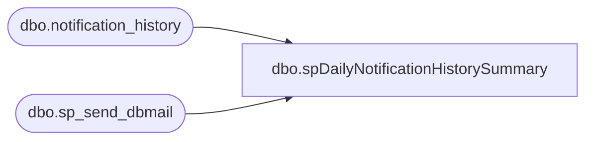

# dbo.spDailyNotificationHistorySummary

**Database:** auditworks  
**Server:** bedrockdb01  

## Architecture Diagram



## Table Dependencies

| Referenced Table |
|---|
| dbo.notification_history |
| dbo.sp_send_dbmail |

## Stored Procedure Code

```sql
--DROP PROC [dbo].[spDailyNotificationHistorySummary]
--GO

CREATE PROC [dbo].[spDailyNotificationHistorySummary]
-- =============================================================================================================
-- Name: [dbo].[spDailyNotificationHistorySummary]
--
-- Description:	Checks for files and starts CL import validation and import process & notifies via email accordingly
--
--
-- Output: N/A
--
-- Dependencies: 
--
-- Revision History
--		Name:			Date:			Comments:
--		Paul Beckman	11/04/2019		Created SP
--		Paul Beckman	02/05/2020		Updated email profile to 'EntSysSupport'
--
-- exec spDailyNotificationHistorySummary
-- =============================================================================================================
AS
SET NOCOUNT ON

IF (Object_ID('tempdb..##NotificationSummary') IS NOT NULL) DROP TABLE ##NotificationSummary

CREATE TABLE ##NotificationSummary (
	[dbname] [varchar](100) NULL,
	[stored_proc_name] [varchar](100) NULL,
	[record_logged_datetime] [datetime] NULL,
	[comment] [varchar](8000) NULL,
	[issues_found] [varchar](5) NULL,
	[action_required] [varchar](5) NULL,
	[notification_sent] [varchar](5) NULL,
	[email_subject] [varchar](150) NULL,
	[email_type] [varchar](20) NULL
	)

INSERT INTO ##NotificationSummary
SELECT 'BEDROCKDK01.auditworks'
	,stored_proc_name
	,CONVERT(VARCHAR(20), record_logged_datetime, 100) AS record_logged_datetime
	,comment
	,issues_found
	,action_required
	,notification_sent
	,email_subject
	,email_type
FROM [BEDROCKDB01].[auditworks].[dbo].[notification_history]
WHERE CONVERT(VARCHAR(10), record_logged_datetime, 101) >= CONVERT(VARCHAR(10),DATEADD(DAY,-0,GETDATE()), 101)

INSERT INTO ##NotificationSummary
SELECT 'BEDROCKDK01.Comm'
	,stored_proc_name
	,CONVERT(VARCHAR(20), record_logged_datetime, 100) AS record_logged_datetime
	,comment
	,issues_found
	,action_required
	,notification_sent
	,email_subject
	,email_type
FROM [BEDROCKDB01].[Comm].[dbo].[notification_history]
WHERE CONVERT(VARCHAR(10), record_logged_datetime, 101) >= CONVERT(VARCHAR(10),DATEADD(DAY,-0,GETDATE()), 101)

INSERT INTO ##NotificationSummary
SELECT 'BEDROCKDK02.me_01'
	,stored_proc_name
	,CONVERT(VARCHAR(20), record_logged_datetime, 100) AS record_logged_datetime
	,comment
	,issues_found
	,action_required
	,notification_sent
	,email_subject
	,email_type
FROM [BEDROCKDB02].[me_01].[dbo].[notification_history]
WHERE CONVERT(VARCHAR(10), record_logged_datetime, 101) >= CONVERT(VARCHAR(10),DATEADD(DAY,-0,GETDATE()), 101)

INSERT INTO ##NotificationSummary
SELECT 'BEDROCKDK02.EJ'
	,stored_proc_name
	,CONVERT(VARCHAR(20), record_logged_datetime, 100) AS record_logged_datetime
	,comment
	,issues_found
	,action_required
	,notification_sent
	,email_subject
	,email_type
FROM [BEDROCKDB02].[EJ].[dbo].[notification_history]
WHERE CONVERT(VARCHAR(10), record_logged_datetime, 101) >= CONVERT(VARCHAR(10),DATEADD(DAY,-0,GETDATE()), 101)

INSERT INTO ##NotificationSummary
SELECT 'BEDROCKDK02.esell'
	,stored_proc_name
	,CONVERT(VARCHAR(20), record_logged_datetime, 100) AS record_logged_datetime
	,comment
	,issues_found
	,action_required
	,notification_sent
	,email_subject
	,email_type
FROM [BEDROCKDB02].[esell].[dbo].[notification_history]
WHERE CONVERT(VARCHAR(10), record_logged_datetime, 101) >= CONVERT(VARCHAR(10),DATEADD(DAY,-0,GETDATE()), 101)

INSERT INTO ##NotificationSummary
SELECT 'BEDROCKDK02.USICOAL'
	,stored_proc_name
	,CONVERT(VARCHAR(20), record_logged_datetime, 100) AS record_logged_datetime
	,comment
	,issues_found
	,action_required
	,notification_sent
	,email_subject
	,email_type
FROM [BEDROCKDB02].[USICOAL].[dbo].[notification_history]
WHERE CONVERT(VARCHAR(10), record_logged_datetime, 101) >= CONVERT(VARCHAR(10),DATEADD(DAY,-0,GETDATE()), 101)

INSERT INTO ##NotificationSummary
SELECT 'STL-CRMDB-P-01.CRM'
	,stored_proc_name
	,CONVERT(VARCHAR(20), record_logged_datetime, 100) AS record_logged_datetime
	,comment
	,issues_found
	,action_required
	,notification_sent
	,email_subject
	,email_type
FROM [STL-CRMDB-P-01].[CRM].[dbo].[notification_history]
WHERE CONVERT(VARCHAR(10), record_logged_datetime, 101) >= CONVERT(VARCHAR(10),DATEADD(DAY,-0,GETDATE()), 101)

--SELECT * FROM ##NotificationSummary

DECLARE @sql VARCHAR(8000)
DECLARE @recipients VARCHAR(8000)
DECLARE @Subject VARCHAR(60)
DECLARE @query VARCHAR(8000)
DECLARE @text NVARCHAR(max)

SET @recipients = 'paulb@buildabear.com'
--SET @recipients = 'EntSysSupport@buildabear.com'

SET @text = 
				'<font face =arial size = 2>' +
				'Daily summary of notification_history for ' + CONVERT(VARCHAR(10), GETDATE(), 101) + '<br>' +
				'<br>' +
				'<table border="1">' + 
				'<font face =arial size = 2>' +
				'<tr bgcolor=#D5D5F7><th>DB Name</th><th>Proc Name</th><th>DateTime</th><th>Comment</th><th>Issues</th><th>Action Req</th><th>Email Sent</th><th>Email Type</th></tr>' +
				CAST ( ( SELECT td = dbname, '',
							td = stored_proc_name, '',
							td = CONVERT(VARCHAR(20), record_logged_datetime, 100), '',
							td = comment, '',
							td = issues_found, '',
							td = action_required, '',
							td = notification_sent, '',
							--td = email_subject, '',
							td = CASE WHEN email_type IS NULL THEN ' ' ELSE email_type END, ''
							--td = email_to, '',
							--td = email_cc, ''
					  FROM ##NotificationSummary
					  WHERE CONVERT(VARCHAR(10), record_logged_datetime, 101) = CONVERT(VARCHAR(10),DATEADD(DAY,-0,GETDATE()), 101)
					  FOR xml path ('tr'), type
				) AS NVARCHAR(MAX) ) +
				'</table>' +
				'<font face =arial size = 1 color="#C0C0C0">' +
				'<br><br><br><br>' +
				'Server:  BEDROCKDB01 <br>' +
				'Job Name:  Daily Notification History Summary <br>' +
				'Stored Proc:  BEDROCKDB01.auditworks.dbo.spDailyNotificationHistorySummary <br>' +
				'Created by:  Paul Beckman <br>' +
				'Team Ownership:  Enterprise Systems <br>'

	set @Subject = 'Daily summary of notification_history for ' + CONVERT(VARCHAR(10), GETDATE(), 101)

	exec msdb.dbo.sp_send_dbmail
	@profile_name = 'EntSysSupport',
	@recipients = @recipients,
	@subject=@Subject, 
	@body = @text,
	@body_format = 'HTML'
```

