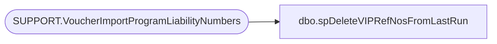

# dbo.spDeleteVIPRefNosFromLastRun

**Database:** auditworks  
**Server:** bedrockdb01  

## Architecture Diagram



## Table Dependencies

| Referenced Table |
|---|
| SUPPORT.VoucherImportProgramLiabilityNumbers |

## Stored Procedure Code

```sql
CREATE  proc [dbo].[spDeleteVIPRefNosFromLastRun]
   
AS
-- =====================================================================================================
-- Name: spDeleteVIPRefNosFromLastRun
--
-- Description:	
--
-- Input:	
--			N/A
--
-- Output: Resultset with the following columns:
--			N/A
--
-- Dependencies: None
--
-- Revision History
--		Name:			Date:			Comments:
--		?				08/24/2010		Initial version source control
-- =====================================================================================================


    /* check if the store exists first. else increment store number. */

    DELETE FROM auditworks.SUPPORT.VoucherImportProgramLiabilityNumbers
where VoucherCreateDate < dateadd(dd,-1,getdate())
```

