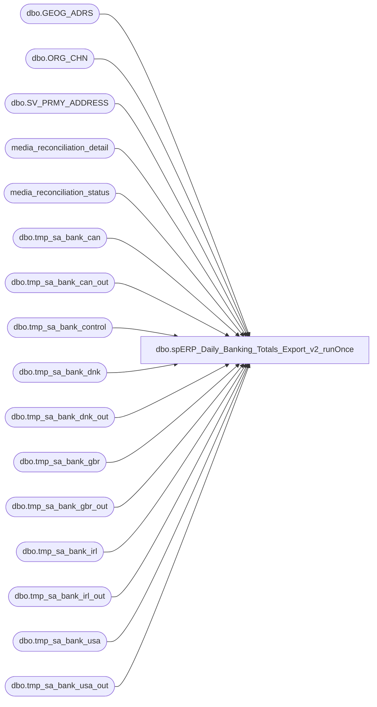

# dbo.spERP_Daily_Banking_Totals_Export_v2_runOnce

**Database:** auditworks  
**Server:** bedrockdb01  

## Architecture Diagram



## Table Dependencies

| Referenced Table |
|---|
| dbo.GEOG_ADRS |
| dbo.ORG_CHN |
| dbo.SV_PRMY_ADDRESS |
| media_reconciliation_detail |
| media_reconciliation_status |
| dbo.tmp_sa_bank_can |
| dbo.tmp_sa_bank_can_out |
| dbo.tmp_sa_bank_control |
| dbo.tmp_sa_bank_dnk |
| dbo.tmp_sa_bank_dnk_out |
| dbo.tmp_sa_bank_gbr |
| dbo.tmp_sa_bank_gbr_out |
| dbo.tmp_sa_bank_irl |
| dbo.tmp_sa_bank_irl_out |
| dbo.tmp_sa_bank_usa |
| dbo.tmp_sa_bank_usa_out |

## Stored Procedure Code

```sql
CREATE procedure [dbo].[spERP_Daily_Banking_Totals_Export_v2_runOnce]

AS
-- =====================================================================================================
--    Tue 9:00pm run for prior Wed-Thu sales
--    Wed 9:00pm run for prior Fri-Sat sales
--    Thu 9:00pm run for prior Sun-Mon sales
--    Fri 9:00pm run for prior Tue sales			
--####################################
-- Run day check
--####################################

-->>>>>>   Comment out this IF statement when running manually on Sat, Sun, or Mon   <<<<<<--
IF (SELECT CAST(LEFT(DATENAME(dw,DATEADD(DAY,-0,GETDATE())),3) AS VARCHAR(3))) IN ('Sat','Sun','Mon')
GOTO FINISH

--####################################
-- Temp Tables
--####################################

IF (Object_ID('tempdb..##ERPStoreData') IS NOT NULL) DROP TABLE ##ERPStoreData
IF (Object_ID('tempdb..##ERPCountryList') IS NOT NULL) DROP TABLE ##ERPCountryList
IF (Object_ID('tempdb..##ERPMediaCash') IS NOT NULL) DROP TABLE ##ERPMediaCash
IF (Object_ID('tempdb..##ERPMediaCashAcct') IS NOT NULL) DROP TABLE ##ERPMediaCashAcct
IF (Object_ID('tempdb..##ERPMediaRec') IS NOT NULL) DROP TABLE ##ERPMediaRec
IF (Object_ID('tempdb..##ERPMediaRecSummary') IS NOT NULL) DROP TABLE ##ERPMediaRecSummary
IF (Object_ID('tempdb..##ERPMediaRecHeaders') IS NOT NULL) DROP TABLE ##ERPMediaRecHeaders
IF (Object_ID('tempdb..##ERPMediaRecOutput') IS NOT NULL) DROP TABLE ##ERPMediaRecOutput

truncate table [dbo].[tmp_sa_bank_can]
truncate table [dbo].[tmp_sa_bank_dnk]
truncate table [dbo].[tmp_sa_bank_gbr]
truncate table [dbo].[tmp_sa_bank_irl]
truncate table [dbo].[tmp_sa_bank_usa]

truncate table [dbo].[tmp_sa_bank_can_out]
truncate table [dbo].[tmp_sa_bank_dnk_out]
truncate table [dbo].[tmp_sa_bank_gbr_out]
truncate table [dbo].[tmp_sa_bank_irl_out]
truncate table [dbo].[tmp_sa_bank_usa_out]

--####################################
-- Declare script variables
--####################################

--DECLARE @SQL VARCHAR(8000)
--DECLARE @CMD VARCHAR(4000)
DECLARE @FileDate VARCHAR(14)
--DECLARE @FileName VARCHAR(40)
--DECLARE @FilePath VARCHAR(90)
DECLARE @ERPFilePath VARCHAR(90)
DECLARE @BackupFilePath VARCHAR(90)
DECLARE @TempFilePath VARCHAR(90)
DECLARE @TransactionStartDate AS INT
DECLARE @TransactionEndDate AS INT

DECLARE @ChkFileDrive VARCHAR(5)  
DECLARE @ChkFileCMD VARCHAR(200)
DECLARE @ChkFileCount VARCHAR(5)

DECLARE @Recipients VARCHAR(4000)
DECLARE @Copy_Recipients VARCHAR(4000)
DECLARE @Subject VARCHAR(80)
DECLARE @Query VARCHAR(8000)
DECLARE @Text nvarchar(max)

--####################################
-- Set Date range used by schedule
--####################################

---- Tue run for prior Wed-Thu sales:
--IF (SELECT CAST(LEFT(DATENAME(dw,DATEADD(DAY,-0,GETDATE())),3) AS VARCHAR(3))) = 'Tue'
--BEGIN
--SET @TransactionStartDate = 6
--SET @TransactionEndDate = 5
--END

---- Wed run for prior Fri-Sat sales:
--IF (SELECT CAST(LEFT(DATENAME(dw,DATEADD(DAY,-0,GETDATE())),3) AS VARCHAR(3))) = 'Wed'
--BEGIN
--SET @TransactionStartDate = 5
--SET @TransactionEndDate = 4
--END

---- Thu run for prior Sun-Mon sales:
--IF (SELECT CAST(LEFT(DATENAME(dw,DATEADD(DAY,-0,GETDATE())),3) AS VARCHAR(3))) = 'Thu'
--BEGIN
--SET @TransactionStartDate = 4
--SET @TransactionEndDate = 3
--END

---- Fri run for prior Tue sales:
--IF (SELECT CAST(LEFT(DATENAME(dw,DATEADD(DAY,-0,GETDATE())),3) AS VARCHAR(3))) = 'Fri'
--BEGIN
--SET @TransactionStartDate = 3
--SET @TransactionEndDate = 3
--END


--####################################
-- Set dates for manual execution
--####################################

SET @TransactionStartDate = 20
SET @TransactionEndDate = 19

-->>>>>>   Set dates then uncomment these two SET statements when running manually   <<<<<<--
--SET @TransactionStartDate = DATEDIFF(DAY, '02/04/2018', GETDATE())  --<< SET START DATE
--SET @TransactionEndDate = DATEDIFF(DAY, '02/04/2018', GETDATE())  --<< SET END DATE


--####################################
-- Build Store and Country info
--####################################

SELECT oc.ORG_CHN_NUM AS StrNum
	,oc.DFLT_CRNCY_CODE AS StrCrncyCode
	,ga.CNTRY_CODE_ISO3 AS StrCountry
	,CASE WHEN ga.CNTRY_CODE_ISO3 = 'USA' THEN '1100SAUDTCLEAR'
		WHEN ga.CNTRY_CODE_ISO3 = 'CAN' THEN '1700SAUDTCLEAR'
		WHEN ga.CNTRY_CODE_ISO3 = 'GBR' THEN '2110SAUDTCLEAR'
		WHEN ga.CNTRY_CODE_ISO3 = 'IRL' THEN '2110IRLCLEAR'
		WHEN ga.CNTRY_CODE_ISO3 = 'DNK' THEN '2300SAUDTCLEAR'
		WHEN ga.CNTRY_CODE_ISO3 = 'CHN' THEN '3001SAUDTCLEAR'
		END AS 'AcctCode'
	,CASE WHEN LEN(oc.ORG_CHN_NUM) <= 3 AND oc.ORG_CHN_NUM NOT IN (470,990,991,995)
		THEN '1' + RIGHT('00' + CONVERT(VARCHAR(3),oc.ORG_CHN_NUM),3)
		WHEN LEN(oc.ORG_CHN_NUM) = 4
		THEN CONVERT(VARCHAR(4),oc.ORG_CHN_NUM)
		END AS 'ERPStrNum'
INTO ##ERPStoreData
FROM auditworks.dbo.ORG_CHN oc  WITH (NOLOCK)
	JOIN	auditworks.dbo.SV_PRMY_ADDRESS spa  WITH (NOLOCK) ON oc.PRTY_ID = spa.PRTY_ID
	JOIN	auditworks.dbo.GEOG_ADRS ga  WITH (NOLOCK) ON spa.ADRS_ID = ga.ADRS_ID
WHERE oc.ORG_CHN_NUM BETWEEN 1 AND 3100
ORDER BY oc.ORG_CHN_NUM

SELECT ROW_NUMBER() OVER(ORDER BY StrCountry ASC) AS CountryID
	,StrCountry
INTO ##ERPCountryList
FROM ##ERPStoreData
WHERE StrCountry IN ('CAN','DNK','GBR','IRL','USA') --<< Add new countries here
GROUP BY StrCountry


--####################################
-- Cash
--####################################

SELECT a.store_no
	,a.transaction_date
	,'9007' line_object
	,SUM(a.rec_amount) AS expected_media_amount
INTO ##ERPMediaCash
FROM media_reconciliation_detail a WITH (NOLOCK)
	,media_reconciliation_status b WITH (NOLOCK)
WHERE a.store_no = b.balancing_entity
AND a.balancing_entity_id = b.balancing_entity_id
AND line_action = 247
AND b.rec_type IN (10,20,21)
AND a.line_object IN (600,601,602,619,625,9007)
AND a.transaction_date BETWEEN CONVERT(VARCHAR,DATEADD(DAY,-@TransactionStartDate,GETDATE()),111) AND CONVERT(VARCHAR,DATEADD(DAY,-@TransactionEndDate,GETDATE()),111)
--AND a.transaction_date BETWEEN CONVERT(VARCHAR,DATEADD(DAY,-3,GETDATE()),111) AND CONVERT(VARCHAR,DATEADD(DAY,-3,GETDATE()),111)
--AND a.store_no IN (1,2,26,48,59,125,146,158,220,272)
GROUP BY a.store_no
	,a.transaction_date
ORDER BY a.store_no

SELECT a.*
	,b.StrCountry
	,b.StrCrncyCode
	,b.AcctCode
	,b.ERPStrNum
INTO ##ERPMediaRec
FROM ##ERPMediaCash a
	JOIN ##ERPStoreData b WITH (NOLOCK)
		ON a.store_no = b.StrNum


--####################################
-- Add Summary Totals
--####################################

INSERT INTO ##ERPMediaRec
SELECT '9999'
	,transaction_date
	,line_object
	,SUM(expected_media_amount)
	,StrCountry
	,StrCrncyCode
	,AcctCode
	,'9999'
FROM ##ERPMediaRec
GROUP BY line_object
	,transaction_date
	,StrCountry
	,StrCrncyCode
	,AcctCode


--####################################
-- Set variables
--####################################

SET @FileDate = (SELECT CONVERT(VARCHAR(8), GETDATE(), 112) + REPLACE(CONVERT(VARCHAR(8),GETDATE(), 108),':',''))

--SET @FilePath = '\\saapp01\Financials\ERP'  --<< File path
--SET @TempFilePath = '\\saapp01\Financials\ERP\Work'
--SET @BackupFilePath = '\\saapp01\Financials\ERP\Backup'

--SET @ERPFilePath = '\\stl-dynsnc-p-01\oData\CashBankStatements'  --<< PROD ERP file destination path

SET @Recipients = 'ianw@buildabear.com'

--select * from ##ERPMediaRec 

--####################################
-- Create Headers file
--####################################

--SELECT 
--	'As Of' AS 'As Of'
--	,'Currency' AS 'Currency'
--	,'BankID Type' AS 'BankID Type'
--	,'BankID' AS 'BankID'
--	,'Account' AS 'Account'
--	,'Data Type' AS 'Data Type'
--	,'BAI Code' AS 'BAI Code'
--	,'Description' AS 'Description'
--	,'Amount' AS 'Amount'
--	,'Balance/Value Date' AS 'Balance/Value Date'
--	,'Customer Reference' AS 'Customer Reference'
--	,'Immediate Availability' AS 'Immediate Availability'
--	,'1 Day Float' AS '1 Day Float'
--	,'2+ DayFloat' AS '2+ DayFloat'
--	,'Bank Reference' AS 'Bank Reference'
--	,'# of Items' AS '# of Items'
--	,'Text' AS 'Text'
--INTO ##ERPMediaRecHeaders

--SET @SQL = 'SELECT * FROM ##ERPMediaRecHeaders'

--SELECT  @CMD = 'bcp "' + @SQL + '" queryout "' + @TempFilePath + '\SA_ERP_BANK_HEADERS.csv" -T -c -t,'
--    SELECT  @CMD
--    exec master..xp_cmdshell @CMD

--####################################
-- Create file for each country
--   loops through each country code
--   to create results & file output
--####################################

--DECLARE @cntrycode VARCHAR(3)
--DECLARE cntrycode CURSOR FOR  
--SELECT StrCountry
--FROM ##ERPCountryList 
--ORDER BY CountryID  
  
----open cursor  
--OPEN cntrycode  
  
--FETCH next  
-- FROM cntrycode  
-- INTO @cntrycode  

--WHILE @@fetch_status = 0  

--BEGIN

--IF (Object_ID('tempdb..##ERPMediaRecOutput') IS NOT NULL) DROP TABLE ##ERPMediaRecOutput

--SELECT CONVERT(VARCHAR(10), GETDATE(), 101) AS 'As Of'
--	,StrCrncyCode AS 'Currency'
--	,'ABA' AS 'BankID Type'
--	,'123456789' AS 'BankID'
--	,AcctCode AS 'Account'
--	,CASE WHEN ERPStrNum = '9999' THEN 'Debits'
--		ELSE 'Credits'
--		END AS 'Data Type'
--	,CASE WHEN ERPStrNum = '9999' THEN '699'
--		ELSE '399'
--		END AS 'BAI Code'
--	,CASE WHEN ERPStrNum = '9999' THEN 'Disbursement'
--		ELSE 'Deposit'
--		END AS 'Description'
--	,CONVERT(DECIMAL(10,2),expected_media_amount) AS 'Amount'
--	,NULL AS 'Balance/Value Date'
--	,ERPStrNum AS 'Customer Reference'
--	,NULL AS 'Immediate Availability'
--	,NULL AS '1 Day Float'
--	,NULL AS '2+ DayFloat'
--	,CONVERT(VARCHAR(8), transaction_date, 112) + ERPStrNum AS 'Bank Reference'
--	,NULL AS '# of Items'
--	,CONVERT(VARCHAR(8), transaction_date, 112) + ERPStrNum AS 'Text'
--INTO ##ERPMediaRecOutput
--FROM ##ERPMediaRec WITH (NOLOCK)
--WHERE StrCountry = 'CAN'
--AND expected_media_amount != 0
--ORDER BY transaction_date
--	,ERPStrNum
	

--SET @FileName = '\ERP_DAILY_SA_BANK_' + @cntrycode + '_' + @FileDate

--SET @SQL = 'SELECT * FROM ##ERPMediaRecOutput'


--INSERT INTO [dbo].[tmp_sa_bank_can] ([As Of],[Currency],[BankID Type],[BankID],[Account],[Data Type],[BAI Code],
--[Description],[Amount],[Balance/Value Date],[Customer Reference],[Immediate Availability],[1 Day Float],[2+ DayFloat],[Bank Reference],[# of Items],[Text])
--SELECT CONVERT(VARCHAR(10), GETDATE(), 101) ,StrCrncyCode ,'ABA','123456789',AcctCode AS 'Account',CASE WHEN ERPStrNum = '9999' THEN 'Debits' ELSE 'Credits' END AS 'Data Type'
--,CASE WHEN ERPStrNum = '9999' THEN '699' ELSE '399' END AS 'BAI Code', CASE WHEN ERPStrNum = '9999' THEN 'Disbursement' ELSE 'Deposit' END AS 'Description'
--,CONVERT(DECIMAL(10,2),expected_media_amount) ,NULL,ERPStrNum,NULL,NULL,NULL,CONVERT(VARCHAR(8), transaction_date, 112) + ERPStrNum,NULL ,CONVERT(VARCHAR(8), transaction_date, 112) + ERPStrNum 
--FROM ##ERPMediaRec WITH (NOLOCK) WHERE StrCountry = 'CAN' AND expected_media_amount != 0 ORDER BY transaction_date,ERPStrNum

--INSERT INTO [dbo].[tmp_sa_bank_dnk] ([As Of],[Currency],[BankID Type],[BankID],[Account],[Data Type],[BAI Code],
--[Description],[Amount],[Balance/Value Date],[Customer Reference],[Immediate Availability],[1 Day Float],[2+ DayFloat],[Bank Reference],[# of Items],[Text])
--SELECT CONVERT(VARCHAR(10), GETDATE(), 101) ,StrCrncyCode ,'ABA','123456789',AcctCode AS 'Account',CASE WHEN ERPStrNum = '9999' THEN 'Debits' ELSE 'Credits' END AS 'Data Type'
--,CASE WHEN ERPStrNum = '9999' THEN '699' ELSE '399' END AS 'BAI Code', CASE WHEN ERPStrNum = '9999' THEN 'Disbursement' ELSE 'Deposit' END AS 'Description'
--,CONVERT(DECIMAL(10,2),expected_media_amount) ,NULL,ERPStrNum,NULL,NULL,NULL,CONVERT(VARCHAR(8), transaction_date, 112) + ERPStrNum,NULL ,CONVERT(VARCHAR(8), transaction_date, 112) + ERPStrNum 
--FROM ##ERPMediaRec WITH (NOLOCK) WHERE StrCountry = 'DNK' AND expected_media_amount != 0 ORDER BY transaction_date,ERPStrNum

--INSERT INTO [dbo].[tmp_sa_bank_gbr] ([As Of],[Currency],[BankID Type],[BankID],[Account],[Data Type],[BAI Code],
--[Description],[Amount],[Balance/Value Date],[Customer Reference],[Immediate Availability],[1 Day Float],[2+ DayFloat],[Bank Reference],[# of Items],[Text])
--SELECT CONVERT(VARCHAR(10), GETDATE(), 101) ,StrCrncyCode ,'ABA','123456789',AcctCode AS 'Account',CASE WHEN ERPStrNum = '9999' THEN 'Debits' ELSE 'Credits' END AS 'Data Type'
--,CASE WHEN ERPStrNum = '9999' THEN '699' ELSE '399' END AS 'BAI Code', CASE WHEN ERPStrNum = '9999' THEN 'Disbursement' ELSE 'Deposit' END AS 'Description'
--,CONVERT(DECIMAL(10,2),expected_media_amount) ,NULL,ERPStrNum,NULL,NULL,NULL,CONVERT(VARCHAR(8), transaction_date, 112) + ERPStrNum,NULL ,CONVERT(VARCHAR(8), transaction_date, 112) + ERPStrNum 
--FROM ##ERPMediaRec WITH (NOLOCK) WHERE StrCountry = 'GBR' AND expected_media_amount != 0 ORDER BY transaction_date,ERPStrNum

INSERT INTO [dbo].[tmp_sa_bank_irl] ([As Of],[Currency],[BankID Type],[BankID],[Account],[Data Type],[BAI Code],
[Description],[Amount],[Balance/Value Date],[Customer Reference],[Immediate Availability],[1 Day Float],[2+ DayFloat],[Bank Reference],[# of Items],[Text])
SELECT CONVERT(VARCHAR(10), GETDATE(), 101) ,StrCrncyCode ,'ABA','123456789',AcctCode AS 'Account',CASE WHEN ERPStrNum = '9999' THEN 'Debits' ELSE 'Credits' END AS 'Data Type'
,CASE WHEN ERPStrNum = '9999' THEN '699' ELSE '399' END AS 'BAI Code', CASE WHEN ERPStrNum = '9999' THEN 'Disbursement' ELSE 'Deposit' END AS 'Description'
,CONVERT(DECIMAL(10,2),expected_media_amount) ,NULL,ERPStrNum,NULL,NULL,NULL,CONVERT(VARCHAR(8), transaction_date, 112) + ERPStrNum,NULL ,CONVERT(VARCHAR(8), transaction_date, 112) + ERPStrNum
FROM ##ERPMediaRec WITH (NOLOCK) WHERE StrCountry = 'IRL' AND expected_media_amount != 0 ORDER BY transaction_date,ERPStrNum

--INSERT INTO [dbo].[tmp_sa_bank_usa] ([As Of],[Currency],[BankID Type],[BankID],[Account],[Data Type],[BAI Code],
--[Description],[Amount],[Balance/Value Date],[Customer Reference],[Immediate Availability],[1 Day Float],[2+ DayFloat],[Bank Reference],[# of Items],[Text])
--SELECT CONVERT(VARCHAR(10), GETDATE(), 101) ,StrCrncyCode ,'ABA','123456789',AcctCode AS 'Account',CASE WHEN ERPStrNum = '9999' THEN 'Debits' ELSE 'Credits' END AS 'Data Type'
--,CASE WHEN ERPStrNum = '9999' THEN '699' ELSE '399' END AS 'BAI Code', CASE WHEN ERPStrNum = '9999' THEN 'Disbursement' ELSE 'Deposit' END AS 'Description'
--,CONVERT(DECIMAL(10,2),expected_media_amount) ,NULL,ERPStrNum,NULL,NULL,NULL,CONVERT(VARCHAR(8), transaction_date, 112) + ERPStrNum,NULL ,CONVERT(VARCHAR(8), transaction_date, 112) + ERPStrNum 
--FROM ##ERPMediaRec WITH (NOLOCK) WHERE StrCountry = 'USA' AND expected_media_amount != 0 ORDER BY transaction_date,ERPStrNum

--update  [dbo].[tmp_sa_bank_can]  set [rowNumNew] = [rowNum] + 3
--update  [dbo].[tmp_sa_bank_dnk]  set [rowNumNew] = [rowNum] + 3
--update  [dbo].[tmp_sa_bank_gbr]  set [rowNumNew] = [rowNum] + 3
update  [dbo].[tmp_sa_bank_irl]  set [rowNumNew] = [rowNum] + 3
--update  [dbo].[tmp_sa_bank_usa]  set [rowNumNew] = [rowNum] + 3


--========
DECLARE @DayString varchar(10)
DECLARE @TimeString varchar(10)

set @TimeString = (SELECT REPLACE(CONVERT(varchar(5), GETDATE(), 108), ':', ''))
set @DayString = (SELECT FORMAT(GETDATE(), 'yy') +  RIGHT('00' + CONVERT(NVARCHAR(2), DATEPART(MONTH, GETDATE())), 2) + RIGHT('00' + CONVERT(NVARCHAR(2), DATEPART(DAY, GETDATE())), 2))
--=============

-- IF NOT EXISTS (SELECT * FROM [dbo].[tmp_sa_bank_control] WHERE CountryID=1 and CreatedDate = cast(getdate() as date))
--		INSERT INTO [dbo].[tmp_sa_bank_control] ([CountryID],[StrCountry],[CreatedDate],[lastBatchNum],[DayString],[TimeString])  
--		VALUES (1, 'CAN', cast(getdate() as date), '01',@DayString, @TimeString)
--    ELSE
--       UPDATE [dbo].[tmp_sa_bank_control] SET lastBatchNum = FORMAT(lastBatchNum + 1,'00'), DayString = @DayString, TimeString = @TimeString WHERE CountryID=1 and CreatedDate = cast(getdate() as date)


--IF NOT EXISTS (SELECT * FROM [dbo].[tmp_sa_bank_control] WHERE CountryID=2 and CreatedDate = cast(getdate() as date))
--		INSERT INTO [dbo].[tmp_sa_bank_control] ([CountryID],[StrCountry],[CreatedDate],[lastBatchNum],[DayString],[TimeString])   
--		VALUES (2, 'DNK', cast(getdate() as date), '01',@DayString, @TimeString)
--    ELSE
--       UPDATE [dbo].[tmp_sa_bank_control] SET lastBatchNum = FORMAT(lastBatchNum + 1,'00'), DayString = @DayString, TimeString = @TimeString WHERE CountryID=2 and CreatedDate = cast(getdate() as date)

--IF NOT EXISTS (SELECT * FROM [dbo].[tmp_sa_bank_control] WHERE CountryID=3 and CreatedDate = cast(getdate() as date))
--		INSERT INTO [dbo].[tmp_sa_bank_control] ([CountryID],[StrCountry],[CreatedDate],[lastBatchNum],[DayString],[TimeString])  
--		VALUES (3, 'GBR', cast(getdate() as date), '01',@DayString, @TimeString)
--    ELSE
--       UPDATE [dbo].[tmp_sa_bank_control] SET lastBatchNum = FORMAT(lastBatchNum + 1,'00'), DayString = @DayString, TimeString = @TimeString WHERE CountryID=3 and CreatedDate = cast(getdate() as date)

IF NOT EXISTS (SELECT * FROM [dbo].[tmp_sa_bank_control] WHERE CountryID=4 and CreatedDate = cast(getdate() as date))
		INSERT INTO [dbo].[tmp_sa_bank_control] ([CountryID],[StrCountry],[CreatedDate],[lastBatchNum],[DayString],[TimeString])   
		VALUES (4, 'IRL', cast(getdate() as date), '01',@DayString, @TimeString)
    ELSE
       UPDATE [dbo].[tmp_sa_bank_control] SET lastBatchNum = FORMAT(lastBatchNum + 1,'00'), DayString = @DayString, TimeString = @TimeString WHERE CountryID=4 and CreatedDate = cast(getdate() as date)

--IF NOT EXISTS (SELECT * FROM [dbo].[tmp_sa_bank_control] WHERE CountryID=5 and CreatedDate = cast(getdate() as date))
--		INSERT INTO [dbo].[tmp_sa_bank_control] ([CountryID],[StrCountry],[CreatedDate],[lastBatchNum],[DayString],[TimeString])    
--		VALUES (5, 'USA', cast(getdate() as date), '01',@DayString, @TimeString)
--    ELSE
--       UPDATE [dbo].[tmp_sa_bank_control] SET lastBatchNum = FORMAT(lastBatchNum + 1,'00'), DayString = @DayString, TimeString = @TimeString WHERE CountryID=5 and CreatedDate = cast(getdate() as date)


--=====================================================
--=====================================================
--=====================================================
--=====================================================
--============== Generate files =======================
--=====================================================
--=====================================================
--=====================================================
--=====================================================
--=====================================================
	

DECLARE @SQL VARCHAR(8000)
DECLARE @CMD VARCHAR(8000)
DECLARE @FilePath VARCHAR(250)
DECLARE @FilePath2 VARCHAR(250)
--DECLARE @DayString varchar(10)
--DECLARE @TimeString varchar(10)
DECLARE @DayStringGroup1 varchar(10)
DECLARE @DayStringGroup2 varchar(10)
DECLARE @DayStringLine2 varchar(10)
DECLARE @UniqueSeq varchar(10)
DECLARE @RowCountTrans integer
DECLARE @RowCountGroup integer
DECLARE @RowCountTotal integer
DECLARE @RowCountTransString varchar(20)
DECLARE @RowCountGroupString varchar(20)
DECLARE @RowCountTotalString varchar(20)


--SET @FilePath = '\\stl-ssis-p-01\IntegrationStaging\Dynamics\CashBankStatements'
SET @FilePath = '\\saapp01\Financials\ERP\Backup'
set @FilePath2 = '\\stl-dynsnc-p-01\oData\CashBankStatements\'
set @TimeString = (SELECT REPLACE(CONVERT(varchar(5), GETDATE(), 108), ':', ''))
set @DayString = (SELECT FORMAT(GETDATE(), 'yy') +  RIGHT('00' + CONVERT(NVARCHAR(2), DATEPART(MONTH, GETDATE())), 2) + RIGHT('00' + CONVERT(NVARCHAR(2), DATEPART(DAY, GETDATE())), 2))

-- BLOCK FOR EACH COUNTRY

--=====================================================================================================================================================================================
-- IRL
set @DayStringGroup1 = (select min(LEFT([Bank Reference], 8)) from  [dbo].[tmp_sa_bank_irl])
set @DayStringLine2 = RIGHT(@DayStringGroup1, 6)
set @DayStringGroup2 = (select max(LEFT([Bank Reference], 8)) from  [dbo].[tmp_sa_bank_irl])
set @UniqueSeq = (select DayString + lastBatchNum from [dbo].[tmp_sa_bank_control] where StrCountry = 'IRL' and CreatedDate = cast(getdate() as date))
set @RowCountTrans = (select count(*)+2 from [dbo].[tmp_sa_bank_irl])
set @RowCountGroup = (select count(*)+4 from [dbo].[tmp_sa_bank_irl])
set @RowCountTotal = (select count(*)+6 from [dbo].[tmp_sa_bank_irl])
set @RowCountTransString =  CAST(@RowCountTrans as varchar(20))
set @RowCountGroupString = CAST(@RowCountGroup as varchar(20))
set @RowCountTotalString = CAST(@RowCountTotal as varchar(20))


IF @DayStringGroup1  = @DayStringGroup2   -- check if 1 day or 2 day file

BEGIN
insert [dbo].[tmp_sa_bank_irl_out] (rowNum, col1) select 1,  '01,IRLCLEAR,,' + '' + @DayString + '' +  ',' + '' + @TimeString + '' + ',' + '' + @UniqueSeq + '' +  ',,,2' 
insert [dbo].[tmp_sa_bank_irl_out] (rowNum, col1) select 2,  '02,,IRLCLEAR,1,' + '' + @DayStringLine2 + '' +  ',' + '' + @TimeString + '' + ',' + 'EUR,1'
insert [dbo].[tmp_sa_bank_irl_out] (rowNum, col1) select 3,  '03,2110IRLCLEAR,,010,0,,,015,0,,,045,0,,,040,0,,,072,0,,,074,0,,,075,0,,'
insert [dbo].[tmp_sa_bank_irl_out] (rowNum, col1)
select  rowNumNew, '16,' + [BAI Code] + ',' +  replace(cast([Amount] as varchar),'.','') + ',' + [Description] + ',' + [Bank Reference] + ',' + [Customer Reference] + ',' + [Bank Reference]
from  [dbo].[tmp_sa_bank_irl] where left([Bank Reference],8) = @DayStringGroup1 and Description = 'Deposit' 
insert [dbo].[tmp_sa_bank_irl_out] (rowNum, col1)
select rowNumNew, '16,' + [BAI Code] + ',' +  replace(cast([Amount] as varchar),'.','') + ',' + [Description] + ',' + [Bank Reference] + ',' + [Customer Reference] + ',' + [Bank Reference] 
from  [dbo].[tmp_sa_bank_irl] where left([Bank Reference],8) = @DayStringGroup1  and Description = 'Disbursement'
insert [dbo].[tmp_sa_bank_irl_out] (rowNum, col1) select 99997,  '49,0,' + '' + @RowCountTransString + '' 
insert [dbo].[tmp_sa_bank_irl_out] (rowNum, col1) select 99998,  '98,0,1,' + '' + @RowCountGroupString + '' 
insert [dbo].[tmp_sa_bank_irl_out] (rowNum, col1) select 99999,  '99,0,1,' + '' + @RowCountTotalString + ''
END

ELSE
BEGIN
insert [dbo].[tmp_sa_bank_irl_out] (rowNum, col1) select 1,  '01,IRLCLEAR,,' + '' + @DayString + '' +  ',' + '' + @TimeString + '' + ',' + '' + @UniqueSeq + '' +  ',,,2' 
insert [dbo].[tmp_sa_bank_irl_out] (rowNum, col1) select 2,  '02,,IRLCLEAR,1,' + '' + @DayStringLine2 + '' +  ',' + '' + @TimeString + '' + ',' + 'EUR,1'
insert [dbo].[tmp_sa_bank_irl_out] (rowNum, col1) select 3,  '03,2110IRLCLEAR,,010,0,,,015,0,,,045,0,,,040,0,,,072,0,,,074,0,,,075,0,,'
insert [dbo].[tmp_sa_bank_irl_out] (rowNum, col1)
select  rowNumNew, '16,' + [BAI Code] + ',' +  replace(cast([Amount] as varchar),'.','') + ',' + [Description] + ',' + [Bank Reference] + ',' + [Customer Reference] + ',' + [Bank Reference]
from  [dbo].[tmp_sa_bank_irl] where left([Bank Reference],8) = @DayStringGroup1 and Description = 'Deposit' 
insert [dbo].[tmp_sa_bank_irl_out] (rowNum, col1)
select rowNumNew, '16,' + [BAI Code] + ',' +  replace(cast([Amount] as varchar),'.','') + ',' + [Description] + ',' + [Bank Reference] + ',' + [Customer Reference] + ',' + [Bank Reference] 
from  [dbo].[tmp_sa_bank_irl] where left([Bank Reference],8) = @DayStringGroup1  and Description = 'Disbursement'
insert [dbo].[tmp_sa_bank_irl_out] (rowNum, col1)
select  rowNumNew, '16,' + [BAI Code] + ',' +  replace(cast([Amount] as varchar),'.','') + ',' + [Description] + ',' + [Bank Reference] + ',' + [Customer Reference] + ',' + [Bank Reference]
from  [dbo].[tmp_sa_bank_irl] where left([Bank Reference],8) = @DayStringGroup2 and Description = 'Deposit' 
insert [dbo].[tmp_sa_bank_irl_out] (rowNum, col1)
select rowNumNew, '16,' + [BAI Code] + ',' +  replace(cast([Amount] as varchar),'.','') + ',' + [Description] + ',' + [Bank Reference] + ',' + [Customer Reference] + ',' + [Bank Reference] 
from  [dbo].[tmp_sa_bank_irl] where left([Bank Reference],8) = @DayStringGroup2  and Description = 'Disbursement'
insert [dbo].[tmp_sa_bank_irl_out] (rowNum, col1) select 99997,  '49,0,' + '' + @RowCountTransString + '' 
insert [dbo].[tmp_sa_bank_irl_out] (rowNum, col1) select 99998,  '98,0,1,' + '' + @RowCountGroupString + '' 
insert [dbo].[tmp_sa_bank_irl_out] (rowNum, col1) select 99999,  '99,0,1,' + '' + @RowCountTotalString + '' 
END

SET @SQL = 'SELECT col1 FROM auditworks.dbo.tmp_sa_bank_irl_out order by rowNum asc'

SELECT  @CMD = 'bcp "' + @SQL + '" queryout "' + @FilePath + '\ERP_DAILY_SA_BANK_IRL_' + @FileDate + '.txt" -T -c -t,'
exec master..xp_cmdshell @CMD


SELECT  @CMD = 'bcp "' + @SQL + '" queryout "' + @FilePath2 + '\ERP_DAILY_SA_BANK_IRL_' + @FileDate + '.txt" -T -c -t,'
exec master..xp_cmdshell @CMD
	

----=====================================================================================================================================================================================
---- USA
--set @DayStringGroup1 = (select min(LEFT([Bank Reference], 8)) from  [dbo].[tmp_sa_bank_usa])
--set @DayStringLine2 = RIGHT(@DayStringGroup1, 6)
--set @DayStringGroup2 = (select max(LEFT([Bank Reference], 8)) from  [dbo].[tmp_sa_bank_usa])
--set @UniqueSeq = (select DayString + lastBatchNum from [dbo].[tmp_sa_bank_control] where StrCountry = 'USA' and CreatedDate = cast(getdate() as date))
--set @RowCountTrans = (select count(*)+2 from [dbo].[tmp_sa_bank_usa])
--set @RowCountGroup = (select count(*)+4 from [dbo].[tmp_sa_bank_usa])
--set @RowCountTotal = (select count(*)+6 from [dbo].[tmp_sa_bank_usa])
--set @RowCountTransString =  CAST(@RowCountTrans as varchar(20))
--set @RowCountGroupString = CAST(@RowCountGroup as varchar(20))
--set @RowCountTotalString = CAST(@RowCountTotal as varchar(20))


---- CHECK IS 1 DAY OR 2 DAY FILE
--IF @DayStringGroup1  = @DayStringGroup2

--BEGIN
--insert [dbo].[tmp_sa_bank_usa_out] (rowNum, col1) select 1,  '01,SAUDTCLEAR,,' + '' + @DayString + '' +  ',' + '' + @TimeString + '' + ',' + '' + @UniqueSeq + '' +  ',,,2' 
--insert [dbo].[tmp_sa_bank_usa_out] (rowNum, col1) select 2,  '02,,SAUDTCLEAR,1,' + '' + @DayStringLine2 + '' +  ',' + '' + @TimeString + '' + ',' + 'USD,1'
--insert [dbo].[tmp_sa_bank_usa_out] (rowNum, col1) select 3,  '03,1100SAUDTCLEAR,,010,0,,,015,0,,,045,0,,,040,0,,,072,0,,,074,0,,,075,0,,'
--insert [dbo].[tmp_sa_bank_usa_out] (rowNum, col1)
--select  rowNumNew, '16,' + [BAI Code] + ',' + replace(cast([Amount] as varchar),'.','') + ',' + [Description] + ',' + [Bank Reference] + ',' + [Customer Reference] + ',' + [Bank Reference]
--from  [dbo].[tmp_sa_bank_usa] where left([Bank Reference],8) = @DayStringGroup1 and Description = 'Deposit' 
--insert [dbo].[tmp_sa_bank_usa_out] (rowNum, col1)
--select rowNumNew, '16,' + [BAI Code] + ',' + replace(cast([Amount] as varchar),'.','') + ',' + [Description] + ',' + [Bank Reference] + ',' + [Customer Reference] + ',' + [Bank Reference] 
--from  [dbo].[tmp_sa_bank_usa] where left([Bank Reference],8) = @DayStringGroup1  and Description = 'Disbursement'
--insert [dbo].[tmp_sa_bank_usa_out] (rowNum, col1) select 99997,  '49,0,' + '' + @RowCountTransString + '' 
--insert [dbo].[tmp_sa_bank_usa_out] (rowNum, col1) select 99998,  '98,0,1,' + '' + @RowCountGroupString + '' 
--insert [dbo].[tmp_sa_bank_usa_out] (rowNum, col1) select 99999,  '99,0,1,' + '' + @RowCountTotalString + ''
--END

--ELSE
--BEGIN
--insert [dbo].[tmp_sa_bank_usa_out] (rowNum, col1) select 1,  '01,SAUDTCLEAR,,' + '' + @DayString + '' +  ',' + '' + @TimeString + '' + ',' + '' + @UniqueSeq + '' +  ',,,2' 
--insert [dbo].[tmp_sa_bank_usa_out] (rowNum, col1) select 2,  '02,,SAUDTCLEAR,1,' + '' + @DayStringLine2 + '' +  ',' + '' + @TimeString + '' + ',' + 'USD,1'
--insert [dbo].[tmp_sa_bank_usa_out] (rowNum, col1) select 3,  '03,1100SAUDTCLEAR,,010,0,,,015,0,,,045,0,,,040,0,,,072,0,,,074,0,,,075,0,,'
--insert [dbo].[tmp_sa_bank_usa_out] (rowNum, col1)
--select  rowNumNew, '16,' + [BAI Code] + ',' + replace(cast([Amount] as varchar),'.','') + ',' + [Description] + ',' + [Bank Reference] + ',' + [Customer Reference] + ',' + [Bank Reference]
--from  [dbo].[tmp_sa_bank_usa] where left([Bank Reference],8) = @DayStringGroup1 and Description = 'Deposit' 
--insert [dbo].[tmp_sa_bank_usa_out] (rowNum, col1)
--select rowNumNew, '16,' + [BAI Code] + ',' + replace(cast([Amount] as varchar),'.','') + ',' + [Description] + ',' + [Bank Reference] + ',' + [Customer Reference] + ',' + [Bank Reference] 
--from  [dbo].[tmp_sa_bank_usa] where left([Bank Reference],8) = @DayStringGroup1  and Description = 'Disbursement'
--insert [dbo].[tmp_sa_bank_usa_out] (rowNum, col1)
--select  rowNumNew, '16,' + [BAI Code] + ',' + replace(cast([Amount] as varchar),'.','') + ',' + [Description] + ',' + [Bank Reference] + ',' + [Customer Reference] + ',' + [Bank Reference]
--from  [dbo].[tmp_sa_bank_usa] where left([Bank Reference],8) = @DayStringGroup2 and Description = 'Deposit' 
--insert [dbo].[tmp_sa_bank_usa_out] (rowNum, col1)
--select rowNumNew, '16,' + [BAI Code] + ',' + replace(cast([Amount] as varchar),'.','') + ',' + [Description] + ',' + [Bank Reference] + ',' + [Customer Reference] + ',' + [Bank Reference] 
--from  [dbo].[tmp_sa_bank_usa] where left([Bank Reference],8) = @DayStringGroup2  and Description = 'Disbursement'
--insert [dbo].[tmp_sa_bank_usa_out] (rowNum, col1) select 99997,  '49,0,' + '' + @RowCountTransString + '' 
--insert [dbo].[tmp_sa_bank_usa_out] (rowNum, col1) select 99998,  '98,0,1,' + '' + @RowCountGroupString + '' 
--insert [dbo].[tmp_sa_bank_usa_out] (rowNum, col1) select 99999,  '99,0,1,' + '' + @RowCountTotalString + '' 
--END

--SET @SQL = 'SELECT col1 FROM auditworks.dbo.tmp_sa_bank_usa_out order by rowNum asc'

--SELECT  @CMD = 'bcp "' + @SQL + '" queryout "' + @FilePath + '\ERP_DAILY_SA_BANK_USA_' + @FileDate + '.txt" -T -c -t,'
--exec master..xp_cmdshell @CMD


--SELECT  @CMD = 'bcp "' + @SQL + '" queryout "' + @FilePath2 + '\ERP_DAILY_SA_BANK_USA_' + @FileDate + '.txt" -T -c -t,'
--exec master..xp_cmdshell @CMD


----=====================================================================================================================================================================================
----=====================================================================================================================================================================================
---- CAN
--set @DayStringGroup1 = (select min(LEFT([Bank Reference], 8)) from  [dbo].[tmp_sa_bank_can])
--set @DayStringLine2 = RIGHT(@DayStringGroup1, 6)
--set @DayStringGroup2 = (select max(LEFT([Bank Reference], 8)) from  [dbo].[tmp_sa_bank_can])
--set @UniqueSeq = (select DayString + lastBatchNum from [dbo].[tmp_sa_bank_control] where StrCountry = 'CAN' and CreatedDate = cast(getdate() as date))
--set @RowCountTrans = (select count(*)+2 from [dbo].[tmp_sa_bank_can])
--set @RowCountGroup = (select count(*)+4 from [dbo].[tmp_sa_bank_can])
--set @RowCountTotal = (select count(*)+6 from [dbo].[tmp_sa_bank_can])
--set @RowCountTransString =  CAST(@RowCountTrans as varchar(20))
--set @RowCountGroupString = CAST(@RowCountGroup as varchar(20))
--set @RowCountTotalString = CAST(@RowCountTotal as varchar(20))


---- CHECK IS 1 DAY OR 2 DAY FILE
--IF @DayStringGroup1  = @DayStringGroup2

--BEGIN
--insert [dbo].[tmp_sa_bank_can_out] (rowNum, col1) select 1,  '01,SAUDTCLEAR,,' + '' + @DayString + '' +  ',' + '' + @TimeString + '' + ',' + '' + @UniqueSeq + '' +  ',,,2' 
--insert [dbo].[tmp_sa_bank_can_out] (rowNum, col1) select 2,  '02,,SAUDTCLEAR,1,' + '' + @DayStringLine2 + '' +  ',' + '' + @TimeString + '' + ',' + 'CAD,1'
--insert [dbo].[tmp_sa_bank_can_out] (rowNum, col1) select 3,  '03,1700SAUDTCLEAR,,010,0,,,015,0,,,045,0,,,040,0,,,072,0,,,074,0,,,075,0,,'
--insert [dbo].[tmp_sa_bank_can_out] (rowNum, col1)
--select  rowNumNew, '16,' + [BAI Code] + ',' + replace(cast([Amount] as varchar),'.','') + ',' + [Description] + ',' + [Bank Reference] + ',' + [Customer Reference] + ',' + [Bank Reference]
--from  [dbo].[tmp_sa_bank_can] where left([Bank Reference],8) = @DayStringGroup1 and Description = 'Deposit' 
--insert [dbo].[tmp_sa_bank_can_out] (rowNum, col1)
--select rowNumNew, '16,' + [BAI Code] + ',' + replace(cast([Amount] as varchar),'.','') + ',' + [Description] + ',' + [Bank Reference] + ',' + [Customer Reference] + ',' + [Bank Reference] 
--from  [dbo].[tmp_sa_bank_can] where left([Bank Reference],8) = @DayStringGroup1  and Description = 'Disbursement'
--insert [dbo].[tmp_sa_bank_can_out] (rowNum, col1) select 99997,  '49,0,' + '' + @RowCountTransString + '' 
--insert [dbo].[tmp_sa_bank_can_out] (rowNum, col1) select 99998,  '98,0,1,' + '' + @RowCountGroupString + '' 
--insert [dbo].[tmp_sa_bank_can_out] (rowNum, col1) select 99999,  '99,0,1,' + '' + @RowCountTotalString + ''
--END

--ELSE
--BEGIN
--insert [dbo].[tmp_sa_bank_can_out] (rowNum, col1) select 1,  '01,SAUDTCLEAR,,' + '' + @DayString + '' +  ',' + '' + @TimeString + '' + ',' + '' + @UniqueSeq + '' +  ',,,2' 
--insert [dbo].[tmp_sa_bank_can_out] (rowNum, col1) select 2,  '02,,SAUDTCLEAR,1,' + '' + @DayStringLine2 + '' +  ',' + '' + @TimeString + '' + ',' + 'CAD,1'
--insert [dbo].[tmp_sa_bank_can_out] (rowNum, col1) select 3,  '03,1700SAUDTCLEAR,,010,0,,,015,0,,,045,0,,,040,0,,,072,0,,,074,0,,,075,0,,'
--insert [dbo].[tmp_sa_bank_can_out] (rowNum, col1)
--select  rowNumNew, '16,' + [BAI Code] + ',' + replace(cast([Amount] as varchar),'.','') + ',' + [Description] + ',' + [Bank Reference] + ',' + [Customer Reference] + ',' + [Bank Reference]
--from  [dbo].[tmp_sa_bank_can] where left([Bank Reference],8) = @DayStringGroup1 and Description = 'Deposit' 
--insert [dbo].[tmp_sa_bank_can_out] (rowNum, col1)
--select rowNumNew, '16,' + [BAI Code] + ',' + replace(cast([Amount] as varchar),'.','') + ',' + [Description] + ',' + [Bank Reference] + ',' + [Customer Reference] + ',' + [Bank Reference] 
--from  [dbo].[tmp_sa_bank_can] where left([Bank Reference],8) = @DayStringGroup1  and Description = 'Disbursement'
--insert [dbo].[tmp_sa_bank_can_out] (rowNum, col1)
--select  rowNumNew, '16,' + [BAI Code] + ',' + replace(cast([Amount] as varchar),'.','') + ',' + [Description] + ',' + [Bank Reference] + ',' + [Customer Reference] + ',' + [Bank Reference]
--from  [dbo].[tmp_sa_bank_can] where left([Bank Reference],8) = @DayStringGroup2 and Description = 'Deposit' 
--insert [dbo].[tmp_sa_bank_can_out] (rowNum, col1)
--select rowNumNew, '16,' + [BAI Code] + ',' + replace(cast([Amount] as varchar),'.','') + ',' + [Description] + ',' + [Bank Reference] + ',' + [Customer Reference] + ',' + [Bank Reference] 
--from  [dbo].[tmp_sa_bank_can] where left([Bank Reference],8) = @DayStringGroup2  and Description = 'Disbursement'
--insert [dbo].[tmp_sa_bank_can_out] (rowNum, col1) select 99997,  '49,0,' + '' + @RowCountTransString + '' 
--insert [dbo].[tmp_sa_bank_can_out] (rowNum, col1) select 99998,  '98,0,1,' + '' + @RowCountGroupString + '' 
--insert [dbo].[tmp_sa_bank_can_out] (rowNum, col1) select 99999,  '99,0,1,' + '' + @RowCountTotalString + '' 
--END

--SET @SQL = 'SELECT col1 FROM auditworks.dbo.tmp_sa_bank_can_out order by rowNum asc'

--SELECT  @CMD = 'bcp "' + @SQL + '" queryout "' + @FilePath + '\ERP_DAILY_SA_BANK_CAN_' + @FileDate + '.txt" -T -c -t,'
--exec master..xp_cmdshell @CMD


--SELECT  @CMD = 'bcp "' + @SQL + '" queryout "' + @FilePath2 + '\ERP_DAILY_SA_BANK_CAN_' + @FileDate + '.txt" -T -c -t,'
--exec master..xp_cmdshell @CMD


----=====================================================================================================================================================================================
---- DNK
--set @DayStringGroup1 = (select min(LEFT([Bank Reference], 8)) from  [dbo].[tmp_sa_bank_dnk])
--set @DayStringLine2 = isnull(RIGHT(@DayStringGroup1, 6),@DayString)
--set @DayStringGroup2 = (select max(LEFT([Bank Reference], 8)) from  [dbo].[tmp_sa_bank_dnk])
--set @UniqueSeq = (select DayString + lastBatchNum from [dbo].[tmp_sa_bank_control] where StrCountry = 'DNK' and CreatedDate = cast(getdate() as date))
--set @RowCountTrans = (select count(*)+2 from [dbo].[tmp_sa_bank_dnk])
--set @RowCountGroup = (select count(*)+4 from [dbo].[tmp_sa_bank_dnk])
--set @RowCountTotal = (select count(*)+6 from [dbo].[tmp_sa_bank_dnk])
--set @RowCountTransString =  CAST(@RowCountTrans as varchar(20))
--set @RowCountGroupString = CAST(@RowCountGroup as varchar(20))
--set @RowCountTotalString = CAST(@RowCountTotal as varchar(20))


---- CHECK IS 1 DAY OR 2 DAY FILE
--IF @DayStringGroup1  = @DayStringGroup2

--BEGIN
--insert [dbo].[tmp_sa_bank_dnk_out] (rowNum, col1) select 1,  '01,SAUDTCLEAR,,' + '' + @DayString + '' +  ',' + '' + @TimeString + '' + ',' + '' + @UniqueSeq + '' +  ',,,2' 
--insert [dbo].[tmp_sa_bank_dnk_out] (rowNum, col1) select 2,  '02,,SAUDTCLEAR,1,' + '' + @DayStringLine2 + '' +  ',' + '' + @TimeString + '' + ',' + 'DKK,1'
--insert [dbo].[tmp_sa_bank_dnk_out] (rowNum, col1) select 3,  '03,2300SAUDTCLEAR,,010,0,,,015,0,,,045,0,,,040,0,,,072,0,,,074,0,,,075,0,,'
--insert [dbo].[tmp_sa_bank_dnk_out] (rowNum, col1)
--select  rowNumNew, '16,' + [BAI Code] + ',' + replace(cast([Amount] as varchar),'.','') + ',' + [Description] + ',' + [Bank Reference] + ',' + [Customer Reference] + ',' + [Bank Reference]
--from  [dbo].[tmp_sa_bank_dnk] where left([Bank Reference],8) = @DayStringGroup1 and Description = 'Deposit' 
--insert [dbo].[tmp_sa_bank_dnk_out] (rowNum, col1)
--select rowNumNew, '16,' + [BAI Code] + ',' + replace(cast([Amount] as varchar),'.','') + ',' + [Description] + ',' + [Bank Reference] + ',' + [Customer Reference] + ',' + [Bank Reference] 
--from  [dbo].[tmp_sa_bank_dnk] where left([Bank Reference],8) = @DayStringGroup1  and Description = 'Disbursement'
--insert [dbo].[tmp_sa_bank_dnk_out] (rowNum, col1) select 99997,  '49,0,' + '' + @RowCountTransString + '' 
--insert [dbo].[tmp_sa_bank_dnk_out] (rowNum, col1) select 99998,  '98,0,1,' + '' + @RowCountGroupString + '' 
--insert [dbo].[tmp_sa_bank_dnk_out] (rowNum, col1) select 99999,  '99,0,1,' + '' + @RowCountTotalString + ''
--END

--ELSE
--BEGIN
--insert [dbo].[tmp_sa_bank_dnk_out] (rowNum, col1) select 1,  '01,SAUDTCLEAR,,' + '' + @DayString + '' +  ',' + '' + @TimeString + '' + ',' + '' + @UniqueSeq + '' +  ',,,2' 
--insert [dbo].[tmp_sa_bank_dnk_out] (rowNum, col1) select 2,  '02,,SAUDTCLEAR,1,' + '' + @DayStringLine2 + '' +  ',' + '' + @TimeString + '' + ',' + 'DKK,1'
--insert [dbo].[tmp_sa_bank_dnk_out] (rowNum, col1) select 3,  '03,2300SAUDTCLEAR,,010,0,,,015,0,,,045,0,,,040,0,,,072,0,,,074,0,,,075,0,,'
--insert [dbo].[tmp_sa_bank_dnk_out] (rowNum, col1)
--select  rowNumNew, '16,' + [BAI Code] + ',' + replace(cast([Amount] as varchar),'.','') + ',' + [Description] + ',' + [Bank Reference] + ',' + [Customer Reference] + ',' + [Bank Reference]
--from  [dbo].[tmp_sa_bank_dnk] where left([Bank Reference],8) = @DayStringGroup1 and Description = 'Deposit' 
--insert [dbo].[tmp_sa_bank_dnk_out] (rowNum, col1)
--select rowNumNew, '16,' + [BAI Code] + ',' + replace(cast([Amount] as varchar),'.','') + ',' + [Description] + ',' + [Bank Reference] + ',' + [Customer Reference] + ',' + [Bank Reference] 
--from  [dbo].[tmp_sa_bank_dnk] where left([Bank Reference],8) = @DayStringGroup1  and Description = 'Disbursement'
--insert [dbo].[tmp_sa_bank_dnk_out] (rowNum, col1)
--select  rowNumNew, '16,' + [BAI Code] + ',' + replace(cast([Amount] as varchar),'.','') + ',' + [Description] + ',' + [Bank Reference] + ',' + [Customer Reference] + ',' + [Bank Reference]
--from  [dbo].[tmp_sa_bank_dnk] where left([Bank Reference],8) = @DayStringGroup2 and Description = 'Deposit' 
--insert [dbo].[tmp_sa_bank_dnk_out] (rowNum, col1)
--select rowNumNew, '16,' + [BAI Code] + ',' + replace(cast([Amount] as varchar),'.','') + ',' + [Description] + ',' + [Bank Reference] + ',' + [Customer Reference] + ',' + [Bank Reference] 
--from  [dbo].[tmp_sa_bank_dnk] where left([Bank Reference],8) = @DayStringGroup2  and Description = 'Disbursement'
--insert [dbo].[tmp_sa_bank_dnk_out] (rowNum, col1) select 99997,  '49,0,' + '' + @RowCountTransString + '' 
--insert [dbo].[tmp_sa_bank_dnk_out] (rowNum, col1) select 99998,  '98,0,1,' + '' + @RowCountGroupString + '' 
--insert [dbo].[tmp_sa_bank_dnk_out] (rowNum, col1) select 99999,  '99,0,1,' + '' + @RowCountTotalString + '' 
--END

--SET @SQL = 'SELECT col1 FROM auditworks.dbo.tmp_sa_bank_dnk_out order by rowNum asc'

--SELECT  @CMD = 'bcp "' + @SQL + '" queryout "' + @FilePath + '\ERP_DAILY_SA_BANK_DNK_' + @FileDate + '.txt" -T -c -t,'
--exec master..xp_cmdshell @CMD


--SELECT  @CMD = 'bcp "' + @SQL + '" queryout "' + @FilePath2 + '\ERP_DAILY_SA_BANK_DNK_' + @FileDate + '.txt" -T -c -t,'
--exec master..xp_cmdshell @CMD


----=============================================================================================================================================================================================


---- GBR
--set @DayStringGroup1 = (select min(LEFT([Bank Reference], 8)) from  [dbo].[tmp_sa_bank_gbr])
--set @DayStringLine2 = RIGHT(@DayStringGroup1, 6)
--set @DayStringGroup2 = (select max(LEFT([Bank Reference], 8)) from  [dbo].[tmp_sa_bank_gbr])
--set @UniqueSeq = (select DayString + lastBatchNum from [dbo].[tmp_sa_bank_control] where StrCountry = 'GBR' and CreatedDate = cast(getdate() as date))
--set @RowCountTrans = (select count(*)+2 from [dbo].[tmp_sa_bank_gbr])
--set @RowCountGroup = (select count(*)+4 from [dbo].[tmp_sa_bank_gbr])
--set @RowCountTotal = (select count(*)+6 from [dbo].[tmp_sa_bank_gbr])
--set @RowCountTransString =  CAST(@RowCountTrans as varchar(20))
--set @RowCountGroupString = CAST(@RowCountGroup as varchar(20))
--set @RowCountTotalString = CAST(@RowCountTotal as varchar(20))


---- CHECK IS 1 DAY OR 2 DAY FILE
--IF @DayStringGroup1  = @DayStringGroup2

--BEGIN
--insert [dbo].[tmp_sa_bank_gbr_out] (rowNum, col1) select 1,  '01,SAUDTCLEAR,,' + '' + @DayString + '' +  ',' + '' + @TimeString + '' + ',' + '' + @UniqueSeq + '' +  ',,,2' 
--insert [dbo].[tmp_sa_bank_gbr_out] (rowNum, col1) select 2,  '02,,SAUDTCLEAR,1,' + '' + @DayStringLine2 + '' +  ',' + '' + @TimeString + '' + ',' + 'GBP,1'
--insert [dbo].[tmp_sa_bank_gbr_out] (rowNum, col1) select 3,  '03,2110SAUDTCLEAR,,010,0,,,015,0,,,045,0,,,040,0,,,072,0,,,074,0,,,075,0,,'
--insert [dbo].[tmp_sa_bank_gbr_out] (rowNum, col1)
--select  rowNumNew, '16,' + [BAI Code] + ',' + replace(cast([Amount] as varchar),'.','') + ',' + [Description] + ',' + [Bank Reference] + ',' + [Customer Reference] + ',' + [Bank Reference]
--from  [dbo].[tmp_sa_bank_gbr] where left([Bank Reference],8) = @DayStringGroup1 and Description = 'Deposit' 
--insert [dbo].[tmp_sa_bank_gbr_out] (rowNum, col1)
--select rowNumNew, '16,' + [BAI Code] + ',' + replace(cast([Amount] as varchar),'.','') + ',' + [Description] + ',' + [Bank Reference] + ',' + [Customer Reference] + ',' + [Bank Reference] 
--from  [dbo].[tmp_sa_bank_gbr] where left([Bank Reference],8) = @DayStringGroup1  and Description = 'Disbursement'
--insert [dbo].[tmp_sa_bank_gbr_out] (rowNum, col1) select 99997,  '49,0,' + '' + @RowCountTransString + '' 
--insert [dbo].[tmp_sa_bank_gbr_out] (rowNum, col1) select 99998,  '98,0,1,' + '' + @RowCountGroupString + '' 
--insert [dbo].[tmp_sa_bank_gbr_out] (rowNum, col1) select 99999,  '99,0,1,' + '' + @RowCountTotalString + ''
--END

--ELSE
--BEGIN
--insert [dbo].[tmp_sa_bank_gbr_out] (rowNum, col1) select 1,  '01,SAUDTCLEAR,,' + '' + @DayString + '' +  ',' + '' + @TimeString + '' + ',' + '' + @UniqueSeq + '' +  ',,,2' 
--insert [dbo].[tmp_sa_bank_gbr_out] (rowNum, col1) select 2,  '02,,SAUDTCLEAR,1,' + '' + @DayStringLine2 + '' +  ',' + '' + @TimeString + '' + ',' + 'GBP,1'
--insert [dbo].[tmp_sa_bank_gbr_out] (rowNum, col1) select 3,  '03,2110SAUDTCLEAR,,010,0,,,015,0,,,045,0,,,040,0,,,072,0,,,074,0,,,075,0,,'
--insert [dbo].[tmp_sa_bank_gbr_out] (rowNum, col1)
--select  rowNumNew, '16,' + [BAI Code] + ',' + replace(cast([Amount] as varchar),'.','') + ',' + [Description] + ',' + [Bank Reference] + ',' + [Customer Reference] + ',' + [Bank Reference]
--from  [dbo].[tmp_sa_bank_gbr] where left([Bank Reference],8) = @DayStringGroup1 and Description = 'Deposit' 
--insert [dbo].[tmp_sa_bank_gbr_out] (rowNum, col1)
--select rowNumNew, '16,' + [BAI Code] + ',' + replace(cast([Amount] as varchar),'.','') + ',' + [Description] + ',' + [Bank Reference] + ',' + [Customer Reference] + ',' + [Bank Reference] 
--from  [dbo].[tmp_sa_bank_gbr] where left([Bank Reference],8) = @DayStringGroup1  and Description = 'Disbursement'
--insert [dbo].[tmp_sa_bank_gbr_out] (rowNum, col1)
--select  rowNumNew, '16,' + [BAI Code] + ',' + replace(cast([Amount] as varchar),'.','') + ',' + [Description] + ',' + [Bank Reference] + ',' + [Customer Reference] + ',' + [Bank Reference]
--from  [dbo].[tmp_sa_bank_gbr] where left([Bank Reference],8) = @DayStringGroup2 and Description = 'Deposit' 
--insert [dbo].[tmp_sa_bank_gbr_out] (rowNum, col1)
--select rowNumNew, '16,' + [BAI Code] + ',' + replace(cast([Amount] as varchar),'.','') + ',' + [Description] + ',' + [Bank Reference] + ',' + [Customer Reference] + ',' + [Bank Reference] 
--from  [dbo].[tmp_sa_bank_gbr] where left([Bank Reference],8) = @DayStringGroup2  and Description = 'Disbursement'
--insert [dbo].[tmp_sa_bank_gbr_out] (rowNum, col1) select 99997,  '49,0,' + '' + @RowCountTransString + '' 
--insert [dbo].[tmp_sa_bank_gbr_out] (rowNum, col1) select 99998,  '98,0,1,' + '' + @RowCountGroupString + '' 
--insert [dbo].[tmp_sa_bank_gbr_out] (rowNum, col1) select 99999,  '99,0,1,' + '' + @RowCountTotalString + '' 
--END

--SET @SQL = 'SELECT col1 FROM auditworks.dbo.tmp_sa_bank_gbr_out order by rowNum asc'

--SELECT  @CMD = 'bcp "' + @SQL + '" queryout "' + @FilePath + '\ERP_DAILY_SA_BANK_GBR_' + @FileDate + '.txt" -T -c -t,'
--exec master..xp_cmdshell @CMD


--SELECT  @CMD = 'bcp "' + @SQL + '" queryout "' + @FilePath2 + '\ERP_DAILY_SA_BANK_GBR_' + @FileDate + '.txt" -T -c -t,'
--exec master..xp_cmdshell @CMD

--=============================================================================================================================================================================================


--	select * from  [dbo].[tmp_sa_bank_control]
	 -- truncate table [dbo].[tmp_sa_bank_control]
	   

--SELECT  @CMD = 'bcp "' + @SQL + '" queryout "' + @TempFilePath + '\SA_ERP_BANK_RESULTS_' + @cntrycode + '.csv" -T -c -t,'
--    select  @CMD
--    exec master..xp_cmdshell @CMD

--SET @CMD = 'type ' + @TempFilePath + '\SA_ERP_BANK_HEADERS.csv > ' + @FilePath + @FileName + '.dat'
--    select  @CMD
--    exec master..xp_cmdshell @CMD

--SET @CMD = 'type ' + @TempFilePath + '\SA_ERP_BANK_RESULTS_' + @cntrycode + '.csv >> ' + @FilePath + @FileName + '.dat'
--    select  @CMD
--    exec master..xp_cmdshell @CMD
	
--FETCH next  
-- FROM cntrycode  
-- INTO @cntrycode  
--END  
  
--CLOSE cntrycode
--DEALLOCATE cntrycode


--####################################
-- File copy and rename to ERP
--####################################

--SET @CMD = 'xcopy /y /v /f /r  ' + @FilePath + '\*.dat ' + @ERPFilePath
--    select  @CMD
--    exec master..xp_cmdshell @CMD

--WAITFOR DELAY '00:00:05'

--SET @CMD = 'rename ' + @ERPFilePath + '\*.dat *.csv'
--    select  @CMD
--    exec master..xp_cmdshell @CMD

--SET @CMD = 'rename ' + @FilePath + '\*.dat *.csv'
--    select  @CMD
--    exec master..xp_cmdshell @CMD


--####################################
-- File cleanup
--####################################

--SET @CMD = 'del /Q ' + @TempFilePath + '\SA_ERP_BANK_*.csv'
--    select  @CMD
--    exec master..xp_cmdshell @CMD

--SET @CMD = 'move /Y ' + @FilePath + '\*.csv ' + @BackupFilePath
--    select  @CMD
--    exec master..xp_cmdshell @CMD

--WAITFOR DELAY '00:00:05'


----####################################
---- File check and email completion
----####################################

--IF (Object_ID('tempdb..#filecheck') IS NOT NULL) DROP TABLE #filecheck
--CREATE TABLE #filecheck (dirtext VARCHAR(50))

--SET @ChkFileDrive = 'v:'  
--SET @ChkFileCMD = 'net use ' + @ChkFileDrive + ' /d'  
--EXEC master..xp_cmdshell @ChkFileCMD  
--SET @ChkFileCMD = 'net use ' + @ChkFileDrive + ' \\saapp01\Financials\ERP\Backup'  
--EXEC master..xp_cmdshell @ChkFileCMD  
--SET @ChkFileCMD = 'dir /B ' + @ChkFileDrive + '\ERP_DAILY_SA_BANK_*_' + @FileDate + '.txt'  
--INSERT INTO #filecheck (dirtext)
--EXEC master..xp_cmdshell @ChkFileCMD 
--DELETE FROM #filecheck WHERE dirtext IS NULL OR dirtext = 'File Not Found'

--SET @CMD = 'forfiles /p ' + @ChkFileDrive + ' /s /m *.csv /D -40 /C "cmd /c del @path"'
--    select  @CMD
--    exec master..xp_cmdshell @CMD

--SET @ChkFileCMD = 'net use ' + @ChkFileDrive + ' /d'
--EXEC master..xp_cmdshell @ChkFileCMD

----SET @ChkFileCount = (SELECT COUNT(*) FROM #filecheck)
--SET @ChkFileCount = 5

--IF (SELECT COUNT(*) FROM #filecheck) != 5 -- (SELECT COUNT(*) FROM ##ERPCountryList)
--GOTO ERROREMAIL

--SET @Text = 
--		'<font face =arial size = 2>' +
--		'Daily SA export files have been created for ERP import to D365 for Bank Settlement. <br>' +
--		'Data date range: ' + CONVERT(VARCHAR,DATEADD(DAY,-@TransactionStartDate,GETDATE()),101) + ' - ' + CONVERT(VARCHAR,DATEADD(DAY,-@TransactionEndDate,GETDATE()),101) + '<br>' +
--		'<br>' +
--		'(' + @ChkFileCount + ') Files found in ' + @BackupFilePath + '... <br>' +
--		'<br>' +
--		'<table border="1">' + 
--		'<font face =arial size = 2>' +
--		'<tr bgcolor=#D5D5F7><th>ERP Daily SA file name</th></tr>' +
--		CAST ( ( SELECT [td/@align]='left',
--						td = dirtext, ''
--				FROM #filecheck
--				FOR xml path ('tr'), type
--		) AS NVARCHAR(MAX) ) +
--		'</table>' +
--		'<font face =arial size = 2>' +
--		'<br>' +
--		'The files listed above have been copied to ' + @ERPFilePath + ' for processing into D365. <br>' +
--		'&nbsp;&nbsp;&nbsp;&nbsp;&nbsp;- Files are moved to Archive folder if processed successfully. <br>' +
--		'&nbsp;&nbsp;&nbsp;&nbsp;&nbsp;- Files are moved to Error folder if processing fails. <br>' +
--		'<font face =arial size = 1 color="#C0C0C0">' +
--		'<br><br><br><br>' +
--		'Server:  BEDROCKDB01 <br>' +
--		'Job Name:  ERP_Daily_Files_Export <br>' +
--		'Stored Proc:  BEDROCKDB01.auditworks.dbo.spERP_Daily_Banking_Totals_Export_v2 <br>' +
--		'Created by:  Paul Beckman <br>' +
--		'Team Ownership:  Enterprise Systems <br>'

--SET @Subject = 'ERP Daily Export files created (Bank)'
--	EXEC msdb.dbo.sp_send_dbmail  
--	@profile_name = 'EntSysSupport',
--	@recipients = @Recipients,
--	@copy_recipients = @Copy_Recipients,
--	@subject = @Subject, 
--	@body = @Text,
--	@body_format = 'HTML'
	
--	INSERT INTO notification_history
--	(stored_proc_name,
--	record_logged_datetime,
--	issues_found,
--	action_required,
--	notification_sent,
--	email_type,
--	email_to,
--	email_cc,
--	email_subject,
--	comment
--	)
--	VALUES (
--	'spERP_Daily_Banking_Totals_Export_v2', --<< Stored Proc name
--	GETDATE(),
--	'No', --<< Issues found - Yes / No
--	'No', --<< Action required - Yes / No
--	'Yes', --<< Notification sent - Yes / No
--	'Notification Only', --<< Email type - Notification Only / Alert / Warning
--	@Recipients, --<< Email TO
--	NULL, --<< Email CC
--	@Subject, --<< Email Subject
--	'Daily SA export files have been created for ERP import to D365 for Bank Settlement' --<< Comment
--	)

--GOTO FINISH

--ERROREMAIL:

----SET @Recipients = 'EntSysSupport@buildabear.com'
----SET @Copy_Recipients = 'DawnGo@buildabear.com;MichaelBeiser@buildabear.com'
--SET @Recipients = 'ianw@buildabear.com'
--SET @Copy_Recipients = 'ianw@buildabear.com'
--IF (SELECT COUNT(*) FROM #filecheck) = 0
--BEGIN
--SET @Text = 
--		'<font face =arial size = 2 color="Red">' +
--		'** ACTION REQUIRED **  <br>' +
--		'<br>' +
--		'Daily SA export files Missing for ERP import to D365 for Bank Settlement. <br>' +
--		'Data date range: ' + CONVERT(VARCHAR,DATEADD(DAY,-@TransactionStartDate,GETDATE()),101) + ' - ' + CONVERT(VARCHAR,DATEADD(DAY,-@TransactionEndDate,GETDATE()),101) + '<br>' +
--		'<br>' +
--		'Please check on status of SQL job execution. <br>' +
--		'<br>' +
--		'(' + @ChkFileCount + ') ERP_DAILY_SA_BANK_*_' + @FileDate + '.csv Files found in ' + @BackupFilePath + '... <br>' +
--		'<font face =arial size = 1 color="#C0C0C0">' +
--		'<br><br><br><br>' +
--		'Server:  BEDROCKDB01 <br>' +
--		'Job Name:  ERP_Daily_Files_Export <br>' +
--		'Stored Proc:  BEDROCKDB01.auditworks.dbo.spERP_Daily_Banking_Totals_Export_v2 <br>' +
--		'Created by:  Ian Wallace<br>' +
--		'Team Ownership:  BI Admin <br>'

--SET @Subject = 'WARNING - Missing all (' + CONVERT(VARCHAR(1),(SELECT COUNT(*) FROM ##ERPCountryList)-@ChkFileCount) + ') ERP Daily Export files (Bank)'
--	EXEC msdb.dbo.sp_send_dbmail  
--	@profile_name = 'EntSysSupport',
--	@recipients = @Recipients,
--	@copy_recipients = @Copy_Recipients,
--	@subject = @Subject, 
--	@body = @Text,
--	@body_format = 'HTML'
	
--	INSERT INTO notification_history
--	(stored_proc_name,
--	record_logged_datetime,
--	issues_found,
--	action_required,
--	notification_sent,
--	email_type,
--	email_to,
--	email_cc,
--	email_subject,
--	comment
--	)
--	VALUES (
--	'spERP_Daily_Banking_Totals_Export', --<< Stored Proc name
--	GETDATE(),
--	'Yes', --<< Issues found - Yes / No
--	'Yes', --<< Action required - Yes / No
--	'Yes', --<< Notification sent - Yes / No
--	'Warning', --<< Email type - Notification Only / Alert / Warning
--	@Recipients, --<< Email TO
--	@Copy_Recipients, --<< Email CC
--	@Subject, --<< Email Subject
--	'All Daily SA export files Missing for ERP import to D365 for Bank Settlement' --<< Comment
--	)
--END
--ELSE
--BEGIN
--SET @Text = 
--		'<font face =arial size = 2 color="Red">' +
--		'** ACTION REQUIRED **  <br>' +
--		'<br>' +
--		'Daily SA export files Missing for ERP import to D365 for Bank Settlement. <br>' +
--		'Data date range: ' + CONVERT(VARCHAR,DATEADD(DAY,-@TransactionStartDate,GETDATE()),101) + ' - ' + CONVERT(VARCHAR,DATEADD(DAY,-@TransactionEndDate,GETDATE()),101) + '<br>' +
--		'<br>' +
--		'Please check on status of SQL job execution. <br>' +
--		'<br>' +
--		'(' + @ChkFileCount + ') ERP_DAILY_SA_BANK_*_' + @FileDate + '.csv Files found in ' + @BackupFilePath + '... <br>' +
--		'<br>' +
--		'<table border="1">' + 
--		'<font face =arial size = 2>' +
--		'<tr bgcolor=#D5D5F7><th>ERP Daily SA file name</th></tr>' +
--		CAST ( ( SELECT [td/@align]='left',
--						td = dirtext, ''
--				FROM #filecheck
--				FOR xml path ('tr'), type
--		) AS NVARCHAR(MAX) ) +
--		'</table>' +
--		'<font face =arial size = 1 color="#C0C0C0">' +
--		'<br><br><br><br>' +
--		'Server:  BEDROCKDB01 <br>' +
--		'Job Name:  ERP_Daily_Files_Export <br>' +
--		'Stored Proc:  BEDROCKDB01.auditworks.dbo.spERP_Daily_Banking_Totals_Export_v2 <br>' +
--		'Created by:  Paul Beckman <br>' +
--		'Team Ownership:  Enterprise Systems <br>'

--SET @Subject = 'ALERT - Missing (' + CONVERT(VARCHAR(1),(SELECT COUNT(*) FROM ##ERPCountryList)-@ChkFileCount) + ') ERP Daily Export files (Bank)'
--	EXEC msdb.dbo.sp_send_dbmail  
--	@profile_name = 'EntSysSupport',
--	@recipients = @Recipients,
--	@copy_recipients = @Copy_Recipients,
--	@subject=@Subject, 
--	@body = @Text,
--	@body_format = 'HTML'
	
--	INSERT INTO notification_history
--	(stored_proc_name,
--	record_logged_datetime,
--	issues_found,
--	action_required,
--	notification_sent,
--	email_type,
--	email_to,
--	email_cc,
--	email_subject,
--	comment
--	)
--	VALUES (
--	'spERP_Daily_Banking_Totals_Export', --<< Stored Proc name
--	GETDATE(),
--	'Yes', --<< Issues found - Yes / No
--	'Yes', --<< Action required - Yes / No
--	'Yes', --<< Notification sent - Yes / No
--	'Alert', --<< Email type - Notification Only / Alert / Warning
--	@Recipients, --<< Email TO
--	@Copy_Recipients, --<< Email CC
--	@Subject, --<< Email Subject
--	'Some Daily SA export files Missing for ERP import to D365 for Bank Settlement' --<< Comment
--	)
--END


FINISH:
--####################################
-- Temp Table Cleanup
--####################################

IF (Object_ID('tempdb..##ERPStoreData') IS NOT NULL) DROP TABLE ##ERPStoreData
IF (Object_ID('tempdb..##ERPCountryList') IS NOT NULL) DROP TABLE ##ERPCountryList
IF (Object_ID('tempdb..##ERPMediaCash') IS NOT NULL) DROP TABLE ##ERPMediaCash
IF (Object_ID('tempdb..##ERPMediaCashAcct') IS NOT NULL) DROP TABLE ##ERPMediaCashAcct
IF (Object_ID('tempdb..##ERPMediaRec') IS NOT NULL) DROP TABLE ##ERPMediaRec
IF (Object_ID('tempdb..##ERPMediaRecSummary') IS NOT NULL) DROP TABLE ##ERPMediaRecSummary
IF (Object_ID('tempdb..##ERPMediaRecHeaders') IS NOT NULL) DROP TABLE ##ERPMediaRecHeaders
IF (Object_ID('tempdb..##ERPMediaRecOutput') IS NOT NULL) DROP TABLE ##ERPMediaRecOutput
IF (Object_ID('tempdb..#filecheck') IS NOT NULL) DROP TABLE #filecheck


--####################################


/*

SELECT * FROM ##ERPStoreData
WHERE StrCrncyCode = 'CAD'
AND StrCountry = 'USA'

SELECT * FROM ##ERPCountryList

SELECT * FROM ##ERPMediaCash

SELECT * FROM ##ERPMediaCashAcct

SELECT * FROM ##ERPMediaRec ORDER by 1,2
WHERE store_no = 9999

SELECT * FROM ##ERPMediaRecSummary
WHERE PAYMENTREFERENCE = 9999

SELECT * FROM ##ERPMediaRecHeaders

SELECT * FROM ##ERPMediaRecOutput
WHERE PAYMENTREFERENCE = 9999

SELECT * FROM #filecheck


*/
```

