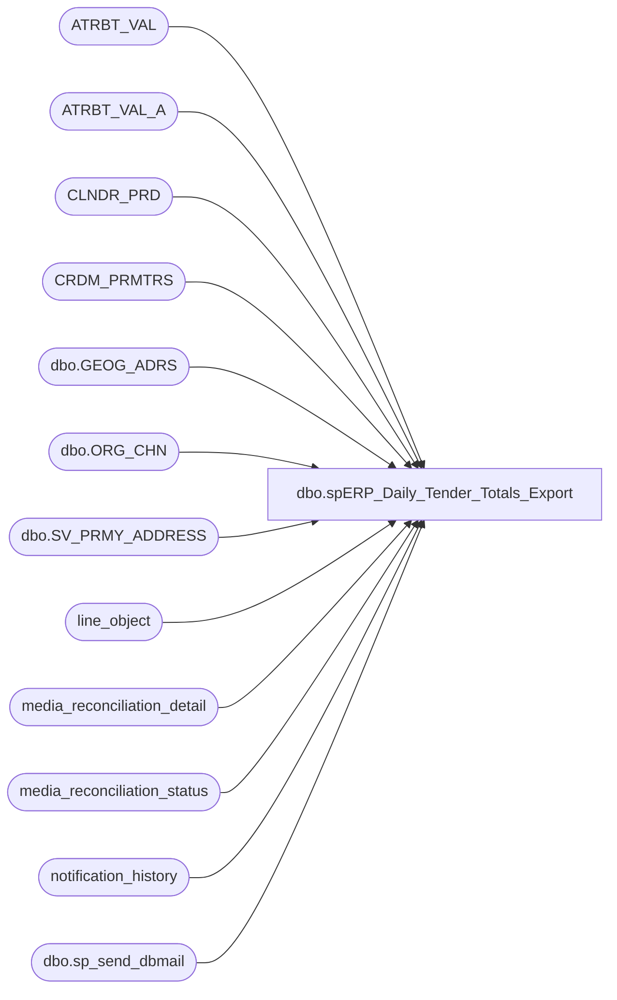

# dbo.spERP_Daily_Tender_Totals_Export

**Database:** auditworks  
**Server:** bedrockdb01  

## Architecture Diagram



## Table Dependencies

| Referenced Table |
|---|
| ATRBT_VAL |
| ATRBT_VAL_A |
| CLNDR_PRD |
| CRDM_PRMTRS |
| dbo.GEOG_ADRS |
| dbo.ORG_CHN |
| dbo.SV_PRMY_ADDRESS |
| line_object |
| media_reconciliation_detail |
| media_reconciliation_status |
| notification_history |
| dbo.sp_send_dbmail |

## Stored Procedure Code

```sql
CREATE   procedure [dbo].[spERP_Daily_Tender_Totals_Export]
--(
--@TransactionStartDate as int
--,@TransactionEndDate as int
--)
AS
-- =====================================================================================================
-- Name: spERP_Daily_Tender_Totals_Export
--
-- Description:	Tender Totals Media rec export from SA for Dynamics 365 ERP
--	
--
-- Input:	
--			
--
-- Output: CSV files.  One for each Country
--			
--
-- Schedule: 
--    Tue 9:00pm run for prior Wed-Thu sales
--    Wed 9:00pm run for prior Fri-Sat sales
--    Thu 9:00pm run for prior Sun-Mon sales
--    Fri 9:00pm run for prior Tue sales			
--
-- Dependencies: None	
--	
--
-- Revision History
--		Name:			Date:			Comments:
--		Paul Beckman		01/30/2018		Created stored proc
--		Paul Beckman		04/23/2018		Remarked out Credit section per request of Jenn Guinn in meeting on 4/23/2018
--		Paul Beckman		05/02/2018		Updated CREDITAMOUNT to include a row for each store versus total CREDITAMOUNT summary line
--		Paul Beckman		05/02/2018		Modified the ACCOUNTDISPLAYVALUE to include '100340-' at the beggining
--		Paul Beckman		05/04/2018		Remarked out columns as requested by Dawn G.  Needs to be removed from script post production.
--		Paul Beckman		05/15/2018		Added text ' (GJ)' to email subject line to differentiate from other daily SA exports
--		Paul Beckman		05/16/2018		Removed remarked out columns as requested by Dawn G as stated in 05/04/2018 note
--		Paul Beckman		05/22/2018		Added Column 'BankTransType' as requested by Dawn G.
--		Paul Beckman		06/26/2018		Changed 'DESCRIPTION' Column text as requested by Dawn G.
--		Paul Beckman		06/26/2018		Changed 'JOURNALNAME' Column text as requested by Dawn G.
--		Paul Beckman		07/20/2018		Changed 'ACCOUNTDISPLAYVALUE' Column text for credit amounts as requested by Dawn G.
--		Paul Beckman		07/20/2018		Changed 'ACCOUNTTYPE' Column text for credit amounts as requested by Dawn G.
--		Paul Beckman		07/20/2018		Changed 'BANKTRANSTYPE' Column text for credit amounts as requested by Dawn G.
--		Paul Beckman		07/20/2018		Changed 'DEFAULTDIMENSIONDISPLAYVALUE' Column text for credit amounts as requested by Dawn G.
--		Paul Beckman		07/20/2018		Updated file path method for unique folder based on Country as requested by Dawn G.
--		Paul Beckman		07/31/2018		Added data date range text for the email message body
--		Paul Beckman		07/31/2018		Added email recipients DawnGo@buildabear.com and MichaelBeiser@buildabear.com
--		Paul Beckman		08/01/2018		Set file location to the Prod location for processing
--		Paul Beckman		08/05/2019		Adjusted file backup days from 20 to 40
--		Paul Beckman		08/27/2019		Removed IanW@buildabear.com
--		Paul Beckman		10/03/2019		Updated recipient from 'SAAdmin' to 'EntSysSupport'
--		Paul Beckman		10/17/2019		Updated to use notification_history table
--		Paul Beckman		02/05/2020		Updated email profile to 'EntSysSupport'
--		
-- 
-- exec spERP_Daily_Tender_Totals_Export		(  if paramters used:  exec spERP_Daily_Tender_Totals_Export 4, 3  )
-- 
-- =====================================================================================================

--####################################
-- Run day check
--####################################

-->>>>>>   Comment out this IF statement when running manually on Sat, Sun, or Mon   <<<<<<--
IF (SELECT CAST(LEFT(DATENAME(dw,DATEADD(DAY,-0,GETDATE())),3) AS VARCHAR(3))) IN ('Sat','Sun','Mon')
GOTO FINISH


--####################################
-- Temp Tables
--####################################

IF (Object_ID('tempdb..##ERPStoreData') IS NOT NULL) DROP TABLE ##ERPStoreData
IF (Object_ID('tempdb..##ERPCountryList') IS NOT NULL) DROP TABLE ##ERPCountryList
IF (Object_ID('tempdb..##ERPMediaCash') IS NOT NULL) DROP TABLE ##ERPMediaCash
IF (Object_ID('tempdb..##ERPMediaCashAcct') IS NOT NULL) DROP TABLE ##ERPMediaCashAcct
IF (Object_ID('tempdb..##ERPMediaRec') IS NOT NULL) DROP TABLE ##ERPMediaRec
IF (Object_ID('tempdb..##ERPMediaRecSummary') IS NOT NULL) DROP TABLE ##ERPMediaRecSummary
IF (Object_ID('tempdb..##ERPMediaRecHeaders') IS NOT NULL) DROP TABLE ##ERPMediaRecHeaders
IF (Object_ID('tempdb..##ERPMediaRecOutput') IS NOT NULL) DROP TABLE ##ERPMediaRecOutput


--####################################
-- Declare script variables
--####################################

DECLARE @SQL VARCHAR(8000)
DECLARE @CMD VARCHAR(4000)
DECLARE @FileDate VARCHAR(14)
DECLARE @FileName VARCHAR(40)
DECLARE @FileDir VARCHAR(40)
DECLARE @FilePath VARCHAR(90)
DECLARE @ERPFilePath VARCHAR(90)
DECLARE @BackupFilePath VARCHAR(90)
DECLARE @TempFilePath VARCHAR(90)
DECLARE @TransactionStartDate AS INT
DECLARE @TransactionEndDate AS INT

DECLARE @ChkFileDrive VARCHAR(5)  
DECLARE @ChkFileCMD VARCHAR(200)
DECLARE @ChkFileCount VARCHAR(5)

DECLARE @Recipients VARCHAR(4000)
DECLARE @Copy_Recipients VARCHAR(4000)
DECLARE @Subject VARCHAR(80)
DECLARE @Query VARCHAR(8000)
DECLARE @Text nvarchar(max)


--####################################
-- Set Date range used by schedule
--####################################

-- Tue run for prior Wed-Thu sales:
IF (SELECT CAST(LEFT(DATENAME(dw,DATEADD(DAY,-0,GETDATE())),3) AS VARCHAR(3))) = 'Tue'
BEGIN
SET @TransactionStartDate = 6
SET @TransactionEndDate = 5
END

-- Wed run for prior Fri-Sat sales:
IF (SELECT CAST(LEFT(DATENAME(dw,DATEADD(DAY,-0,GETDATE())),3) AS VARCHAR(3))) = 'Wed'
BEGIN
SET @TransactionStartDate = 5
SET @TransactionEndDate = 4
END

-- Thu run for prior Sun-Mon sales:
IF (SELECT CAST(LEFT(DATENAME(dw,DATEADD(DAY,-0,GETDATE())),3) AS VARCHAR(3))) = 'Thu'
BEGIN
SET @TransactionStartDate = 4
SET @TransactionEndDate = 3
END

-- Fri run for prior Tue sales:
IF (SELECT CAST(LEFT(DATENAME(dw,DATEADD(DAY,-0,GETDATE())),3) AS VARCHAR(3))) = 'Fri'
BEGIN
SET @TransactionStartDate = 3
SET @TransactionEndDate = 3
END


--####################################
-- Set dates for manual execution
--####################################

-->>>>>>   Set dates then uncomment these two SET statements when running manually   <<<<<<--
--SET @TransactionStartDate = DATEDIFF(DAY, '02/04/2018', GETDATE())  --<< SET START DATE
--SET @TransactionEndDate = DATEDIFF(DAY, '02/04/2018', GETDATE())  --<< SET END DATE


--####################################
-- Build Store and Country info
--####################################

SELECT oc.ORG_CHN_NUM AS StrNum
	,oc.DFLT_CRNCY_CODE AS StrCrncyCode
	,ga.CNTRY_CODE_ISO3 AS StrCountry
INTO ##ERPStoreData
FROM auditworks.dbo.ORG_CHN oc  WITH (NOLOCK)
	JOIN	auditworks.dbo.SV_PRMY_ADDRESS spa  WITH (NOLOCK) ON oc.PRTY_ID = spa.PRTY_ID
	JOIN	auditworks.dbo.GEOG_ADRS ga  WITH (NOLOCK) ON spa.ADRS_ID = ga.ADRS_ID
WHERE oc.ORG_CHN_NUM BETWEEN 1 AND 3100
ORDER BY oc.ORG_CHN_NUM

SELECT ROW_NUMBER() OVER(ORDER BY StrCountry ASC) AS CountryID
	,StrCountry
	,CASE WHEN StrCountry = 'CAN' THEN '1700'
		WHEN StrCountry = 'DNK' THEN '2300'
		WHEN StrCountry = 'GBR' THEN '2110'
		WHEN StrCountry = 'IRL' THEN '2110'
		WHEN StrCountry = 'USA' THEN '1100'
	END AS FileDir
INTO ##ERPCountryList
FROM ##ERPStoreData
WHERE StrCountry IN ('CAN','DNK','GBR','IRL','USA') --<< Add new countries here
GROUP BY StrCountry


--####################################
-- Cash
--####################################

SELECT a.store_no
	,a.transaction_date
	,'9007' line_object
	,SUM(a.rec_amount) AS expected_media_amount
INTO ##ERPMediaCash
FROM media_reconciliation_detail a WITH (NOLOCK)
	,media_reconciliation_status b WITH (NOLOCK)
WHERE a.store_no = b.balancing_entity
AND a.balancing_entity_id = b.balancing_entity_id
AND line_action = 247
AND b.rec_type IN (10,20,21)
AND a.line_object IN (600,601,602,619,625,9007)
AND a.transaction_date BETWEEN CONVERT(VARCHAR,DATEADD(DAY,-@TransactionStartDate,GETDATE()),111) AND CONVERT(VARCHAR,DATEADD(DAY,-@TransactionEndDate,GETDATE()),111)
--AND a.store_no IN (1,2,26,48,59,125,146,158,220,272)
GROUP BY a.store_no
	,a.transaction_date
ORDER BY a.store_no

SELECT d.ASGND_OBJ_NUM,c.ATRBT_VAL_DESC
INTO ##ERPMediaCashAcct
FROM ATRBT_VAL c WITH (NOLOCK)
	JOIN ATRBT_VAL_A d WITH (NOLOCK)
		ON c.ATRBT_VAL_CODE = d.ATRBT_VAL_CODE
WHERE d.ATRBT_CODE = 'BANKACCT'

SELECT a.*
	,b.ATRBT_VAL_DESC AS cash_bank_group
	,c.StrCountry
	,c.StrCrncyCode
INTO ##ERPMediaRec
FROM ##ERPMediaCash a
	LEFT JOIN ##ERPMediaCashAcct b WITH (NOLOCK)
		ON a.store_no = b.ASGND_OBJ_NUM
	JOIN ##ERPStoreData c WITH (NOLOCK)
		ON a.store_no = c.StrNum


--####################################
-- Add Summary Totals
--####################################

INSERT INTO ##ERPMediaRec
SELECT store_no
	,transaction_date
	,line_object
	,CASE WHEN SUM(expected_media_amount) > 0
		THEN -SUM(expected_media_amount)
		ELSE SUM(expected_media_amount)
		END
	,CASE WHEN LEN(store_no) <= 3 AND store_no NOT IN (470,990,991,995)
			THEN '100340-1' + RIGHT('00' + CONVERT(VARCHAR(3),store_no),3) + '-9999-10--'
			WHEN LEN(store_no) = 4
			THEN '100340-' + CONVERT(VARCHAR(4),store_no) + '-9999-10--'
			WHEN store_no IN (470,990,991,995)
			THEN '100340-9999-9999-10--'
			END
	,StrCountry
	,StrCrncyCode
FROM ##ERPMediaRec
GROUP BY line_object
	,store_no
	,transaction_date
	,StrCountry
	,StrCrncyCode


--####################################
-- Set variables
--####################################

SET @FileDate = (SELECT CONVERT(VARCHAR(8), GETDATE(), 112) + REPLACE(CONVERT(VARCHAR(8),GETDATE(), 108),':',''))

SET @FilePath = '\\saapp01\Financials\ERP'  --<< File path
SET @TempFilePath = '\\saapp01\Financials\ERP\Work'
SET @BackupFilePath = '\\saapp01\Financials\ERP\Backup'

--SET @ERPFilePath = '\\saapp01\Financials\ERP\Test'  --<< TEST build path
--SET @ERPFilePath = '\\ShareBear1\Shared\Accounting\ERP_Daily'  --<< PRE-PROD ERP file destination path
--SET @ERPFilePath = '\\stl-dynsnc-t-01\GeneralJournal\Test2'  --<< TEST ERP file destination path
SET @ERPFilePath = '\\stl-dynsnc-p-01\GeneralJournal\prod'  --<< PROD ERP file destination path

--SET @Recipients = 'paulb@buildabear.com'
SET @Recipients = 'ScottP@buildabear.com;KathrynW@buildabear.com'
SET @Copy_Recipients = 'ianw@buildabear.com'


--####################################
-- Create Headers file
--####################################

SELECT 
	'JOURNALBATCHNUMBER' AS 'JOURNALBATCHNUMBER'
	,'LINENUMBER' AS 'LINENUMBER'
	,'ACCOUNTDISPLAYVALUE' AS 'ACCOUNTDISPLAYVALUE'
	,'ACCOUNTTYPE' AS 'ACCOUNTTYPE'
	,'BANKTRANSTYPE' AS 'BANKTRANSTYPE'
	,'CREDITAMOUNT' AS 'CREDITAMOUNT'
	,'CURRENCYCODE' AS 'CURRENCYCODE'
	,'DEBITAMOUNT' AS 'DEBITAMOUNT'
	,'DEFAULTDIMENSIONDISPLAYVALUE' AS 'DEFAULTDIMENSIONDISPLAYVALUE'
	,'DESCRIPTION' AS 'DESCRIPTION'
	,'ISPOSTED' AS 'ISPOSTED'
	,'JOURNALNAME' AS 'JOURNALNAME'
	,'PAYMENTMETHOD' AS 'PAYMENTMETHOD'
	,'PAYMENTREFERENCE' AS 'PAYMENTREFERENCE'
	,'POSTINGLAYER' AS 'POSTINGLAYER'
	,'TEXT' AS 'TEXT'
	,'TRANSDATE' AS 'TRANSDATE'
	,'VOUCHER' AS 'VOUCHER'
INTO ##ERPMediaRecHeaders

SET @SQL = 'SELECT * FROM ##ERPMediaRecHeaders'

SELECT  @CMD = 'bcp "' + @SQL + '" queryout "' + @TempFilePath + '\SA_ERP_GJ_HEADERS.csv" -T -c -t,'
    SELECT  @CMD
    exec master..xp_cmdshell @CMD

--####################################
-- Create file for each country
--   loops through each country code
--   to create results & file output
--####################################

DECLARE @cntrycode VARCHAR(3)
DECLARE cntrycode CURSOR FOR  
SELECT StrCountry
FROM ##ERPCountryList 
ORDER BY CountryID  
  
--open cursor  
OPEN cntrycode  
  
FETCH next  
 FROM cntrycode  
 INTO @cntrycode  

WHILE @@fetch_status = 0  

BEGIN

SET @FileDir = (SELECT FileDir FROM ##ERPCountryList WHERE StrCountry = @cntrycode)

IF (Object_ID('tempdb..##ERPMediaRecSummary') IS NOT NULL) DROP TABLE ##ERPMediaRecSummary
IF (Object_ID('tempdb..##ERPMediaRecOutput') IS NOT NULL) DROP TABLE ##ERPMediaRecOutput

SELECT CASE WHEN a.line_object IN (600,601,602,619,625,9007) AND a.store_no NOT IN (9999) AND a.cash_bank_group IS NOT NULL THEN a.cash_bank_group
			WHEN a.line_object IN (600,601,602,619,625,9007) AND a.store_no NOT IN (9999) AND a.cash_bank_group IS NULL THEN 'MISSINGBANKACCT'
			WHEN a.line_object IN (604,605,698,699) AND a.store_no NOT IN (9999) AND a.StrCountry != 'IRL' THEN 'MCVCLEAR'
			WHEN a.line_object IN (604,605,698,699) AND a.store_no NOT IN (9999) AND a.StrCountry = 'IRL' THEN 'IRCCCLEAR'
			WHEN a.line_object IN (611) AND a.store_no NOT IN (255,9999) AND a.StrCountry != 'IRL' THEN 'MCVCLEAR'
			WHEN a.line_object IN (611) AND a.store_no NOT IN (255,9999) AND a.StrCountry = 'IRL' THEN 'IRCCCLEAR'
			WHEN a.line_object IN (611,626) AND a.store_no IN (255,9999) THEN '1100DEBIT'
			WHEN a.line_object = 626 AND a.store_no NOT IN (255,9999) THEN 'SALOCAL'
			WHEN a.line_object IN (606,697) AND a.store_no NOT IN (9999) THEN 'AMEXCLEAR'
			WHEN a.line_object = 608 AND a.store_no NOT IN (9999) THEN 'DISCVCLEAR'
			WHEN a.store_no = 9999 THEN 'SAUDTCLEAR'
			--WHEN a.line_object = 695 AND d.country_code IN ('CHN') THEN 'SACC-CH'
			--WHEN a.line_object IN (600,601,602,604,605,606,608,611,619,625,626,695,698,699,9007) AND a.store_no = 9999 THEN 'SAUDTCLEAR'
		END AS ACCOUNTDISPLAYVALUE
	,CASE WHEN a.expected_media_amount < 0 AND a.store_no != '9999'
			THEN ABS(a.expected_media_amount)
			WHEN a.expected_media_amount > 0 AND a.store_no = '9999'
			THEN a.expected_media_amount
			WHEN a.expected_media_amount <> 0 AND a.store_no != '9999'
			THEN 0
			WHEN a.expected_media_amount <> 0 AND a.store_no = '9999'
			THEN 0
		END AS CREDITAMOUNT
	,a.StrCrncyCode AS CURRENCYCODE
	,CASE WHEN a.expected_media_amount > 0 AND a.store_no != '9999'
			THEN a.expected_media_amount
			WHEN a.expected_media_amount > 0 AND a.store_no = '9999'
			THEN 0
			WHEN a.expected_media_amount < 0 AND a.store_no != '9999'
			THEN 0
		END AS DEBITAMOUNT
	,CASE WHEN LEN(a.store_no) <= 3 AND a.store_no NOT IN (470,990,991,995)
			THEN '1' + RIGHT('00' + CONVERT(VARCHAR(3),a.store_no),3) + '-9999-10--'
			WHEN LEN(a.store_no) = 4
			THEN CONVERT(VARCHAR(4),a.store_no) + '-9999-10--'
			WHEN a.store_no IN (470,990,991,995)
			THEN '9999-9999-10--'
		END AS DEFAULTDIMENSIONDISPLAYVALUE
	,CASE WHEN a.line_object IN (600,601,602,619,625,9007)
			THEN 'SALESAUDCASH' + CONVERT(VARCHAR(8), a.transaction_date, 112)
			WHEN a.line_object IN (604,605,606,608,611,626,695,697,698,699)
			THEN 'SALESAUDCC' + CONVERT(VARCHAR(8), a.transaction_date, 112)
		END AS DESCRIPTION
	,CASE WHEN a.line_object = 600 THEN 'SACASH'
			WHEN a.line_object = 601 THEN 'SACASH'
			WHEN a.line_object = 602 THEN 'SACASH'
			WHEN a.line_object = 604 THEN 'SAVISA'
			WHEN a.line_object = 605 THEN 'SAMC'
			WHEN a.line_object = 606 THEN 'SAAMX'
			WHEN a.line_object = 608 THEN 'SADSC'
			WHEN a.line_object = 611 THEN 'SADB'
			WHEN a.line_object = 619 THEN 'SACASH'
			WHEN a.line_object = 625 THEN 'SACASH'
			WHEN a.line_object = 626 THEN 'SALOCAL'
			WHEN a.line_object = 695 THEN 'SACREDIT'
			WHEN a.line_object = 697 THEN 'SAAMX'
			WHEN a.line_object = 698 THEN 'SACREDIT'
			WHEN a.line_object = 699 AND a.StrCountry IN ('GBR','IRL') THEN 'SACC-UK'
			WHEN a.line_object = 699 AND a.StrCountry IN ('DNK') THEN 'SACC-DK'
			WHEN a.line_object = 9007 THEN 'SACASH'
		END AS PAYMENTMETHOD
	,CASE WHEN LEN(a.store_no) <= 3
			THEN '1000' + a.store_no
			WHEN LEN(a.store_no) = 4
			THEN a.store_no
		END AS PAYMENTREFERENCE
	,CASE WHEN a.line_object IN (600,601,602,619,625,9007)
			THEN 'DAILYSALESAUDCASH' + CONVERT(VARCHAR(8), a.transaction_date, 112)
			WHEN a.line_object IN (604,605,606,608,611,626,695,697,698,699)
			THEN 'DAILYSALESAUDCC' + CONVERT(VARCHAR(8), a.transaction_date, 112)
		END AS TEXT
	,CONVERT(VARCHAR(10), a.transaction_date, 101) AS TRANSDATE
	,CONVERT(VARCHAR,YEAR(transaction_date),4) + (SELECT RIGHT('00' + CONVERT(VARCHAR,clp.CLNDR_PRD_NUM,2),2) 
													FROM CLNDR_PRD clp
													JOIN CRDM_PRMTRS cp ON clp.CLNDR_ID = cp.PRMTR_VAL_BIN
													WHERE STRT_DATE_TIME <= a.transaction_date AND END_DATE_TIME > a.transaction_date AND clp.CLNDR_PRD_NAME LIKE 'Period%') + 'DAILYSA' AS VOUCHER
INTO ##ERPMediaRecSummary
FROM ##ERPMediaRec a WITH (NOLOCK)
	,line_object b WITH (NOLOCK)
WHERE a.line_object = b.line_object
AND a.expected_media_amount <> 0
AND a.store_no NOT IN (3002)
AND a.StrCountry = @cntrycode
ORDER BY PAYMENTREFERENCE
	,PAYMENTMETHOD
	,TRANSDATE
	,ACCOUNTDISPLAYVALUE DESC

SELECT 'GLNUM001' AS JOURNALBATCHNUMBER
	,ROW_NUMBER() OVER(ORDER BY TRANSDATE ASC) AS LINENUMBER
	,CASE WHEN ACCOUNTDISPLAYVALUE NOT LIKE '100340-____-____-__--'
		THEN ACCOUNTDISPLAYVALUE
		ELSE
			CASE WHEN @cntrycode = 'CAN' THEN 'SAUDTCLEAR'
			WHEN @cntrycode = 'DNK' THEN 'SAUDTCLEAR'
			WHEN @cntrycode = 'GBR' THEN 'SAUDTCLEAR'
			WHEN @cntrycode = 'IRL' THEN 'IRLCLEAR'
			WHEN @cntrycode = 'USA' THEN 'SAUDTCLEAR'
			END
	END AS ACCOUNTDISPLAYVALUE
	,'Bank' AS ACCOUNTTYPE
	,'SACASH' AS BANKTRANSTYPE
	,CONVERT(VARCHAR(14),CREDITAMOUNT) AS CREDITAMOUNT
	,CURRENCYCODE
	,CONVERT(VARCHAR(14),DEBITAMOUNT) AS DEBITAMOUNT
	,DEFAULTDIMENSIONDISPLAYVALUE
	,'SALESAUDCASH' + CONVERT(VARCHAR(8), GETDATE(), 112) AS DESCRIPTION
	,NULL AS ISPOSTED
	,'DailySA' AS JOURNALNAME
	,PAYMENTMETHOD
	,PAYMENTREFERENCE
	,'Current' AS POSTINGLAYER
	,TEXT
	,TRANSDATE
	,VOUCHER
INTO ##ERPMediaRecOutput
FROM ##ERPMediaRecSummary a WITH (NOLOCK)
ORDER BY LINENUMBER
	,PAYMENTREFERENCE
	,TRANSDATE
	,PAYMENTMETHOD
	,ACCOUNTTYPE
	

SET @FileName = '\ERP_DAILY_SA_GJ_' + @cntrycode + '_' + @FileDate

SET @SQL = 'SELECT * FROM ##ERPMediaRecOutput'

SELECT  @CMD = 'bcp "' + @SQL + '" queryout "' + @TempFilePath + '\SA_ERP_GJ_RESULTS_' + @cntrycode + '.csv" -T -c -t,'
    select  @CMD
    exec master..xp_cmdshell @CMD

SET @CMD = 'type ' + @TempFilePath + '\SA_ERP_GJ_HEADERS.csv > ' + @FilePath + @FileName + '.dat'
    select  @CMD
    exec master..xp_cmdshell @CMD

SET @CMD = 'type ' + @TempFilePath + '\SA_ERP_GJ_RESULTS_' + @cntrycode + '.csv >> ' + @FilePath + @FileName + '.dat'
    select  @CMD
    exec master..xp_cmdshell @CMD

SET @CMD = 'xcopy /y /v /f /r  ' + @FilePath + '\' + @FileName + '.dat ' + @ERPFilePath + '\' + @FileDir
    select  @CMD
    exec master..xp_cmdshell @CMD

WAITFOR DELAY '00:00:05'

SET @CMD = 'rename ' + @ERPFilePath + '\' + @FileDir + '\*.dat *.csv'
    select  @CMD
    exec master..xp_cmdshell @CMD


FETCH next  
 FROM cntrycode  
 INTO @cntrycode  
END  
  
CLOSE cntrycode
DEALLOCATE cntrycode


--####################################
-- File copy, rename, and cleanup
--####################################

SET @CMD = 'rename ' + @FilePath + '\*.dat *.csv'
    select  @CMD
    exec master..xp_cmdshell @CMD

WAITFOR DELAY '00:00:05'

SET @CMD = 'del /Q ' + @TempFilePath + '\SA_ERP_GJ_*.csv'
    select  @CMD
    exec master..xp_cmdshell @CMD

SET @CMD = 'move /Y ' + @FilePath + '\*.csv ' + @BackupFilePath
    select  @CMD
    exec master..xp_cmdshell @CMD

WAITFOR DELAY '00:00:05'


--####################################
-- File check and email completion
--####################################

IF (Object_ID('tempdb..#filecheck') IS NOT NULL) DROP TABLE #filecheck
CREATE TABLE #filecheck (dirtext VARCHAR(50))

SET @ChkFileDrive = 'v:'  
SET @ChkFileCMD = 'net use ' + @ChkFileDrive + ' /d'  
EXEC master..xp_cmdshell @ChkFileCMD  
SET @ChkFileCMD = 'net use ' + @ChkFileDrive + ' \\saapp01\Financials\ERP\Backup'  
EXEC master..xp_cmdshell @ChkFileCMD  
SET @ChkFileCMD = 'dir /B ' + @ChkFileDrive + '\ERP_DAILY_SA_GJ_*_' + @FileDate + '.csv'  
INSERT INTO #filecheck (dirtext)
EXEC master..xp_cmdshell @ChkFileCMD 
DELETE FROM #filecheck WHERE dirtext IS NULL OR dirtext = 'File Not Found'

SET @CMD = 'forfiles /p ' + @ChkFileDrive + ' /s /m *.csv /D -40 /C "cmd /c del @path"'
    select  @CMD
    exec master..xp_cmdshell @CMD

SET @ChkFileCMD = 'net use ' + @ChkFileDrive + ' /d'
EXEC master..xp_cmdshell @ChkFileCMD

SET @ChkFileCount = (SELECT COUNT(*) FROM #filecheck)

IF (SELECT COUNT(*) FROM #filecheck) != (SELECT COUNT(*) FROM ##ERPCountryList)
GOTO ERROREMAIL

SET @Text = 
		'<font face =arial size = 2>' +
		'Daily SA export files have been created for ERP import to D365 General Journal. <br>' +
		'Data date range: ' + CONVERT(VARCHAR,DATEADD(DAY,-@TransactionStartDate,GETDATE()),101) + ' - ' + CONVERT(VARCHAR,DATEADD(DAY,-@TransactionEndDate,GETDATE()),101) + '<br>' +
		'<br>' +
		'(' + @ChkFileCount + ') Files found in ' + @BackupFilePath + '... <br>' +
		'<br>' +
		'<table border="1">' + 
		'<font face =arial size = 2>' +
		'<tr bgcolor=#D5D5F7><th>ERP Daily SA file name</th></tr>' +
		CAST ( ( SELECT [td/@align]='left',
						td = dirtext, ''
				FROM #filecheck
				FOR xml path ('tr'), type
		) AS NVARCHAR(MAX) ) +
		'</table>' +
		'<font face =arial size = 2>' +
		'<br>' +
		'The files listed above have been copied to ' + @ERPFilePath + ' folders for processing into D365. <br>' +
		'&nbsp;&nbsp;&nbsp;&nbsp;&nbsp;- Files are moved to Archive folder if processed successfully. <br>' +
		'&nbsp;&nbsp;&nbsp;&nbsp;&nbsp;- Files are moved to Error folder if processing fails. <br>' +
		'<font face =arial size = 1 color="#C0C0C0">' +
		'<br><br><br><br>' +
		'Server:  BEDROCKDB01 <br>' +
		'Job Name:  ERP_Daily_Files_Export <br>' +
		'Stored Proc:  BEDROCKDB01.auditworks.dbo.spERP_Daily_Tender_Totals_Export <br>' +
		'Created by:  Paul Beckman <br>' +
		'Team Ownership:  Enterprise Systems <br>'

SET @Subject = 'ERP Daily Export files created (GJ)'
	EXEC msdb.dbo.sp_send_dbmail  
	@profile_name = 'EntSysSupport',
	@recipients = @Recipients,
	@copy_recipients = @Copy_Recipients,
	@subject=@Subject, 
	@body = @Text,
	@body_format = 'HTML'
	
	INSERT INTO notification_history
	(stored_proc_name,
	record_logged_datetime,
	issues_found,
	action_required,
	notification_sent,
	email_type,
	email_to,
	email_cc,
	email_subject,
	comment
	)
	VALUES (
	'spERP_Daily_Tender_Totals_Export', --<< Stored Proc name
	GETDATE(),
	'No', --<< Issues found - Yes / No
	'No', --<< Action required - Yes / No
	'Yes', --<< Notification sent - Yes / No
	'Notification Only', --<< Email type - Notification Only / Alert / Warning
	@Recipients, --<< Email TO
	NULL, --<< Email CC
	@Subject, --<< Email Subject
	'Daily SA export files have been created for ERP import to D365 General Journal' --<< Comment
	)

GOTO FINISH

ERROREMAIL:

SET @Recipients = 'ianw@buildabear.com'
SET @Copy_Recipients = 'ScottP@buildabear.com;KathrynW@buildabear.com'
IF (SELECT COUNT(*) FROM #filecheck) = 0
BEGIN
SET @Text = 
		'<font face =arial size = 2 color="Red">' +
		'** ACTION REQUIRED **  <br>' +
		'<br>' +
		'Daily SA export files Missing for ERP import to D365 General Journal. <br>' +
		'Data date range: ' + CONVERT(VARCHAR,DATEADD(DAY,-@TransactionStartDate,GETDATE()),101) + ' - ' + CONVERT(VARCHAR,DATEADD(DAY,-@TransactionEndDate,GETDATE()),101) + '<br>' +
		'<br>' +
		'Please check on status of SQL job execution. <br>' +
		'<br>' +
		'(' + @ChkFileCount + ') ERP_DAILY_SA_GJ_*_' + @FileDate + '.csv Files found in ' + @BackupFilePath + '... <br>' +
		'<font face =arial size = 1 color="#C0C0C0">' +
		'<br><br><br><br>' +
		'Server:  BEDROCKDB01 <br>' +
		'Job Name:  ERP_Daily_Files_Export <br>' +
		'Stored Proc:  BEDROCKDB01.auditworks.dbo.spERP_Daily_Tender_Totals_Export <br>' +
		'Created by:  Paul Beckman <br>' +
		'Team Ownership:  Enterprise Systems <br>'

SET @Subject = 'WARNING - Missing all (' + CONVERT(VARCHAR(1),(SELECT COUNT(*) FROM ##ERPCountryList)-@ChkFileCount) + ') ERP Daily Export files (GJ)'
	EXEC msdb.dbo.sp_send_dbmail  
	@profile_name = 'EntSysSupport',
	@recipients = @Recipients,
	@copy_recipients = @Copy_Recipients,
	@subject=@Subject, 
	@body = @Text,
	@body_format = 'HTML'
	
	INSERT INTO notification_history
	(stored_proc_name,
	record_logged_datetime,
	issues_found,
	action_required,
	notification_sent,
	email_type,
	email_to,
	email_cc,
	email_subject,
	comment
	)
	VALUES (
	'spERP_Daily_Tender_Totals_Export', --<< Stored Proc name
	GETDATE(),
	'Yes', --<< Issues found - Yes / No
	'Yes', --<< Action required - Yes / No
	'Yes', --<< Notification sent - Yes / No
	'Warning', --<< Email type - Notification Only / Alert / Warning
	@Recipients, --<< Email TO
	@Copy_Recipients, --<< Email CC
	@Subject, --<< Email Subject
	'All Daily SA export files Missing for ERP import to D365 General Journal' --<< Comment
	)
END
ELSE
BEGIN
SET @Text = 
		'<font face =arial size = 2 color="Red">' +
		'** ACTION REQUIRED **  <br>' +
		'<br>' +
		'Daily SA export files Missing for ERP import to D365 General Journal. <br>' +
		'Data date range: ' + CONVERT(VARCHAR,DATEADD(DAY,-@TransactionStartDate,GETDATE()),101) + ' - ' + CONVERT(VARCHAR,DATEADD(DAY,-@TransactionEndDate,GETDATE()),101) + '<br>' +
		'<br>' +
		'Please check on status of SQL job execution. <br>' +
		'<br>' +
		'(' + @ChkFileCount + ') ERP_DAILY_SA_GJ_*_' + @FileDate + '.csv Files found in ' + @BackupFilePath + '... <br>' +
		'<br>' +
		'<table border="1">' + 
		'<font face =arial size = 2>' +
		'<tr bgcolor=#D5D5F7><th>ERP Daily SA file name</th></tr>' +
		CAST ( ( SELECT [td/@align]='left',
						td = dirtext, ''
				FROM #filecheck
				FOR xml path ('tr'), type
		) AS NVARCHAR(MAX) ) +
		'</table>' +
		'<font face =arial size = 1 color="#C0C0C0">' +
		'<br><br><br><br>' +
		'Server:  BEDROCKDB01 <br>' +
		'Job Name:  ERP_Daily_Files_Export <br>' +
		'Stored Proc:  BEDROCKDB01.auditworks.dbo.spERP_Daily_Tender_Totals_Export <br>' +
		'Created by:  Paul Beckman <br>' +
		'Team Ownership:  Enterprise Systems <br>'

SET @Subject = 'ALERT - Missing (' + CONVERT(VARCHAR(1),(SELECT COUNT(*) FROM ##ERPCountryList)-@ChkFileCount) + ') ERP Daily Export files (GJ)'
	EXEC msdb.dbo.sp_send_dbmail  
	@profile_name = 'EntSysSupport',
	@recipients = @Recipients,
	@copy_recipients = @Copy_Recipients,
	@subject=@Subject, 
	@body = @Text,
	@body_format = 'HTML'
	
	INSERT INTO notification_history
	(stored_proc_name,
	record_logged_datetime,
	issues_found,
	action_required,
	notification_sent,
	email_type,
	email_to,
	email_cc,
	email_subject,
	comment
	)
	VALUES (
	'spERP_Daily_Tender_Totals_Export', --<< Stored Proc name
	GETDATE(),
	'Yes', --<< Issues found - Yes / No
	'Yes', --<< Action required - Yes / No
	'Yes', --<< Notification sent - Yes / No
	'Alert', --<< Email type - Notification Only / Alert / Warning
	@Recipients, --<< Email TO
	@Copy_Recipients, --<< Email CC
	@Subject, --<< Email Subject
	'Some Daily SA export files Missing for ERP import to D365 General Journal' --<< Comment
	)
END


FINISH:
--####################################
-- Temp Table Cleanup
--####################################

IF (Object_ID('tempdb..##ERPStoreData') IS NOT NULL) DROP TABLE ##ERPStoreData
IF (Object_ID('tempdb..##ERPCountryList') IS NOT NULL) DROP TABLE ##ERPCountryList
IF (Object_ID('tempdb..##ERPMediaCash') IS NOT NULL) DROP TABLE ##ERPMediaCash
IF (Object_ID('tempdb..##ERPMediaCashAcct') IS NOT NULL) DROP TABLE ##ERPMediaCashAcct
IF (Object_ID('tempdb..##ERPMediaRec') IS NOT NULL) DROP TABLE ##ERPMediaRec
IF (Object_ID('tempdb..##ERPMediaRecSummary') IS NOT NULL) DROP TABLE ##ERPMediaRecSummary
IF (Object_ID('tempdb..##ERPMediaRecHeaders') IS NOT NULL) DROP TABLE ##ERPMediaRecHeaders
IF (Object_ID('tempdb..##ERPMediaRecOutput') IS NOT NULL) DROP TABLE ##ERPMediaRecOutput
IF (Object_ID('tempdb..#filecheck') IS NOT NULL) DROP TABLE #filecheck


--####################################


/*

SELECT * FROM ##ERPStoreData
WHERE StrCrncyCode = 'CAD'
AND StrCountry = 'USA'

SELECT * FROM ##ERPCountryList

SELECT * FROM ##ERPMediaCash

SELECT * FROM ##ERPMediaCashAcct

SELECT * FROM ##ERPMediaRec
WHERE store_no = 9999

SELECT * FROM ##ERPMediaRecSummary
WHERE PAYMENTREFERENCE = 9999

SELECT * FROM ##ERPMediaRecHeaders

SELECT * FROM ##ERPMediaRecOutput
WHERE PAYMENTREFERENCE = 9999

SELECT * FROM #filecheck

*/
```

