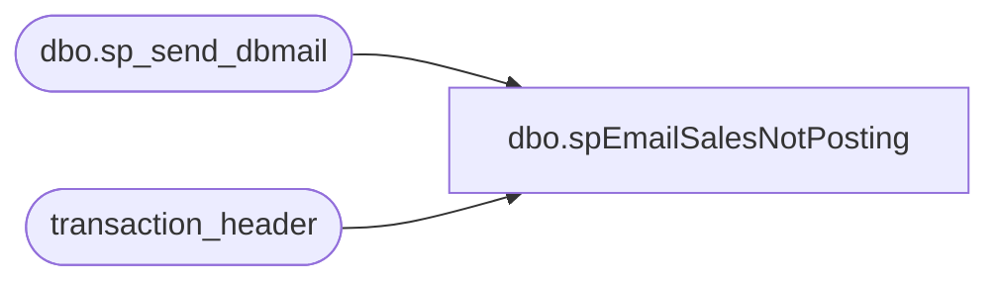

# dbo.spEmailSalesNotPosting

**Database:** auditworks  
**Server:** bedrockdb01  

## Architecture Diagram



## Table Dependencies

| Referenced Table |
|---|
| dbo.sp_send_dbmail |
| transaction_header |

## Stored Procedure Code

```sql
create proc spEmailSalesNotPosting

as

set nocount on


declare
	@min int, 
	@hour int, 
	@maxDateTime datetime, 
	@CurrentDateTime datetime,
	@text nvarchar(1000)

select @maxDateTime= max(entry_date_time)
from transaction_header with (nolock)

select @CurrentDateTime=getdate()

select @min= datediff(mi, @maxDateTime, @CurrentDateTime)
from transaction_header with (nolock)

select @hour= @min/60

select @text= 'Sales Have Not Posted to Sales Audit in '  + cast(@hour as varchar) + ' hours'

if @hour>=2

EXEC msdb.dbo.sp_send_dbmail
@profile_name = 'Databears',
@recipients = 'entsyssupport@buildabear.com; biadmintextalert@buildabear.com',
@subject= 'Sales Not Posting to Sales Audit',
@body = @text,
@importance = 'HIGH'
```

