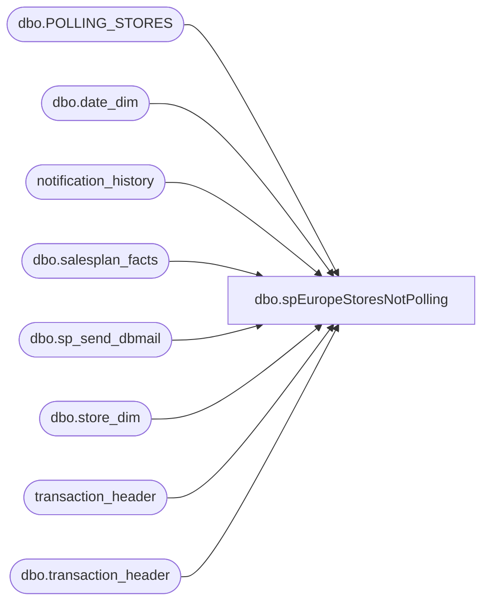

# dbo.spEuropeStoresNotPolling

**Database:** auditworks  
**Server:** bedrockdb01  

## Architecture Diagram



## Table Dependencies

| Referenced Table |
|---|
| dbo.POLLING_STORES |
| dbo.date_dim |
| notification_history |
| dbo.salesplan_facts |
| dbo.sp_send_dbmail |
| dbo.store_dim |
| transaction_header |
| dbo.transaction_header |

## Stored Procedure Code

```sql
CREATE  procedure [dbo].[spEuropeStoresNotPolling]
-- =====================================================================================================
-- Name: spEuropeStoresNotPolling
--
-- Description:	
--
-- Input:	
--			
--
-- Output: Resultset with the following columns:
--			
--
-- Dependencies: None
--
-- Revision History
--		Name:			Date:			Comments:
--		?				08/26/2010		Initial version source control
--		Garyd			08/26/2010		Modify to use db_mail on new POS server.
--		Garyd			08/30/2010		Modify query to use SA 5.0 tables.
--		Paul B			10/26/2010		Changed from sp_EuropeStoresNotPolling to spEuropeStoresNotPolling
--		Paul B			01/29/2015		Modified store inclusion range high end from 2099 to 2399 for DNK
--		Paul Beckman	07/18/2015		Updated from POSDBSSA to BEDROCKDB01
--		Paul Beckman	10/07/2015		Updated translate version to include 20 for Store 6.4 translate
--		Paul Beckman	01/22/2016		Updated Warning email message body for services to check
--		Paul Beckman	01/10/2017		Updated email body to HTML
--		Paul Beckman	05/23/2017		Removed old non-HTML code for email body
--		Paul Beckman	04/04/2018		Modified store select group to use auditworks.dbo.POLLING_STORES information
--		Paul Beckman	03/11/2019		Added MLB store 469 to store exclusions
--		Paul Beckman	10/03/2019		Updated recipient with 'EntSysSupport'
--		Paul Beckman	10/17/2019		Updated to use notification_history table
--		Paul Beckman	12/04/2019		Updated to use [PAPAMART].[dw].[dbo].[salesplan_facts] for store
--										that should have sales for selected day.
--		Paul Beckman	02/05/2020		Updated email profile to 'EntSysSupport'
--		Lizzy Timm		02/23/2021		Added Bcc for emails sent when greater than 25 stores are not polling and added logic to only send to Bcc upto once per day
--
--  exec spEuropeStoresNotPolling
-- =====================================================================================================
AS
SET NOCOUNT ON

declare @sql varchar(8000)
declare @recipients varchar(8000)
declare @Subject varchar(60)
declare @query varchar(8000)
declare @text nvarchar(max)

set @recipients = 'BIAdmin@buildabear.com;benb@buildabear.com;brandonh@buildabear.com;enjolia@buildabear.com;bradw@buildabear.com;juanp@buildabear.com'
--'poll@buildabear.com'

IF (Object_ID('tempdb..#stores') IS NOT NULL) DROP TABLE #stores

SELECT ps.STORE_NUM as store_no
INTO #stores
FROM [PAPAMART].[dw].[dbo].[salesplan_facts] sf
	JOIN [PAPAMART].[dw].[dbo].[date_dim] dd WITH (NOLOCK)
		ON sf.date_key=dd.date_key
	JOIN [PAPAMART].[dw].[dbo].[store_dim] sd WITH (NOLOCK)
		ON sf.store_key=sd.store_key
	JOIN auditworks.dbo.POLLING_STORES ps
		ON ps.STORE_NUM = sd.store_id
WHERE ps.POLLING_VLDTN = 1
AND ps.POLLING_VLDTN_DATE <= GETDATE()
AND ps.CLOSED_DATE IS NULL
AND CONVERT(VARCHAR(10),dd.actual_date,101) = CONVERT(VARCHAR(10),GETDATE(),101)
AND sf.amount > 0
AND ps.COUNTRY IN ('GBR','IRL','DNK')

--SELECT STORE_NUM as store_no
--INTO #stores
--FROM auditworks.dbo.POLLING_STORES
--WHERE POLLING_VLDTN = 1
--AND POLLING_VLDTN_DATE <= GETDATE()
--AND CLOSED_DATE IS NULL
--AND STORE_NUM NOT IN (212,469,470)
--AND COUNTRY IN ('GBR','IRL','DNK')

IF (Object_ID('tempdb..#edittime') IS NOT NULL) DROP TABLE #edittime
SELECT DATEPART (mm,getdate()) * 100000000000.0 + DATEPART ( dd, getdate() ) * 1000000000.0 + (DATEPART ( hh, getdate() ) -3 )* 10000000.0 + DATEPART ( mi, getdate() ) * 100000.0 + DATEPART ( ss, getdate() ) * 1000.0 + DATEPART ( ms, getdate() ) AS edittime
INTO #edittime

IF (Object_ID('tempdb..#stores_polled') IS NOT NULL) DROP TABLE #stores_polled
SELECT th.store_no, MAX(edit_timestamp) AS last_poll_time
INTO #stores_polled
--FROM transaction_header th
FROM (select store_no, edit_timestamp from transaction_header where cast(convert(varchar,transaction_date,101) as datetime) = cast(convert(varchar,getdate(),101) as datetime))th 
join #stores s
on th.store_no =s.store_no
GROUP BY th.store_no

IF (Object_ID('tempdb..##StoresNotPolled') IS NOT NULL) DROP TABLE ##StoresNotPolled
SELECT DISTINCT th.store_no as Store_No,
				substring(convert(varchar,convert(numeric,last_poll_time)),len(convert(numeric,last_poll_time))-8,2) + ':' + substring(convert(varchar,convert(numeric,last_poll_time)),len(convert(numeric,last_poll_time))-6,2) as Last_Poll_Time
into ##StoresNotPolled
FROM auditworks.dbo.transaction_header th
join #stores_polled sp
on th.store_no = sp.store_no
where sp.last_poll_time < (SELECT edittime FROM #edittime)
ORDER BY  th.store_no

--select * from ##StoresNotPolled return

DECLARE @listStr VARCHAR(MAX)
SET @listStr = ''
SELECT @listStr = @listStr + CONVERT(VARCHAR(10),Store_No) + ','
FROM ##StoresNotPolled


--=======================================
if (select count(Store_No) from ##StoresNotPolled) = 0
begin
	INSERT INTO notification_history
	(stored_proc_name,
	record_logged_datetime,
	issues_found,
	action_required,
	notification_sent,
	comment
	)
	VALUES (
	'spEuropeStoresNotPolling', --<< Stored Proc name
	GETDATE(),
	'No', --<< Issues found - Yes / No
	'No', --<< Action required - Yes / No
	'No', --<< Notification sent - Yes / No
	'ALL Europe stores have reported sales to Sales Audit within the past 3 hours' --<< Comment
	)
end


--=======================================
if (select count(Store_No) from ##StoresNotPolled) between 1 and 9
begin
	INSERT INTO notification_history
	(stored_proc_name,
	record_logged_datetime,
	issues_found,
	action_required,
	notification_sent,
	comment
	)
	VALUES (
	'spEuropeStoresNotPolling', --<< Stored Proc name
	GETDATE(),
	'Yes', --<< Issues found - Yes / No
	'No', --<< Action required - Yes / No
	'No', --<< Notification sent - Yes / No
	'Europe stores ' + CONVERT(VARCHAR(8000),SUBSTRING(@listStr , 1, LEN(@listStr)-1)) + ' have not reported sales to Sales Audit within the past 3 hours' --<< Comment
	)
end


--=======================================
if (select count(Store_No) from ##StoresNotPolled) between 10 and 25
begin
	set @text = 
				'<font face =arial size = 2>' +
				'The following Europe stores have not reported sales to Sales Audit within the past 3 hours:<br>' +
				'<br>' +
				'<table border="1">' + 
				'<font face =arial size = 2>' +
				'<tr bgcolor=#D5D5F7><th>Store No</th><th>Last Poll Time</th></tr>' +
				CAST ( ( SELECT td = Store_No, '',
								td = Last_Poll_Time, ''
					  FROM ##StoresNotPolled
					  FOR xml path ('tr'), type
				) AS NVARCHAR(MAX) ) +
				'</table>' +
				'<font face =arial size = 1 color="#C0C0C0">' +
				'<br><br><br><br>' +
				'Server:  BEDROCKDB01 <br>' +
				'Job Name:  StoresNotTricklePolling Europe <br>' +
				'Stored Proc:  BEDROCKDB01.auditworks.dbo.spEuropeStoresNotPolling <br>' +
				'Created by:  Paul Beckman <br>' +
				'Team Ownership:  Enterprise Systems <br>'


	set @Subject = 'ALERT - Europe Stores Not Trickle Polling'
	
	exec msdb.dbo.sp_send_dbmail
	@profile_name = 'EntSysSupport',
	@recipients = @recipients,
	@subject=@Subject, 
	@body = @text,
	@body_format = 'HTML'
	
	INSERT INTO notification_history
	(stored_proc_name,
	record_logged_datetime,
	issues_found,
	action_required,
	notification_sent,
	email_type,
	email_to,
	email_cc,
	email_subject,
	comment
	)
	VALUES (
	'spEuropeStoresNotPolling', --<< Stored Proc name
	GETDATE(),
	'Yes', --<< Issues found - Yes / No
	'No', --<< Action required - Yes / No
	'Yes', --<< Notification sent - Yes / No
	'Alert', --<< Email type - Notification Only / Alert / Warning
	@recipients, --<< Email TO
	NULL, --<< Email CC
	@Subject, --<< Email Subject
	'Many Europe stores have not reported sales to Sales Audit within the past 3 hours' --<< Comment
	)
end


--=======================================
if (select count(Store_No) from ##StoresNotPolled) > 15
begin
	set @recipients = 'BIAdminTextAlert@buildabear.com'
	--'poll@buildabear.com;EntSysSupport@buildabear.com'
	set @text = 
				'<font face =arial size = 2 color="Red">' +
				'More than 25 Europe stores have not reported sales to Sales Audit within the past 3 hours:<br>' +
				'Check the following...<br>' +
				'  1) Data Exchange Polling Poster service on DEAPP01<br>' +
				'  2) Data_Exchange_EPS.bedrockdb01.Comm.1 service on DEAPP01<br>' +
				'  3) auditworks_ICT_EDIT01 Smartload on SAAPP01<br>' +
				'  4) SRMainSA service on SAAPP01<br>' +
				'<br>' +
				'<table border="1">' + 
				'<font face =arial size = 2>' +
				'<tr bgcolor=#D5D5F7><th>Store No</th><th>Last Poll Time</th></tr>' +
				CAST ( ( SELECT td = Store_No, '',
								td = Last_Poll_Time, ''
					  FROM ##StoresNotPolled
					  FOR xml path ('tr'), type
				) AS NVARCHAR(MAX) ) +
				'</table>' +
				'<font face =arial size = 1 color="#C0C0C0">' +
				'<br><br><br><br>' +
				'Server:  BEDROCKDB01 <br>' +
				'Job Name:  StoresNotTricklePolling Europe <br>' +
				'Stored Proc:  BEDROCKDB01.auditworks.dbo.spEuropeStoresNotPolling <br>' +
				'Created by:  Paul Beckman <br>' +
				'Team Ownership:  Enterprise Systems <br>'


	set @Subject = 'WARNING - Europe Stores Not Trickle Polling'

	--exec msdb.dbo.sp_send_dbmail
	--@profile_name = 'EntSysSupport',
	--@recipients = @recipients,
	--@subject=@Subject, 
	--@body = @text,
	--@body_format = 'HTML'
	IF (SELECT COUNT(*) FROM notification_history WHERE stored_proc_name = 'spEuropeStoresNotPolling' AND action_required = 'Yes' AND convert(varchar, record_logged_datetime, 101) = convert(varchar, getdate(), 101)) < 1
	BEGIN
		declare @textA nvarchar(max)
		SET @textA = 'More than 25 Europe stores have not reported sales to Sales Audit.'

		exec msdb.dbo.sp_send_dbmail
		@profile_name = 'EntSysSupport',
		@recipients = 'BIAdminTextAlert@buildabear.com',
		--@blind_copy_recipients = 'EnterpriseSystemsAlerts@buildabear.com',
		@subject=@Subject, 
		@body = @textA,
		@body_format = 'TEXT'

		exec msdb.dbo.sp_send_dbmail
		@profile_name = 'EntSysSupport',
		@recipients = @recipients,
		@subject=@Subject, 
		@body = @text,
		@body_format = 'HTML'
	END
  ELSE
	BEGIN
		exec msdb.dbo.sp_send_dbmail
		@profile_name = 'EntSysSupport',
		@recipients = @recipients,
		@subject=@Subject, 
		@body = @text,
		@body_format = 'HTML'
	END

	INSERT INTO notification_history
	(stored_proc_name,
	record_logged_datetime,
	issues_found,
	action_required,
	notification_sent,
	email_type,
	email_to,
	email_cc,
	email_subject,
	comment
	)
	VALUES (
	'spEuropeStoresNotPolling', --<< Stored Proc name
	GETDATE(),
	'Yes', --<< Issues found - Yes / No
	'Yes', --<< Action required - Yes / No
	'Yes', --<< Notification sent - Yes / No
	'Warning', --<< Email type - Notification Only / Alert / Warning
	@recipients, --<< Email TO
	NULL, --<< Email CC
	@Subject, --<< Email Subject
	'More than 20 Europe stores have not reported sales to Sales Audit within the past 3 hours' --<< Comment
	)
end

--------------------------------------------------------------------------------------------------------
```

