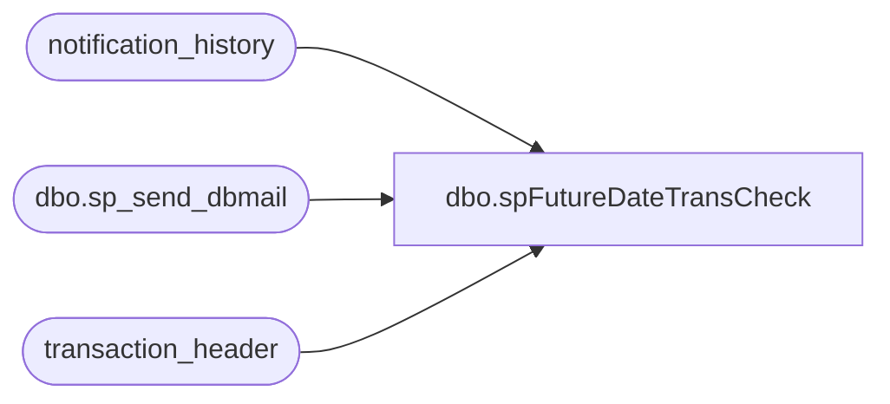

# dbo.spFutureDateTransCheck

**Database:** auditworks  
**Server:** bedrockdb01  

## Architecture Diagram



## Table Dependencies

| Referenced Table |
|---|
| notification_history |
| dbo.sp_send_dbmail |
| transaction_header |

## Stored Procedure Code

```sql
--DROP PROC [dbo].[spFutureDateTransCheck]
--GO

CREATE PROC [dbo].[spFutureDateTransCheck]
-- =============================================================================================================
-- Name: [dbo].[spFutureDateTransCheck]
--
-- Description:	Sends email alerts of Transactions in Sales Audit with a future date
--
-- Input:	@filelocation	varchar(100)	path to drop files
--			@rowcount		int				total number of records to process
--
-- Output: N/A
--
-- Dependencies: 
--
-- Revision History
--		Name:			Date:			Comments:
--		Paul Beckman	10/18/2010		Created SP
--		Paul Beckman	07/19/2015		Updated from POSDBSSA to BEDROCKDB01
--		Paul Beckman	08/31/2016		Updated profile_name from 'POSadmin' to 'SAAdmin'
--		Paul Beckman	01/16/2017		Updated email body to HTML
--		Paul Beckman	06/09/2017		Removed old non-HTML code for email body
--		Paul Beckman	06/09/2017		Removed ithd@buildabear.com from recipients list
--		Paul Beckman	06/09/2017		Corrected issue with pulling column names from temp table for email body
--		Paul Beckman	10/18/2019		Updated to use notification_history table
--		Paul Beckman	02/05/2020		Updated email profile to 'EntSysSupport'
--
-- exec spFutureDateTransCheck
-- =============================================================================================================
AS

declare @sql varchar(8000)
declare @recipients varchar(4000)
declare @Subject varchar(60)
declare @query varchar(8000)
declare @copy_recipients varchar(8000)
declare @text nvarchar(max)

--set @recipients = 'paulb@buildabear.com'
set @recipients = 'poll@buildabear.com;SalesAuditBears@buildabear.com'
--set @copy_recipients = ''

IF (Object_ID('tempdb..##futuredt') IS NOT NULL) DROP TABLE ##futuredt
SELECT CONVERT(VARCHAR(8),store_no) AS Store_No
	,CONVERT(VARCHAR(6),register_no) AS Reg_No
	,CONVERT(VARCHAR(8),transaction_no) AS Trans_No
	,CONVERT(VARCHAR(11), entry_date_time, 101) AS Store_Trans_Date
	,CONVERT(VARCHAR(11), transaction_date, 101) as SA_Trans_Date
into ##futuredt
FROM transaction_header
WHERE transaction_category = '1'
AND transaction_series not in ('G')
AND store_no not in ('473')
AND CONVERT(VARCHAR(11), transaction_date, 101) > CONVERT(VARCHAR(11), entry_date_time, 101)
order by store_no

if (select count(*) from ##futuredt) > 0 
begin 
	set @text = 
				'<font face =arial size = 2>' +
				'The following Transactions are in Sales Audit with a Future Date.  This may be a result of the MWS and POS times being out of sync:<br>' +
				'<br>' +
				'<table border="1">' + 
				'<font face =arial size = 2>' +
				'<tr bgcolor=#D5D5F7><th>Store Num</th><th>Reg Num</th><th>Trans Num</th><th>Store Trans Date</th><th>SA Trans Date</th></tr>' +
				CAST ( ( SELECT td = Store_No, '',
								td = Reg_No, '',
								td = Trans_No, '',
								td = CONVERT(VARCHAR(11), Store_Trans_Date, 101), '',
								td = CONVERT(VARCHAR(11), SA_Trans_Date, 101), ''
					  FROM ##futuredt
					  FOR xml path ('tr'), type
				) AS NVARCHAR(MAX) ) +
				'</table>' +
				'<font face =arial size = 1 color="#C0C0C0">' +
				'<br><br><br><br>' +
				'Server:  BEDROCKDB01 <br>' +
				'Job Name:  FutureDate_Trans_Check <br>' +
				'Stored Proc:  BEDROCKDB01.auditworks.dbo.spFutureDateTransCheck <br>' +
				'Created by:  Paul Beckman <br>' +
				'Team Ownership:  Enterprise Systems <br>'

set @Subject = 'ALERT - Transactions with Future Date in SA'
	exec msdb.dbo.sp_send_dbmail  
		@profile_name = 'EntSysSupport',
		@recipients = @recipients,
		--@copy_recipients = @copy_recipients,
		@subject=@Subject, 
		@body = @text,
		@body_format = 'HTML'
	
	INSERT INTO notification_history
	(stored_proc_name,
	record_logged_datetime,
	issues_found,
	action_required,
	notification_sent,
	email_type,
	email_to,
	email_cc,
	email_subject,
	comment
	)
	VALUES (
	'spFutureDateTransCheck', --<< Stored Proc name
	GETDATE(),
	'Yes', --<< Issues found - Yes / No
	'No', --<< Action required - Yes / No
	'Yes', --<< Notification sent - Yes / No
	'Alert', --<< Email type - Notification Only / Alert / Warning
	@recipients, --<< Email TO
	NULL, --<< Email CC
	@Subject, --<< Email Subject
	'Transactions are in Sales Audit with a Future Date' --<< Comment
	)

end
else
if (select count(*) from ##futuredt) = 0 
begin
	INSERT INTO notification_history
	(stored_proc_name,
	record_logged_datetime,
	issues_found,
	action_required,
	notification_sent,
	comment
	)
	VALUES (
	'spFutureDateTransCheck', --<< Stored Proc name
	GETDATE(),
	'No', --<< Issues found - Yes / No
	'No', --<< Action required - Yes / No
	'No', --<< Notification sent - Yes / No
	'There are no Future Date Transactions found in Sales Audit' --<< Comment
	)
end
```

