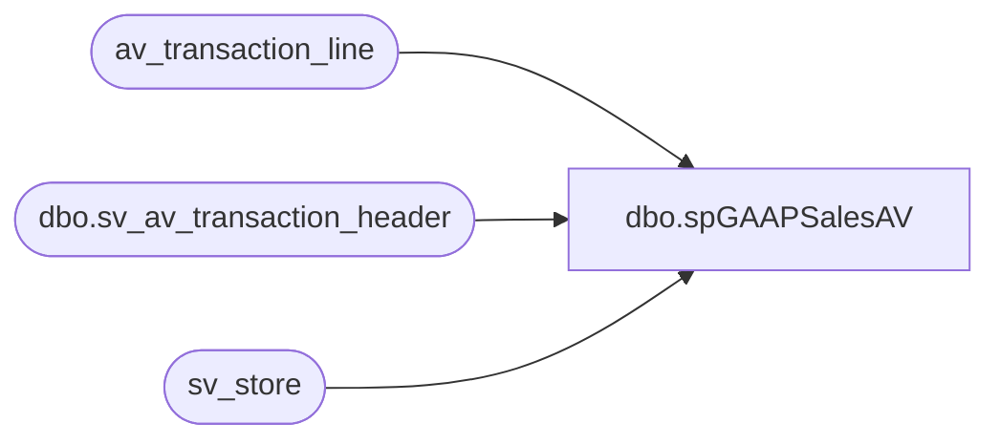

# dbo.spGAAPSalesAV

**Database:** auditworks  
**Server:** bedrockdb01  

## Architecture Diagram



## Table Dependencies

| Referenced Table |
|---|
| av_transaction_line |
| dbo.sv_av_transaction_header |
| sv_store |

## Stored Procedure Code

```sql
CREATE PROCEDURE [dbo].[spGAAPSalesAV] @start_dt datetime, @end_dt datetime 
AS
-- =====================================================================================================
-- Name: spGAAPSalesAV
--
-- Description:	
--
-- Input:	
--			date range
--
-- Output: Resultset with the following columns:
--			gaap sales by store
--
-- Dependencies: None
--
-- Revision History
--		Name:			Date:			Comments:
--		?				08/24/2010		Initial version source control
-- exec spGAAPSalesAV '2010-08-01', '2010-08-05'
-- =====================================================================================================


--Here is the code to "replace" the "Flash GAAP Sales Archive" report from SmartLook.
 
-------------------------------------------------------------------------------------
--(1)
select a.transaction_id, a.store_no, a.transaction_void_flag, a.transaction_category
into #tmp_av_id
FROM auditworks.dbo.sv_av_transaction_header a 
WHERE a.transaction_date Between @start_dt and @end_dt
 
--(2)
select * 
into #tmp_av_filter
from #tmp_av_id
where transaction_void_flag = 0 
  AND transaction_category IN (1,2) 
--(3)
create index idxC_U_tmp on #tmp_av_filter (transaction_id)
--(4)
select av_transaction_id as transaction_id, gross_line_amount, pos_discount_amount, db_cr_none, voiding_reversal_flag, line_void_flag, line_object
into #tmp_av_line_id
 from av_transaction_line
where av_transaction_id in (select distinct transaction_id from #tmp_av_filter)
--14 min
 
--(5)
create index idxN_NU_line_obj on #tmp_av_line_id (line_object, transaction_id)
 
--(6)
select h.store_no as Field_a, 
 c.store_name as Field_b, 
 SUM( ((l.gross_line_amount - l.pos_discount_amount) )* l.db_cr_none * l.voiding_reversal_flag) as Field_c, 
 0 as Field_d 
 from #tmp_av_filter h
 join #tmp_av_line_id l on h.transaction_id = l.transaction_id
    join sv_store c on h.store_no=c.store_no
where l.line_object IN (100,200,202,203,204,206,210,250,290,291,293,295,623,640,690,691) 
     AND l.line_void_flag=0 
GROUP BY h.store_no,c.store_name
ORDER BY h.store_no,c.store_name
```

