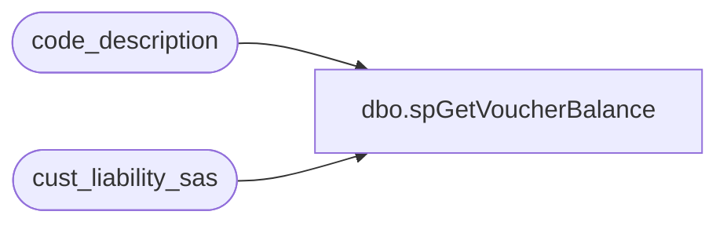

# dbo.spGetVoucherBalance

**Database:** auditworks  
**Server:** bedrockdb01  

## Architecture Diagram



## Table Dependencies

| Referenced Table |
|---|
| code_description |
| cust_liability_sas |

## Stored Procedure Code

```sql
CREATE   procedure [dbo].[spGetVoucherBalance](
@VoucherID as varchar(50)
,@iVoucherType as int
)
AS
-- =====================================================================================================
-- Name: spGetVoucherBalance
--
-- Description:	
--
-- Input:	
--			@VoucherID		varchar(50)		uniquely identify liability
--
-- Output: Resultset with the following columns:
--			current_balance 
--
-- Dependencies: None
--
-- Revision History
--		Name:			Date:			Comments:
--		GaryD			08/24/2010		Initial version source control
--
-- exec spGetVoucherBalance '0000000000231184', 31
-- =====================================================================================================

--NOTE:
--'06165263' had $70 voucher then it was devalued.  BT still showed $70 because "AND pos_status = 30" was commented out.  I uncommented it 2/23/2010. - Brad A


--@iVoucherType: 30 Party, 31 SFS, 35 Serialzed Coupon
/*=======================BALANCE=======================*/
select  vw.reference_no as eventid
	, vw.pos_amount_1 as current_balance
	, vw.original_amount
	, d.code_display_descr as status_desc
	, vw.pos_status as status_code
	, vw.date_issued
	, vw.expiry_date
	--, vw.pos_amount_2 as layaway_balance
	--, vw.pos_amount_3 as stocked_amount
	, vw.last_modified_by_pos as last_mod_date
from cust_liability_sas vw 
	JOIN code_description d 
	on d.code=vw.pos_status and d.code_type=251 --251 means "Voucher"
where reference_type=@iVoucherType
	 --cust_liability_type.tracking_id_desc='Party Deposits' when joining on reference_type=reference_type
	AND
 reference_no = @VoucherID--'6165263' --passed from UI
	AND pos_status = 30	--list valid only
/*
"Valid"(status=30) is further defined by the value in pos_amount_1:
when status = 30 and ...
	pos_amount_1 > 0 then voucher is sold or issued.  i.e. there is still a liability
	pos_amount_1 = 0 then voucher is returned or redeemed there remains no liability
 
pos_amount_1 is the outstanding liability amount for this voucher
pos_amount_2 is the outstanding receivable amount (layaways)
pos_amount_3 is the stocked amount (for fixed amount gift certs that haven't been sold yet)
*/
```

