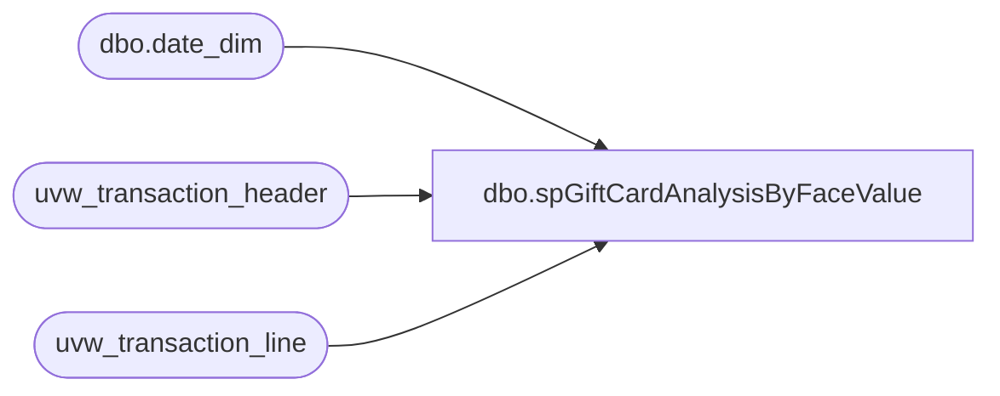

# dbo.spGiftCardAnalysisByFaceValue

**Database:** auditworks  
**Server:** bedrockdb01  

## Architecture Diagram



## Table Dependencies

| Referenced Table |
|---|
| dbo.date_dim |
| uvw_transaction_header |
| uvw_transaction_line |

## Stored Procedure Code

```sql
-------------This is it!-----------------------------------------------------------
--ALTER
CREATE 
PROCEDURE [dbo].[spGiftCardAnalysisByFaceValue] 

@1_ActivationStartDate datetime,
@2_ActivationEndDate datetime,
@3_RedemptionStartDate datetime,
@4_RedemptionEndDate datetime

--=====================================================================================================
-- Name: spGiftCardAnalysisByFaceValue
--
-- Description:	Enter description here
--
-- Input:	
--			@1_ActivationStartDate		datetime	
--			@2_ActivationEndDate		datetime	
--			@3_RedemptionStartDate		datetime	
--			@4_RedemptionEndDate		datetime	
--
-- Output: Resultset with the following columns:
--			
--
-- Dependencies: None
--
-- Revision History
--		Name:			Date:			Comments:
--		FunmiA			02/08/2010		Created ...
-- =====================================================================================================

AS
SET NOCOUNT ON
/*--********************************************--********************************************--********************************************
										ACTIVATIONS
--********************************************--********************************************--********************************************/

--********************************************Activations Against AuditWorks Begins********************************************--****************************/

/*
declare @1_ActivationStartDate datetime,
@2_ActivationEndDate datetime,
@3_RedemptionStartDate datetime,
@4_RedemptionEndDate datetime

set @1_ActivationStartDate = '11/24/2009'
set @2_ActivationEndDate  = '11/24/2009'
set @3_RedemptionStartDate  = '11/24/2009'
set @4_RedemptionEndDate  = '11/24/2009'
*/

IF (Object_ID('tempdb..##activations_1') IS NOT NULL) DROP TABLE  ##activations_1

SELECT  

'Activation' as [Action],th.transaction_void_flag,tl.line_void_flag
,tl.line_object, tl.line_action , d.date_key, d.fiscal_year
,d.fiscal_quarter,d.org_fiscal_period fiscal_period, d.org_fiscal_week fiscal_week, th.transaction_date 
, th.store_no, th.register_no,th.transaction_id
,th.transaction_no,tl.reference_no, 1 as no_of_giftcards
,th.tender_total, tl.gross_line_amount
,CASE WHEN tl.gross_line_amount < 10 THEN '<10'
WHEN tl.gross_line_amount = 10 THEN '10'
WHEN tl.gross_line_amount between 10.01 and 14.99 THEN '10.01-14.99'
WHEN tl.gross_line_amount between 15 and 19.99 THEN '15-19.99'
WHEN tl.gross_line_amount between 20 and 24.99 THEN '20-24.99'
WHEN tl.gross_line_amount between 25 and 29.99 THEN '25-29.99'
WHEN tl.gross_line_amount between 30 and 34.99 THEN '30-34.99'
WHEN tl.gross_line_amount between 35 and 39.99 THEN '35-39.99'
WHEN tl.gross_line_amount between 40 and 44.99 THEN '40-44.99'
WHEN tl.gross_line_amount between 45 and 49.99 THEN '45-49.99'
WHEN tl.gross_line_amount between 50 and 74.99 THEN '50-74.99'
WHEN tl.gross_line_amount > 74.99 THEN '75+' END AS face_value
, CASE WHEN tl.gross_line_amount = 10 then 1 else 0 END AS TransWithTenDollarGC
 INTO ##activations_1  
FROM auditworks..uvw_transaction_header th with (nolock)  join  auditworks..uvw_transaction_line tl with (nolock) on 
th.transaction_id = tl.transaction_id  
--and th.transaction_id = tl.transaction_id 
join dbo.date_dim d with (nolock) on 
th.transaction_date = d.actual_date
WHERE th.transaction_void_flag = 0  and tl.line_void_flag <> 1 
   and th.transaction_date between @1_ActivationStartDate and @2_ActivationEndDate
   and (( tl.line_object in (403,404) and tl.line_action = 1 )  -- Gift Card Activations  
         or  
	  (tl.line_object = 633 and tl.line_action = 12)) -- Gift Card Activations

--********************************************Activations Against AuditWorks Ends********************************************--********************************************/

--********************************************Activations Against Queries Begins********************************************--********************************************/
/*
IF (Object_ID('tempdb..##activations_1') IS NOT NULL) DROP TABLE  ##activations_1

SELECT  
line_object, line_action , 'Activation' as [Action],store_no, register_no,transaction_id,transaction_no,reference_no, 1 as no_of_giftcards, transaction_date, date_key, fiscal_year,
fiscal_quarter,org_fiscal_period,fiscal_period, org_fiscal_week,fiscal_week, transaction_void_flag,tender_total, line_void_flag,gross_line_amount
,CASE WHEN gross_line_amount < 10 THEN '<10'
WHEN gross_line_amount = 10 THEN '10'
WHEN gross_line_amount between 10.01 and 14.99 THEN '10.01-14.99'
WHEN gross_line_amount between 15 and 19.99 THEN '15-19.99'
WHEN gross_line_amount between 20 and 24.99 THEN '20-24.99'
WHEN gross_line_amount between 25 and 29.99 THEN '25-29.99'
WHEN gross_line_amount between 30 and 34.99 THEN '30-34.99'
WHEN gross_line_amount between 35 and 39.99 THEN '35-39.99'
WHEN gross_line_amount between 40 and 44.99 THEN '40-44.99'
WHEN gross_line_amount between 45 and 49.99 THEN '45-49.99'
WHEN gross_line_amount between 50 and 74.99 THEN '50-74.99'
WHEN gross_line_amount > 74.99 THEN '75+' END AS face_value
, CASE WHEN gross_line_amount = 10 then 1 else 0 END AS TransWithTenDollarGC
  INTO ##activations_1  
FROM queries.dbo.FA_tmp_AWGiftCardTransactions  
WHERE 
 transaction_void_flag = 0  and line_void_flag <> 1 
--   and transaction_date between @1_ActivationStartDate and @2_ActivationEndDate
   and (( line_object in (403,404) and line_action = 1 )  -- Gift Card Activations  
         or  
	  (line_object = 633 and line_action = 12)) -- Gift Card Activations

*/

--select * from queries.dbo.FA_tmp_AWGiftCardTransactions  

--********************************************Activations Against Queries Ends********************************************--********************************************/

--eliminate duplicate giftcard activations.  (Convert numeric fields like store_no and date fields to alphanumeric)
IF (Object_ID('tempdb..##activations_2') IS NOT NULL) DROP TABLE  ##activations_2

select cast(transaction_void_flag as varchar(2)) transaction_void_flag
,cast(line_void_flag  as varchar(2)) line_void_flag
,cast(line_object as varchar(8)) line_object
,cast(line_action as varchar(8)) line_action
,[Action]
,cast(store_no as varchar(50)) store_no
,cast(register_no as varchar(50)) register_no
,cast(transaction_id as varchar(50)) transaction_id
,cast(transaction_no as varchar(50)) transaction_no
,reference_no
,cast(date_key as varchar(8)) date_key
,cast(fiscal_year as varchar(4)) fiscal_year
,cast(fiscal_quarter as varchar(2)) fiscal_quarter
,cast(fiscal_period as varchar(2)) fiscal_period
,cast(fiscal_week as varchar(2)) fiscal_week
,transaction_date 
,no_of_giftcards
,tender_total
, gross_line_amount
,face_value
,TransWithTenDollarGC
INTO ##activations_2 
FROM ##activations_1
group by 
cast(transaction_void_flag as varchar(2)) 
,cast(line_void_flag  as varchar(2)) 
,cast(line_object as varchar(8)) 
,cast(line_action as varchar(8)) 
,[Action]
,cast(store_no as varchar(50)) 
,cast(register_no as varchar(50)) 
,cast(transaction_id as varchar(50)) 
,cast(transaction_no as varchar(50)) 
,reference_no
,cast(date_key as varchar(8)) 
,cast(fiscal_year as varchar(4)) 
,cast(fiscal_quarter as varchar(2)) 
,cast(fiscal_period as varchar(2)) 
,cast(fiscal_week as varchar(2)) 
,transaction_date 
,no_of_giftcards
,tender_total
, gross_line_amount
,face_value
,TransWithTenDollarGC

--determine trans with $10 gift card activations 
IF (Object_ID('tempdb..##activations_3') IS NOT NULL) DROP TABLE  ##activations_3

select transaction_id, store_no,transaction_date,tender_total
,case when sum(TransWithTenDollarGC) > 0 then 'Y' else 'N' END AS TransWithTenDollarGC
,case when sum(gross_line_amount) < tender_total then 'N' else 'Y' END AS GiftCardOnlyTrans
into ##activations_3
FROM ##activations_2
group by transaction_id, store_no,transaction_date,tender_total


--update unique line item transactions with $10 gift card activation flag
IF (Object_ID('tempdb..##activations') IS NOT NULL) DROP TABLE  ##activations

select a.line_object, a.line_action ,a.[Action]
,a.fiscal_year,a.fiscal_quarter, a.fiscal_period, a.fiscal_week, a.transaction_date
,a.store_no,a.register_no,a.transaction_id,a.transaction_no,a.reference_no
,a.no_of_giftcards,a.tender_total, a.gross_line_amount,a.face_value,b.TransWithTenDollarGC,b.GiftCardOnlyTrans
into ##activations
FROM ##activations_2 a join ##activations_3 b ON
a.transaction_id = b.transaction_id
and a.store_no = b.store_no 
and a.transaction_date = b.transaction_date

--select * from ##activations order by transaction_id

-- aggregate line items to single record per transaction_id 
IF (Object_ID('tempdb..##activationsByTransaction') IS NOT NULL) DROP TABLE  ##activationsByTransaction 

select [Action],fiscal_year,fiscal_quarter, fiscal_period, fiscal_week
,store_no,face_value,TransWithTenDollarGC,GiftCardOnlyTrans
,transaction_id,transaction_no
,sum(no_of_giftcards) NoOfGiftCards 
,tender_total,sum(gross_line_amount) TotalGCAmount
into ##activationsByTransaction
FROM ##activations 
group by [Action],fiscal_year,fiscal_quarter, fiscal_period, fiscal_week
,store_no,face_value,TransWithTenDollarGC,GiftCardOnlyTrans,tender_total
,transaction_id,transaction_no


--determine TenderTotal per transaction_id
IF (Object_ID('tempdb..##activationsByTenderTotal') IS NOT NULL) DROP TABLE  ##activationsByTenderTotal 

select [Action],fiscal_year,fiscal_quarter, fiscal_period, fiscal_week
,store_no,face_value,TransWithTenDollarGC,GiftCardOnlyTrans
,count(distinct transaction_id) NoOfTransactions
,sum(NoOfGiftCards) NoOfGiftCards 
,sum(tender_total) TenderTotal, sum(TotalGCAmount) TotalGCAmount
into ##activationsByTenderTotal
FROM ##activationsByTransaction 
group by [Action],fiscal_year,fiscal_quarter, fiscal_period, fiscal_week
,store_no,face_value,TransWithTenDollarGC,GiftCardOnlyTrans

--$$$$$$$$$$$$$$$$$$$$$$$$$$$$$$$$$$$$$$$$$$$$$$$$$$$$$$$$$$$$$$$$$$$$$$$$$$$$$$$$$$$$$$$$$$$$$$$$$$$$$$$$$$$$$$$$$$$$$$$$$$$$$$

IF (Object_ID('tempdb..##activationsByFaceValue') IS NOT NULL) DROP TABLE  ##activationsByFaceValue

--select * from ##activationsByTenderTotal

select [Action],fiscal_year,fiscal_quarter, fiscal_period, fiscal_week
,store_no,face_value 
,NoOfTransWithTenDollarGC = 
case when TransWithTenDollarGC = 'Y' then sum(NoOfGiftCards) 
else 0 end
,NoOfTransWithoutTenDollarGC = 
case when TransWithTenDollarGC = 'N' then sum(NoOfGiftCards) 
else 0 end
,NoOfGiftCardOnlyTrans = 
case when GiftCardOnlyTrans = 'Y' then sum(NoOfGiftCards) 
else 0 end
,NoOfGiftCardPlusTrans = 
case when GiftCardOnlyTrans = 'N' then sum(NoOfGiftCards) 
else 0 end
,Sum(NoOfTransactions) NoOfTransactions 
,sum(NoOfGiftCards) NoOfGiftCards
,sum(TenderTotal) TenderTotal,sum(TotalGCAmount) TotalGCAmount
into ##activationsByFaceValue
from ##activationsByTenderTotal
--where store_no = 2015
group by 
[Action],fiscal_year,fiscal_quarter, fiscal_period, fiscal_week
,store_no,face_value,TransWithTenDollarGC,GiftCardOnlyTrans
order by fiscal_year,fiscal_week,store_no,face_value

IF (Object_ID('tempdb..##FinalGCActivationsAnalysis') IS NOT NULL) DROP TABLE  ##FinalGCActivationsAnalysis 

select [Action],fiscal_year,fiscal_quarter, fiscal_period
, fiscal_week,store_no,face_value
,sum(NoOfGiftCards) NoOfGiftCards
,sum(TotalGCAmount) TotalGCAmount
,sum(NoOfTransactions) NoOfTransactions 
,sum(TenderTotal) TenderTotal
,sum(NoOfTransWithTenDollarGC) NoOfTransWithTenDollarGC
,sum(NoOfTransWithoutTenDollarGC) NoOfTransWithoutTenDollarGC
,sum(NoOfGiftCardOnlyTrans) NoOfGiftCardOnlyTrans
,sum(NoOfGiftCardPlusTrans) NoOfGiftCardPlusTrans
into ##FinalGCActivationsAnalysis 
from ##activationsByFaceValue 
group by [Action],fiscal_year 
,fiscal_quarter, fiscal_period  
, fiscal_week, store_no, face_value 


--Select Data

select -- top 1
'Activations By Face Value' as ReportName
,a.[Action]
,a.fiscal_year
,a.fiscal_quarter
,a.fiscal_period
,a.fiscal_week
,a.store_no
,a.face_value
,a.NoOfGiftCards
,a.TotalGCAmount
,a.NoOfTransactions
,a.TenderTotal
,a.NoOfTransWithTenDollarGC
,a.NoOfTransWithoutTenDollarGC
,a.NoOfGiftCardOnlyTrans
,a.NoOfGiftCardPlusTrans
from ##FinalGCActivationsAnalysis a
order by fiscal_year,fiscal_week,store_no,face_value

-- top 1 * from ##FinalGCRedemptionsAnalysis


--select top 1 * from ##activations

select -- top 1
'Activation Details' as ReportName
,a.[Action]
,a.line_object
,a.line_action
,a.fiscal_year
,a.fiscal_quarter
,a.fiscal_period
,a.fiscal_week
,a.transaction_date
,a.store_no
,a.register_no
,a.transaction_id
,a.transaction_no
,a.reference_no
,a.no_of_giftcards
,a.tender_total
,a.gross_line_amount
,a.face_value
,a.TransWithTenDollarGC
,a.GiftCardOnlyTrans
from ##activations a
order by fiscal_year,fiscal_week,store_no,transaction_id , face_value, TransWithTenDollarGC,GiftCardOnlyTrans

/*$$$$$$$$$$$$$$$$$$$$$$$$$$$$$$$$$$$$$$$$$$$$$$$$$$$$$$$$$$$$$$$$$$$$$$$$$$$$$$$$$$$$$$$$$$$$$$$$$$$$$$$$$$$$*/


/*--********************************************--********************************************--********************************************
										REDEMPTIONS
--********************************************--********************************************--********************************************/

--********************************************Redemptions Against AuditWorks Begins********************************************--****************************/

/* 

declare @1_ActivationStartDate datetime,
@@2_ActivationEndDate datetime,
@3_RedemptionStartDate datetime,
@4_RedemptionEndDate datetime

set @1_ActivationStartDate = '11/24/2009'
set @@2_ActivationEndDate  = '11/24/2009'
set @3_RedemptionStartDate  = '11/24/2009'
set @4_RedemptionEndDate  = '11/24/2009'

*/ 

IF (Object_ID('tempdb..##redemptions_1') IS NOT NULL) DROP TABLE  ##redemptions_1

SELECT  

'Redemption' as [Action],th.transaction_void_flag,tl.line_void_flag
,tl.line_object, tl.line_action , d.date_key, d.fiscal_year
,d.fiscal_quarter,d.org_fiscal_period fiscal_period, d.org_fiscal_week fiscal_week, th.transaction_date 
, th.store_no, th.register_no,th.transaction_id
,th.transaction_no,tl.reference_no, 1 as no_of_giftcards
,th.tender_total, tl.gross_line_amount
,CASE WHEN tl.gross_line_amount < 10 THEN '<10'
WHEN tl.gross_line_amount = 10 THEN '10'
WHEN tl.gross_line_amount between 10.01 and 14.99 THEN '10.01-14.99'
WHEN tl.gross_line_amount between 15 and 19.99 THEN '15-19.99'
WHEN tl.gross_line_amount between 20 and 24.99 THEN '20-24.99'
WHEN tl.gross_line_amount between 25 and 29.99 THEN '25-29.99'
WHEN tl.gross_line_amount between 30 and 34.99 THEN '30-34.99'
WHEN tl.gross_line_amount between 35 and 39.99 THEN '35-39.99'
WHEN tl.gross_line_amount between 40 and 44.99 THEN '40-44.99'
WHEN tl.gross_line_amount between 45 and 49.99 THEN '45-49.99'
WHEN tl.gross_line_amount between 50 and 74.99 THEN '50-74.99'
WHEN tl.gross_line_amount > 74.99 THEN '75+' END AS face_value
, CASE WHEN tl.gross_line_amount = 10 then 1 else 0 END AS TransWithTenDollarGC
 
/*
'Redemption' as [Action]
,cast(d.date_key as varchar(8)) date_key
,cast(tl.line_object as varchar(8)) line_object
,cast(tl.line_action as varchar(8)) line_action
,cast(d.fiscal_year as varchar(4)) fiscal_year
,cast(d.fiscal_quarter as varchar(2)) fiscal_quarter
,cast(d.org_fiscal_period as varchar(2)) fiscal_period
,cast(d.org_fiscal_week as varchar(2)) fiscal_week
, th.transaction_date 
,cast(th.store_no as varchar(50)) store_no
,cast(th.register_no as varchar(50)) register_no
,cast(th.transaction_id as varchar(50)) transaction_id
,cast(th.transaction_no as varchar(50)) transaction_no
,tl.reference_no
, 1 as no_of_giftcards
,th.tender_total
, tl.gross_line_amount
,CASE WHEN tl.gross_line_amount < 10 THEN '<10'
WHEN tl.gross_line_amount = 10 THEN '10'
WHEN tl.gross_line_amount between 10.01 and 14.99 THEN '10.01-14.99'
WHEN tl.gross_line_amount between 15 and 19.99 THEN '15-19.99'
WHEN tl.gross_line_amount between 20 and 24.99 THEN '20-24.99'
WHEN tl.gross_line_amount between 25 and 29.99 THEN '25-29.99'
WHEN tl.gross_line_amount between 30 and 34.99 THEN '30-34.99'
WHEN tl.gross_line_amount between 35 and 39.99 THEN '35-39.99'
WHEN tl.gross_line_amount between 40 and 44.99 THEN '40-44.99'
WHEN tl.gross_line_amount between 45 and 49.99 THEN '45-49.99'
WHEN tl.gross_line_amount between 50 and 74.99 THEN '50-74.99'
WHEN tl.gross_line_amount > 74.99 THEN '75+' END AS face_value
, CASE WHEN tl.gross_line_amount = 10 then 1 else 0 END AS TransWithTenDollarGC
*/
 INTO ##redemptions_1  
FROM auditworks..uvw_transaction_header th with (nolock)  join  auditworks..uvw_transaction_line tl with (nolock) on 
th.transaction_id = tl.transaction_id  
--and th.transaction_id = tl.transaction_id 
join dbo.date_dim d with (nolock) on 
th.transaction_date = d.actual_date
WHERE th.transaction_void_flag = 0  and tl.line_void_flag <> 1 
   and th.transaction_date between @3_RedemptionStartDate and @4_RedemptionEndDate
  and (( line_object in (403,404)  and line_action = 2 ) -- Gift Card Redemptions
            or  
	 (line_object = 633  and line_action = 25 )) -- Gift Card Redemptions

--********************************************Redemptions Against AuditWorks Ends********************************************--********************************************/

--********************************************Redemptions Against Queries Begins********************************************--********************************************/
/*
IF (Object_ID('tempdb..##redemptions_1') IS NOT NULL) DROP TABLE  ##redemptions_1

SELECT  
line_object, line_action , 'Redemption' as [Action],store_no, register_no,transaction_id,transaction_no,reference_no, 1 as no_of_giftcards, transaction_date, date_key, fiscal_year,
fiscal_quarter,org_fiscal_period,fiscal_period, org_fiscal_week,fiscal_week, transaction_void_flag,tender_total, line_void_flag,gross_line_amount
,CASE WHEN gross_line_amount < 10 THEN '<10'
WHEN gross_line_amount = 10 THEN '10'
WHEN gross_line_amount between 10.01 and 14.99 THEN '10.01-14.99'
WHEN gross_line_amount between 15 and 19.99 THEN '15-19.99'
WHEN gross_line_amount between 20 and 24.99 THEN '20-24.99'
WHEN gross_line_amount between 25 and 29.99 THEN '25-29.99'
WHEN gross_line_amount between 30 and 34.99 THEN '30-34.99'
WHEN gross_line_amount between 35 and 39.99 THEN '35-39.99'
WHEN gross_line_amount between 40 and 44.99 THEN '40-44.99'
WHEN gross_line_amount between 45 and 49.99 THEN '45-49.99'
WHEN gross_line_amount between 50 and 74.99 THEN '50-74.99'
WHEN gross_line_amount > 74.99 THEN '75+' END AS face_value
, CASE WHEN gross_line_amount = 10 then 1 else 0 END AS TransWithTenDollarGC
  INTO ##redemptions_1  
FROM queries.dbo.FA_tmp_AWGiftCardTransactions  
WHERE th.transaction_void_flag = 0  and tl.line_void_flag <> 1 
 --  and th.transaction_date between @3_RedemptionStartDate and @4_RedemptionEndDate
  and (( line_object in (403,404)  and line_action = 2 ) -- Gift Card Redemptions
            or  
	 (line_object = 633  and line_action = 25 )) -- Gift Card Redemptions

*/

--select * from queries.dbo.FA_tmp_AWGiftCardTransactions  

--********************************************Redemptions Against Queries Ends********************************************--********************************************/

--eliminate duplicate giftcard redemptions
IF (Object_ID('tempdb..##redemptions_2') IS NOT NULL) DROP TABLE  ##redemptions_2

select
/* line_object, line_action , [Action]
,store_no, register_no,transaction_id,transaction_no,reference_no
,no_of_giftcards, transaction_date, date_key, fiscal_year,
fiscal_quarter,fiscal_period, fiscal_week
, transaction_void_flag,tender_total, line_void_flag,gross_line_amount
,face_value,TransWithTenDollarGC*/
cast(transaction_void_flag as varchar(2)) transaction_void_flag
,cast(line_void_flag  as varchar(2)) line_void_flag
,cast(line_object as varchar(8)) line_object
,cast(line_action as varchar(8)) line_action
,[Action]
,cast(store_no as varchar(50)) store_no
,cast(register_no as varchar(50)) register_no
,cast(transaction_id as varchar(50)) transaction_id
,cast(transaction_no as varchar(50)) transaction_no
,reference_no
,cast(date_key as varchar(8)) date_key
,cast(fiscal_year as varchar(4)) fiscal_year
,cast(fiscal_quarter as varchar(2)) fiscal_quarter
,cast(fiscal_period as varchar(2)) fiscal_period
,cast(fiscal_week as varchar(2)) fiscal_week
,transaction_date 
,no_of_giftcards
,tender_total
, gross_line_amount
,face_value
,TransWithTenDollarGC
INTO ##redemptions_2 
FROM ##redemptions_1
group by 
cast(transaction_void_flag as varchar(2)) 
,cast(line_void_flag  as varchar(2)) 
,cast(line_object as varchar(8)) 
,cast(line_action as varchar(8)) 
,[Action]
,cast(store_no as varchar(50)) 
,cast(register_no as varchar(50)) 
,cast(transaction_id as varchar(50)) 
,cast(transaction_no as varchar(50)) 
,reference_no
,cast(date_key as varchar(8)) 
,cast(fiscal_year as varchar(4)) 
,cast(fiscal_quarter as varchar(2)) 
,cast(fiscal_period as varchar(2)) 
,cast(fiscal_week as varchar(2)) 
,transaction_date 
,no_of_giftcards
,tender_total
, gross_line_amount
,face_value
,TransWithTenDollarGC

--determine trans with $10 gift card redemptions 
IF (Object_ID('tempdb..##redemptions_3') IS NOT NULL) DROP TABLE  ##redemptions_3

select transaction_id, store_no,transaction_date,tender_total
,case when sum(TransWithTenDollarGC) > 0 then 'Y' else 'N' END AS TransWithTenDollarGC
,case when sum(gross_line_amount) < tender_total then 'N' else 'Y' END AS GiftCardOnlyTrans
into ##redemptions_3
FROM ##redemptions_2
group by transaction_id, store_no,transaction_date,tender_total


IF (Object_ID('tempdb..##redemptions') IS NOT NULL) DROP TABLE  ##redemptions

select a.line_object, a.line_action ,a.[Action]
,a.fiscal_year,a.fiscal_quarter, a.fiscal_period, a.fiscal_week, a.transaction_date
,a.store_no,a.register_no,a.transaction_id,a.transaction_no,a.reference_no
,a.no_of_giftcards,a.tender_total, a.gross_line_amount,a.face_value,b.TransWithTenDollarGC,b.GiftCardOnlyTrans
into ##redemptions
FROM ##redemptions_2 a join ##redemptions_3 b ON
a.transaction_id = b.transaction_id
and a.store_no = b.store_no 
and a.transaction_date = b.transaction_date

--select * from ##redemptions order by transaction_id

IF (Object_ID('tempdb..##redemptionsByTransaction') IS NOT NULL) DROP TABLE  ##redemptionsByTransaction 

select [Action],fiscal_year,fiscal_quarter, fiscal_period, fiscal_week
,store_no,face_value,TransWithTenDollarGC,GiftCardOnlyTrans
,transaction_id,transaction_no
,sum(no_of_giftcards) NoOfGiftCards 
,tender_total,sum(gross_line_amount) TotalGCAmount
into ##redemptionsByTransaction
FROM ##redemptions 
group by [Action],fiscal_year,fiscal_quarter, fiscal_period, fiscal_week
,store_no,face_value,TransWithTenDollarGC,GiftCardOnlyTrans,tender_total
,transaction_id,transaction_no


IF (Object_ID('tempdb..##redemptionsByTenderTotal') IS NOT NULL) DROP TABLE  ##redemptionsByTenderTotal 

select [Action],fiscal_year,fiscal_quarter, fiscal_period, fiscal_week
,store_no,face_value,TransWithTenDollarGC,GiftCardOnlyTrans
,count(distinct transaction_id) NoOfTransactions
,sum(NoOfGiftCards) NoOfGiftCards 
,sum(tender_total) TenderTotal, sum(TotalGCAmount) TotalGCAmount
into ##redemptionsByTenderTotal
FROM ##redemptionsByTransaction 
group by [Action],fiscal_year,fiscal_quarter, fiscal_period, fiscal_week
,store_no,face_value,TransWithTenDollarGC,GiftCardOnlyTrans

--$$$$$$$$$$$$$$$$$$$$$$$$$$$$$$$$$$$$$$$$$$$$$$$$$$$$$$$$$$$$$$$$$$$$$$$$$$$$$$$$$$$$$$$$$$$$$$$$$$$$$$$$$$$$$$$$$$$$$$$$$$$$$$

IF (Object_ID('tempdb..##redemptionsByFaceValue') IS NOT NULL) DROP TABLE  ##redemptionsByFaceValue

--select * from ##redemptionsByTenderTotal

select [Action],fiscal_year,fiscal_quarter, fiscal_period, fiscal_week
,store_no,face_value --,TransWithTenDollarGC,GiftCardOnlyTrans
,NoOfTransWithTenDollarGC = 
case when TransWithTenDollarGC = 'Y' then sum(NoOfGiftCards) 
else 0 end
,NoOfTransWithoutTenDollarGC = 
case when TransWithTenDollarGC = 'N' then sum(NoOfGiftCards) 
else 0 end
,NoOfGiftCardOnlyTrans = 
case when GiftCardOnlyTrans = 'Y' then sum(NoOfGiftCards) 
else 0 end
,NoOfGiftCardPlusTrans = 
case when GiftCardOnlyTrans = 'N' then sum(NoOfGiftCards) 
else 0 end
,Sum(NoOfTransactions) NoOfTransactions 
,sum(NoOfGiftCards) NoOfGiftCards
,sum(TenderTotal) TenderTotal,sum(TotalGCAmount) TotalGCAmount
into ##redemptionsByFaceValue
from ##redemptionsByTenderTotal
--where store_no = 2015
group by 
[Action],fiscal_year,fiscal_quarter, fiscal_period, fiscal_week
,store_no,face_value,TransWithTenDollarGC,GiftCardOnlyTrans
order by fiscal_year,fiscal_week,store_no,face_value

IF (Object_ID('tempdb..##FinalGCRedemptionsAnalysis') IS NOT NULL) DROP TABLE  ##FinalGCRedemptionsAnalysis 

select [Action],fiscal_year,fiscal_quarter, fiscal_period
, fiscal_week,store_no,face_value
,sum(NoOfGiftCards) NoOfGiftCards
,sum(TotalGCAmount) TotalGCAmount
,sum(NoOfTransactions) NoOfTransactions 
,sum(TenderTotal) TenderTotal
,sum(NoOfTransWithTenDollarGC) NoOfTransWithTenDollarGC
,sum(NoOfTransWithoutTenDollarGC) NoOfTransWithoutTenDollarGC
,sum(NoOfGiftCardOnlyTrans) NoOfGiftCardOnlyTrans
,sum(NoOfGiftCardPlusTrans) NoOfGiftCardPlusTrans
into ##FinalGCRedemptionsAnalysis 
from ##redemptionsByFaceValue 
group by [Action],fiscal_year 
,fiscal_quarter, fiscal_period  
, fiscal_week, store_no, face_value 


--Select Data

select -- top 1
'Redemptions By Face Value' as ReportName
,r.[Action]
,r.fiscal_year
,r.fiscal_quarter
,r.fiscal_period
,r.fiscal_week
,r.store_no
,r.face_value
,r.NoOfGiftCards
,r.TotalGCAmount
,r.NoOfTransactions
,r.TenderTotal
,r.NoOfTransWithTenDollarGC
,r.NoOfTransWithoutTenDollarGC
,r.NoOfGiftCardOnlyTrans
,r.NoOfGiftCardPlusTrans
from ##FinalGCRedemptionsAnalysis r
order by fiscal_year,fiscal_week,store_no,face_value

-- top 1 * from ##FinalGCRedemptionsAnalysis


--select top 1 * from ##redemptions

select -- top 1
'Redemption Details' as ReportName
,r.[Action]
,r.line_object
,r.line_action
,r.fiscal_year
,r.fiscal_quarter
,r.fiscal_period
,r.fiscal_week
,r.transaction_date
,r.store_no
,r.register_no
,r.transaction_id
,r.transaction_no
,r.reference_no
,r.no_of_giftcards
,r.tender_total
,r.gross_line_amount
,r.face_value
,r.TransWithTenDollarGC
,r.GiftCardOnlyTrans
from ##redemptions r
order by fiscal_year,fiscal_week,store_no,transaction_id , face_value, TransWithTenDollarGC,GiftCardOnlyTrans
```

