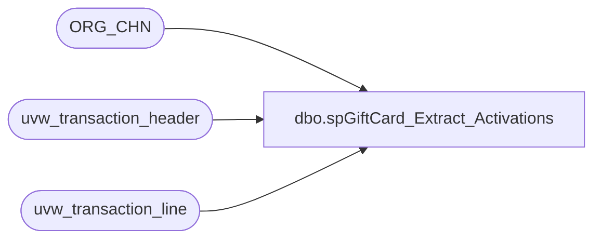

# dbo.spGiftCard_Extract_Activations

**Database:** auditworks  
**Server:** bedrockdb01  

## Architecture Diagram



## Table Dependencies

| Referenced Table |
|---|
| ORG_CHN |
| uvw_transaction_header |
| uvw_transaction_line |

## Stored Procedure Code

```sql
CREATE PROCEDURE [dbo].[spGiftCard_Extract_Activations]
	-- =============================================================================================================
	-- Name: spGiftCard_Extract_Activations
	--
	-- Description:	
	--	Pull the giftcard activations for pulling the datawarehouse.
	--
	--
	-- Input:		@numDaysHorizon = number of days to go back for the extraction
	--
	-- Output: 
	--
	-- Dependencies: NOTE THE UNION STATEMENT IN THE SELECTION IF YOU HAVE TO CHANGE THE CRITERIA
	--
	-- Revision History
	--		Name:			Date:			Comments:
	--		Gary Murrish	4/17/2013		Created

	-- =============================================================================================================
	@numDaysHorizon AS int
AS

	SET NOCOUNT ON

	DECLARE @asOfDate datetime
	SET @asOfDate = CONVERT(varchar(10), DATEADD(D, -1 * @numDaysHorizon, GETDATE()), 101)

	SELECT
		base.transaction_id,
		MIN(base.transaction_date) AS transaction_date,
		SUM(base.gross_line_amount) AS gross_line_amount,
		SUM(base.pos_discount_amount) AS pos_discount_amount,
		base.reference_no,
		MIN(base.DFLT_CRNCY_CODE) AS DFLT_CRNCY_CODE,
		MIN(base.store_no) AS store_no
	FROM
		(SELECT
				CAST(th.transaction_id AS integer) AS transaction_id,
				th.transaction_date,
				CAST((tl.gross_line_amount * tl.db_cr_none * -1) AS money) AS gross_line_amount,
				CAST((tl.pos_discount_amount * tl.db_cr_none * -1) AS money) AS pos_discount_amount,
				LTRIM(RTRIM(tl.reference_no)) COLLATE SQL_Latin1_General_CP1_CI_AS reference_no,
				ORG.DFLT_CRNCY_CODE,
				th.store_no
			FROM
				uvw_transaction_header th WITH (NOLOCK)
				INNER JOIN uvw_transaction_line tl WITH (NOLOCK)
					ON th.transaction_id = tl.transaction_id
				INNER JOIN ORG_CHN ORG WITH (NOLOCK)
					ON th.store_no = ORG.ORG_CHN_NUM
			WHERE
				th.transaction_date >= @asOfDate
				AND tl.reference_no IS NOT NULL
				AND th.transaction_void_flag = 0
				AND tl.line_void_flag <> 1
				AND tl.gross_line_amount <> 0
				AND LEFT(LTRIM(tl.reference_no), 1) = '6'
				AND ((tl.line_object = 403 -- E-Card Activations
				AND tl.line_action = 1)
				OR (tl.line_object = 404 -- Gift Card Activations
				AND tl.line_action IN (1,2))
				OR (tl.line_object = 633 -- Gift Card Activations
				AND tl.line_action IN (12, 24))) -- Added 24 as a valid action code
		)
		base
	GROUP BY	base.transaction_id,
				base.reference_no
```

