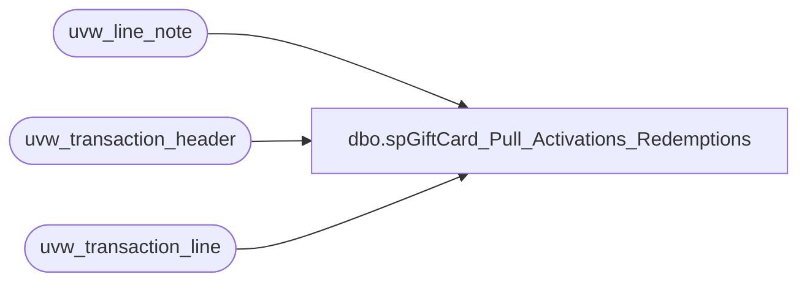

# dbo.spGiftCard_Pull_Activations_Redemptions

**Database:** auditworks  
**Server:** bedrockdb01  

## Architecture Diagram



## Table Dependencies

| Referenced Table |
|---|
| uvw_line_note |
| uvw_transaction_header |
| uvw_transaction_line |

## Stored Procedure Code

```sql
CREATE PROCEDURE [dbo].[spGiftCard_Pull_Activations_Redemptions] 
-- =============================================================================================================
-- Name: spGiftCard_Pull_Activations_Redemptions
--
-- Description:	
--	Pull the giftcard activations and redemptions for the papamart missing reports.
--
-- This was separated out from the papamart.dw jobs because of possible performance issues
-- Since we are waiting for the ValueLink file to be done, this can run earlier.
--
-- Input:		
--
-- Output: 
--
-- Dependencies: 
--
-- Revision History
--		Name:			Date:			Comments:
--		Dave Rice		12/10/2009		created
--		Mike Pelikan	11/15/2012		Modified where clause to include Gift Card Activiations in LD_GiftCard_Activations
--										for PAPAMART.dw.dbo.spGiftCardMissingActivations
--		Mike Pelikan	01/23/2014		modified the where clause for 24 activations and added AND th.store_no > 0
-- =============================================================================================================
AS 

SET NOCOUNT ON

IF (Object_ID('LD_Giftcard_Activations') IS NOT NULL) DROP TABLE LD_Giftcard_Activations
select th.store_no, th.register_no, th.transaction_no, th.transaction_date, th.transaction_id, tl.line_id, tl.line_sequence, th.transaction_void_flag, tl.line_void_flag, tl.gross_line_amount, line_object, tl.reference_no, line_note  
into LD_Giftcard_Activations
from uvw_transaction_header th with (nolock)  
	join uvw_transaction_line tl with (nolock)  
	on tl.transaction_id = th.transaction_id  
	left join uvw_line_note ln with (nolock)  
	on ln.transaction_id = tl.transaction_id  
	and ln.line_id = tl.line_id  
where th.transaction_date between dateadd(mm, -1, getdate()) and dateadd(dd, -1, getdate())  
	and th.transaction_void_flag = 0  
	and tl.line_void_flag <> 1  
	and th.transaction_id = tl.transaction_id  
	-- 294 Gift Card Re-Load  
	-- 403 E-Certificates  
	-- 404 BABW Gift Card  
	and 
	( 
	tl.line_object IN (294,403,404) 
	OR (
		--tl.line_object = 633 AND tl.db_cr_none = -1 AND tl.line_action NOT IN (24, 25, 32, 234, 246)		--commented out 1/23/2014 mjp. 
-- for line_object 633: "BABW Gift Card Tender" the line_action of 24 was making some cards appear
-- as they were not activated.
--24 issued
--25 redeemed
--32 closing
--234 reconciliation picked up
--246 counted
		tl.line_object = 633 AND tl.db_cr_none = -1 AND tl.line_action NOT IN (25, 32, 234, 246) 
		AND tl.gross_line_amount <> 0 
		)
	)


IF (Object_ID('LD_Giftcard_Redemptions') IS NOT NULL) DROP TABLE LD_Giftcard_Redemptions
select th.store_no, th.register_no, th.transaction_no, th.transaction_date, th.transaction_void_flag, tl.line_void_flag, tl.gross_line_amount, tl.reference_no 
into LD_Giftcard_Redemptions
from uvw_transaction_header th with (nolock)
	join uvw_transaction_line tl with (nolock)
	on tl.transaction_id = th.transaction_id
where th.transaction_date between dateadd(mm, -1, getdate()) and dateadd(dd, -1, getdate())  
	and th.transaction_void_flag = 0
	and tl.line_void_flag <> 1
	and line_object = 633 -- BABW Gift Card Tender
	and line_action = 025 -- Redeemed
```

