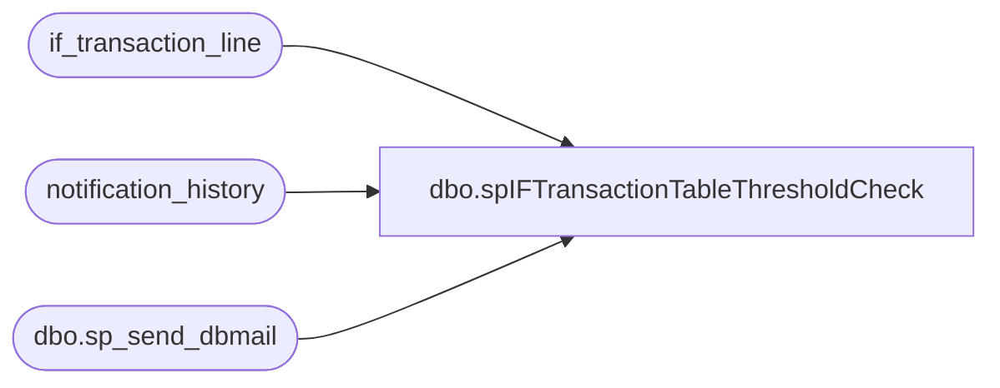

# dbo.spIFTransactionTableThresholdCheck

**Database:** auditworks  
**Server:** bedrockdb01  

## Architecture Diagram



## Table Dependencies

| Referenced Table |
|---|
| if_transaction_line |
| notification_history |
| dbo.sp_send_dbmail |

## Stored Procedure Code

```sql
--DROP PROC [dbo].[spIFTransactionTableThresholdCheck]
--GO

CREATE PROC [dbo].[spIFTransactionTableThresholdCheck]
-- =============================================================================================================
-- Name: [dbo].[spIFTransactionTableThresholdCheck]
--
-- Description:	Sends email alerts if Thresholds have been reached of record counts in the IF Trans tables
--
-- Input:	@filelocation	varchar(100)	path to drop files
--			@rowcount		int				total number of records to process
--
-- Output: N/A
--
-- Dependencies: 
--
-- Revision History
--		Name:			Date:			Comments:
--		Paul Beckman	10/18/2010		Created SP
--		Paul Beckman	07/19/2015		Updated from POSDBSSA to BEDROCKDB01
--		Paul Beckman	01/16/2017		Updated email body to HTML
--		Paul Beckman	02/13/2018		Removed old non-HTML code for email body
--		Paul Beckman	10/18/2019		Updated to use notification_history table
--		Paul Beckman	11/29/2019		Added section to log record to notification_history if threshold is OK
--		Paul Beckman	02/05/2020		Updated email profile to 'EntSysSupport'
--
--
-- exec spIFTransactionTableThresholdCheck
-- =============================================================================================================
AS
SET NOCOUNT ON

declare @sql varchar(8000)
declare @recipients varchar(8000)
declare @Subject varchar(60)
declare @query varchar(8000)
declare @text nvarchar(max)

set @recipients = 'EntSysSupport@buildabear.com'
--set @recipients = 'paulb@buildabear.com'

--#########################################################


if (select count(if_entry_no) as IF_Line_Record_Count from if_transaction_line) between 3000000 and 3500000

begin
	set @text = 
				'<font face =arial size = 2>' +
				'There a large number of records in the auditworks db if_transaction_line table.<br>' +
				'Housekeeping may be having a problem.<br>' +
				'<br>' +
				'<table border="1">' + 
				'<font face =arial size = 2>' +
				'<tr bgcolor=#D5D5F7><th>IF Line Record Count</th></tr>' +
				CAST ( ( SELECT td = count(if_entry_no), ''
					  FROM if_transaction_line
					  FOR xml path ('tr'), type
				) AS NVARCHAR(MAX) ) +
				'</table>' +
				'<br>' +
				'Housekeeping may be having a problem.<br>' +
				'<br>' +
				'SA app > Services Administration > Job Scheduler > SAAPP01 - SA > Housekeeping Server and is named "Housekeeping Job" <br>' +
				'<font face =arial size = 1 color="#C0C0C0">' +
				'<br><br><br><br>' +
				'Server:  BEDROCKDB01 <br>' +
				'Job Name:  Housekeeping_Validation <br>' +
				'Stored Proc:  BEDROCKDB01.auditworks.dbo.spIFTransactionTableThresholdCheck <br>' +
				'Created by:  Paul Beckman <br>' +
				'Team Ownership:  Enterprise Systems <br>'

	set @Subject = 'ALERT - IF Transaction line threshold reached'

	exec msdb.dbo.sp_send_dbmail  
		@profile_name = 'EntSysSupport',
		@recipients = @recipients,
		@subject=@Subject, 
		@body = @text,
		@body_format = 'HTML'
	
	INSERT INTO notification_history
	(stored_proc_name,
	record_logged_datetime,
	issues_found,
	action_required,
	notification_sent,
	email_type,
	email_to,
	email_cc,
	email_subject,
	comment
	)
	VALUES (
	'spIFTransactionTableThresholdCheck', --<< Stored Proc name
	GETDATE(),
	'Yes', --<< Issues found - Yes / No
	'Yes', --<< Action required - Yes / No
	'Yes', --<< Notification sent - Yes / No
	'Alert', --<< Email type - Notification Only / Alert / Warning
	@recipients, --<< Email TO
	NULL, --<< Email CC
	@Subject, --<< Email Subject
	'There is a large number of records in the auditworks db if_transaction_line table' --<< Comment
	)

end

--#########################################################

if (select count(if_entry_no) as IF_Line_Record_Count from if_transaction_line) > 3500000

begin
	set @text = 
				'<font face =arial size = 2 color="Red">' +
				'There are too many records in the auditworks db if_transaction_line table.<br>' +
				'Housekeeping may be having a problem.<br>' +
				'<br>' +
				'<table border="1">' + 
				'<font face =arial size = 2>' +
				'<tr bgcolor=#D5D5F7><th>IF Line Record Count</th></tr>' +
				CAST ( ( SELECT td = count(if_entry_no), ''
					  FROM if_transaction_line
					  FOR xml path ('tr'), type
				) AS NVARCHAR(MAX) ) +
				'</table>' +
				'<br>' +
				'Please take action to resolve this issue.  Aptos may need to be involved.<br>' +
				'<br>' +
				'SA app > Services Administration > Job Scheduler > SAAPP01 - SA > Housekeeping Server and is named "Housekeeping Job" <br>' +
				'<font face =arial size = 1 color="#C0C0C0">' +
				'<br><br><br><br>' +
				'Server:  BEDROCKDB01 <br>' +
				'Job Name:  Housekeeping_Validation <br>' +
				'Stored Proc:  BEDROCKDB01.auditworks.dbo.spIFTransactionTableThresholdCheck <br>' +
				'Created by:  Paul Beckman <br>' +
				'Team Ownership:  Enterprise Systems <br>'

	set @Subject = 'WARNING - IF Transaction line threshold surpassed'

	exec msdb.dbo.sp_send_dbmail  
		@profile_name = 'EntSysSupport',
		@recipients = @recipients,
		@subject=@Subject, 
		@body = @text,
		@body_format = 'HTML'

	INSERT INTO notification_history
	(stored_proc_name,
	record_logged_datetime,
	issues_found,
	action_required,
	notification_sent,
	email_type,
	email_to,
	email_cc,
	email_subject,
	comment
	)
	VALUES (
	'spIFTransactionTableThresholdCheck', --<< Stored Proc name
	GETDATE(),
	'Yes', --<< Issues found - Yes / No
	'Yes', --<< Action required - Yes / No
	'Yes', --<< Notification sent - Yes / No
	'Warning', --<< Email type - Notification Only / Alert / Warning
	@recipients, --<< Email TO
	NULL, --<< Email CC
	@Subject, --<< Email Subject
	'IF Transaction line threshold surpassed.  There is a very large number of records in the auditworks db if_transaction_line table' --<< Comment
	)

end

--#########################################################

if (select count(if_entry_no) as IF_Line_Record_Count from if_transaction_line) < 3000000

begin
	INSERT INTO notification_history
	(stored_proc_name,
	record_logged_datetime,
	issues_found,
	action_required,
	notification_sent,
	comment
	)
	VALUES (
	'spIFTransactionTableThresholdCheck', --<< Stored Proc name
	GETDATE(),
	'No', --<< Issues found - Yes / No
	'No', --<< Action required - Yes / No
	'No', --<< Notification sent - Yes / No
	'IF Transaction line threshold OK.  There are less than 3000000 records in the auditworks db if_transaction_line table' --<< Comment
	)

end
```

