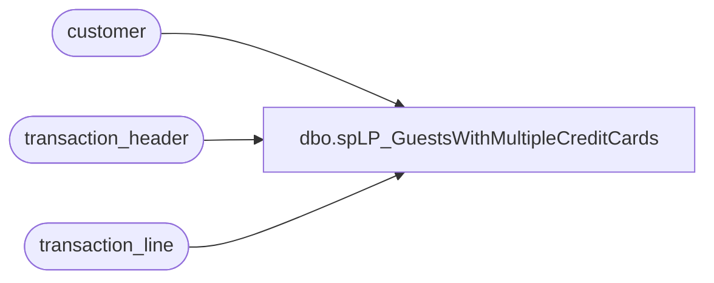

# dbo.spLP_GuestsWithMultipleCreditCards

**Database:** auditworks  
**Server:** bedrockdb01  

## Architecture Diagram



## Table Dependencies

| Referenced Table |
|---|
| customer |
| transaction_header |
| transaction_line |

## Stored Procedure Code

```sql
CREATE PROCEDURE [dbo].[spLP_GuestsWithMultipleCreditCards]
	@minDate datetime,
	@maxDate datetime,
	@minTenders int = 3,
	@minTrans int = 2
AS
	-- =====================================================================================================
	-- Name: spLP_GuestsWithMultipleCreditCards
	--
	-- Description:	This procedure will extract all of the Guests who used multiple credit cards
	--					 during the requested timeframe. These must have happened over more that a one hour
	--					 period.
	--				This is used for Loss Prevention.
	--
	--	WARNING ********************************************************************************************
	--	WARNING ** Changes to this proc will also probably need to be made to the proc that pulls the details
	--	WARNING **		spLP_GuestWithMultpileCreditCards_Detail
	--	WARNING ********************************************************************************************
	-- Input:	
	--			fromDate - Starting Date
	--			thruDate - Ending Date
	--			minTenders - The minimum number of distinct tender reference numbers to flag
	--			minTrans - The minimum number of distinct transactions that this must appear to flag
	--
	-- Output: Resultset with the following columns:
	--			N/A
	--
	-- Dependencies: None
	--
	--
	-- Revision History
	--		Name:			Date:			Comments:
	--		Gary Murrish	10/17/2014		Initial Deployment
	-- =====================================================================================================

	IF OBJECT_ID('tempdb..#Charges') IS NOT NULL
	BEGIN
		DROP TABLE #Charges
	END
	SELECT
		tl.reference_no,
		c.customer_no,
		tl.transaction_id,
		tl.line_object,
		tl.reference_type,
		th.transaction_date,
		th.store_no,
		th.entry_date_time,
		th.cashier_no,
		th.transaction_no,
		th.till_no,
		tl.gross_line_amount,
		tl.line_sequence
	INTO #Charges
	FROM
		transaction_line tl WITH (NOLOCK)
		INNER JOIN transaction_header th WITH (NOLOCK)
			ON tl.transaction_id = th.transaction_id
		INNER JOIN customer c WITH (NOLOCK)
			ON tl.transaction_id = c.transaction_id
			AND c.line_id = 0
	WHERE
		tl.line_object IN (604, 605, 606, 608, 611, 614, 631, 632, 634, 635, 636, 642, 697, 698, 699)
		AND tl.line_action IN (11)
		AND tl.line_void_flag = 0
		AND th.transaction_category IN (1, 2, 10)
		AND th.transaction_series IN ('P', '', 'D', 'F', 'W', 'A')
		AND th.transaction_void_flag = 0
		AND tl.reference_no IS NOT NULL
		AND c.customer_no > 0
		AND th.transaction_date BETWEEN @minDate AND @maxDate


	IF OBJECT_ID('tempdb..#customerProblems') IS NOT NULL
	BEGIN
		DROP TABLE #customerProblems
	END

	SELECT
		c.customer_no,
		MAX(c.reference_no) AS maxNum,
		MIN(c.reference_no) AS minNum,
		COUNT(*) AS numTenders,
		COUNT(DISTINCT c.transaction_id) AS numTrans,
		MIN(c.entry_date_time) AS minTime,
		MAX(c.entry_date_time) AS maxTime,
		COUNT(DISTINCT c.store_no) AS numStores,
		MIN(c.store_no) AS minStore,
		MAX(c.store_no) AS maxStore,
		COUNT(DISTINCT c.reference_no) AS numCards
	INTO #customerProblems
	FROM
		#Charges c
	GROUP BY c.customer_no
	HAVING COUNT(*) >= @minTenders
		AND MAX(c.reference_no) <> MIN(c.reference_no)
		AND COUNT(DISTINCT c.transaction_id) >= @minTrans
		AND DATEDIFF(HOUR, MIN(c.entry_date_time), MAX(c.entry_date_time)) > 1
	ORDER BY 5 DESC

	SELECT
		p.customer_no,
		p.numTenders,
		p.numTrans,
		p.minTime,
		p.maxTime,
		p.numStores,
		p.minStore,
		p.maxStore,
		p.numCards
	FROM
		#customerProblems p
```

