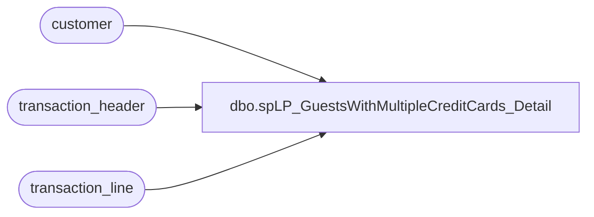

# dbo.spLP_GuestsWithMultipleCreditCards_Detail

**Database:** auditworks  
**Server:** bedrockdb01  

## Architecture Diagram



## Table Dependencies

| Referenced Table |
|---|
| customer |
| transaction_header |
| transaction_line |

## Stored Procedure Code

```sql
CREATE PROCEDURE [dbo].[spLP_GuestsWithMultipleCreditCards_Detail]
	@minDate datetime,
	@maxDate datetime,
	@customerNo int
AS
	-- =====================================================================================================
	-- Name: spLP_GuestsWithMultipleCreditCards_Detail
	--
	-- Description:	This procedure will extract all of the Guest details for a guest who used multiple credit cards
	--					 during the requested timeframe. These must have happened over more that a one hour
	--					 period.
	--				This is used for Loss Prevention.
	--
	--	WARNING ********************************************************************************************
	--	WARNING ** Changes to this proc will also probably need to be made to the proc that pulls the details
	--	WARNING **		spLP_GuestWithMultpileCreditCards
	--	WARNING ********************************************************************************************
	-- Input:	
	--			fromDate - Starting Date
	--			thruDate - Ending Date
	--			customerNo - The Customer number to review
	--
	-- Output: Resultset with the following columns:
	--			N/A
	--
	-- Dependencies: None
	--
	--
	-- Revision History
	--		Name:			Date:			Comments:
	--		Gary Murrish	10/17/2014		Initial Deployment
	-- =====================================================================================================

	IF OBJECT_ID('tempdb..#details') IS NOT NULL
	BEGIN
		DROP TABLE #details
	END
	SELECT
		tl.reference_no,
		c.customer_no,
		tl.transaction_id,
		tl.line_object,
		tl.reference_type,
		th.transaction_date,
		th.store_no,
		th.entry_date_time,
		th.cashier_no,
		th.transaction_no,
		th.till_no,
		tl.gross_line_amount,
		tl.line_sequence
	INTO #details
	FROM
		transaction_line tl WITH (NOLOCK)
		INNER JOIN transaction_header th WITH (NOLOCK)
			ON tl.transaction_id = th.transaction_id
		INNER JOIN customer c WITH (NOLOCK)
			ON tl.transaction_id = c.transaction_id
			AND c.line_id = 0
	WHERE
		tl.line_object IN (604, 605, 606, 608, 611, 614, 631, 632, 634, 635, 636, 642, 697, 698, 699)
		AND tl.line_action IN (11)
		AND tl.line_void_flag = 0
		AND th.transaction_category IN (1, 2, 10)
		AND th.transaction_series IN ('P', '', 'D', 'F', 'W', 'A')
		AND th.transaction_void_flag = 0
		AND tl.reference_no IS NOT NULL
		AND c.customer_no = @customerNo
		AND th.transaction_date BETWEEN @minDate AND @maxDate
	ORDER BY	th.transaction_date,
				th.entry_date_time,
				th.store_no,
				th.transaction_id

	-- Translate the cards numbers to something readable
	IF OBJECT_ID('tempdb..#cardNos') IS NOT NULL
	BEGIN
		DROP TABLE #cardNos
	END
	SELECT
		x.reference_no,
		'Card - ' + RIGHT('0000' + CAST(ROW_NUMBER() OVER (ORDER BY x.reference_no) AS varchar), 4) AS cardNumber
	INTO #cardNos
	FROM
		(SELECT DISTINCT
				c.reference_no
			FROM
				#details c WITH (NOLOCK)) x


	SELECT
		n.cardNumber,
		d.customer_no,
		d.transaction_id,
		d.line_object,
		d.reference_type,
		d.transaction_date,
		d.store_no,
		d.entry_date_time,
		d.cashier_no,
		d.transaction_no,
		d.till_no,
		d.gross_line_amount,
		d.line_sequence
	FROM
		#details d WITH (NOLOCK)
		LEFT JOIN #cardNos n WITH (NOLOCK)
			ON d.reference_no = n.reference_no
```

