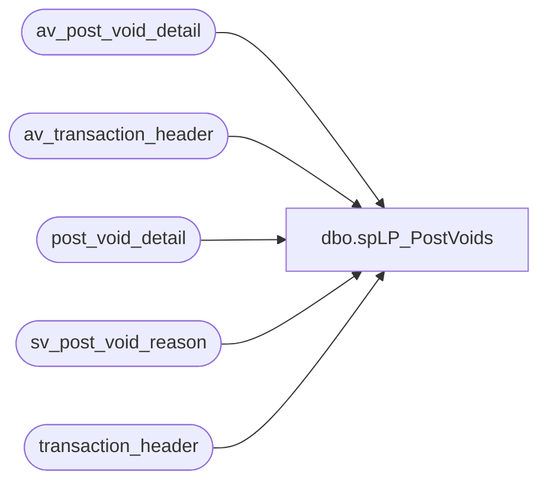

# dbo.spLP_PostVoids

**Database:** auditworks  
**Server:** bedrockdb01  

## Architecture Diagram



## Table Dependencies

| Referenced Table |
|---|
| av_post_void_detail |
| av_transaction_header |
| post_void_detail |
| sv_post_void_reason |
| transaction_header |

## Stored Procedure Code

```sql
CREATE PROCEDURE [dbo].[spLP_PostVoids]
	@fromDate datetime,
	@thruDate datetime,
	@fromStore int = 0,
	@thruStore int = 3000
AS
	-- =====================================================================================================
	-- Name: spLP_PostVoids
	--
	-- Description:	This procedure will extract all of the post voids made during the requested timeframe.
	--				This is used for Loss Prevention.
	--
	-- Input:	
	--			fromDate - Starting Date
	--			thruDate - Ending Date
	--
	-- Output: Resultset with the following columns:
	--			N/A
	--
	-- Dependencies: None
	--
	--GRANT  SELECT ,  UPDATE ,  INSERT ,  DELETE  ON [dbo].[spLP_PostVoids]  TO [pm_repo]
	--
	-- Revision History
	--		Name:			Date:			Comments:
	--		Gary Murrish	9/2/2014		Initial Deployment
	-- =====================================================================================================

	-- Post Void Details		

	SELECT
		th.av_transaction_id AS transaction_id,
		th.store_no,
		th.register_no,
		th.transaction_date,
		th.transaction_no,
		th.entry_date_time,
		th.cashier_no,
		th.tender_total,
		pvd.post_void_successful,
		pvd.post_void_reason_code,
		spvr.code_display_descr,
		DATEDIFF(MINUTE, orig.entry_date_time, th.entry_date_time) AS minDiff,
		orig.av_transaction_id AS orig_transaction_id,
		orig.entry_date_time AS orig_entry_date_time,
		orig.cashier_no AS orig_cashier_no,
		orig.register_no AS orig_register_no,
		orig.transaction_no AS orig_transaction_no,
		CASE
			WHEN orig.transaction_void_flag <> 1 THEN 'ERROR ' + CAST(orig.transaction_void_flag AS varchar)
			ELSE ''
		END AS MismatchProblem
	FROM
		av_transaction_header th WITH (NOLOCK)
		INNER JOIN av_post_void_detail pvd WITH (NOLOCK)
			ON th.av_transaction_id = pvd.av_transaction_id
		LEFT JOIN av_transaction_header orig WITH (NOLOCK)
			ON th.transaction_date = orig.transaction_date
			AND th.store_no = orig.store_no
			AND pvd.post_voided_register = orig.register_no
			AND pvd.post_voided_trans_no = orig.transaction_no
		INNER JOIN sv_post_void_reason spvr WITH (NOLOCK)
			ON pvd.post_void_reason_code = spvr.code
	WHERE
		th.transaction_void_flag IN (1, 5)
		AND th.transaction_series IN ('P', '', 'D', 'F', 'W', 'A')
		AND th.transaction_category IN (1, 2, 10)
		AND th.transaction_date BETWEEN @fromDate AND @thruDate
		AND th.store_no BETWEEN @fromStore and @thruStore

	UNION ALL
	SELECT
		th.transaction_id AS transaction_id,
		th.store_no,
		th.register_no,
		th.transaction_date,
		th.transaction_no,
		th.entry_date_time,
		th.cashier_no,
		th.tender_total,
		pvd.post_void_successful,
		pvd.post_void_reason_code,
		spvr.code_display_descr,
		DATEDIFF(MINUTE, orig.entry_date_time, th.entry_date_time) AS minDiff,
		orig.transaction_id AS orig_transaction_id,
		orig.entry_date_time AS orig_entry_date_time,
		orig.cashier_no AS orig_cashier_no,
		orig.register_no AS orig_register_no,
		orig.transaction_no AS orig_transaction_no,
		CASE
			WHEN orig.transaction_void_flag <> 1 THEN 'ERROR ' + CAST(orig.transaction_void_flag AS varchar)
			ELSE ''
		END AS MismatchProblem
	FROM
		transaction_header th WITH (NOLOCK)
		INNER JOIN post_void_detail pvd WITH (NOLOCK)
			ON th.transaction_id = pvd.transaction_id
		LEFT JOIN transaction_header orig WITH (NOLOCK)
			ON th.transaction_date = orig.transaction_date
			AND th.store_no = orig.store_no
			AND pvd.post_voided_register = orig.register_no
			AND pvd.post_voided_trans_no = orig.transaction_no
		INNER JOIN sv_post_void_reason spvr WITH (NOLOCK)
			ON pvd.post_void_reason_code = spvr.code
	WHERE
		th.transaction_void_flag IN (1, 5)
		AND th.transaction_series IN ('P', '', 'D', 'F', 'W', 'A')
		AND th.transaction_category IN (1, 2, 10)
		AND th.transaction_date BETWEEN @fromDate AND @thruDate
		AND th.store_no BETWEEN @fromStore and @thruStore
```

