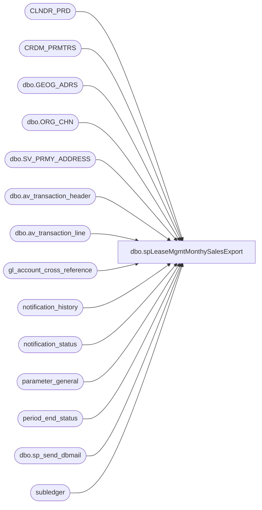

# dbo.spLeaseMgmtMonthySalesExport

**Database:** auditworks  
**Server:** bedrockdb01  

## Architecture Diagram



## Table Dependencies

| Referenced Table |
|---|
| CLNDR_PRD |
| CRDM_PRMTRS |
| dbo.GEOG_ADRS |
| dbo.ORG_CHN |
| dbo.SV_PRMY_ADDRESS |
| dbo.av_transaction_header |
| dbo.av_transaction_line |
| gl_account_cross_reference |
| notification_history |
| notification_status |
| parameter_general |
| period_end_status |
| dbo.sp_send_dbmail |
| subledger |

## Stored Procedure Code

```sql
CREATE   procedure [dbo].[spLeaseMgmtMonthySalesExport]
--@TransactionStartDate as int
--,@TransactionEndDate as int

AS
-- =====================================================================================================
-- Name: spLeaseMgmtMonthySalesExport
--
-- Description:	Monthly Sales Export for manual upload to Lucernex (LXContracts) by the Acct department	
--	
--
-- Input:	n/a
--			
--
-- Output:  
--			File name:  LEASE_MGMT_EXPORT_yyyymmddHHMMSS.csv
--			Destination location:  \\ShareBear1\Shared\Accounting\Lease_Mgmt
--          Backup files location: \\saapp01\d$\EPICOR\auditworks\OUTPUT\Financials\Lease_Mgmt\Backup
--			
--
-- Schedule: Daily
--    		
--
-- Dependencies: None	
--	
--
-- Revision History
--		Name:			Date:			Comments:
--		Paul Beckman	05/22/2018		First test build of stored proc
--		Paul Beckman	08/02/2018		Created stored proc in BEDROCKDB01.auditworks
--		Paul Beckman	08/07/2018		Moved ABS totals function to "Create results output file" section
--		Paul Beckman	02/05/2019		Updated to include ES sales, discounts, and shipping
--		Paul Beckman	06/04/2019		Added backup file cleanup section
--		Paul Beckman	10/07/2019		Replaced email recipient JessicaR@buildabear.com with Lease-acctg@buildabear.com
--		Paul Beckman	10/18/2019		Updated to use notification_history table
--		Paul Beckman	02/05/2020		Updated email profile to 'EntSysSupport'
--		
-- 
-- exec spLeaseMgmtMonthySalesExport
-- 
---- =====================================================================================================

SET NOCOUNT ON


--####################################
-- Check for same day job completion
--####################################

IF (SELECT COUNT(*) FROM notification_status WHERE reported = 1 AND CONVERT(VARCHAR(19),first_reported,101) = CONVERT(VARCHAR(19),GETDATE(),101) AND notification_name = 'Lease mgmt file generated' AND reported_cleared IS NULL) = 1
GOTO FINISH

IF (SELECT COUNT(*) FROM notification_status WHERE reported = 1 AND CONVERT(VARCHAR(19),first_reported,101) != CONVERT(VARCHAR(19),GETDATE(),101) AND notification_name = 'Lease mgmt file generated' AND reported_cleared IS NULL) = 1
BEGIN
	UPDATE notification_status
	SET reported = 0,reported_cleared = CONVERT(VARCHAR(19),GETDATE(),120)
	WHERE CONVERT(VARCHAR(19),first_reported,101) != CONVERT(VARCHAR(19),GETDATE(),101)
	AND notification_name = 'Lease mgmt file generated'
END


--####################################
-- Temp Tables
--####################################

IF (Object_ID('tempdb..##StartJobCheck') IS NOT NULL) DROP TABLE ##StartJobCheck
IF (Object_ID('tempdb..##PeriodDates') IS NOT NULL) DROP TABLE ##PeriodDates
IF (Object_ID('tempdb..##LeaseMgmtStoreData') IS NOT NULL) DROP TABLE ##LeaseMgmtStoreData
IF (Object_ID('tempdb..##LeaseMgmtSubLedgerData') IS NOT NULL) DROP TABLE ##LeaseMgmtSubLedgerData
IF (Object_ID('tempdb..##LeaseMgmtEmployeeSales') IS NOT NULL) DROP TABLE ##LeaseMgmtEmployeeSales
IF (Object_ID('tempdb..##LeaseMgmtSummaryResults') IS NOT NULL) DROP TABLE ##LeaseMgmtSummaryResults
IF (Object_ID('tempdb..##LeaseMgmtSummaryOutput') IS NOT NULL) DROP TABLE ##LeaseMgmtSummaryOutput
IF (Object_ID('tempdb..##LeaseMgmtExportHeaders') IS NOT NULL) DROP TABLE ##LeaseMgmtExportHeaders


--####################################
-- Declare script variables
--####################################

DECLARE @SQL VARCHAR(8000)
DECLARE @CMD VARCHAR(4000)
DECLARE @FileDate VARCHAR(14)
DECLARE @FileName VARCHAR(50)
DECLARE @FilePath VARCHAR(90)
DECLARE @LeaseMgmtFilePath VARCHAR(90)
DECLARE @BackupFilePath VARCHAR(90)
DECLARE @TempFilePath VARCHAR(90)
DECLARE @TransactionStartDate DATE
DECLARE @TransactionEndDate DATE
DECLARE @FiscalPeriod VARCHAR(2)
DECLARE @FiscalYear VARCHAR(4)

DECLARE @ChkFileDrive VARCHAR(5)  
DECLARE @ChkFileCMD VARCHAR(200)
DECLARE @ChkFileCount VARCHAR(5)

DECLARE @Recipients VARCHAR(4000)
DECLARE @Copy_Recipients VARCHAR(4000)
DECLARE @Subject VARCHAR(80)
DECLARE @Query VARCHAR(8000)
DECLARE @Text NVARCHAR(MAX)
DECLARE @EmailAttachment VARCHAR(100)


--####################################
-- Set Date range used by schedule
--####################################

SELECT CONVERT(VARCHAR(10), clp.STRT_DATE_TIME, 121) AS STRT_DATE_TIME
	,CONVERT(VARCHAR(10), DATEADD(DAY,-1,clp.END_DATE_TIME), 121) AS END_DATE_TIME
	,CLNDR_PRD_NUM AS FSCL_PRD
	,NULL AS FSCL_YR
INTO ##StartJobCheck
FROM CLNDR_PRD clp
JOIN CRDM_PRMTRS cp ON clp.CLNDR_ID = cp.PRMTR_VAL_BIN
WHERE clp.CLNDR_PRD_NAME LIKE 'Period%'
AND clp.STRT_DATE_TIME < (SELECT DATEADD(DAY,-1,clp.STRT_DATE_TIME) 
		FROM CLNDR_PRD clp 
		JOIN CRDM_PRMTRS cp ON clp.CLNDR_ID = cp.PRMTR_VAL_BIN
		WHERE clp.CLNDR_PRD_NAME LIKE 'Period%'
		AND clp.STRT_DATE_TIME < GETDATE()
		AND clp.END_DATE_TIME > GETDATE())
AND clp.END_DATE_TIME > (SELECT DATEADD(DAY,-1,STRT_DATE_TIME) 
		FROM CLNDR_PRD clp
		JOIN CRDM_PRMTRS cp ON clp.CLNDR_ID = cp.PRMTR_VAL_BIN
		WHERE clp.CLNDR_PRD_NAME LIKE 'Period%'
		AND clp.STRT_DATE_TIME < GETDATE()
		AND clp.END_DATE_TIME > GETDATE())
AND (SELECT COUNT(*)
		FROM period_end_status
		WHERE period_end_status = 0
		AND CONVERT(VARCHAR(10), process_end_time, 120) = CONVERT(VARCHAR(10), GETDATE(), 120)) = 1
AND (SELECT COUNT(*)
		FROM parameter_general
		WHERE period_end_date = (SELECT DATEADD(DAY,-1,STRT_DATE_TIME) 
			FROM CLNDR_PRD clp
			JOIN CRDM_PRMTRS cp ON clp.CLNDR_ID = cp.PRMTR_VAL_BIN
			WHERE clp.CLNDR_PRD_NAME LIKE 'Period%'
			AND STRT_DATE_TIME < GETDATE()
			AND END_DATE_TIME > GETDATE())
		AND dayend_in_progress = 0
		AND period_end_in_progress = 0
		AND period_end_date < (SELECT process_end_time FROM period_end_status)) = 1

IF (SELECT COUNT(*) FROM ##StartJobCheck) = 0
GOTO FINISH


--####################################
-- Create Fiscal Dates
--####################################

SELECT clp.CLNDR_PRD_NUM
	,CONVERT(VARCHAR(10), STRT_DATE_TIME, 120) AS STRT_DATE_TIME
	,CONVERT(VARCHAR(10), DATEADD(DAY,-1,END_DATE_TIME), 120) AS END_DATE_TIME
	,CASE WHEN clp.CLNDR_PRD_NAME LIKE 'Year%' THEN 'YEAR'
		WHEN clp.CLNDR_PRD_NAME LIKE 'Period%' THEN 'PERIOD'
		END AS 'FSCL_TYPE'
INTO ##PeriodDates
FROM CLNDR_PRD clp
JOIN CRDM_PRMTRS cp ON clp.CLNDR_ID = cp.PRMTR_VAL_BIN
WHERE clp.CLNDR_PRD_NAME LIKE 'Year%' OR clp.CLNDR_PRD_NAME LIKE 'Period%'
ORDER BY clp.STRT_DATE_TIME, clp.END_DATE_TIME desc


--####################################
-- Set dates 
--####################################

SET @TransactionStartDate = (SELECT STRT_DATE_TIME FROM ##StartJobCheck)
SET @TransactionEndDate = (SELECT END_DATE_TIME FROM ##StartJobCheck)

-->>>>>>   Set dates then uncomment these two SET statements when running manually   <<<<<<--
--SET @TransactionStartDate = '2018-12-01'
--SET @TransactionEndDate = '2019-01-05'


--####################################
-- Build STORE info
--####################################

SELECT oc.ORG_CHN_NUM AS StrNumber
	,ga.CNTRY_CODE_ISO3 AS StrCountry
	,oc.DFLT_CRNCY_CODE AS StrCurrency
	,CASE WHEN len(oc.ORG_CHN_NUM) < 4 THEN '1' + RIGHT('0000' + CAST(oc.ORG_CHN_NUM AS VARCHAR(4)),3)
		WHEN len(oc.ORG_CHN_NUM) = 4 THEN CAST(CONVERT(CHAR,oc.ORG_CHN_NUM,4) AS VARCHAR(4))
			END AS ClientEntityID
INTO ##LeaseMgmtStoreData
FROM	auditworks.dbo.ORG_CHN oc WITH (NOLOCK)
	JOIN	auditworks.dbo.SV_PRMY_ADDRESS spa WITH (NOLOCK) ON oc.PRTY_ID = spa.PRTY_ID
	JOIN	auditworks.dbo.GEOG_ADRS ga WITH (NOLOCK) ON spa.ADRS_ID = ga.ADRS_ID
WHERE oc.ORG_CHN_NUM BETWEEN 1 AND 3100  --<< UNCOMMENT OUT FOR PROD
--WHERE oc.ORG_CHN_NUM IN (1)  --<< COMMENT OUT FOR PROD
AND oc.ORG_CHN_TYPE_CODE !='WH'
ORDER BY oc.ORG_CHN_NUM


--####################################
-- Build totals from SubLedger
--    - Discounts
--    - Employee Discounts
--    - Gross Sales
--    - Marketing Discounts
--    - Returns
--    - Shipping
--    - ES Orders
--####################################

SELECT	sd.ClientEntityID
	,CONVERT(VARCHAR(10), sl.transaction_date, 120) AS transaction_date
	,CASE WHEN LEFT(x.gl_account_no,10) IN ('5121000000','5122000000','5124000000') OR (x.gl_account_no like '306050%' AND sl.line_object IN (1614,1616,1617,1621,1627,1629,1651)) THEN 'Discounts'
		WHEN LEFT(x.gl_account_no,10) = '5123000000' OR (x.gl_account_no like '306050%' AND sl.line_object IN (1740)) THEN 'Employee Discounts'
		WHEN LEFT(x.gl_account_no,10) = '5101000000' OR (x.gl_account_no like '306050%' AND sl.line_object IN (106)) THEN 'Gross Sales'
		WHEN LEFT(x.gl_account_no,10) IN ('5125000000','5129000000','5129500000') OR (x.gl_account_no like '306050%' AND sl.line_object IN (1610,1611,1636,1642,1643,1701)) THEN 'Marketing Discounts'
		WHEN LEFT(x.gl_account_no,10) = '5130000000' THEN 'Returns'
		WHEN LEFT(x.gl_account_no,10) = '5102000000' OR (x.gl_account_no like '306050%' AND sl.line_object IN (200)) THEN 'Shipping'
		END AS 'Sales.CodeSalesTypeID'
	,SUM(sl.amount) AS 'GrossAmt'
	,(SELECT CLNDR_PRD_NUM FROM ##PeriodDates WHERE FSCL_TYPE = 'PERIOD' AND sl.transaction_date >= STRT_DATE_TIME AND sl.transaction_date <= END_DATE_TIME) AS 'Sales.SalesPeriod'
	,(SELECT CLNDR_PRD_NUM FROM ##PeriodDates WHERE FSCL_TYPE = 'YEAR' AND sl.transaction_date >= STRT_DATE_TIME AND sl.transaction_date <= END_DATE_TIME) AS 'Sales.SalesYear'
INTO ##LeaseMgmtSubLedgerData
FROM	subledger sl WITH (NOLOCK)
JOIN	gl_account_cross_reference x ON sl.gl_account_id = x.gl_account_id
JOIN	##LeaseMgmtStoreData sd WITH (NOLOCK) ON sl.store_no=sd.StrNumber
WHERE	sl.store_no NOT IN (13,2013)
AND		sl.transaction_date BETWEEN @TransactionStartDate AND @TransactionEndDate
AND		LEFT(x.gl_account_no,10) IN (
		'5121000000'
		,'5122000000'
		,'5124000000'
		,'5123000000'
		,'5101000000'
		,'5125000000'
		,'5129000000'
		,'5129500000'
		,'5130000000'
		,'5102000000'
		,'3060500000'
		)
AND		sl.line_object != 500
GROUP BY sd.ClientEntityID
	,sl.transaction_date
	,CASE WHEN LEFT(x.gl_account_no,10) IN ('5121000000','5122000000','5124000000') OR (x.gl_account_no like '306050%' AND sl.line_object IN (1614,1616,1617,1621,1627,1629,1651)) THEN 'Discounts'
		WHEN LEFT(x.gl_account_no,10) = '5123000000' OR (x.gl_account_no like '306050%' AND sl.line_object IN (1740)) THEN 'Employee Discounts'
		WHEN LEFT(x.gl_account_no,10) = '5101000000' OR (x.gl_account_no like '306050%' AND sl.line_object IN (106)) THEN 'Gross Sales'
		WHEN LEFT(x.gl_account_no,10) IN ('5125000000','5129000000','5129500000') OR (x.gl_account_no like '306050%' AND sl.line_object IN (1610,1611,1636,1642,1643,1701)) THEN 'Marketing Discounts'
		WHEN LEFT(x.gl_account_no,10) = '5130000000' THEN 'Returns'
		WHEN LEFT(x.gl_account_no,10) = '5102000000' OR (x.gl_account_no like '306050%' AND sl.line_object IN (200)) THEN 'Shipping'
		END

SELECT ClientEntityID
	,[Sales.CodeSalesTypeID]
	,SUM([GrossAmt]) AS 'Sales.GrossSalesAmount'
	,[Sales.SalesPeriod]
	,[Sales.SalesYear]
INTO ##LeaseMgmtSummaryResults
FROM ##LeaseMgmtSubLedgerData
GROUP BY ClientEntityID
	,[Sales.CodeSalesTypeID]
	,[Sales.SalesPeriod]
	,[Sales.SalesYear]
ORDER BY ClientEntityID
	,[Sales.SalesYear]
	,[Sales.SalesPeriod]
	,[Sales.CodeSalesTypeID]


--####################################
-- Build EMPLOYEE Sales total
--####################################

SELECT sd.ClientEntityID
	,CONVERT(VARCHAR(10), th.transaction_date, 120) AS transaction_date
	,'Employee Sales' AS 'Sales.CodeSalesTypeID'
		,CASE WHEN tl.line_object IN (1940) AND tl.line_action IN (38) THEN CONVERT(DECIMAL(10,2),SUM(th.tender_total))
		END AS 'GrossAmt'
	,(SELECT CLNDR_PRD_NUM FROM ##PeriodDates WHERE FSCL_TYPE = 'PERIOD' AND th.transaction_date >= STRT_DATE_TIME AND th.transaction_date <= END_DATE_TIME) AS 'Sales.SalesPeriod'
	,(SELECT CLNDR_PRD_NUM FROM ##PeriodDates WHERE FSCL_TYPE = 'YEAR' AND th.transaction_date >= STRT_DATE_TIME AND th.transaction_date <= END_DATE_TIME) AS 'Sales.SalesYear'
INTO	##LeaseMgmtEmployeeSales
FROM 	auditworks.dbo.av_transaction_header th WITH (NOLOCK)
JOIN	auditworks.dbo.av_transaction_line tl WITH (NOLOCK) ON th.av_transaction_id=tl.av_transaction_id
JOIN	##LeaseMgmtStoreData sd WITH (NOLOCK) ON th.store_no=sd.StrNumber
WHERE	th.transaction_void_flag = 0
AND		tl.line_void_flag = 0
AND		tl.line_object IN (1940) AND tl.line_action IN (38)
AND		tl.interface_rejection_flag = 0
AND		th.sa_rejection_flag = 0
AND		th.store_no NOT IN (13,2013)
AND		th.transaction_date BETWEEN @TransactionStartDate AND @TransactionEndDate
GROUP BY sd.ClientEntityID
	,th.transaction_date
	,tl.line_object
	,tl.line_action

INSERT INTO ##LeaseMgmtSummaryResults
SELECT ClientEntityID
	,[Sales.CodeSalesTypeID]
	,SUM(GrossAmt) AS 'Sales.GrossSalesAmount'
	,[Sales.SalesPeriod]
	,[Sales.SalesYear]
FROM ##LeaseMgmtEmployeeSales
GROUP BY ClientEntityID
	,[Sales.CodeSalesTypeID]
	,[Sales.SalesPeriod]
	,[Sales.SalesYear]
ORDER BY ClientEntityID
	,[Sales.SalesYear]
	,[Sales.SalesPeriod]
	,[Sales.CodeSalesTypeID]


--####################################
-- Set variables
--####################################

SET @FileDate = (SELECT CONVERT(VARCHAR(8), GETDATE(), 112) + REPLACE(CONVERT(VARCHAR(8),GETDATE(), 108),':',''))

SET @FilePath = '\\saapp01\Financials\Lease_Mgmt'  --<< File path
SET @TempFilePath = '\\saapp01\Financials\Lease_Mgmt\Work'
SET @BackupFilePath = '\\saapp01\Financials\Lease_Mgmt\Backup'

--SET @LeaseMgmtFilePath = '\\saapp01\Financials\Lease_Mgmt\Test'  --<< TEST build path
--SET @LeaseMgmtFilePath = '\\ShareBear1\Shared\Accounting\Lease_Mgmt'  --<< TEST Lease_Mgmt file destination path
SET @LeaseMgmtFilePath = '\\ShareBear1\Shared\Accounting\Lease_Mgmt'  --<< PROD Lease_Mgmt file destination path

SET @Recipients = 'Lease-acctg@buildabear.com'
--SET @Recipients = 'paulb@buildabear.com'
--SET @Recipients = 'Lease-acctg@buildabear.com;PaulB@buildabear.com'
--SET @Copy_Recipients = 'SAAdmin@buildabear.com'


--####################################
-- Create Headers file
--####################################

SELECT 
		'UpdateOnly' AS 'UpdateOnly'
		,'RowType' AS 'RowType'
		,'ClientID' AS 'ClientID'
		,'LxRecID' AS 'LxRecID'
		,'ProjectEntityID' AS 'ProjectEntityID'
		,'ClientEntityID' AS 'ClientEntityID'
		,'Sales.CodeSalesGroupID' AS 'Sales.CodeSalesGroupID'
		,'Sales.CodeSalesTypeID' AS 'Sales.CodeSalesTypeID'
		,'Sales.CodeSalesCategoryID' AS 'Sales.CodeSalesCategoryID'
		,'Sales.CodeCurrencyTypeID' AS 'Sales.CodeCurrencyTypeID'
		,'Sales.GrossSalesAmount' AS 'Sales.GrossSalesAmount'
		,'Sales.NetSalesAmount' AS 'Sales.NetSalesAmount'
		,'Sales.SalesPeriod' AS 'Sales.SalesPeriod'
		,'Sales.SalesYear' AS 'Sales.SalesYear'
INTO ##LeaseMgmtExportHeaders

SET @SQL = 'SELECT * FROM ##LeaseMgmtExportHeaders'

SELECT  @CMD = 'bcp "' + @SQL + '" queryout "' + @TempFilePath + '\LEASE_MGMT_EXPORT_HEADERS.csv" -T -c -t,'
    SELECT  @CMD
    exec master..xp_cmdshell @CMD


--####################################
-- Create results output file
--####################################

SELECT	NULL AS 'UpdateOnly'
		,'Sales' AS 'RowType'
		,NULL AS 'ClientID'
		,NULL AS 'LxRecID'
		,NULL AS 'ProjectEntityID'
		,lmsr.ClientEntityID AS 'ClientEntityID'
		,'Sales' AS 'Sales.CodeSalesGroupID'
		,lmsr.[Sales.CodeSalesTypeID] AS 'Sales.CodeSalesTypeID'
		,'Actual' AS 'Sales.CodeSalesCategoryID'
		,lmsd.StrCurrency AS 'Sales.CodeCurrencyTypeID'
		,ABS(lmsr.[Sales.GrossSalesAmount]) AS 'Sales.GrossSalesAmount'
		,ABS(lmsr.[Sales.GrossSalesAmount]) AS 'Sales.NetSalesAmount'
		,lmsr.[Sales.SalesPeriod] AS 'Sales.SalesPeriod'
		,lmsr.[Sales.SalesYear] AS 'Sales.SalesYear'
INTO ##LeaseMgmtSummaryOutput
FROM ##LeaseMgmtSummaryResults lmsr WITH (NOLOCK)
JOIN ##LeaseMgmtStoreData lmsd WITH (NOLOCK) ON lmsr.ClientEntityID = lmsd.ClientEntityID
ORDER BY lmsr.ClientEntityID
		,lmsr.[Sales.SalesPeriod]
		,lmsr.[Sales.SalesYear]
		,lmsr.[Sales.CodeSalesTypeID]

SET @FileName = '\LEASE_MGMT_EXPORT_' + @FileDate + '.csv'

SET @SQL = 'SELECT * FROM ##LeaseMgmtSummaryOutput'

SELECT  @CMD = 'bcp "' + @SQL + '" queryout "' + @TempFilePath + '\LEASE_MGMT_EXPORT_RESULTS.csv" -T -c -t,'
    select  @CMD
    exec master..xp_cmdshell @CMD

SET @CMD = 'type ' + @TempFilePath + '\LEASE_MGMT_EXPORT_HEADERS.csv > ' + @FilePath + @FileName
    select  @CMD
    exec master..xp_cmdshell @CMD

SET @CMD = 'type ' + @TempFilePath + '\LEASE_MGMT_EXPORT_RESULTS.csv >> ' + @FilePath + @FileName
    select  @CMD
    exec master..xp_cmdshell @CMD

SET @EmailAttachment = @BackupFilePath + @FileName


--####################################
-- File cleanup
--####################################

SET @CMD = 'del /Q ' + @TempFilePath + '\LEASE_MGMT_EXPORT_*.csv'
    select  @CMD
    exec master..xp_cmdshell @CMD

SET @CMD = 'move /Y ' + @FilePath + '\*.csv ' + @BackupFilePath
    select  @CMD
    exec master..xp_cmdshell @CMD

WAITFOR DELAY '00:00:05'

SET @CMD = 'xcopy /y /v /f /r  ' + @BackupFilePath + @FileName + ' ' + @LeaseMgmtFilePath
    select  @CMD
    exec master..xp_cmdshell @CMD


--####################################
-- File check and email completion
--####################################

IF (Object_ID('tempdb..#filecheck') IS NOT NULL) DROP TABLE #filecheck
CREATE TABLE #filecheck (dirtext VARCHAR(50))

SET @ChkFileDrive = 'v:'  
SET @ChkFileCMD = 'net use ' + @ChkFileDrive + ' /d'  
EXEC master..xp_cmdshell @ChkFileCMD  
SET @ChkFileCMD = 'net use ' + @ChkFileDrive + ' ' + @LeaseMgmtFilePath  
EXEC master..xp_cmdshell @ChkFileCMD  
SET @ChkFileCMD = 'dir /B ' + @ChkFileDrive + @FileName  
INSERT INTO #filecheck (dirtext)
EXEC master..xp_cmdshell @ChkFileCMD 
DELETE FROM #filecheck WHERE dirtext IS NULL OR dirtext = 'File Not Found'

SET @CMD = 'forfiles /p ' + @ChkFileDrive + ' /s /m *.csv /D -400 /C "cmd /c del @path"'
    select  @CMD
    exec master..xp_cmdshell @CMD

SET @ChkFileCMD = 'net use ' + @ChkFileDrive + ' /d'
EXEC master..xp_cmdshell @ChkFileCMD

SET @ChkFileCount = (SELECT COUNT(*) FROM #filecheck)

IF (SELECT COUNT(*) FROM #filecheck) = 0
BEGIN
SET @Recipients = 'EntSysSupport@buildabear.com'
SET @Copy_Recipients = 'Lease-acctg@buildabear.com'
SET @Text = 
		'<font face =arial size = 2 color="Red">' +
		N'<H3>** ACTION REQUIRED **</H3>' +
		'<br>' +
		'Lease Management Sales Audit data export file ' + @FileName + ' is missing. <br>' +
		'<br>' +
		'Please check on status of SQL job execution. <br>' +
		'<br>' +
		'<font face =arial size = 1 color="#C0C0C0">' +
		'<br><br><br><br>' +
		'Server:  BEDROCKDB01 <br>' +
		'Job Name:  Lease_Mgmt_Monthy_Sales_File_Export <br>' +
		'Stored Proc:  BEDROCKDB01.auditworks.dbo.spLeaseMgmtMonthySalesExport <br>' +
		'Created by:  Paul Beckman <br>' +
		'Team Ownership:  Enterprise Systems <br>'

SET @Subject = 'WARNING - Missing Lease Management Sales Audit export file'
	EXEC msdb.dbo.sp_send_dbmail  
	@profile_name = 'EntSysSupport',
	@recipients = @Recipients,
	@copy_recipients = @Copy_Recipients,
	@subject=@Subject, 
	@body = @Text,
	@body_format = 'HTML'
	
	INSERT INTO notification_history
	(stored_proc_name,
	record_logged_datetime,
	issues_found,
	action_required,
	notification_sent,
	email_type,
	email_to,
	email_cc,
	email_subject,
	comment
	)
	VALUES (
	'spLeaseMgmtMonthySalesExport', --<< Stored Proc name
	GETDATE(),
	'Yes', --<< Issues found - Yes / No
	'Yes', --<< Action required - Yes / No
	'Yes', --<< Notification sent - Yes / No
	'Warning', --<< Email type - Notification Only / Alert / Warning
	@Recipients, --<< Email TO
	NULL, --<< Email CC
	@Subject, --<< Email Subject
	'Lease Management Sales Audit data export file ' + @FileName + ' is missing.' --<< Comment
	)
END
ELSE
BEGIN
SET @Recipients = 'Lease-acctg@buildabear.com'
SET @Text = 
		'<font face =arial size = 2>' +
		'Lease Management Sales Audit data export file has been created for import to Lucernex. <br>' +
		'Sales Audit data date range... <br>' +
		'From: ' + CONVERT(VARCHAR(10),@TransactionStartDate) + '<br>' +
		'To: ' + CONVERT(VARCHAR(10),@TransactionEndDate) + ' <br>' +
		'<br>' +
		'File found in ' + @LeaseMgmtFilePath + '... <br>' +
		'<br>' +
		'<table border="1">' + 
		'<font face =arial size = 2>' +
		'<tr bgcolor=#D5D5F7><th>Lease Management Sales export file name</th></tr>' +
		CAST ( ( SELECT [td/@align]='left',
						td = dirtext, ''
				FROM #filecheck
				FOR xml path ('tr'), type
		) AS NVARCHAR(MAX) ) +
		'</table>' +
		'<br>' +
		'<font face =arial size = 1 color="#C0C0C0">' +
		'<br><br><br><br>' +
		'Server:  BEDROCKDB01 <br>' +
		'Job Name:  Lease_Mgmt_Monthy_Sales_File_Export <br>' +
		'Stored Proc:  BEDROCKDB01.auditworks.dbo.spLeaseMgmtMonthySalesExport <br>' +
		'Created by:  Paul Beckman <br>' +
		'Team Ownership:  Enterprise Systems <br>'

SET @Subject = 'Lease Management Sales export file created'
	EXEC msdb.dbo.sp_send_dbmail  
	@profile_name = 'EntSysSupport',
	@recipients = @Recipients,
	@copy_recipients = @Copy_Recipients,
	@subject=@Subject, 
	@body = @Text,
	@body_format = 'HTML'
	
	INSERT INTO notification_history
	(stored_proc_name,
	record_logged_datetime,
	issues_found,
	action_required,
	notification_sent,
	email_type,
	email_to,
	email_cc,
	email_subject,
	comment
	)
	VALUES (
	'spLeaseMgmtMonthySalesExport', --<< Stored Proc name
	GETDATE(),
	'No', --<< Issues found - Yes / No
	'No', --<< Action required - Yes / No
	'Yes', --<< Notification sent - Yes / No
	'Notification Only', --<< Email type - Notification Only / Alert / Warning
	@Recipients, --<< Email TO
	NULL, --<< Email CC
	@Subject, --<< Email Subject
	'Lease Management Sales Audit data export file ' + @FileName + ' has been created for import to Lucernex' --<< Comment
	)

--####################################
-- Log job completion for the day
--####################################

UPDATE notification_status
SET reported = 1,first_reported = CONVERT(VARCHAR(19),GETDATE(),120),reported_cleared = NULL
WHERE notification_name = 'Lease mgmt file generated'

END


--####################################
-- Backup File Cleanup
--####################################

SET @ChkFileDrive = 'v:'  
SET @ChkFileCMD = 'net use ' + @ChkFileDrive + ' /d'  
EXEC master..xp_cmdshell @ChkFileCMD  
SET @ChkFileCMD = 'net use ' + @ChkFileDrive + ' ' + @BackupFilePath  
EXEC master..xp_cmdshell @ChkFileCMD  

SET @CMD = 'forfiles /p ' + @ChkFileDrive + ' /s /m *.csv /D -400 /C "cmd /c del @path"'
    select  @CMD
    exec master..xp_cmdshell @CMD

SET @ChkFileCMD = 'net use ' + @ChkFileDrive + ' /d'
EXEC master..xp_cmdshell @ChkFileCMD

FINISH:
--####################################
-- Temp Table Cleanup
--####################################

IF (Object_ID('tempdb..##StartJobCheck') IS NOT NULL) DROP TABLE ##StartJobCheck
IF (Object_ID('tempdb..##PeriodDates') IS NOT NULL) DROP TABLE ##PeriodDates
IF (Object_ID('tempdb..##LeaseMgmtStoreData') IS NOT NULL) DROP TABLE ##LeaseMgmtStoreData
IF (Object_ID('tempdb..##LeaseMgmtSubLedgerData') IS NOT NULL) DROP TABLE ##LeaseMgmtSubLedgerData
IF (Object_ID('tempdb..##LeaseMgmtEmployeeSales') IS NOT NULL) DROP TABLE ##LeaseMgmtEmployeeSales
IF (Object_ID('tempdb..##LeaseMgmtSummaryResults') IS NOT NULL) DROP TABLE ##LeaseMgmtSummaryResults
IF (Object_ID('tempdb..##LeaseMgmtSummaryOutput') IS NOT NULL) DROP TABLE ##LeaseMgmtSummaryOutput
IF (Object_ID('tempdb..##LeaseMgmtExportHeaders') IS NOT NULL) DROP TABLE ##LeaseMgmtExportHeaders


--####################################


/*

SELECT * FROM ##LeaseMgmtStoreData

SELECT * FROM ##LeaseMgmtNetSales

SELECT * FROM ##LeaseMgmtSubLedgerData

SELECT * FROM ##LeaseMgmtEmployeeSales

SELECT * FROM ##PeriodDates

SELECT * FROM ##LeaseMgmtSummaryResults

SELECT * FROM ##StartJobCheck

SELECT * FROM ##LeaseMgmtSummaryOutput

SELECT * FROM ##LeaseMgmtExportHeaders

SELECT * FROM notification_status WHERE notification_name = 'Lease mgmt file generated'

*/
```

