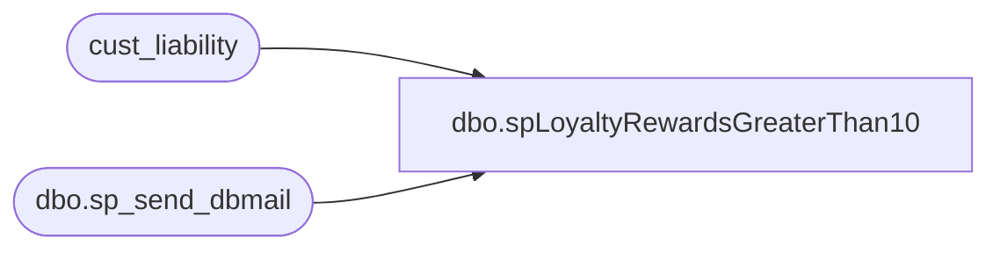

# dbo.spLoyaltyRewardsGreaterThan10

**Database:** auditworks  
**Server:** bedrockdb01  

## Architecture Diagram



## Table Dependencies

| Referenced Table |
|---|
| cust_liability |
| dbo.sp_send_dbmail |

## Stored Procedure Code

```sql
--DROP PROC [dbo].[spLoyaltyRewardsGreaterThan10]
--GO

CREATE PROC [dbo].[spLoyaltyRewardsGreaterThan10]
-- =============================================================================================================
-- Name: [dbo].[spLoyaltyRewardsGreaterThan10]
--
-- Description:	Sends email alerts of Loyalty vouchers with value greater than 10
--
-- Input:	@filelocation	varchar(100)	path to drop files
--			@rowcount		int				total number of records to process
--
-- Output: N/A
--
-- Dependencies: 
--
-- Revision History
--		Name:			Date:			Comments:
--		Paul Beckman	10/18/2010		Created SP
--		Paul Beckman	07/19/2015		Updated from POSDBSSA to BEDROCKDB01
--		Paul Beckman	01/17/2017		Updated email body to HTML
--		Paul Beckman	02/13/2018		Removed old non-HTML code for email body
--		Paul Beckman	02/05/2020		Updated email profile to 'EntSysSupport'
--
-- =============================================================================================================
AS
SET NOCOUNT ON

declare @sql varchar(8000)
declare @recipients varchar(4000)
declare @Subject varchar(60)
declare @query varchar(8000)
declare @copy_recipients varchar(8000)
declare @text nvarchar(max)

IF (Object_ID('tempdb..##Cert_Greater_Than_10') IS NOT NULL) DROP TABLE ##Cert_Greater_Than_10
select reference_no, date_issued, liability_amount
into ##Cert_Greater_Than_10
from cust_liability
where reference_type = 31
and liability_amount > 10
and date_issued > '07-12-2006'
order by reference_no

set @recipients = 'EntSysSupport@buildabear.com;lindak@buildabear.com'

if (select count(*) from ##Cert_Greater_Than_10) > 0  
begin
	set @text = 
				'<font face =arial size = 2>' +
				'Below are reward certificates that are greater than 10.00 in cust_liability table in auditworks db.<br>' +
				'<br>' +
				'<table border="1">' + 
				'<font face =arial size = 2>' +
				'<tr bgcolor=#D5D5F7><th>Reference Num</th><th>Date Issued</th><th>Liability Amount</th></tr>' +
				CAST ( ( SELECT td = reference_no, '',
								td = date_issued, '',
								td = liability_amount, ''
					  FROM ##Cert_Greater_Than_10
					  FOR xml path ('tr'), type
				) AS NVARCHAR(MAX) ) +
				'</table>' +
				'<font face =arial size = 1 color="#C0C0C0">' +
				'<br><br><br><br>' +
				'Server:  BEDROCKDB01 <br>' +
				'Job Name:  Loyalty_Rewards_Greater_Than_10 <br>' +
				'Stored Proc:  BEDROCKDB01.auditworks.dbo.spLoyaltyRewardsGreaterThan10 <br>' +
				'Created by:  Paul Beckman <br>' +
				'Team Ownership:  Enterprise Systems <br>'

set @Subject = 'ALERT - Loyalty Rewards Greater than 10'
	exec msdb.dbo.sp_send_dbmail  
		@profile_name = 'EntSysSupport',
		@recipients = @recipients,
		@subject=@Subject, 
		@body = @text,
		@body_format = 'HTML'

end
return
```

