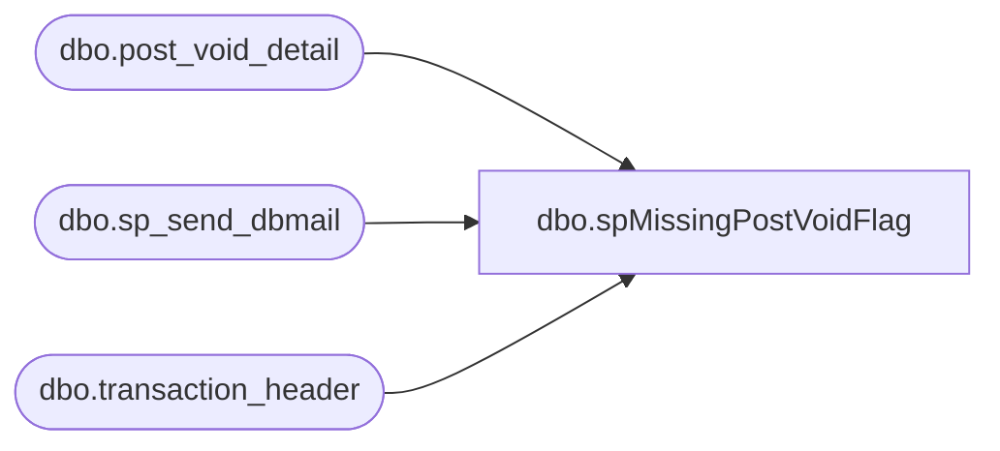

# dbo.spMissingPostVoidFlag

**Database:** auditworks  
**Server:** bedrockdb01  

## Architecture Diagram



## Table Dependencies

| Referenced Table |
|---|
| dbo.post_void_detail |
| dbo.sp_send_dbmail |
| dbo.transaction_header |

## Stored Procedure Code

```sql
--DROP PROC [dbo].[spMissingPostVoidFlag]
--GO

CREATE PROC [dbo].[spMissingPostVoidFlag]
-- =============================================================================================================
-- Name: [dbo].[spMissingPostVoidFlag]
--
-- Description:	Shows that SA Housekeeping has run successfully and shows the table record counts
--
-- Input:	@filelocation	varchar(100)	path to drop files
--			@rowcount		int				total number of records to process
--
-- Output: N/A
--
-- Dependencies: 
--
-- Revision History
--		Name:			Date:			Comments:
--		Paul Beckman	10/22/2010		Created SP
--		Paul Beckman	11/17/2010		Added Line for a.updated_by_user_id IS NOT NULL 
--		Paul Beckman	07/19/2015		Updated from POSDBSSA to BEDROCKDB01
--		Paul Beckman	02/05/2020		Updated email profile to 'EntSysSupport'
--
-- exec spMissingPostVoidFlag
-- =============================================================================================================
AS
SET NOCOUNT ON

declare @sql varchar(8000)
declare @recipients varchar(4000)
declare @Subject varchar(60)
declare @query varchar(8000)
declare @copy_recipients varchar(8000)

IF (Object_ID('tempdb..##missingpv') IS NOT NULL) DROP TABLE ##missingpv
SET NOCOUNT ON
SELECT 
CONVERT(VARCHAR(10),a.store_no) as Store_no,
CONVERT(VARCHAR(30),a.transaction_date, 101) as Transaction_Date,
CONVERT(VARCHAR(15),a.register_no) as Register,
CONVERT(VARCHAR(30),a.transaction_no) as Voiding_Trans_no,
b.post_voided_register as PV_Register,
b.post_voided_trans_no as PV_Trans_no 
into ##missingpv
FROM auditworks.dbo.transaction_header a, auditworks.dbo.post_void_detail b 
WHERE a.transaction_id = b.transaction_id  
    AND (a.transaction_void_flag = 5
	AND a.updated_by_user_id IS NOT NULL -- LINE ADDED BY PAUL B on 17 Nov 2010
	AND a.transaction_date < convert(varchar,dateadd(day,-0,getdate()),101)
    AND b.post_voided_trans_no NOT IN (SELECT DISTINCT a.transaction_no
FROM auditworks.dbo.transaction_header a 
WHERE (a.transaction_void_flag IN (1,4)) 
    AND 1=1
	AND 4=4))
GROUP BY CONVERT(VARCHAR(10),a.store_no),CONVERT(VARCHAR(30),a.transaction_no),CONVERT(VARCHAR(30),a.transaction_date, 101),CONVERT(VARCHAR(15),a.register_no),b.post_voided_register,b.post_voided_trans_no
ORDER BY Store_no,CONVERT(VARCHAR(30), a.transaction_date, 101),Register--CONVERT(VARCHAR(8),a.register_no)

--select * from ##missingpv

if (select count(*) from ##missingpv) > 0 
begin

set @query = 
'
print ''Below are Post Voiding transactions in Sales Audit that the corresponding Post Void transaction is not flagged as such.''
print ''Go to the Post Voided transaction and change accordingly''
print ''''
set nocount on
select * from ##missingpv
PRINT ''''
PRINT ''''
PRINT ''Server:  BEDROCKDB01''
PRINT ''Job Name:  Missing_Post_Void_Flag''
PRINT ''Stored Proc:  BEDROCKDB01.auditworks.dbo.spMissingPostVoidFlag''
PRINT ''Created by:  Paul Beckman''
PRINT ''Team Ownership:  Enterprise Systems''
'

--set @recipients = 'paulb@buildabear.com'
set @recipients = 'SalesAuditBears@buildabear.com'
set @copy_recipients = 'EntSysSupport@buildabear.com'

set @Subject = 'ALERT - Transactions Missing Post Void flag'
	exec msdb.dbo.sp_send_dbmail  
		@profile_name = 'EntSysSupport',
		@recipients = @recipients,
		@copy_recipients = @copy_recipients,
		@subject=@Subject, 
		@query_result_width = 250,
		@query= @query

end
return
```

