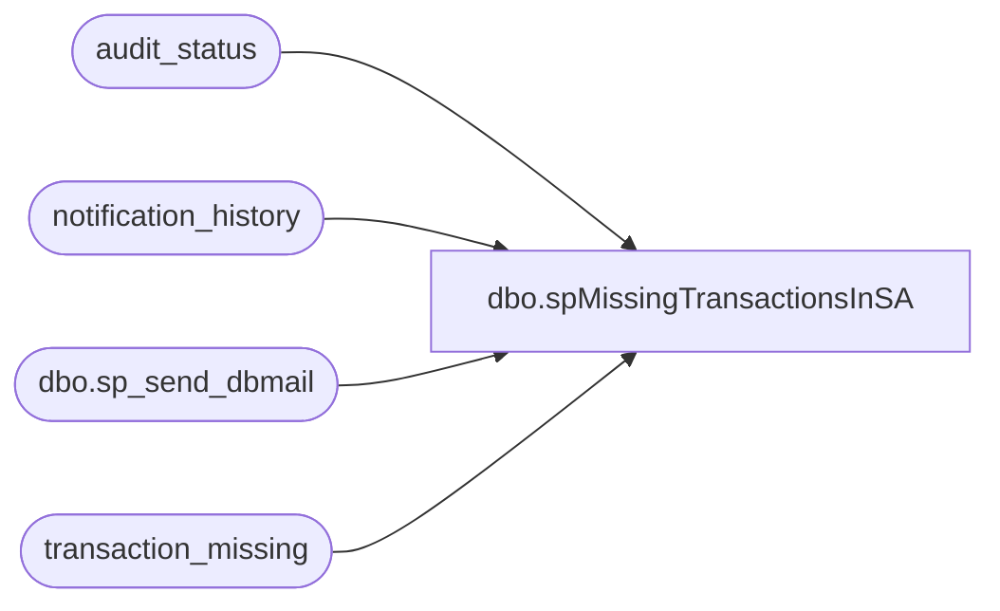

# dbo.spMissingTransactionsInSA

**Database:** auditworks  
**Server:** bedrockdb01  

## Architecture Diagram



## Table Dependencies

| Referenced Table |
|---|
| audit_status |
| notification_history |
| dbo.sp_send_dbmail |
| transaction_missing |

## Stored Procedure Code

```sql
--DROP PROC [dbo].[spMissingTransactionsInSA]
--GO

CREATE PROC [dbo].[spMissingTransactionsInSA]
-- =============================================================================================================
-- Name: [dbo].[spMissingTransactionsInSA]
--
-- Description:	Sends email alerts of Missing Transactions in Sales Audit
--
-- Input:	@filelocation	varchar(100)	path to drop files
--			@rowcount		int				total number of records to process
--
-- Output: N/A
--
-- Dependencies: 
--
-- Revision History
--		Name:			Date:			Comments:
--		Paul Beckman	10/18/2010		Created SP
--		Paul Beckman	12/13/2010		Updated SP for calculation of column as Total_Trans
--										from 'missing_qty' to '(to_transaction_no+1) - from_transaction_no'
--		Paul Beckman	02/17/2011		Added exclusion of Register 1000
--		Paul Beckman	07/17/2015		Updated from POSDBSSA to BEDROCKDB01
--		Paul Beckman	08/31/2016		Updated profile_name from 'POSadmin' to 'SAAdmin'
--		Paul Beckman	01/09/2017		Updated Alert email body to HTML
--		Paul Beckman	02/13/2018		Removed old non-HTML code for email body
--		Paul Beckman	07/17/2019		Added font color formatting based on value for email body
--		Paul Beckman	07/22/2019		Added text to message body to explain why rows might be red
--		Paul Beckman	10/17/2019		Updated to use notification_history table
--		Paul Beckman	02/05/2020		Updated email profile to 'EntSysSupport'
--      Juan Peterson	02/01/2023		Updated Email recipients to 'BABWSupport@capstone-is.com'
--		Brandon Hickey	10/22/2025		Added ChristopherEime@buildabear.com to recipients list
--
-- exec spMissingTransactionsInSA
-- =============================================================================================================
AS

declare @sql varchar(8000)
declare @recipients varchar(4000)
declare @Subject varchar(60)
declare @text nvarchar(max)
declare @query varchar(8000)
declare @copy_recipients varchar(8000)

--set @recipients = 'paulb@buildabear.com'
set @recipients = 'BIAdmin@buildabear.com;benb@buildabear.com;brandonh@buildabear.com;enjolia@buildabear.com;bradw@buildabear.com;juanp@buildabear.com;ChristopherEime@buildabear.com;SalesAuditBears@buildabear.com'
--'poll@buildabear.com;EntSysSupport@buildabear.com;SalesAuditBears@buildabear.com;BABWSupport@capstone-is.com'
--set @copy_recipients = 'ianw@buildabear.com'

IF (Object_ID('tempdb..##misstrans') IS NOT NULL) DROP TABLE ##misstrans
SELECT CONVERT (VARCHAR(5),audit_status.store_no) AS Store,CONVERT (VARCHAR(3),audit_status.register_no) AS WS,CONVERT(VARCHAR(11), audit_status.sales_date, 101) AS Sales_Date,CONVERT (VARCHAR(14),from_transaction_no) AS from_Trans_No,CONVERT (VARCHAR(12),to_transaction_no) AS to_Trans_No,CONVERT (VARCHAR(7),(to_transaction_no+1) - from_transaction_no) AS Total_Trans
INTO ##misstrans
FROM audit_status,transaction_missing
WHERE audit_status.missing_qty > 0
AND audit_status.missing_qty < 10000
AND verified = 0
and sa_reject_qty = 0
and if_reject_qty = 0
and audit_status.register_no not in (21,22,23,24,1000)
AND audit_status.store_no = transaction_missing.store_no
AND audit_status.register_no = transaction_missing.register_no
AND audit_status.sales_date = transaction_missing.sales_date
ORDER BY audit_status.store_no

if (select count(*) from ##misstrans) > 0 
begin 
	set @text = 
				'<font face =arial size = 2 color="Black">' +
				'The following Transactions are currently missing from Sales Audit...<br>' +
				'<br>' +
				'<table border="1">' + 
				'<font face =arial size = 2>' +
				'<tr bgcolor=#D5D5F7><th>Store</th><th>WS</th><th>Sales Date</th><th>from Trans No</th><th>to Trans No</th><th>Total Trans</th></tr>' +
				CAST ( ( SELECT CASE WHEN Total_Trans > 2 THEN 'red' ELSE 'black' END  AS "font/@color",
								[td/@align]='center',
								td = Store, '',
								[td/@align]='center',
								td = WS, '',
								td = Sales_Date, '',
								td = from_Trans_No, '',
								td = to_Trans_No, '',
								td = Total_Trans, ''
					  FROM ##misstrans
					  FOR xml path ('tr'), type
				) AS NVARCHAR(MAX) ) +
				'</table>' +
				'<br>' +
				'<font face =arial size = 1 color="Red">' +
				'* Stores above in Red indicates more than 2 missing transactions.' +
				'<br><br><br><br>' +
				'<font face =arial size = 1 color="#C0C0C0">' +
				'<br><br><br><br>' +
				'Server:  BEDROCKDB01 <br>' +
				'Job Name:  Missing_Transactions_in_SA <br>' +
				'Stored Proc:  BEDROCKDB01.auditworks.dbo.spMissingTransactionsInSA <br>' +
				'Created by:  Paul Beckman <br>' +
				'Team Ownership:  Enterprise Systems <br>'

set @Subject = 'ALERT - Missing Transactions in SA'
	exec msdb.dbo.sp_send_dbmail  
		@profile_name = 'EntSysSupport',
		@recipients = @recipients,
		@copy_recipients = @copy_recipients,
		@subject=@Subject, 
		@body = @text,
		@body_format = 'HTML'

	INSERT INTO notification_history
	(stored_proc_name,
	record_logged_datetime,
	issues_found,
	action_required,
	notification_sent,
	email_type,
	email_to,
	email_cc,
	email_subject,
	comment
	)
	VALUES (
	'spMissingTransactionsInSA', --<< Stored Proc name
	GETDATE(),
	'Yes', --<< Issues found - Yes / No
	'Yes', --<< Action required - Yes / No
	'Yes', --<< Notification sent - Yes / No
	'Alert', --<< Email type - Notification Only / Alert / Warning
	@recipients, --<< Email TO
	@copy_recipients, --<< Email CC
	@Subject, --<< Email Subject
	'Transactions are currently missing from Sales Audit' --<< Comment
	)

end
else
if (select count(*) from ##misstrans) = 0 
begin
	INSERT INTO notification_history
	(stored_proc_name,
	record_logged_datetime,
	issues_found,
	action_required,
	notification_sent,
	email_type,
	email_to,
	email_cc,
	email_subject,
	comment
	)
	VALUES (
	'spMissingTransactionsInSA', --<< Stored Proc name
	GETDATE(),
	'No', --<< Issues found - Yes / No
	'No', --<< Action required - Yes / No
	'No', --<< Notification sent - Yes / No
	NULL, --<< Email type - Notification Only / Alert / Warning
	NULL, --<< Email TO
	NULL, --<< Email CC
	NULL, --<< Email Subject
	'There are currently No Missing POS Transactions in Sales Audit' --<< Comment
	)
end
```

