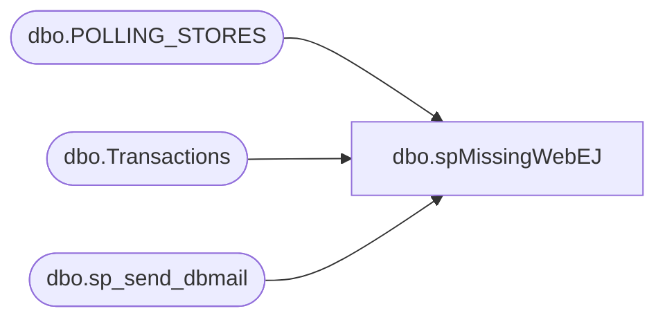

# dbo.spMissingWebEJ

**Database:** auditworks  
**Server:** bedrockdb01  

## Architecture Diagram



## Table Dependencies

| Referenced Table |
|---|
| dbo.POLLING_STORES |
| dbo.Transactions |
| dbo.sp_send_dbmail |

## Stored Procedure Code

```sql
--DROP PROC [dbo].[spMissingWebEJ]
--GO

CREATE PROC [dbo].[spMissingWebEJ]
-- =============================================================================================================
-- Name: [dbo].[spMissingWebEJ]
--
-- Description:	Checks for stores missing ej data for yesterday in ENTSCDB01 EJ database & notifies via email accordingly
--
--
-- Output: N/A
--
-- Dependencies: 
--
-- Revision History
--		Name:			Date:			Comments:
--		Paul Beckman	01/07/2011		Created SP from existing job step
--		Paul Beckman	08/29/2012		Updated to point to new EJ server ENTSCDB01
--		Paul Beckman	10/10/2017		Updated to pull store list from auditworks.dbo.POLLING_STORES
--
-- exec spMissingWebEJ
-- =============================================================================================================
AS
SET NOCOUNT ON


declare @sql varchar(8000)
declare @recipients varchar(8000)
declare @Subject varchar(60)
declare @query varchar(8000)
--declare @salesdate varchar(20)
--set @salesdate = '05/08/2005'

set @recipients = 'posadmin@buildabear.com'
--set @recipients = 'paulb@buildabear.com'
--set @recipients = 'RS Polling'

--------------------------------------------------
IF (Object_ID('tempdb..##Coalition_Stores') IS NOT NULL) DROP TABLE ##Coalition_Stores

SELECT STORE_NUM as Store
INTO ##Coalition_Stores
FROM auditworks.dbo.POLLING_STORES
WHERE POLLING_VLDTN = 1
AND POLLING_VLDTN_DATE <= GETDATE()
AND STORE_NUM NOT IN (470,473)
ORDER BY STORE_NUM

IF (Object_ID('tempdb..##WebEJ') IS NOT NULL) DROP TABLE ##WebEJ
select STORENO as StoreEJ 
INTO ##WebEJ
from ENTSCDB01.EJ.dbo.Transactions
where DATETIME between CONVERT(char,DATEADD(day,-1,getdate()),111) and  CONVERT(char,DATEADD(day,0,getdate()),111)
group by STORENO
order by STORENO

IF (Object_ID('tempdb..##MissingWebEJ') IS NOT NULL) DROP TABLE ##MissingWebEJ
select CS.* into ##MissingWebEJ
from ##Coalition_Stores CS
left join ##WebEJ EJ
on Store = StoreEJ
where StoreEJ is NULL

if (select count(*) from ##MissingWebEJ) > 50
begin
	set @query = 
	'
	PRINT ''There are too many Stores Missing WebEJ entries for yesterdays sales.''
	PRINT ''It is possible that the EJ db on ENTSCDB01 is full or the EJ Import process is not running on entSCapp01.''
	PRINT ''If the Import is not running, start or restart the NSB WebEJ service on entSCapp01.''
	PRINT ''''
	PRINT ''The following stores have no WebEJ entries for yesterday:''
	PRINT ''''
	set nocount on
	select * from ##MissingWebEJ
	PRINT ''''
	PRINT ''''
	PRINT ''''
	PRINT ''Server:  POSdbsSA''
	PRINT ''Job Name:  MissingWebEJ''
	PRINT ''Stored Proc:  posdbssa.auditworks.dbo.spMissingWebEJ''
	PRINT ''Created by:  Paul Beckman''
	PRINT ''Team Ownership:  POSadmin''
	'

	set @Subject = 'WARNING - WebEJ Store Entries Missing'

	exec msdb.dbo.sp_send_dbmail
		@recipients = @recipients,
		@subject=@Subject, 
		@query_result_width = 250,
		@query= @query

end

if (select count(*) from ##MissingWebEJ) between 1 and 49
begin
	set @query = 
	'
	PRINT ''The following stores have no WebEJ entries for yesterday:''
	PRINT ''''
	set nocount on
	select * from ##MissingWebEJ
	PRINT ''''
	PRINT ''It is likely these stores were on the wrong business date yesterday or EOD was not completed''
	PRINT ''''
	PRINT ''''
	PRINT ''''
	PRINT ''Server:  POSdbsSA''
	PRINT ''Job Name:  MissingWebEJ''
	PRINT ''Stored Proc:  posdbssa.auditworks.dbo.spMissingWebEJ''
	PRINT ''Created by:  Paul Beckman''
	PRINT ''Team Ownership:  POSadmin''
	'

	set @Subject = 'ALERT - WebEJ Store Entries Missing'

	exec msdb.dbo.sp_send_dbmail
		@recipients = @recipients,
		@subject=@Subject, 
		@query_result_width = 250,
		@query= @query
end

if (select count(*) from ##MissingWebEJ) = 0
begin
	set @query = 
	'
	PRINT ''All Stores posted to WebEJ''
	PRINT ''''
	PRINT ''''
	PRINT ''''
	PRINT ''Server:  POSdbsSA''
	PRINT ''Job Name:  MissingWebEJ''
	PRINT ''Stored Proc:  posdbssa.auditworks.dbo.spMissingWebEJ''
	PRINT ''Created by:  Paul Beckman''
	PRINT ''Team Ownership:  POSadmin''
	'

	set @Subject = 'All Store posted to WebEJ'

	exec msdb.dbo.sp_send_dbmail
		@recipients = @recipients,
		@subject=@Subject, 
		@query_result_width = 250,
		@query= @query
end
```

