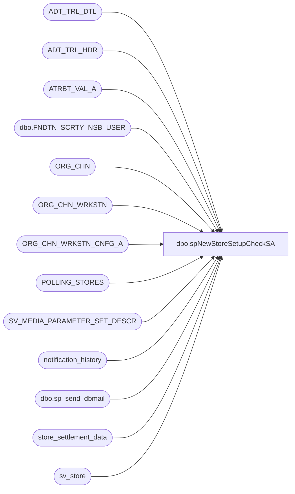

# dbo.spNewStoreSetupCheckSA

**Database:** auditworks  
**Server:** bedrockdb01  

## Architecture Diagram



## Table Dependencies

| Referenced Table |
|---|
| ADT_TRL_DTL |
| ADT_TRL_HDR |
| ATRBT_VAL_A |
| dbo.FNDTN_SCRTY_NSB_USER |
| ORG_CHN |
| ORG_CHN_WRKSTN |
| ORG_CHN_WRKSTN_CNFG_A |
| POLLING_STORES |
| SV_MEDIA_PARAMETER_SET_DESCR |
| notification_history |
| dbo.sp_send_dbmail |
| store_settlement_data |
| sv_store |

## Stored Procedure Code

```sql
CREATE   procedure [dbo].[spNewStoreSetupCheckSA]
--(
--@TransactionStartDate as int
--,@TransactionEndDate as int
--)
AS
-- =====================================================================================================
-- Name: spNewStoreSetupCheckSA
--
-- Description:	Performs some checks on store setup and reports to the business user responsible for
--				said setup
--	
--
-- Input:	
--			
--
-- Output: Email
--			
--
-- Schedule: 
--		
--
-- Dependencies: None	
--	
--
-- Revision History
--		Name:				Date:			Comments:
--		Paul Beckman		07/17/2019		Initial setup
--		Paul Beckman		07/23/2019		Added Media Parameter Set check
--		Paul Beckman		07/24/2019		Added color formatting based on items needing attention
--		Paul Beckman		08/09/2019		Added check for MID value update in store_settlement_data
--		Paul Beckman		08/13/2019		Added DOW check for audit trail days Mon=3 Tue-Fri=1
--		Paul Beckman		10/18/2019		Updated to use notification_history table
--		Paul Beckman		02/05/2020		Updated email profile to 'EntSysSupport'
--		Juan Peterson		06/08/2021		Replaced 'JenniferMa@buildabear.com' with 'AaronS@buildabear.com' and removed 'DawnGo@buildabear.com'
--		Keith Lee			09/16/2021		Removed Eric S from report and added Chuck R.  Replaced JenniferMa@buildabear.com with jenm@buildabear.com.
-- exec spNewStoreSetupCheckSA
-- 
-- =====================================================================================================


--####################################
-- Create Temp Table
--####################################

IF (Object_ID('tempdb..##NewStoreList') IS NOT NULL) DROP TABLE ##NewStoreList
CREATE TABLE ##NewStoreList (StoreNum numeric(4,0)
	,OpenDate date
	,StoreType varchar(5)
	,Workstations varchar(5)
	,TaxAssign varchar(5)
	,MID varchar(5)
	,Attribute varchar(5)
	,Translate varchar(5)
	,MediaParm varchar(5)
	)

IF (Object_ID('tempdb..##StoreMIDcheck') IS NOT NULL) DROP TABLE ##StoreMIDcheck


--####################################
-- Declare script variables
--####################################

DECLARE @SQL VARCHAR(8000)
DECLARE @CMD VARCHAR(4000)
DECLARE @Recipients VARCHAR(4000)
DECLARE @Copy_Recipients VARCHAR(4000)
DECLARE @Subject VARCHAR(80)
DECLARE @Query VARCHAR(8000)
DECLARE @Text nvarchar(max)
DECLARE @StoreCount AS INT
DECLARE @DateCount AS INT
DECLARE @AuditTrailDays AS INT


--####################################
-- Set variables
--####################################

SET @DateCount = 30  --<< Days prior to Stores [OPEN_DATE] in [auditworks].[dbo].[POLLING_STORES]

--SET @Recipients = 'paulb@buildabear.com'
SET @Recipients = 'ScottP@buildabear.com;LisaM@buildabear.com;chuckr@buildabear.com'
SET @Copy_Recipients = 'EntSysSupport@buildabear.com;AaronS@buildabear.com'


--####################################
-- Insert Stores into Temp Table
--####################################

INSERT INTO ##NewStoreList
SELECT STORE_NUM
	,OPEN_DATE
	,NULL
	,NULL
	,NULL
	,NULL
	,NULL
	,NULL
	,NULL
FROM POLLING_STORES
WHERE CLOSED_DATE IS NULL
AND STORE_NUM NOT IN (470)
AND STORE_BRAND IN ('Workshop')
AND OPEN_DATE <= DATEADD(day,+@DateCount,GETDATE())
AND OPEN_DATE >= DATEADD(day,-30,GETDATE())
--AND STORE_NUM IN (443)


--####################################
-- Setup Checks
--####################################

-------- Store Export code (for CRM Export) --------
UPDATE ##NewStoreList
SET StoreType = 'X'
WHERE StoreNum IN (
SELECT a.STORE_NUM
FROM POLLING_STORES a
WHERE a.STORE_NUM NOT IN (SELECT a.STORE_NUM FROM POLLING_STORES a
LEFT JOIN sv_store b ON a.STORE_NUM = b.store_no
WHERE store_export_code = 'S'
)
AND a.CLOSED_DATE IS NULL
AND a.STORE_NUM NOT IN (470)
AND a.STORE_BRAND IN ('Workshop')
AND a.OPEN_DATE <= DATEADD(day,+@DateCount,GETDATE())
)

------------------ Workstations --------------------
UPDATE ##NewStoreList
SET Workstations = 'X'
WHERE StoreNum IN (
SELECT a.STORE_NUM
FROM POLLING_STORES a
WHERE a.STORE_NUM NOT IN (SELECT a.STORE_NUM FROM POLLING_STORES a
LEFT JOIN ORG_CHN_WRKSTN b ON a.STORE_NUM = b.ORG_CHN_NUM
WHERE ACTV = 1
AND WRKSTN_NUM IN (2,3,16,17,18,19,1000)
)
AND a.CLOSED_DATE IS NULL
AND a.STORE_NUM NOT IN (470)
AND a.STORE_BRAND IN ('Workshop')
AND a.OPEN_DATE <= DATEADD(day,+@DateCount,GETDATE())
)

------------Tax Jurisdiction and Rates ------------
UPDATE ##NewStoreList
SET TaxAssign = 'X'
WHERE StoreNum IN (
SELECT a.STORE_NUM
FROM POLLING_STORES a
WHERE a.STORE_NUM NOT IN (SELECT a.STORE_NUM FROM POLLING_STORES a
LEFT JOIN ORG_CHN b ON a.STORE_NUM = b.ORG_CHN_NUM
WHERE b.TAX_JRSDCTN_CODE IS NOT NULL
)
AND a.CLOSED_DATE IS NULL
AND a.STORE_NUM NOT IN (470)
AND a.STORE_BRAND IN ('Workshop')
AND a.OPEN_DATE <= DATEADD(day,+@DateCount,GETDATE())
)

---------------- Merchant ID (MID) -----------------
UPDATE ##NewStoreList
SET MID = 'X'
WHERE StoreNum IN (
SELECT a.STORE_NUM
FROM POLLING_STORES a
WHERE a.STORE_NUM NOT IN (SELECT a.STORE_NUM FROM POLLING_STORES a
LEFT JOIN store_settlement_data b ON a.STORE_NUM = b.store_no
WHERE b.interface_id = 52
AND b.store_merchant_id != '0'
)
AND a.CLOSED_DATE IS NULL
AND a.STORE_NUM NOT IN (470)
AND a.STORE_BRAND IN ('Workshop')
AND a.COUNTRY = 'USA'
AND a.OPEN_DATE <= DATEADD(day,+@DateCount,GETDATE())
)

-------------- BANKACCT Attribute ------------------
UPDATE ##NewStoreList
SET Attribute = 'X'
WHERE StoreNum IN (
SELECT a.STORE_NUM
FROM POLLING_STORES a
WHERE a.STORE_NUM NOT IN (SELECT a.STORE_NUM FROM POLLING_STORES a
LEFT JOIN ATRBT_VAL_A b ON a.STORE_NUM = b.ASGND_OBJ_NUM
WHERE b.ATRBT_CODE = 'BANKACCT'
)
AND a.CLOSED_DATE IS NULL
AND a.STORE_NUM NOT IN (470)
AND a.STORE_BRAND IN ('Workshop')
AND a.OPEN_DATE <= DATEADD(day,+@DateCount,GETDATE())
)

------------- Translate assignment -----------------
UPDATE ##NewStoreList
SET Translate = 'X'
WHERE StoreNum IN (
SELECT a.STORE_NUM
FROM POLLING_STORES a
WHERE a.STORE_NUM NOT IN (SELECT a.STORE_NUM FROM POLLING_STORES a
LEFT JOIN ATRBT_VAL_A b ON a.STORE_NUM = b.ASGND_OBJ_NUM
JOIN ORG_CHN_WRKSTN c ON a.STORE_NUM = c.ORG_CHN_NUM
JOIN ORG_CHN_WRKSTN_CNFG_A d ON c.WRKSTN_ID = d.WRKSTN_ID
WHERE c.WRKSTN_NUM = 21
AND (d.EXPRTN_DATE IS NULL OR d.EXPRTN_DATE > a.OPEN_DATE)
)
AND a.CLOSED_DATE IS NULL
AND a.STORE_NUM NOT IN (470)
AND a.STORE_BRAND IN ('Workshop')
AND a.OPEN_DATE <= DATEADD(day,+@DateCount,GETDATE())
)

------------- Media Parameter set ------------------

UPDATE ##NewStoreList
SET MediaParm = 'X'
WHERE StoreNum IN (
SELECT a.STORE_NUM
FROM POLLING_STORES a
WHERE a.STORE_NUM NOT IN (SELECT a.STORE_NUM FROM POLLING_STORES a
LEFT JOIN SV_MEDIA_PARAMETER_SET_DESCR b ON a.STORE_NUM = b.ORG_CHN_NUM
WHERE WRKSTN_NUM IN (2,3,16,17,18,19,1000)
AND media_parameter_set_no IS NOT NULL
AND effective_until_date IS NULL
GROUP BY a.STORE_NUM, media_parameter_set_no
HAVING COUNT(WRKSTN_NUM) > 0
)
AND a.CLOSED_DATE IS NULL
AND a.STORE_NUM NOT IN (470)
AND a.STORE_BRAND IN ('Workshop')
AND a.OPEN_DATE <= DATEADD(day,+@DateCount,GETDATE())
)


--####################################
-- Send Email id applicable
--####################################

SET @StoreCount = (SELECT COUNT(*) FROM ##NewStoreList WHERE CONCAT(StoreType, Workstations, TaxAssign, MID, Attribute, Translate, MediaParm) LIKE '%X%')

IF @StoreCount = 0
GOTO FINISH

SET @Text = 
		'<font face =arial size = 2 color="Red">' +
		N'<H3>** ACTION REQUIRED **</H3>' +
		'(' + CONVERT(VARCHAR(5),@StoreCount) + ') Stores found that are opening within the next ' + CONVERT(VARCHAR(5),@DateCount) + ' days and require setup completion in Sales Audit. <br>' +
		'The below items identified by store and marked with "X" require setup and/or correction. <br>' +
		'<br>' +
		'<br>' +
		'<font face =arial size = 2 color="Black">' +
		(SELECT CASE WHEN COUNT(StoreType) = 0 THEN '<font color="#D3D3D3">' ELSE '<font color="#000080">' END FROM ##NewStoreList) +
		'&nbsp;&nbsp;&nbsp;&nbsp;&nbsp;<b>- Store Type:</b>&nbsp;&nbsp;<i>Not Defined as "*BAB Store"</i><br>' +
		(SELECT CASE WHEN COUNT(Workstations) = 0 THEN '<font color="#D3D3D3">' ELSE '<font color="#000080">' END FROM ##NewStoreList) +
		'&nbsp;&nbsp;&nbsp;&nbsp;&nbsp;<b>- Workstations:</b>&nbsp;&nbsp;<i>Workstations 2,3,16,17,18,19,1000 (at minimum) not all setup</i><br>' +
		(SELECT CASE WHEN COUNT(TaxAssign) = 0 THEN '<font color="#D3D3D3">' ELSE '<font color="#000080">' END FROM ##NewStoreList) +
		'&nbsp;&nbsp;&nbsp;&nbsp;&nbsp;<b>- Tax Assignment:</b>&nbsp;&nbsp;<i>A Tax Jurisdiction is not assigned</i><br>' +
		(SELECT CASE WHEN COUNT(MID) = 0 THEN '<font color="#D3D3D3">' ELSE '<font color="#000080">' END FROM ##NewStoreList) +
		'&nbsp;&nbsp;&nbsp;&nbsp;&nbsp;<b>- Merchant ID:</b>&nbsp;&nbsp;<i>Store MID is not listed (USA Stores ONLY)</i><br>' + 
		(SELECT CASE WHEN COUNT(Attribute) = 0 THEN '<font color="#D3D3D3">' ELSE '<font color="#000080">' END FROM ##NewStoreList) +
		'&nbsp;&nbsp;&nbsp;&nbsp;&nbsp;<b>- BANKACCT Attribute:</b>&nbsp;&nbsp;<i>"BANKACCT" attribute is not defined</i><br>' + 
		(SELECT CASE WHEN COUNT(Translate) = 0 THEN '<font color="#D3D3D3">' ELSE '<font color="#000080">' END FROM ##NewStoreList) +
		'&nbsp;&nbsp;&nbsp;&nbsp;&nbsp;<b>- Translate Version:</b>&nbsp;&nbsp;<i>Wrong or missing Transalate defined</i><br>' + 
		(SELECT CASE WHEN COUNT(MediaParm) = 0 THEN '<font color="#D3D3D3">' ELSE '<font color="#000080">' END FROM ##NewStoreList) +
		'&nbsp;&nbsp;&nbsp;&nbsp;&nbsp;<b>- Media Parameter Set:</b>&nbsp;&nbsp;<i>Workstations 2,3,16,17,18,19,1000 (at minimum) need Media Paramter Set defined</i><br>' + 
		'<br>' + 
		'<table border="1">' + 
		'<font face =arial size = 2 color="Black">' +
		'<tr bgcolor=#D5D5F7><th>Store Num</th><th>Open Date</th><th>Store Type</th><th>Workstations</th><th>Tax Assignment</th><th>Merchant ID</th><th>BANKACCT Attribute</th><th>Translate Version</th><th>Media Parameter Set</th></tr>' +
		CAST ( ( SELECT [td/@align]='left',
						td = StoreNum, '',
						[td/@align]='left',
						td = CONVERT(VARCHAR(19),OpenDate,101), '',
						[td/@align]='center',
						td = CASE WHEN StoreType IS NULL THEN '' ELSE StoreType END, '',
						[td/@align]='center',
						td = CASE WHEN Workstations IS NULL THEN '' ELSE Workstations END, '',
						[td/@align]='center',
						td = CASE WHEN TaxAssign IS NULL THEN '' ELSE TaxAssign END, '',
						[td/@align]='center',
						td = CASE WHEN MID IS NULL THEN '' ELSE MID END, '',
						[td/@align]='center',
						td = CASE WHEN Attribute IS NULL THEN '' ELSE Attribute END, '',
						[td/@align]='center',
						td = CASE WHEN Translate IS NULL THEN '' ELSE Translate END, '',
						[td/@align]='center',
						td = CASE WHEN MediaParm IS NULL THEN '' ELSE MediaParm END, ''
				FROM ##NewStoreList
				WHERE CONCAT(StoreType, Workstations, TaxAssign, MID, Attribute, Translate, MediaParm) LIKE '%X%'
				ORDER BY OpenDate,StoreNum
				FOR xml path ('tr'), type
		) AS NVARCHAR(MAX) ) +
		'</table>' +
		'<font face =arial size = 1 color="#C0C0C0">' +
		'<br><br><br><br>' +
		'Server:  BEDROCKDB01 <br>' +
		'Job Name:  New_Store_Setup_Check <br>' +
		'Stored Proc:  BEDROCKDB01.auditworks.dbo.spNewStoreSetupCheckSA <br>' +
		'Created by:  Paul Beckman <br>' +
		'Team Ownership:  Enterprise Systems <br>'

SET @Subject = 'ALERT - Sales Audit New Store setup required'
	EXEC msdb.dbo.sp_send_dbmail  
	@profile_name = 'EntSysSupport',
	@recipients = @Recipients,
	@copy_recipients = @Copy_Recipients,
	@subject=@Subject, 
	@body = @Text,
	@body_format = 'HTML'

	
	INSERT INTO notification_history
	(stored_proc_name,
	record_logged_datetime,
	issues_found,
	action_required,
	notification_sent,
	email_type,
	email_to,
	email_cc,
	email_subject,
	comment
	)
	VALUES (
	'spNewStoreSetupCheckSA', --<< Stored Proc name
	GETDATE(),
	'Yes', --<< Issues found - Yes / No
	'Yes', --<< Action required - Yes / No
	'Yes', --<< Notification sent - Yes / No
	'Alert', --<< Email type - Notification Only / Alert / Warning
	@Recipients, --<< Email TO
	@Copy_Recipients, --<< Email CC
	@Subject, --<< Email Subject
	'SA setup items identified that need completion for stores opening soon' --<< Comment
	)


FINISH:
--####################################
-- Check for MID updates
--####################################


IF DATENAME(weekday, GETDATE()) IN (N'Monday')
       SET @AuditTrailDays = 3;
ELSE 
       SET @AuditTrailDays = 1;


SELECT a.ROOT_TBL_KEY AS STORE
	,b.NEW_VAL AS MerchantID
	,c.USER_NAME AS UPDATED_BY
	,CONVERT(VARCHAR(19),a.ENTRY_DATE_TIME, 120) AS UPDATE_DTTM
	,ROW_NUMBER() OVER (PARTITION BY a.ROOT_TBL_KEY ORDER BY a.ROOT_TBL_KEY, ENTRY_DATE_TIME DESC) AS RowNum
INTO ##StoreMIDcheck
FROM ADT_TRL_HDR a
	,ADT_TRL_DTL b
	,foundation.dbo.FNDTN_SCRTY_NSB_USER c
WHERE a.ENTRY_DATE_TIME >= DATEADD(day,-@AuditTrailDays,GETDATE())
AND a.ENTRY_ID = b.ENTRY_ID
AND a.USER_ID = c.USER_ID
AND a.ROOT_TBL_NAME = 'ORG_CHN'
AND b.TBL_NAME = 'store_settlement_data'
AND LEN(b.NEW_VAL) > 1
AND b.TBL_KEY_RSRC_PRMS LIKE '52%Paymentech Settlement%'
AND b.ACTN_CODE = 'M'
AND b.CLMN_NAME LIKE '%store_merchant_id%'

IF (SELECT COUNT(*) FROM ##StoreMIDcheck) > 0
BEGIN

--SET @Recipients = 'paulb@buildabear.com'
--SET @Copy_Recipients = 'paulb@buildabear.com'
SET @Recipients = 'EntSysSupport@buildabear.com'
SET @Copy_Recipients = 'JenM@buildabear.com'

SET @Text = 
		'<font face =arial size = 2 color="Black">' +
		'Listed below are Store Merchant ID''s (MID) that have been updated in Sales Audit within the last ' + CONVERT(VARCHAR(2),@AuditTrailDays) + ' days. <br>' +
		'<br>' +
		'<br>' + 
		'<table border="1">' + 
		'<font face =arial size = 2 color="Black">' +
		'<tr bgcolor=#D5D5F7><th>Store Num</th><th>Merchant ID</th><th>Updated by</th><th>Update date time</th></tr>' +
		CAST ( ( SELECT [td/@align]='left',
						td = REPLACE(STORE, '', ''), '',
						[td/@align]='left',
						td = REPLACE(MerchantID, '', ''), '',
						[td/@align]='center',
						td = REPLACE(UPDATED_BY, '', ''), '',
						[td/@align]='left',
						td = CONVERT(VARCHAR(19), UPDATE_DTTM, 120), ''
				FROM ##StoreMIDcheck 
				WHERE RowNum <= 1
				ORDER BY STORE
				FOR xml path ('tr'), type
		) AS NVARCHAR(MAX) ) +
		'</table>' +
		'<font face =arial size = 1 color="#C0C0C0">' +
		'<br><br><br><br>' +
		'Server:  BEDROCKDB01 <br>' +
		'Job Name:  New_Store_Setup_Check <br>' +
		'Stored Proc:  BEDROCKDB01.auditworks.dbo.spNewStoreSetupCheckSA <br>' +
		'Created by:  Paul Beckman <br>' +
		'Team Ownership:  SAadmin <br>'

SET @Subject = 'NOTICE - Store MID updated in Sales Audit'
	EXEC msdb.dbo.sp_send_dbmail  
	@profile_name = 'EntSysSupport',
	@recipients = @Recipients,
	@copy_recipients = @Copy_Recipients,
	@subject=@Subject, 
	@body = @Text,
	@body_format = 'HTML'
	
	INSERT INTO notification_history
	(stored_proc_name,
	record_logged_datetime,
	issues_found,
	action_required,
	notification_sent,
	email_type,
	email_to,
	email_cc,
	email_subject,
	comment
	)
	VALUES (
	'spNewStoreSetupCheckSA', --<< Stored Proc name
	GETDATE(),
	'No', --<< Issues found - Yes / No
	'No', --<< Action required - Yes / No
	'Yes', --<< Notification sent - Yes / No
	'Notification Only', --<< Email type - Notification Only / Alert / Warning
	@Recipients, --<< Email TO
	@Copy_Recipients, --<< Email CC
	@Subject, --<< Email Subject
	'MID recently updated in SA' --<< Comment
	)

END


--####################################
-- Temp Table Cleanup
--####################################

IF (Object_ID('tempdb..##NewStoreList') IS NOT NULL) DROP TABLE ##NewStoreList
IF (Object_ID('tempdb..##StoreMIDcheck') IS NOT NULL) DROP TABLE ##StoreMIDcheck


--####################################


/*

SELECT * FROM ##NewStoreList

*/
```

