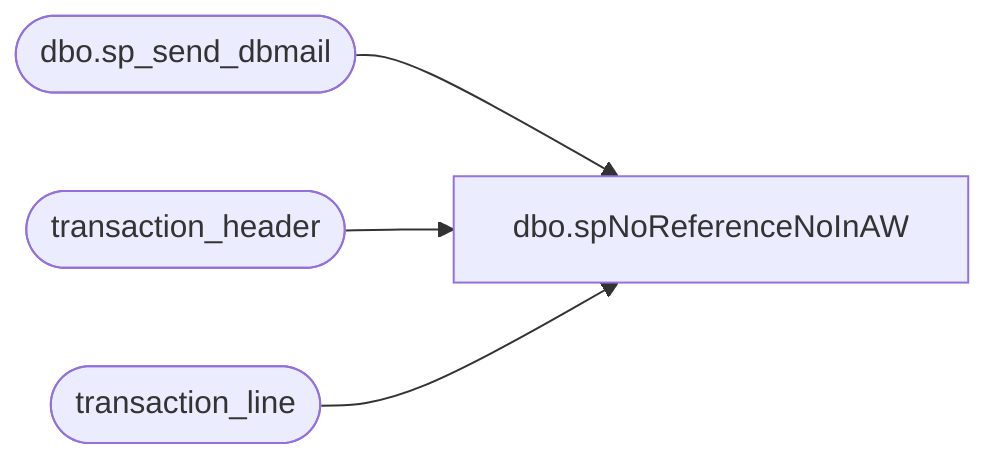

# dbo.spNoReferenceNoInAW

**Database:** auditworks  
**Server:** bedrockdb01  

## Architecture Diagram



## Table Dependencies

| Referenced Table |
|---|
| dbo.sp_send_dbmail |
| transaction_header |
| transaction_line |

## Stored Procedure Code

```sql
--DROP PROC [dbo].[spNoReferenceNoInAW]
--GO

CREATE PROC [dbo].[spNoReferenceNoInAW]
-- =============================================================================================================
-- Name: [dbo].[spNoReferenceNoInAW]
--
-- Description:	Alerts of any transactions without a reference number
--
-- Input:	@filelocation	varchar(100)	path to drop files
--			@rowcount		int				total number of records to process
--
-- Output: N/A
--
-- Dependencies: 
--
-- Revision History
--		Name:			Date:			Comments:
--		Paul Beckman	10/20/2010		Created SP
--		Paul Beckman	08/31/2011		Updated transaction series line to exclude 'B' also
-- =============================================================================================================
AS

IF (Object_ID('tempdb..##dmt_temp2') IS NOT NULL) DROP TABLE ##dmt_temp2
set nocount on
declare @sql varchar(8000)
declare @recipients varchar(8000)
declare @copy_recipients varchar (100)
declare @Subject varchar(65)
declare @query varchar(8000)

select th.store_no, th.register_no, th.entry_date_time, th.transaction_no 
into ##dmt_temp2
from transaction_line tl
join transaction_header th
on tl.transaction_id = th.transaction_id
where tl.line_object_type = 6
and tl.line_object in (604,605,606,608)
and th.transaction_series not in ('M','B')
and tl.line_void_flag = '0'
and tl.reference_no is null
order by th.store_no, th.register_no, th.entry_date_time, th.transaction_no

set @query = 
'
print ''If any transactions exist in AW with no reference number, they are listed below.''
print ''''
set nocount on
select * from ##dmt_temp2
print ''''
print ''''
print ''This is an automated email sent at 12pm and 4pm daily if any exist.''
print ''If you need to respond, send email to POSadmin@buildabear.com''
print ''''
print ''This process was run on POSDBSSA and is named "NoReferenceNoInAW" using stored proc posdbssa.auditworks.dbo.spNoReferenceNoInAW''
'

set @Subject = 'ALERT - Transactions found in SA with No Reference number'
--set @recipients = 'paulb@buildabear.com'
--set @copy_recipients = 'paulb@buildabear.com'
set @recipients = 'lindak@buildabear.com'
set @copy_recipients = 'posadmin@buildabear.com'

if (select count(*) from ##dmt_temp2) > 0
-- send the email if we have anything to report
begin
	exec msdb.dbo.sp_send_dbmail
		@recipients = @recipients,
		@copy_recipients = @copy_recipients,
		@subject=@Subject, 
		@query_result_width = 250,
		@query= @query
end
```

