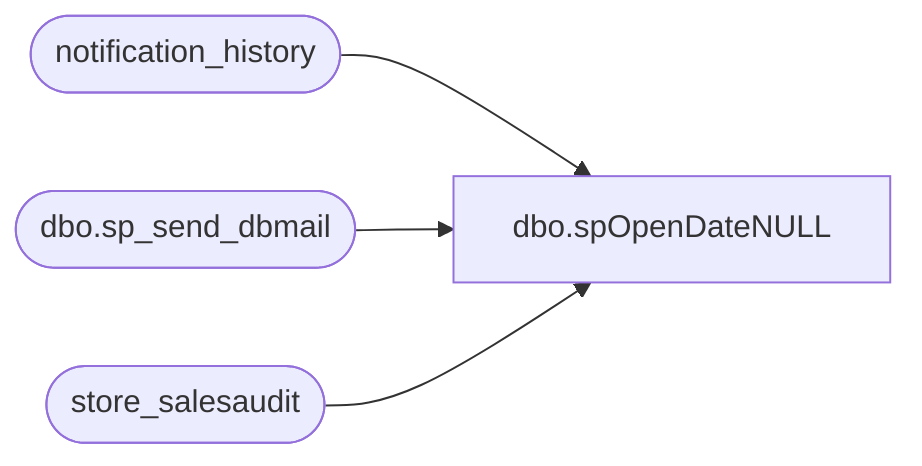

# dbo.spOpenDateNULL

**Database:** auditworks  
**Server:** bedrockdb01  

## Architecture Diagram



## Table Dependencies

| Referenced Table |
|---|
| notification_history |
| dbo.sp_send_dbmail |
| store_salesaudit |

## Stored Procedure Code

```sql
--DROP PROC [dbo].[spOpenDateNULL]
--GO

CREATE PROC [dbo].[spOpenDateNULL]
-- =============================================================================================================
-- Name: [dbo].[spOpenDateNULL]
--
-- Description:	Shows stores that have a NULL open date
--
-- Input:	@filelocation	varchar(100)	path to drop files
--			@rowcount		int				total number of records to process
--
-- Output: N/A
--
-- Dependencies: 
--
-- Revision History
--		Name:			Date:			Comments:
--		Paul Beckman	10/18/2010		Created SP
--		Paul Beckman	07/19/2015		Updated from POSDBSSA to BEDROCKDB01
--		Paul Beckman	08/31/2016		Updated profile_name from 'POSadmin' to 'SAAdmin'
--		Paul Beckman	01/17/2017		Updated Alert email body to HTML
--		Paul Beckman	01/25/2018		Updated SQL Job Name in email body to HTML
--		Paul Beckman	03/22/2019		Added LisaM@buildabear.com to email notification
--		Paul Beckman	04/08/2019		Replaced ronw@buildabear.com with DawnGo@buildabear.com
--		Paul Beckman	10/18/2019		Updated to use notification_history table
--		Paul Beckman	02/05/2020		Updated email profile to 'EntSysSupport'
--		Keith Lee		09/28/2021		Removed DawnGo@buildabear.com and added ScottP@buildabear.com as per SR# 31495
--
-- =============================================================================================================
AS
SET NOCOUNT ON

declare @sql varchar(8000)
declare @recipients varchar(4000)
declare @Subject varchar(60)
declare @query varchar(8000)
declare @copy_recipients varchar(8000)
declare @text nvarchar(max)

IF (Object_ID('tempdb..##opendt') IS NOT NULL) DROP TABLE ##opendt
select store_no,open_date
into ##opendt
from store_salesaudit
where open_date is null
and store_no not in ('473','991','1513','1590')
and store_no <= '2199'
order by store_no


--set @recipients = 'paulb@buildabear.com'
set @recipients = 'LisaM@buildabear.com;lindak@buildabear.com;ScottP@buildabear.com'
set @copy_recipients = 'EntSysSupport@buildabear.com'

if (select count(*) from ##opendt) > 0 
begin
set @text = 
		'<font face =arial size = 2>' +
		'Below are stores that do not have an Open Date in Sales Audit. <br>' +
		'Please add the actual Open Date to the Location in CRDM. <br>' +
		'<br>' +
		'<table border="1">' + 
		'<font face =arial size = 2>' +
		'<tr bgcolor=#D5D5F7><th>Store Num</th><th>Open Date</th></tr>' +
		CAST ( ( SELECT [td/@align]='center',
						td = store_no, '',
						[td/@align]='center',
						td = open_date, ''
				FROM ##opendt
				FOR xml path ('tr'), type
		) AS NVARCHAR(MAX) ) +
		'</table>' +
		'<font face =arial size = 1 color="#C0C0C0">' +
		'<br><br><br><br>' +
		'Server:  BEDROCKDB01 <br>' +
		'Job Name:  Store_CRDM_Dates_Check <br>' +
		'Stored Proc:  BEDROCKDB01.auditworks.dbo.spOpenDateNULL <br>' +
		'Created by:  Paul Beckman <br>' +
		'Team Ownership:  Enterprise Systems <br>'

set @Subject = 'ALERT - NULL Store Open Date in SA'
	exec msdb.dbo.sp_send_dbmail  
		@profile_name = 'EntSysSupport',
		@recipients = @recipients,
		@copy_recipients = @copy_recipients,
		@subject=@Subject, 
		@body = @text,
		@body_format = 'HTML'
	
	INSERT INTO notification_history
	(stored_proc_name,
	record_logged_datetime,
	issues_found,
	action_required,
	notification_sent,
	email_type,
	email_to,
	email_cc,
	email_subject,
	comment
	)
	VALUES (
	'spOpenDateNULL', --<< Stored Proc name
	GETDATE(),
	'Yes', --<< Issues found - Yes / No
	'Yes', --<< Action required - Yes / No
	'Yes', --<< Notification sent - Yes / No
	'Alert', --<< Email type - Notification Only / Alert / Warning
	@recipients, --<< Email TO
	@copy_recipients, --<< Email CC
	@Subject, --<< Email Subject
	'Stores identified that do not have an Open Date in Sales Audit' --<< Comment
	)

end
return
```

