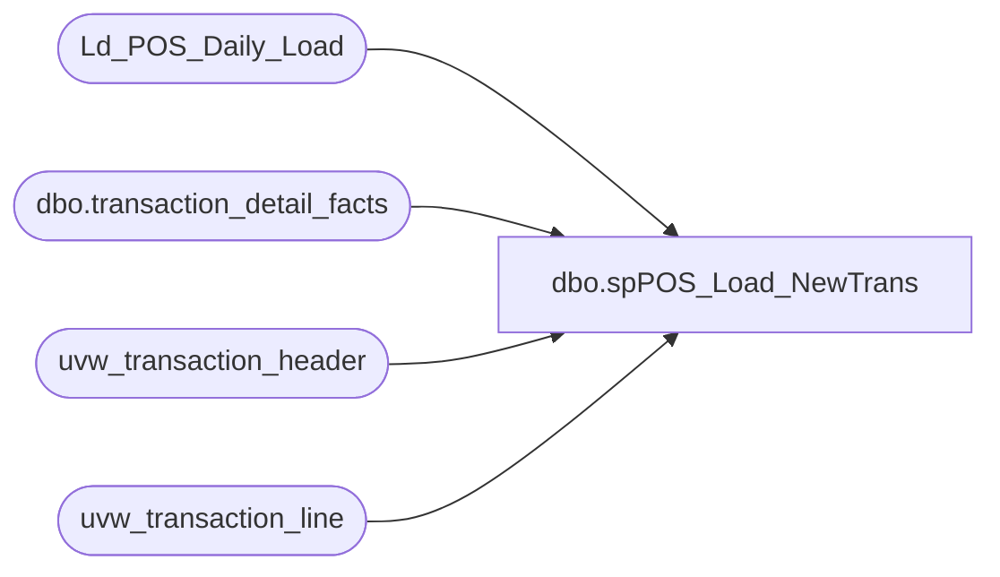

# dbo.spPOS_Load_NewTrans

**Database:** auditworks  
**Server:** bedrockdb01  

## Architecture Diagram



## Table Dependencies

| Referenced Table |
|---|
| Ld_POS_Daily_Load |
| dbo.transaction_detail_facts |
| uvw_transaction_header |
| uvw_transaction_line |

## Stored Procedure Code

```sql
-- =============================================================================================================
-- Name: spPOS_Load_NewTrans
--
-- Description:	
--		pull a list of the latest transactions to load.  
--		this helps solve some problems.
--			1. we were just pulling from transaction_header and not the av tables.  what could happen is that
--				when the network to a store was down for a couple of days, the transactions would flow through
--				into transaction_header and then that day, they would be moved to the av tables.  this meant that
--				they were gone before we could even pull them.
--
--			2. the etl load could die, but some of the transaction data was still loaded - discount_facts.  since
--				we didn't know what transactions where to be processed before hand, we couldn't make sure they
--				were deleted before we ran the load again.
--
--		had to come up with an efficient way to pull transactions from the av tables.  doing it in two stages
--		seemed to solve the problem
--
-- Input:
--		nada
--
-- Output: 
--		nada
--
-- Dependencies: 
--
-- EXAMPLE:
--		exec auditworks.dbo.spPOS_Load_NewTrans
--
-- Revision History
--		Name:			Date:			Comments:
--		Dave Rice		10/06/2010		created
--		dave			10/27/2010		going back a week to grab any trans we might have missed
--		dave			01/05/2011		added groupon bypass
-- =============================================================================================================
CREATE procedure [dbo].[spPOS_Load_NewTrans]
as

--create table Ld_POS_Daily_Load (
--	transaction_id bigint
--)


------ pull the last loaded transaction_id from papamart
--declare @last_transaction_id int
--set @last_transaction_id = (select max(LAST_ID) from PAPAMART.dwstaging.dbo.etl_prcs_cntrl where ETL_PRCS_NM = 'POS_Daily_Load')
----set @last_transaction_id = (select max(transaction_id) from PAPAMART.dw.dbo.transaction_detail_facts)
--/*
--select * from PAPAMART.dwstaging.dbo.etl_prcs_cntrl where ETL_PRCS_NM = 'POS_Daily_Load'
--order by INS_DT desc
--
--*/

declare @last_transaction_id int
set @last_transaction_id = (select min(transaction_id) from uvw_transaction_header where transaction_date = convert(varchar, dateadd(dd, -15, getdate()), 101))
--set @last_transaction_id = (select max(LAST_ID) from PAPAMART.dwstaging.dbo.etl_prcs_cntrl where ETL_PRCS_NM = 'POS_Daily_Load')

IF (Object_ID('tempdb..#tmp_dw') IS NOT NULL) DROP TABLE #tmp_dw
select distinct transaction_id
into #tmp_dw
from PAPAMART.dw.dbo.transaction_detail_facts
where transaction_id >= @last_transaction_id

-- pull a simple list of the new transactions, this is far faster than trying to run the
-- entire where clause
IF (Object_ID('tempdb..#tempme') IS NOT NULL) DROP TABLE #tempme
select distinct th.transaction_id
into #tempme
from uvw_transaction_header th
	left join #tmp_dw dw
	on dw.transaction_id = th.transaction_id
where th.transaction_id > @last_transaction_id
	and th.transaction_series in ('P','','D','F','W','A','N')
	and th.transaction_void_flag = 0
	and th.transaction_category in (1,2,10)
	and dw.transaction_id is null
union
-- bring in the 1199/groupon adjustment transactions
select distinct th.transaction_id
from uvw_transaction_header th
	left join #tmp_dw dw
	on dw.transaction_id = th.transaction_id
where 1=1
	and th.transaction_id > @last_transaction_id
	and th.transaction_series in ('N')
	and th.transaction_void_flag = 0
	and th.transaction_category in (1,2,10)
	and dw.transaction_id is null

-- pull the list of transactions that need to be loaded
truncate table Ld_POS_Daily_Load

-- further refine the transactions we need to look at
-- this step will greatly reduce the transaction count
insert into Ld_POS_Daily_Load (transaction_id)
select distinct th.transaction_id
from #tempme d
	join uvw_transaction_header th with (nolock)
	on th.transaction_id = d.transaction_id
	join uvw_transaction_line tl with (nolock)
	on tl.transaction_id = th.transaction_id
WHERE 1=1
	and th.transaction_series in ('P','','D','F','W','A')
	and th.transaction_void_flag = 0
	and tl.line_void_flag = 0

	and ((th.transaction_category in (1,2)
		and tl.line_object_type <> 12)
		or (th.transaction_category in (10)
		and tl.line_object_type = 7 
		and tl.line_object between 700 and 799
		))
union
-- groupon adjustments
select distinct th.transaction_id
from #tempme d
	join uvw_transaction_header th with (nolock)
	on th.transaction_id = d.transaction_id
	join uvw_transaction_line tl with (nolock)
	on tl.transaction_id = th.transaction_id
WHERE 1=1
	and th.transaction_series in ('N')
	and tl.line_object = 1199
	and th.transaction_void_flag = 0
	and tl.line_void_flag = 0
```

