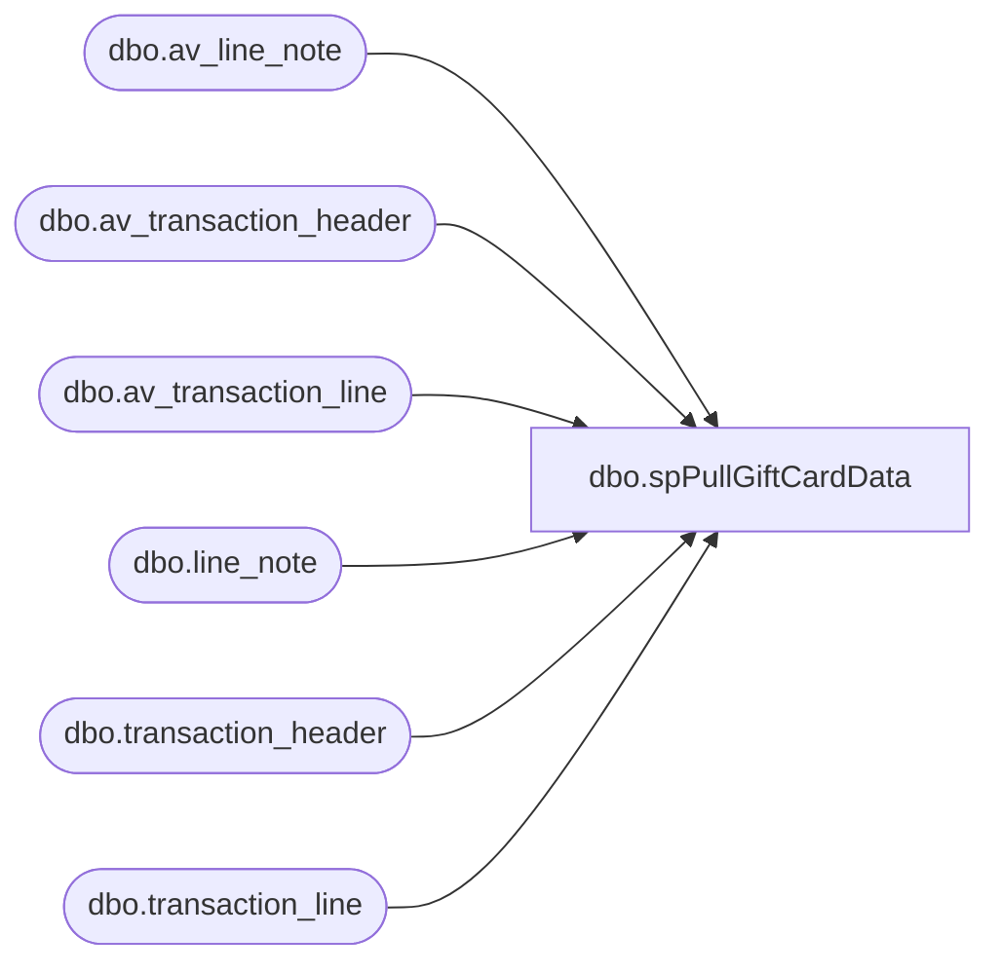

# dbo.spPullGiftCardData

**Database:** auditworks  
**Server:** bedrockdb01  

## Architecture Diagram



## Table Dependencies

| Referenced Table |
|---|
| dbo.av_line_note |
| dbo.av_transaction_header |
| dbo.av_transaction_line |
| dbo.line_note |
| dbo.transaction_header |
| dbo.transaction_line |

## Stored Procedure Code

```sql
CREATE PROCEDURE [dbo].[spPullGiftCardData]
AS
 
-- -- SET QUOTED_IDENTIFIER ON 
-- -- GO
-- -- SET ANSI_NULLS ON 
-- -- GO
 
set nocount off

/*
exec spPullGiftCardData

This was designed to pull giftcard information from auditworks
and compare it to what we found in the giftcard tables we loaded from 
the ValueLink ftp process.

This can be quite slow, so we should run during downtimes
*/

IF (Object_ID('tempdb..#tempme_header') IS NOT NULL) DROP TABLE #tempme_header
set nocount off
select av_transaction_id, store_no, transaction_date, entry_date_time, transaction_void_flag
into #tempme_header
from auditworks.dbo.av_transaction_header th
where 1=1
	and th.transaction_date >=  '12/01/2004'
create index ix_tempme_header_av_transaction_id on #tempme_header(av_transaction_id)

IF (Object_ID('tempdb..#tempme_line') IS NOT NULL) DROP TABLE #tempme_line
select 'av tables' wherefrom, th.store_no, th.transaction_date, th.entry_date_time, th.transaction_void_flag, tl.av_transaction_id transaction_id, tl.line_id, gross_line_amount, line_object, reference_type, voiding_reversal_flag, reference_no
into #tempme_line
from #tempme_header th
	join auditworks.dbo.av_transaction_line tl
	on tl.av_transaction_id = th.av_transaction_id 
where 1=1
	and reference_no is not null
	and tl.line_object IN (294,403,404) -- 294	Gift Card Re-Load
										-- 403	E-Certificates
										-- 404	BABW Gift Card
create index ix_tempme_line_transaction_id on #tempme_line(transaction_id)

IF (Object_ID('tempdb..#tempme_all') IS NOT NULL) DROP TABLE #tempme_all
select tl.*, line_note
into #tempme_all
from #tempme_line tl
	left join auditworks.dbo.av_line_note ln
	on ln.av_transaction_id = tl.transaction_id
	and ln.line_id = tl.line_id
where 1=1

-- *****************************************************************************************************

IF (Object_ID('tempdb..#tempme_header2') IS NOT NULL) DROP TABLE #tempme_header2
select transaction_id, store_no, transaction_date, entry_date_time, transaction_void_flag
into #tempme_header2
from auditworks.dbo.transaction_header th
where 1=1
	and th.transaction_date >=  '12/01/2004'
create index ix_tempme_header_transaction_id on #tempme_header2(transaction_id)
--441653 	:07
--250659 	:04

IF (Object_ID('tempdb..#tempme_line2') IS NOT NULL) DROP TABLE #tempme_line2
select 'nonav tables' wherefrom, th.store_no, th.transaction_date, th.entry_date_time, th.transaction_void_flag, tl.transaction_id, tl.line_id, gross_line_amount, line_object, reference_type, voiding_reversal_flag, reference_no
into #tempme_line2
from #tempme_header2 th
	join auditworks.dbo.transaction_line tl
	on tl.transaction_id = th.transaction_id 
where 1=1
	and reference_no is not null
	and tl.line_object IN (294,403,404) -- 294	Gift Card Re-Load
										-- 403	E-Certificates
										-- 404	BABW Gift Card
create index ix_tempme_line2_transaction_id on #tempme_line2(transaction_id)

IF (Object_ID('tempdb..#tempme_all2') IS NOT NULL) DROP TABLE #tempme_all2
select tl.*, line_note
into #tempme_all2
from #tempme_line2 tl
	left join auditworks.dbo.line_note ln
	on ln.transaction_id = tl.transaction_id
	and ln.line_id = tl.line_id
where 1=1

IF (Object_ID('tmp_dave_giftcards') IS NOT NULL) DROP TABLE tmp_dave_giftcards
set nocount on
select * 
into tmp_dave_giftcards
from #tempme_all
union
select * 
from #tempme_all2
```

