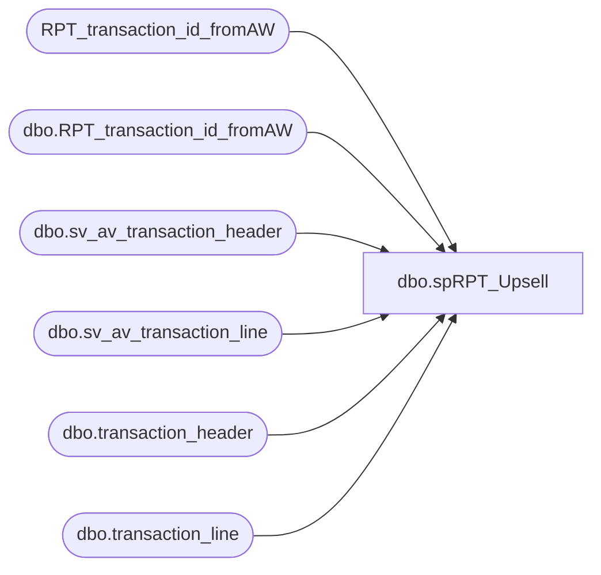

# dbo.spRPT_Upsell

**Database:** auditworks  
**Server:** bedrockdb01  

## Architecture Diagram



## Table Dependencies

| Referenced Table |
|---|
| RPT_transaction_id_fromAW |
| dbo.RPT_transaction_id_fromAW |
| dbo.sv_av_transaction_header |
| dbo.sv_av_transaction_line |
| dbo.transaction_header |
| dbo.transaction_line |

## Stored Procedure Code

```sql
CREATE procedure [dbo].[spRPT_Upsell]  
 @BeginDate datetime,  
 @EndDate datetime,  
 @GrossLineAmount int,  
 @LineObject int  
as  
/*************************************************  
Purpose:  Used to provide a list of transaction_id's  
  to be used with JacksFacts BusObj Universe  
  
Author:  Dan Morgan  
Created:  8/28/07  
Modified:  
--Name			Date			Change
--Garyd			08/26/2010		Initial version in source control.
  
Sample:  exec spRPT_Upsell @BeginDate = '7/2/07', @EndDate = '7/2/07', @GrossLineAmount = 10, @LineObject = 633  
**************************************************/  
  
/*  
declare   
 @BeginDate datetime,  
 @EndDate datetime,  
 @GrossLineAmount int,  
 @LineObject int  
  
set @BeginDate = '7/2/07'  
set @EndDate = '7/2/07'  
set @GrossLineAmount = 10  
set @LineObject = 633  
  
  
CREATE TABLE [dbo].[RPT_transaction_id_fromAW](  
 [transaction_id] [int] NOT NULL,  
 [use_field_y_n] [char](1) COLLATE SQL_Latin1_General_CP1_CI_AS NOT NULL CONSTRAINT [DF_RPT_transaction_id_fromAW_use_field_y_n]  DEFAULT ('Y')  
) ON [PRIMARY]  
  
  
GRANT UPDATE, INSERT, DELETE on dbo.RPT_transaction_id_fromAW to Public  
*/  
delete RPT_transaction_id_fromAW  
  
  
insert dbo.RPT_transaction_id_fromAW(transaction_id)  
SELECT DISTINCT b.transaction_id as Field_a   
FROM auditworks.dbo.sv_av_transaction_header a (nolock), auditworks.dbo.sv_av_transaction_line b (nolock)  
WHERE a.transaction_id=b.transaction_id   
    AND (a.transaction_void_flag = 0   
    AND a.transaction_date Between   @BeginDate and @EndDate  
    AND b.gross_line_amount IN (@GrossLineAmount)   
    AND b.line_object = @LineObject)  

UNION

SELECT DISTINCT b.transaction_id as Field_a   
FROM auditworks.dbo.transaction_header a (nolock), auditworks.dbo.transaction_line b (nolock)  
WHERE a.transaction_id=b.transaction_id   
    AND (a.transaction_void_flag = 0   
    AND a.transaction_date Between   @BeginDate and @EndDate  
    AND b.gross_line_amount IN (@GrossLineAmount)   
    AND b.line_object = @LineObject)
```

