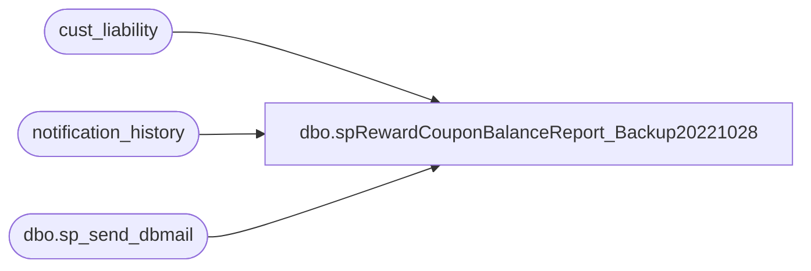

# dbo.spRewardCouponBalanceReport_Backup20221028

**Database:** auditworks  
**Server:** bedrockdb01  

## Architecture Diagram



## Table Dependencies

| Referenced Table |
|---|
| cust_liability |
| notification_history |
| dbo.sp_send_dbmail |

## Stored Procedure Code

```sql
--DROP PROC [dbo].[spRewardCouponBalanceReport]
--GO

CREATE PROCEDURE [dbo].[spRewardCouponBalanceReport]
-- =============================================================================================================
-- Name: [dbo].[spRewardCouponBalanceReport]
--
-- Description:	Provides BABW Reward Coupon counts and balances to Jeff Kimsey on a monthly basis via emails
--
-- Input: N/A
--
-- Output: N/A
--
-- Dependencies: N/A
--
-- Revision History
--		Name:			Date:			Comments:
--		Kelly Farrar	01/26/2017	    Created SP
--		Paul Beckman	01/17/2018	    Corrected job name in email body by removing 'BABW '
--		Paul Beckman	01/25/2018	    Adjust Period End Date check in to account for the added calendars 
--										and identify the active calendar
--		Paul Beckman	02/05/2018		Added CRMadmin@buildabear.com to CC on email
--		Paul Beckman	10/18/2019		Updated to use notification_history table
--		Paul Beckman	02/05/2020		Updated email profile to 'EntSysSupport'
--		
--
-- exec spRewardCouponBalanceReport
-- =============================================================================================================
AS
SET NOCOUNT ON

--IF (Object_ID('tempdb..##datematch') IS NOT NULL) DROP TABLE ##datematch
--SELECT CONVERT(varchar(10),DATEADD(DAY,-0,clp.END_DATE_TIME),120) AS Period_End_dates
----INTO ##datematch
--FROM CLNDR_PRD clp
--JOIN CRDM_PRMTRS cp ON clp.CLNDR_ID = cp.PRMTR_VAL_BIN
--WHERE clp.CLNDR_PRD_NAME LIKE 'Period%'
--AND CONVERT(varchar(10),DATEADD(DAY,-0,clp.END_DATE_TIME),120) = CONVERT(varchar(10),DATEADD(DAY,-0,getdate()),120)
--ORDER BY END_DATE_TIME

--IF (SELECT COUNT(*) FROM ##datematch) = 0
--GOTO FINISH

DECLARE @sql varchar(8000)
DECLARE @recipients varchar(4000)
DECLARE @Subject varchar(90)
DECLARE @query varchar(8000)
DECLARE @copy_recipients varchar(8000)
DECLARE @todaysdate VARCHAR(12)
DECLARE @text nvarchar(max)

DECLARE @result int

SET @todaysdate = CONVERT(varchar(12),GETDATE(),101)

SET @recipients = 'JeffK@buildabear.com'
SET @copy_recipients = 'EntSysSupport@buildabear.com'

--##########  USA COUNTS  ##########

IF (Object_ID('tempdb..##usavchrissued') IS NOT NULL) DROP TABLE ##usavchrissued
SELECT date_issued, COUNT(date_issued) AS Certs_Issued
INTO ##usavchrissued
FROM cust_liability (nolock)
WHERE  reference_type = 35  -- (30=Party Deposit, 31=Loyalty Rewards, 35=Serialized Coupons)
AND expiry_date IS NOT NULL
AND forfeited_flag = 0
AND issued_flag != 0
AND amount_3 != 0
AND title = 'RWD'
--AND ISNULL (country,'USA') IN ('USA','MEX')
AND ISNULL (country,'USA') NOT IN ('GBR' , 'CAN' , 'CAF') 
GROUP BY date_issued
ORDER BY date_issued

IF (Object_ID('tempdb..##usavchrremain') IS NOT NULL) DROP TABLE ##usavchrremain
SELECT date_issued, COUNT(date_issued) AS Certs_with_Balance , SUM(liability_amount) AS Remaining_Balance
--INTO ##usavchrremain
FROM cust_liability (nolock)
WHERE liability_amount = 10
AND reference_type = 35  -- (30=Party Deposit, 31=Loyalty Rewards, 35=Serialized Coupons)
AND expiry_date IS NOT NULL
AND forfeited_flag = 0
AND issued_flag != 0
AND amount_3 != 0
AND title = 'RWD'
--AND ISNULL (country,'USA') IN ('USA','MEX')
AND ISNULL (country,'USA') NOT IN ('GBR' , 'CAN' , 'CAF') 
GROUP BY date_issued
ORDER BY date_issued

IF (Object_ID('tempdb..##usabalresults') IS NOT NULL) DROP TABLE ##usabalresults
SELECT CONVERT(VARCHAR(10),##usavchrissued.date_issued,101) AS Date_Issued,Certs_Issued,Certs_with_Balance,SUM(Remaining_Balance) AS Remaining_Balance
INTO ##usabalresults
FROM ##usavchrissued JOIN ##usavchrremain
ON ##usavchrissued.date_issued = ##usavchrremain.date_issued
GROUP BY ##usavchrissued.date_issued,##usavchrissued.Certs_Issued,##usavchrremain.Certs_with_Balance
ORDER BY ##usavchrissued.date_issued

SET @text = 
				'<font face =arial size = 2>' +
				'BABW Reward Coupons counts and balances for USA as of ' + @todaysdate + '<br>' +
				'<br>' +
				'<table border="1">' + 
				'<font face =arial size = 2>' +
				'<tr bgcolor=#D5D5F7><th>Date Issued</th><th>Certs Issued</th><th>Certs with Balance</th><th>Remaining Balance</th><th>Redeemed</th></tr>' +
				CAST ( ( SELECT td = Date_Issued, '',
								[td/@align]='right',
								td = FORMAT(Certs_Issued,'#,###'), '',
								[td/@align]='right',
								td = FORMAT(Certs_with_Balance,'#,###'), '',
								[td/@align]='right',
								td = FORMAT(Remaining_Balance,'#,###.00'), '',
								[td/@align]='right',
								td = CONVERT(VARCHAR,CONVERT(DECIMAL(5,2),100 - 100.0 * Certs_with_Balance / Certs_Issued)) + '%', ''
					  FROM ##usabalresults
					  FOR xml path ('tr'), type
				) AS NVARCHAR(MAX) ) +
				'</table>' +
				'<font face =arial size = 1 color="#C0C0C0">' +
				'<br><br><br><br>' +
				'Server:  BEDROCKDB01 <br>' +
				'Job Name:  Reward Coupon Balance Report <br>' +
				'Stored Proc:  BEDROCKDB01.auditworks.dbo.spRewardCouponBalanceReport <br>' +
				'Created by:  Kelly Farrar <br>' +
				'Team Ownership:  Enterprise Systems <br>'

SET @Subject = 'BABW Reward Coupon counts and balances for USA as of ' + @todaysdate
	EXEC @result = msdb.dbo.sp_send_dbmail  
	@profile_name = 'EntSysSupport',
	@recipients = @recipients,
	@copy_recipients = @copy_recipients,
	@subject=@Subject, 
	@body = @text,
	@body_format = 'HTML'

SELECT @result
	
	INSERT INTO notification_history
	(stored_proc_name,
	record_logged_datetime,
	issues_found,
	action_required,
	notification_sent,
	email_type,
	email_to,
	email_cc,
	email_subject,
	comment
	)
	VALUES (
	'spRewardCouponBalanceReport', --<< Stored Proc name
	GETDATE(),
	'No', --<< Issues found - Yes / No
	'No', --<< Action required - Yes / No
	'Yes', --<< Notification sent - Yes / No
	'Notification Only', --<< Email type - Notification Only / Alert / Warning
	@recipients, --<< Email TO
	@copy_recipients, --<< Email CC
	@Subject, --<< Email Subject
	'BABW Reward Coupons counts and balances for USA' --<< Comment
	)

--##########  CAN COUNTS  ##########

IF (Object_ID('tempdb..##canvchrissued') IS NOT NULL) DROP TABLE ##canvchrissued
SELECT date_issued, COUNT(date_issued) AS Certs_Issued
INTO ##canvchrissued
FROM cust_liability (nolock)
WHERE  reference_type = 35  -- (30=Party Deposit, 31=Loyalty Rewards, 35=Serialized Coupons)
AND expiry_date IS NOT NULL
AND forfeited_flag = 0
AND issued_flag != 0
AND amount_3 != 0
AND title = 'RWD'
AND country IN ('CAN','CAF')
GROUP BY date_issued
ORDER BY date_issued

IF (Object_ID('tempdb..##canvchrremain') IS NOT NULL) DROP TABLE ##canvchrremain
SELECT date_issued, COUNT(date_issued) AS Certs_with_Balance , SUM(liability_amount) AS Remaining_Balance
INTO ##canvchrremain
FROM cust_liability (nolock)
WHERE liability_amount = 10
AND reference_type = 35  -- (30=Party Deposit, 31=Loyalty Rewards, 35=Serialized Coupons)
AND expiry_date IS NOT NULL
AND forfeited_flag = 0
AND issued_flag != 0
AND amount_3 != 0
AND title = 'RWD'
AND country IN ('CAN','CAF')
GROUP BY date_issued
ORDER BY date_issued

IF (Object_ID('tempdb..##canbalresults') IS NOT NULL) DROP TABLE ##canbalresults
SELECT CONVERT(VARCHAR(10),##canvchrissued.date_issued,101) AS Date_Issued,Certs_Issued,Certs_with_Balance,SUM(Remaining_Balance) AS Remaining_Balance
INTO ##canbalresults
FROM ##canvchrissued JOIN ##canvchrremain
ON ##canvchrissued.date_issued = ##canvchrremain.date_issued
GROUP BY ##canvchrissued.date_issued,##canvchrissued.Certs_Issued,##canvchrremain.Certs_with_Balance
ORDER BY ##canvchrissued.date_issued

SET @text = 
				'<font face =arial size = 2>' +
				'BABW Reward Coupon counts and balances for CAN as of ' + @todaysdate + '<br>' +
				'<br>' +
				'<table border="1">' + 
				'<font face =arial size = 2>' +
				'<tr bgcolor=#D5D5F7><th>Date Issued</th><th>Certs Issued</th><th>Certs with Balance</th><th>Remaining Balance</th><th>Redeemed</th></tr>' +
				CAST ( ( SELECT td = Date_Issued, '',
								[td/@align]='right',
								td = FORMAT(Certs_Issued,'#,###'), '',
								[td/@align]='right',
								td = FORMAT(Certs_with_Balance,'#,###'), '',
								[td/@align]='right',
								td = FORMAT(Remaining_Balance,'#,###.00'), '',
								[td/@align]='right',
								td = CONVERT(VARCHAR,CONVERT(DECIMAL(5,2),100 - 100.0 * Certs_with_Balance / Certs_Issued)) + '%', ''
					  FROM ##canbalresults
					  FOR xml path ('tr'), type
				) AS NVARCHAR(MAX) ) +
				'</table>' +
				'<font face =arial size = 1 color="#C0C0C0">' +
				'<br><br><br><br>' +
				'Server:  BEDROCKDB01 <br>' +
				'Job Name:  Reward Coupon Balance Report <br>' +
				'Stored Proc:  BEDROCKDB01.auditworks.dbo.spRewardCouponBalanceReport <br>' +
				'Created by:  Kelly Farrar <br>' +
				'Team Ownership:  Enterprise Systems <br>'


SET @Subject = 'BABW Reward Coupon counts and balances for CAN as of ' + @todaysdate
	EXEC @result =  msdb.dbo.sp_send_dbmail  
	@profile_name = 'EntSysSupport',
	@recipients = @recipients,
	@copy_recipients = @copy_recipients,
	@subject=@Subject, 
	@body = @text,
	@body_format = 'HTML'

	SELECT @result
	
	INSERT INTO notification_history
	(stored_proc_name,
	record_logged_datetime,
	issues_found,
	action_required,
	notification_sent,
	email_type,
	email_to,
	email_cc,
	email_subject,
	comment
	)
	VALUES (
	'spRewardCouponBalanceReport', --<< Stored Proc name
	GETDATE(),
	'No', --<< Issues found - Yes / No
	'No', --<< Action required - Yes / No
	'Yes', --<< Notification sent - Yes / No
	'Notification Only', --<< Email type - Notification Only / Alert / Warning
	@recipients, --<< Email TO
	@copy_recipients, --<< Email CC
	@Subject, --<< Email Subject
	'BABW Reward Coupons counts and balances for CAN' --<< Comment
	)

--##########  GBR COUNTS  ##########

IF (Object_ID('tempdb..##gbrvchrissued') IS NOT NULL) DROP TABLE ##gbrvchrissued
SELECT date_issued, COUNT(date_issued) AS Certs_Issued
INTO ##gbrvchrissued
FROM cust_liability (nolock)
WHERE  reference_type = 35  -- (30=Party Deposit, 31=Loyalty Rewards, 35=Serialized Coupons)
AND expiry_date IS NOT NULL
AND forfeited_flag = 0
AND issued_flag != 0
AND amount_3 != 0
AND title = 'RWD'
AND country = 'GBR'
GROUP BY date_issued
ORDER BY date_issued

IF (Object_ID('tempdb..##gbrvchrremain') IS NOT NULL) DROP TABLE ##gbrvchrremain
SELECT date_issued, COUNT(date_issued) AS Certs_with_Balance , SUM(liability_amount) AS Remaining_Balance
INTO ##gbrvchrremain
FROM cust_liability (nolock)
WHERE liability_amount = 5
AND reference_type = 35  -- (30=Party Deposit, 31=Loyalty Rewards, 35=Serialized Coupons)
AND expiry_date IS NOT NULL
AND forfeited_flag = 0
AND issued_flag != 0
AND amount_3 != 0
AND title = 'RWD'
AND country = 'GBR'
GROUP BY date_issued
ORDER BY date_issued

IF (Object_ID('tempdb..##gbrbalresults') IS NOT NULL) DROP TABLE ##gbrbalresults
SELECT CONVERT(VARCHAR(10),##gbrvchrissued.date_issued,101) AS Date_Issued,Certs_Issued,Certs_with_Balance,SUM(Remaining_Balance) AS Remaining_Balance
INTO ##gbrbalresults
FROM ##gbrvchrissued JOIN ##gbrvchrremain
ON ##gbrvchrissued.date_issued = ##gbrvchrremain.date_issued
GROUP BY ##gbrvchrissued.date_issued,##gbrvchrissued.Certs_Issued,##gbrvchrremain.Certs_with_Balance
ORDER BY ##gbrvchrissued.date_issued

SET @text = 
				'<font face =arial size = 2>' +
				'BABW Reward Coupon counts and balances for GBR as of ' + @todaysdate + '<br>' +
				'<br>' +
				'<table border="1">' + 
				'<font face =arial size = 2>' +
				'<tr bgcolor=#D5D5F7><th>Date Issued</th><th>Certs Issued</th><th>Certs with Balance</th><th>Remaining Balance</th><th>Redeemed</th></tr>' +
				CAST ( ( SELECT td = Date_Issued, '',
								[td/@align]='right',
								td = FORMAT(Certs_Issued,'#,###'), '',
								[td/@align]='right',
								td = FORMAT(Certs_with_Balance,'#,###'), '',
								[td/@align]='right',
								td = FORMAT(Remaining_Balance,'#,###.00'), '',
								[td/@align]='right',
								td = CONVERT(VARCHAR,CONVERT(DECIMAL(5,2),100 - 100.0 * Certs_with_Balance / Certs_Issued)) + '%', ''
					  FROM ##gbrbalresults
					  FOR xml path ('tr'), type
				) AS NVARCHAR(MAX) ) +
				'</table>' +
				'<font face =arial size = 1 color="#C0C0C0">' +
				'<br><br><br><br>' +
				'Server:  BEDROCKDB01 <br>' +
				'Job Name:  Reward Coupon Balance Report <br>' +
				'Stored Proc:  BEDROCKDB01.auditworks.dbo.spRewardCouponBalanceReport <br>' +
				'Created by:  Kelly Farrar <br>' +
				'Team Ownership:  Enterprise Systems <br>'


SET @Subject = 'BABW Reward Coupon counts and balances for GBR as of ' + @todaysdate
	EXEC @result =  msdb.dbo.sp_send_dbmail  
	@profile_name = 'EntSysSupport',
	@recipients = @recipients,
	@copy_recipients = @copy_recipients,
	@subject=@Subject, 
	@body = @text,
	@body_format = 'HTML'

	SELECT @result
	
	INSERT INTO notification_history
	(stored_proc_name,
	record_logged_datetime,
	issues_found,
	action_required,
	notification_sent,
	email_type,
	email_to,
	email_cc,
	email_subject,
	comment
	)
	VALUES (
	'spRewardCouponBalanceReport', --<< Stored Proc name
	GETDATE(),
	'No', --<< Issues found - Yes / No
	'No', --<< Action required - Yes / No
	'Yes', --<< Notification sent - Yes / No
	'Notification Only', --<< Email type - Notification Only / Alert / Warning
	@recipients, --<< Email TO
	@copy_recipients, --<< Email CC
	@Subject, --<< Email Subject
	'BABW Reward Coupons counts and balances for GBR' --<< Comment
	)

FINISH:
```

