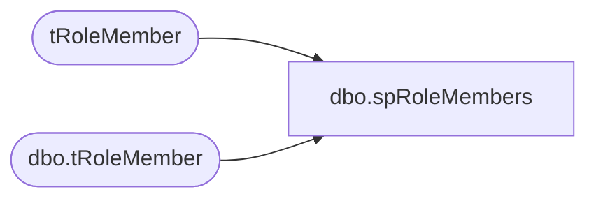

# dbo.spRoleMembers

**Database:** auditworks  
**Server:** bedrockdb01  

## Architecture Diagram



## Table Dependencies

| Referenced Table |
|---|
| tRoleMember |
| dbo.tRoleMember |

## Stored Procedure Code

```sql
CREATE PROCEDURE [dbo].[spRoleMembers]
AS
-- ***********************************************************
--    Creation Date: 04/28/02    Created By: Randy Dyess
--                               Web Site: www.TransactSQL.Com
--                               Email: RandyDyess@TransactSQL.Com
--    Purpose: Loops through all databases and obtains member
--    for database roles as well as server role members.
--    Location: master database
--    Output Parameters: None
--    Return Status: None
--    Called By: None       
--    Calls: None
--    Data Modifications: None
--    Updates:     
--    Name			Date			Change
--	  GaryD			08/26/2010		Initial version is source control
--   
-- ***********************************************************
SET NOCOUNT ON

--Variables
DECLARE @lngCounter INTEGER
DECLARE @strDBName VARCHAR(50)
DECLARE @strSQL NVARCHAR(4000)

--Temp table to hold database and user-define role user names
CREATE TABLE #tRoleMember
(
strServerName VARCHAR(50) DEFAULT @@SERVERNAME
,strDBName VARCHAR(50)
,strRoleName VARCHAR(50)
,strUserName VARCHAR(50)
,strUserID VARCHAR(100)
)

--Temp table to hold database names
CREATE TABLE #tDBNames
(lngID INTEGER IDENTITY(1,1)
,strDBName VARCHAR(50)
)

--Create permanent table
IF OBJECT_ID ('dbo.tRoleMember') IS NULL
BEGIN
CREATE TABLE dbo.tRoleMember
(
strServerName VARCHAR(50)
,strDBName VARCHAR(50)
,strRoleName VARCHAR(50)
,strUserName VARCHAR(50)
,strUserID VARCHAR(100)
)
END
TRUNCATE table dbo.tRoleMember

--Obtain members of each server role
INSERT INTO #tRoleMember (strRoleName, strUserName, strUserID)
EXEC dbo.sp_helpsrvrolemember

--Obtain database names
INSERT INTO #tDBNames (strDBName)
SELECT name FROM master.dbo.sysdatabases
SET @lngCounter = @@ROWCOUNT

--Loop through databases to obtain members of database roles and user-defined roles
WHILE @lngCounter > 0
BEGIN

--Get database name from temp table
SET @strDBName = (SELECT strDBName FROM #tDBNames WHERE lngID = @lngCounter)

--Obtain members of each database and user-defined role
SET @strSQL = 'INSERT INTO #tRoleMember (strRoleName, strUserName, strUserID)
EXEC ' + @strDBName + '.dbo.sp_helprolemember'

EXEC sp_executesql @strSQL

--Update database name in temp table
UPDATE #tRoleMember
SET strDBName = @strDBName
WHERE strDBName IS NULL

SET @lngCounter = @lngCounter - 1

END

--Place data into permanent table
INSERT INTO tRoleMember
SELECT trm.* FROM #tRoleMember trm
LEFT JOIN tRoleMember prm
ON trm.strUserName = prm.strUserName
AND trm.strDBName = prm.strDBName
AND trm.strRoleName = prm.strRoleName
AND trm.strServerName = prm.strServerName
WHERE prm.strServerName IS NULL
```

