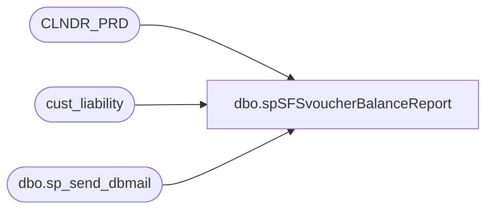

# dbo.spSFSvoucherBalanceReport

**Database:** auditworks  
**Server:** bedrockdb01  

## Architecture Diagram



## Table Dependencies

| Referenced Table |
|---|
| CLNDR_PRD |
| cust_liability |
| dbo.sp_send_dbmail |

## Stored Procedure Code

```sql
--DROP PROC [dbo].[spSFSvoucherBalanceReport]
--GO

CREATE PROC [dbo].[spSFSvoucherBalanceReport]
-- =============================================================================================================
-- Name: [dbo].[spSFSvoucherBalanceReport]
--
-- Description:	Provides SFS voucher counts and balances to Jack McCormick on a monthly basis via emails
--
-- Input: N/A
--
-- Output: N/A
--
-- Dependencies: N/A
--
-- Revision History
--		Name:			Date:			Comments:
--		Paul Beckman	07/20/2011		Created SP
--		Paul Beckman	08/02/2011		Added redeemed percentage for Jack M
--		Paul Beckman	04/30/2012		Updated to seperate USA & CAN from GBR per request of Jack M
--		Paul Beckman	01/16/2013		Updated to seperate CAN from USA and include NULL country values as USA
--										per request of Jack M
--		Paul Beckman	04/15/2014		Added JeffK@buildabear.com to recipients per request of Jack M	
--		Paul Beckman	07/19/2015		Updated from POSDBSSA to BEDROCKDB01
--		Paul Beckman	08/31/2016		Updated profile_name from 'POSadmin' to 'SAAdmin'
--		Paul Beckman	01/17/2017		Updated Alert email body to HTML
--		Paul Beckman	01/25/2017		Removed jeffa@buildabear.com from copy_recipients
--
-- exec spSFSvoucherBalanceReport
-- =============================================================================================================
AS
SET NOCOUNT ON

IF (Object_ID('tempdb..##datematch') IS NOT NULL) DROP TABLE ##datematch
SELECT CONVERT(varchar(10),DATEADD(DAY,-0,END_DATE_TIME),120) AS Period_End_dates
INTO ##datematch
FROM CLNDR_PRD
WHERE CLNDR_PRD_NAME LIKE 'Period%'
AND CONVERT(varchar(10),DATEADD(DAY,-0,END_DATE_TIME),120) = CONVERT(varchar(10),DATEADD(DAY,-0,getdate()),120)
ORDER BY END_DATE_TIME

IF (SELECT COUNT(*) FROM ##datematch) = 0
GOTO FINISH

DECLARE @sql varchar(8000)
DECLARE @recipients varchar(4000)
DECLARE @Subject varchar(90)
DECLARE @query varchar(8000)
DECLARE @copy_recipients varchar(8000)
DECLARE @todaysdate VARCHAR(12)
DECLARE @text nvarchar(max)

SET @todaysdate = CONVERT(varchar(12),GETDATE(),101)

--SET @recipients = 'paulb@buildabear.com'
SET @recipients = 'JeffK@buildabear.com'
SET @copy_recipients = 'SAAdmin@buildabear.com'


--##########  USA COUNTS  ##########

IF (Object_ID('tempdb..##usavchrissued') IS NOT NULL) DROP TABLE ##usavchrissued
SELECT date_issued, COUNT(date_issued) AS Certs_Issued
INTO ##usavchrissued
FROM cust_liability (nolock)
WHERE  reference_type = 31  -- (30=Party Deposit, 31=Loyalty Rewards, 35=Serialized Coupons)
AND expiry_date IS NOT NULL
AND forfeited_flag = 0
AND issued_flag != 0
AND amount_3 != 0
AND date_issued <> '2010-12-12' --<< This excludes the certs that were created for plus up
AND reference_no NOT LIKE '0123456789%'
AND reference_no NOT LIKE '0100000%'
AND ISNULL (country,'USA') IN ('USA','MEX')
GROUP BY date_issued
ORDER BY date_issued

IF (Object_ID('tempdb..##usavchrremain') IS NOT NULL) DROP TABLE ##usavchrremain
SELECT date_issued, COUNT(date_issued) AS Certs_with_Balance , SUM(liability_amount) AS Remaining_Balance
INTO ##usavchrremain
FROM cust_liability (nolock)
WHERE liability_amount > 0
AND reference_type = 31  -- (30=Party Deposit, 31=Loyalty Rewards, 35=Serialized Coupons)
AND expiry_date IS NOT NULL
AND forfeited_flag = 0
AND issued_flag != 0
AND amount_3 != 0
AND date_issued <> '2010-12-12' --<< This excludes the certs that were created for plus up
AND reference_no NOT LIKE '0123456789%'
AND reference_no NOT LIKE '0100000%'
AND ISNULL (country,'USA') IN ('USA','MEX')
GROUP BY date_issued
ORDER BY date_issued

IF (Object_ID('tempdb..##usabalresults') IS NOT NULL) DROP TABLE ##usabalresults
SELECT CONVERT(VARCHAR(10),##usavchrissued.date_issued,101) AS Date_Issued,Certs_Issued,Certs_with_Balance,SUM(Remaining_Balance) AS Remaining_Balance
INTO ##usabalresults
FROM ##usavchrissued JOIN ##usavchrremain
ON ##usavchrissued.date_issued = ##usavchrremain.date_issued
GROUP BY ##usavchrissued.date_issued,##usavchrissued.Certs_Issued,##usavchrremain.Certs_with_Balance
ORDER BY ##usavchrissued.date_issued

SET @text = 
				'<font face =arial size = 2>' +
				'SFS Voucher counts and balances for USA as of ' + @todaysdate + '<br>' +
				'<br>' +
				'<table border="1">' + 
				'<font face =arial size = 2>' +
				'<tr bgcolor=#D5D5F7><th>Date Issued</th><th>Certs Issued</th><th>Certs with Balance</th><th>Remaining Balance</th><th>Redeemed</th></tr>' +
				CAST ( ( SELECT td = Date_Issued, '',
								[td/@align]='right',
								td = FORMAT(Certs_Issued,'#,###'), '',
								[td/@align]='right',
								td = FORMAT(Certs_with_Balance,'#,###'), '',
								[td/@align]='right',
								td = FORMAT(Remaining_Balance,'#,###.00'), '',
								[td/@align]='right',
								td = CONVERT(VARCHAR,CONVERT(DECIMAL(5,2),100 - 100.0 * Certs_with_Balance / Certs_Issued)) + '%', ''
					  FROM ##usabalresults
					  FOR xml path ('tr'), type
				) AS NVARCHAR(MAX) ) +
				'</table>' +
				'<font face =arial size = 1>' +
				'<br><br><br><br>' +
				'Server:  BEDROCKDB01 <br>' +
				'Job Name:  SFS Cert Balance Report <br>' +
				'Stored Proc:  BEDROCKDB01.auditworks.dbo.spSFSvoucherBalanceReport <br>' +
				'Created by:  Paul Beckman <br>' +
				'Team Ownership:  SAadmin <br>'

/*
SET @query = 
'
SET NOCOUNT ON
PRINT ''SFS Voucher counts and balances for USA as of '' + '''+@todaysdate+'''
PRINT ''''
SELECT Date_Issued,''  '',Certs_Issued,''  '',Certs_with_Balance,''  '',CONVERT(DECIMAL(12,2),Remaining_Balance) AS Remaining_Balance,''  '',CONVERT(VARCHAR,CONVERT(DECIMAL(5,2),100 - 100.0 * Certs_with_Balance / Certs_Issued)) + ''%'' AS Redeemed  FROM ##usabalresults
PRINT ''''
PRINT ''#################################''
PRINT ''''
PRINT ''''
PRINT ''''
PRINT ''Server:  BEDROCKDB01''
PRINT ''Job-Name:  SFS Cert Balance Report''
PRINT ''Stored Proc:  BEDROCKDB01.auditworks.dbo.spSFSvoucherBalanceReport''
PRINT ''Created by:  Paul Beckman''
PRINT ''Team Ownership:  SAadmin''
'
*/

SET @Subject = 'SFS Voucher counts and balances for USA as of ' + @todaysdate
	EXEC msdb.dbo.sp_send_dbmail  
	@profile_name = 'SAAdmin',
	@recipients = @recipients,
	@copy_recipients = @copy_recipients,
	@subject=@Subject, 
	@body = @text,
	@body_format = 'HTML'

--##########  CAN COUNTS  ##########

IF (Object_ID('tempdb..##canvchrissued') IS NOT NULL) DROP TABLE ##canvchrissued
SELECT date_issued, COUNT(date_issued) AS Certs_Issued
INTO ##canvchrissued
FROM cust_liability (nolock)
WHERE  reference_type = 31  -- (30=Party Deposit, 31=Loyalty Rewards, 35=Serialized Coupons)
AND expiry_date IS NOT NULL
AND forfeited_flag = 0
AND issued_flag != 0
AND amount_3 != 0
AND date_issued <> '2010-12-12' --<< This excludes the certs that were created for plus up
AND reference_no NOT LIKE '0123456789%'
AND reference_no NOT LIKE '0100000%'
AND country IN ('CAN','CAF')
GROUP BY date_issued
ORDER BY date_issued

IF (Object_ID('tempdb..##canvchrremain') IS NOT NULL) DROP TABLE ##canvchrremain
SELECT date_issued, COUNT(date_issued) AS Certs_with_Balance , SUM(liability_amount) AS Remaining_Balance
INTO ##canvchrremain
FROM cust_liability (nolock)
WHERE liability_amount > 0
AND reference_type = 31  -- (30=Party Deposit, 31=Loyalty Rewards, 35=Serialized Coupons)
AND reference_no NOT LIKE '0123456789%'
AND reference_no NOT LIKE '0100000%'
AND expiry_date IS NOT NULL
AND forfeited_flag = 0
AND issued_flag != 0
AND amount_3 != 0
AND date_issued <> '2010-12-12' --<< This excludes the certs that were created for plus up
AND country IN ('CAN','CAF')
GROUP BY date_issued
ORDER BY date_issued

IF (Object_ID('tempdb..##canbalresults') IS NOT NULL) DROP TABLE ##canbalresults
SELECT CONVERT(VARCHAR(10),##canvchrissued.date_issued,101) AS Date_Issued,Certs_Issued,Certs_with_Balance,SUM(Remaining_Balance) AS Remaining_Balance
INTO ##canbalresults
FROM ##canvchrissued JOIN ##canvchrremain
ON ##canvchrissued.date_issued = ##canvchrremain.date_issued
GROUP BY ##canvchrissued.date_issued,##canvchrissued.Certs_Issued,##canvchrremain.Certs_with_Balance
ORDER BY ##canvchrissued.date_issued

SET @text = 
				'<font face =arial size = 2>' +
				'SFS Voucher counts and balances for CAN as of ' + @todaysdate + '<br>' +
				'<br>' +
				'<table border="1">' + 
				'<font face =arial size = 2>' +
				'<tr bgcolor=#D5D5F7><th>Date Issued</th><th>Certs Issued</th><th>Certs with Balance</th><th>Remaining Balance</th><th>Redeemed</th></tr>' +
				CAST ( ( SELECT td = Date_Issued, '',
								[td/@align]='right',
								td = FORMAT(Certs_Issued,'#,###'), '',
								[td/@align]='right',
								td = FORMAT(Certs_with_Balance,'#,###'), '',
								[td/@align]='right',
								td = FORMAT(Remaining_Balance,'#,###.00'), '',
								[td/@align]='right',
								td = CONVERT(VARCHAR,CONVERT(DECIMAL(5,2),100 - 100.0 * Certs_with_Balance / Certs_Issued)) + '%', ''
					  FROM ##canbalresults
					  FOR xml path ('tr'), type
				) AS NVARCHAR(MAX) ) +
				'</table>' +
				'<font face =arial size = 1>' +
				'<br><br><br><br>' +
				'Server:  BEDROCKDB01 <br>' +
				'Job Name:  SFS Cert Balance Report <br>' +
				'Stored Proc:  BEDROCKDB01.auditworks.dbo.spSFSvoucherBalanceReport <br>' +
				'Created by:  Paul Beckman <br>' +
				'Team Ownership:  SAadmin <br>'

/*
SET @query = 
'
SET NOCOUNT ON
PRINT ''SFS Voucher counts and balances for CAN as of '' + '''+@todaysdate+'''
PRINT ''''
SELECT Date_Issued,''  '',Certs_Issued,''  '',Certs_with_Balance,''  '',CONVERT(DECIMAL(12,2),Remaining_Balance) AS Remaining_Balance,''  '',CONVERT(VARCHAR,CONVERT(DECIMAL(5,2),100 - 100.0 * Certs_with_Balance / Certs_Issued)) + ''%'' AS Redeemed  FROM ##canbalresults
PRINT ''''
PRINT ''#################################''
PRINT ''''
PRINT ''''
PRINT ''''
PRINT ''Server:  BEDROCKDB01''
PRINT ''Job-Name:  SFS Cert Balance Report''
PRINT ''Stored Proc:  BEDROCKDB01.auditworks.dbo.spSFSvoucherBalanceReport''
PRINT ''Created by:  Paul Beckman''
PRINT ''Team Ownership:  SAadmin''
'
*/

SET @Subject = 'SFS Voucher counts and balances for CAN as of ' + @todaysdate
	EXEC msdb.dbo.sp_send_dbmail  
	@profile_name = 'SAAdmin',
	@recipients = @recipients,
	@copy_recipients = @copy_recipients,
	@subject=@Subject, 
	@body = @text,
	@body_format = 'HTML'

--##########  GBR COUNTS  ##########

IF (Object_ID('tempdb..##gbrvchrissued') IS NOT NULL) DROP TABLE ##gbrvchrissued
SELECT date_issued, COUNT(date_issued) AS Certs_Issued
INTO ##gbrvchrissued
FROM cust_liability (nolock)
WHERE  reference_type = 31  -- (30=Party Deposit, 31=Loyalty Rewards, 35=Serialized Coupons)
AND expiry_date IS NOT NULL
AND forfeited_flag = 0
AND issued_flag != 0
AND amount_3 != 0
AND date_issued <> '2010-12-12' --<< This excludes the certs that were created for plus up
AND reference_no NOT LIKE '0123456789%'
AND reference_no NOT LIKE '0100000%'
AND country = 'GBR'
GROUP BY date_issued
ORDER BY date_issued

IF (Object_ID('tempdb..##gbrvchrremain') IS NOT NULL) DROP TABLE ##gbrvchrremain
SELECT date_issued, COUNT(date_issued) AS Certs_with_Balance , SUM(liability_amount) AS Remaining_Balance
INTO ##gbrvchrremain
FROM cust_liability (nolock)
WHERE liability_amount > 0
AND reference_type = 31  -- (30=Party Deposit, 31=Loyalty Rewards, 35=Serialized Coupons)
AND expiry_date IS NOT NULL
AND forfeited_flag = 0
AND issued_flag != 0
AND amount_3 != 0
AND date_issued <> '2010-12-12' --<< This excludes the certs that were created for plus up
AND reference_no NOT LIKE '0123456789%'
AND reference_no NOT LIKE '0100000%'
AND country = 'GBR'
GROUP BY date_issued
ORDER BY date_issued

IF (Object_ID('tempdb..##gbrbalresults') IS NOT NULL) DROP TABLE ##gbrbalresults
SELECT CONVERT(VARCHAR(10),##gbrvchrissued.date_issued,101) AS Date_Issued,Certs_Issued,Certs_with_Balance,SUM(Remaining_Balance) AS Remaining_Balance
INTO ##gbrbalresults
FROM ##gbrvchrissued JOIN ##gbrvchrremain
ON ##gbrvchrissued.date_issued = ##gbrvchrremain.date_issued
GROUP BY ##gbrvchrissued.date_issued,##gbrvchrissued.Certs_Issued,##gbrvchrremain.Certs_with_Balance
ORDER BY ##gbrvchrissued.date_issued

SET @text = 
				'<font face =arial size = 2>' +
				'SFS Voucher counts and balances for GBR as of ' + @todaysdate + '<br>' +
				'<br>' +
				'<table border="1">' + 
				'<font face =arial size = 2>' +
				'<tr bgcolor=#D5D5F7><th>Date Issued</th><th>Certs Issued</th><th>Certs with Balance</th><th>Remaining Balance</th><th>Redeemed</th></tr>' +
				CAST ( ( SELECT td = Date_Issued, '',
								[td/@align]='right',
								td = FORMAT(Certs_Issued,'#,###'), '',
								[td/@align]='right',
								td = FORMAT(Certs_with_Balance,'#,###'), '',
								[td/@align]='right',
								td = FORMAT(Remaining_Balance,'#,###.00'), '',
								[td/@align]='right',
								td = CONVERT(VARCHAR,CONVERT(DECIMAL(5,2),100 - 100.0 * Certs_with_Balance / Certs_Issued)) + '%', ''
					  FROM ##gbrbalresults
					  FOR xml path ('tr'), type
				) AS NVARCHAR(MAX) ) +
				'</table>' +
				'<font face =arial size = 1>' +
				'<br><br><br><br>' +
				'Server:  BEDROCKDB01 <br>' +
				'Job Name:  SFS Cert Balance Report <br>' +
				'Stored Proc:  BEDROCKDB01.auditworks.dbo.spSFSvoucherBalanceReport <br>' +
				'Created by:  Paul Beckman <br>' +
				'Team Ownership:  SAadmin <br>'

/*
SET @query = 
'
SET NOCOUNT ON
PRINT ''SFS Voucher counts and balances for GBR as of '' + '''+@todaysdate+'''
PRINT ''''
SELECT Date_Issued,''  '',Certs_Issued,''  '',Certs_with_Balance,''  '',CONVERT(DECIMAL(12,2),Remaining_Balance) AS Remaining_Balance,''  '',CONVERT(VARCHAR,CONVERT(DECIMAL(5,2),100 - 100.0 * Certs_with_Balance / Certs_Issued)) + ''%'' AS Redeemed  FROM ##gbrbalresults
PRINT ''''
PRINT ''#################################''
PRINT ''''
PRINT ''''
PRINT ''''
PRINT ''Server:  BEDROCKDB01''
PRINT ''Job-Name:  SFS Cert Balance Report''
PRINT ''Stored Proc:  BEDROCKDB01.auditworks.dbo.spSFSvoucherBalanceReport''
PRINT ''Created by:  Paul Beckman''
PRINT ''Team Ownership:  SAadmin''
'
*/

SET @Subject = 'SFS Voucher counts and balances for GBR as of ' + @todaysdate
	EXEC msdb.dbo.sp_send_dbmail  
	@profile_name = 'SAAdmin',
	@recipients = @recipients,
	@copy_recipients = @copy_recipients,
	@subject=@Subject, 
	@body = @text,
	@body_format = 'HTML'


FINISH:
```

