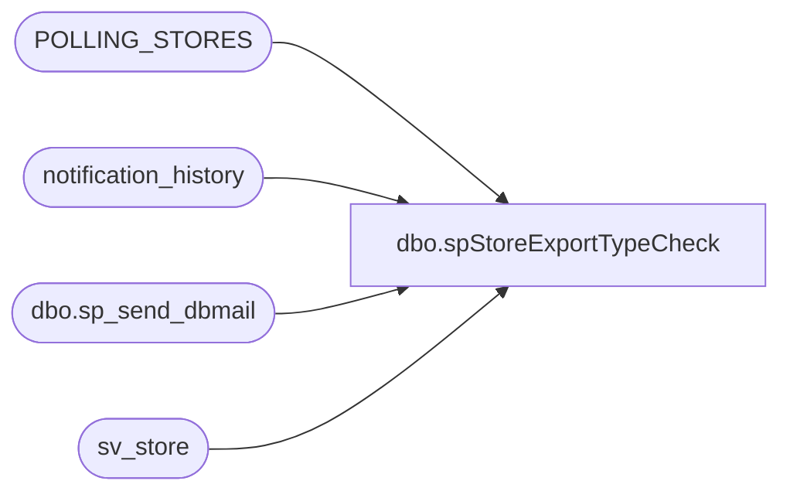

# dbo.spStoreExportTypeCheck

**Database:** auditworks  
**Server:** bedrockdb01  

## Architecture Diagram



## Table Dependencies

| Referenced Table |
|---|
| POLLING_STORES |
| notification_history |
| dbo.sp_send_dbmail |
| sv_store |

## Stored Procedure Code

```sql
--DROP PROC [dbo].[spStoreExportTypeCheck]
--GO

CREATE PROC [dbo].[spStoreExportTypeCheck]
-- =============================================================================================================
-- Name: [dbo].[spStoreExportTypeCheck]
--
-- Description:	Checks for stores export type that is set to NOT USED & notifies via email accordingly
--				This export type in the store setup in SA CRDM affects if and how the store transactions are
--				exported for CRM.
--
--
-- Output: N/A
--
-- Dependencies: 
--
-- Revision History
--		Name:			Date:			Comments:
--		Paul Beckman	02/18/2011		Created SP
--		Paul Beckman	03/10/2015		Updated iStoreID < from 2099 to 2400 to include DNK
--		Paul Beckman	09/19/2016		Updated email send profile and recipients
--		Paul Beckman	01/17/2017		Updated Alert email body to HTML
--		Paul Beckman	01/11/2018		Changed Job Name text in message body of email 
--										from Store_Export_Type_Check to Store_Setup_Checks
--		Paul Beckman	03/22/2019		Added LisaM@buildabear.com to email notification
--		Paul Beckman	04/08/2019		Replaced ronw@buildabear.com with DawnGo@buildabear.com
--		Paul Beckman	07/23/2019		Updated script to use POLLING_STORES table instead of kodiak.tblStore
--		Paul Beckman	10/18/2019		Updated to use notification_history table
--		Paul Beckman	02/05/2020		Updated email profile to 'EntSysSupport'
--
--
-- exec spStoreExportTypeCheck
-- =============================================================================================================
AS
SET NOCOUNT ON


--####################################################

IF (Object_ID('tempdb..##StoresList') IS NOT NULL) DROP TABLE ##StoresList

SELECT a.STORE_NUM
INTO ##StoresList
FROM POLLING_STORES a
WHERE a.STORE_NUM NOT IN (SELECT a.STORE_NUM FROM POLLING_STORES a
LEFT JOIN sv_store b ON a.STORE_NUM = b.store_no
WHERE store_export_code = 'S'
)
AND a.CLOSED_DATE IS NULL
AND a.STORE_NUM NOT IN (470)
AND a.STORE_BRAND IN ('Workshop')
AND a.OPEN_DATE <= DATEADD(day,+7,GETDATE())


--####################################################

IF (SELECT COUNT(*) FROM ##StoresList) = 0
GOTO FINISH

begin

DECLARE @sql VARCHAR(8000)
DECLARE @recipients VARCHAR(4000)
DECLARE @copy_recipients VARCHAR(4000)
DECLARE @Subject VARCHAR(80)
DECLARE @query VARCHAR(8000)
declare @text nvarchar(max)

--SET @recipients = 'paulb@buildabear.com'
SET @recipients = 'ScottP@buildabear.com;LisaM@buildabear.com;DawnGo@buildabear.com;lindak@buildabear.com'
SET @copy_recipients = 'EntSysSupport@buildabear.com'

SET @text = 
		'<font face =arial size = 2 color="Red">' +
		N'<H3>** ACTION REQUIRED **</H3>' +
		'<br>' +
		'The following stores have the wrong "Type" setup in CRDM under Store setup and need to be corrected. <br>' +
		'This type affects if and how the stores transactions are exported to CRM. <br>' +
		'<br>' +
		'<table border="1">' + 
		'<font face =arial size = 2 color="Black">' +
		'<tr bgcolor=#D5D5F7><th>Store Number</th></tr>' +
		CAST ( ( SELECT [td/@align]='center',
						td = STORE_NUM, ''
				FROM ##StoresList
				FOR xml path ('tr'), type
		) AS NVARCHAR(MAX) ) +
		'</table>' +
		'<font face =arial size = 1 color="#C0C0C0">' +
		'<br><br><br><br>' +
		'Server:  BEDROCKDB01 <br>' +
		'Job Name:  Store_Setup_Checks <br>' +
		'Stored Proc:  BEDROCKDB01.auditworks.dbo.spStoreExportTypeCheck <br>' +
		'Created by:  Paul Beckman <br>' +
		'Team Ownership:  Enterprise Systems <br>'

SET @Subject = 'ALERT - Store "Type" wrong in CRDM'
	EXEC msdb.dbo.sp_send_dbmail  
		@profile_name = 'EntSysSupport',
		@recipients = @recipients,
		@copy_recipients = @copy_recipients,
		@subject = @Subject, 
		@body = @text,
		@body_format = 'HTML'
	
	INSERT INTO notification_history
	(stored_proc_name,
	record_logged_datetime,
	issues_found,
	action_required,
	notification_sent,
	email_type,
	email_to,
	email_cc,
	email_subject,
	comment
	)
	VALUES (
	'spStoreExportTypeCheck', --<< Stored Proc name
	GETDATE(),
	'Yes', --<< Issues found - Yes / No
	'Yes', --<< Action required - Yes / No
	'Yes', --<< Notification sent - Yes / No
	'Alert', --<< Email type - Notification Only / Alert / Warning
	@recipients, --<< Email TO
	@copy_recipients, --<< Email CC
	@Subject, --<< Email Subject
	'Stores have the wrong TYPE setup in CRDM under Store setup and need to be corrected' --<< Comment
	)
END

--####################################################
FINISH:
```

