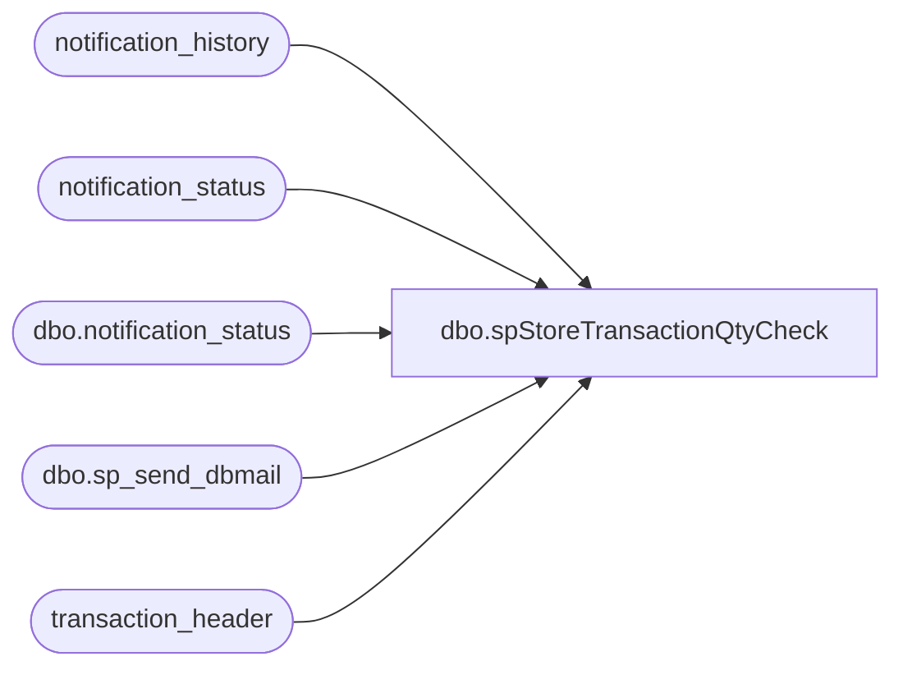

# dbo.spStoreTransactionQtyCheck

**Database:** auditworks  
**Server:** bedrockdb01  

## Architecture Diagram



## Table Dependencies

| Referenced Table |
|---|
| notification_history |
| notification_status |
| dbo.notification_status |
| dbo.sp_send_dbmail |
| transaction_header |

## Stored Procedure Code

```sql
--DROP PROC [dbo].[spStoreTransactionQtyCheck]
--GO

CREATE PROC [dbo].[spStoreTransactionQtyCheck]
-- =============================================================================================================
-- Name: [dbo].[spStoreTransactionQtyCheck]
--
-- Description:	This is a validation only script.  If stores transaction count for the past 48 hours is past 
--				a set threshold, this validation will send an email alert so immediate action can be taken.
--
-- Input: N/A
--
-- Output: N/A
--
-- Dependencies: N/A
--
-- Revision History
--		Name:			Date:			Comments:
--		Paul Beckman	07/25/2018		Created SP
--		Paul Beckman	10/18/2019		Updated to use notification_history table
--		Paul Beckman	01/02/2020		Changed SAAlert@buildabear.com to EnterpriseSystemsAlerts@buildabear.com
--		Paul Beckman	02/05/2020		Updated email profile to 'EntSysSupport'
--
-- exec spStoreTransactionQtyCheck
-- =============================================================================================================
AS
SET NOCOUNT ON


DECLARE @sql VARCHAR(8000)
DECLARE @recipients VARCHAR(4000)
DECLARE @copy_recipients VARCHAR(4000)
DECLARE @Subject VARCHAR(80)
DECLARE @query VARCHAR(8000)
DECLARE @text NVARCHAR(MAX)
DECLARE @QtyThreshold VARCHAR(5)

SET @QtyThreshold = 5000

--##############################################

IF EXISTS (SELECT store_no
	,register_no
	,COUNT(transaction_id) AS trans_qty
	,CONVERT(VARCHAR(10), transaction_date, 110) AS transaction_date
	FROM transaction_header
	WHERE transaction_date > CONVERT(VARCHAR,DATEADD(DAY,-2,GETDATE()),111)
	AND store_no NOT IN (13,990,2013)
	GROUP BY store_no,register_no,transaction_date
	HAVING COUNT(transaction_id) > @QtyThreshold)
GOTO CHECKALERTSTATUS

--##############################################

CLEARALERTSTATUS:
	IF (SELECT COUNT(*) FROM notification_status WHERE reported = 1 AND notification_name = 'Store Transaction Qty check') = 1
	BEGIN
		UPDATE notification_status
		SET reported = 0,reported_cleared = CONVERT(VARCHAR(19),GETDATE(),120)
		WHERE notification_name = 'Store Transaction Qty check'
		
		SET @recipients = 'EntSysSupport@buildabear.com'
		--SET @recipients = 'paulb@buildabear.com'
		SET @text = 
		'<font face =arial size = 2>' +
		'The Store Transaction Qty check has been cleared. <br>' +
		'<br>' +
		'<table border="1">' + 
		'<font face =arial size = 2>' +
		'<tr bgcolor=#D5D5F7><th>Notification Name</th><th>First Reported</th><th>Reported Cleared</th></tr>' +
		CAST ( ( SELECT td = notification_name, '',
						td = CONVERT(VARCHAR(19),first_reported,120), '',
						td = CONVERT(VARCHAR(19),reported_cleared,120), ''
				FROM auditworks.dbo.notification_status
				WHERE notification_name = 'Store Transaction Qty check'
				FOR xml path ('tr'), type
		) AS NVARCHAR(MAX) ) +
		'</table>' +
		'<font face =arial size = 1 color="#C0C0C0">' +
		'<br><br><br><br>' +
		'Server:  BEDROCKDB01 <br>' +
		'Job Name:  Store Transaction Qty Check <br>' +
		'Stored Proc:  BEDROCKDB01.auditworks.dbo.spStoreTransactionQtyCheck <br>' +
		'Created by:  Paul Beckman <br>' +
		'Team Ownership:  Enterprise Systems <br>'

		SET @Subject = 'UPDATE - Store Transaction Qty check has been cleared'
		EXEC msdb.dbo.sp_send_dbmail  
			@profile_name = 'EntSysSupport',
			@recipients = @recipients,
			@copy_recipients = @copy_recipients,
			@subject=@Subject, 
			@body = @text,
			@body_format = 'HTML'
		
	INSERT INTO notification_history
	(stored_proc_name,
	record_logged_datetime,
	issues_found,
	action_required,
	notification_sent,
	email_type,
	email_to,
	email_cc,
	email_subject,
	comment
	)
	VALUES (
	'spStoreTransactionQtyCheck', --<< Stored Proc name
	GETDATE(),
	'No', --<< Issues found - Yes / No
	'No', --<< Action required - Yes / No
	'Yes', --<< Notification sent - Yes / No
	'Notification Only', --<< Email type - Notification Only / Alert / Warning
	@recipients, --<< Email TO
	@copy_recipients, --<< Email CC
	@Subject, --<< Email Subject
	'The Store Transaction Qty check has been cleared' --<< Comment
	)
END
	
GOTO CHECKCOMPLETE

--##############################################

CHECKALERTSTATUS:
	IF (SELECT COUNT(*) FROM notification_status WHERE reported = 0 AND notification_name = 'Store Transaction Qty check') = 1
	BEGIN
		UPDATE notification_status
		SET reported = 1,first_reported = CONVERT(VARCHAR(19),GETDATE(),120),reported_cleared = NULL
		WHERE notification_name = 'Store Transaction Qty check'
		
		SET @recipients = 'EnterpriseSystemsAlerts@buildabear.com;EntSysSupport@buildabear.com'
		--SET @recipients = 'paulb@buildabear.com'
		SET @text = 
		'<font face =arial size = 2 color="Red">' +
		N'<H3>** ACTION REQUIRED **</H3>' +
		'<br>' +
		'The Store Transaction Qty is TOO high.  Below are registers that have produced over ' + @QtyThreshold + ' transactions thus far.  This is often a result of a key stuck on the keyboard of a register, typically F2.  Investigate and resolve immediately. <br>' +
		'<br>' +
		'<table border="1">' + 
		'<font face =arial size = 2 color="Black">' +
		'<tr bgcolor=#D5D5F7><th>Store num</th><th>Reg num</th><th>Trans Qty</th><th>Trans Date</th></tr>' +
		CAST ( (SELECT td = store_no, '',
				td = register_no, '',
				td = COUNT(transaction_id), '',
				td = CONVERT(VARCHAR(10), transaction_date, 110), ''-- AS transaction_date
				FROM transaction_header
				WHERE transaction_date > CONVERT(VARCHAR,DATEADD(DAY,-2,GETDATE()),111)
				AND store_no NOT IN (13,990,2013)
				GROUP BY store_no,register_no,transaction_date
				HAVING COUNT(transaction_id) > @QtyThreshold
				ORDER BY store_no,register_no,transaction_date
				FOR xml path ('tr'), type
		) AS NVARCHAR(MAX) ) +
		'</table>' +
		'<font face =arial size = 1 color="#C0C0C0">' +
		'<br><br><br><br>' +
		'Server:  BEDROCKDB01 <br>' +
		'Job Name:  Store Transaction Qty Check <br>' +
		'Stored Proc:  BEDROCKDB01.auditworks.dbo.spStoreTransactionQtyCheck <br>' +
		'Created by:  Paul Beckman <br>' +
		'Team Ownership:  Enterprise Systems <br>'

		SET @Subject = 'WARNING - Store Transaction Qty TOO high'
		EXEC msdb.dbo.sp_send_dbmail  
			@profile_name = 'EntSysSupport',
			@recipients = @recipients,
			@subject=@Subject, 
			@importance = 'High',
			@body = @text,
			@body_format = 'HTML'
		
	INSERT INTO notification_history
	(stored_proc_name,
	record_logged_datetime,
	issues_found,
	action_required,
	notification_sent,
	email_type,
	email_to,
	email_cc,
	email_subject,
	comment
	)
	VALUES (
	'spStoreTransactionQtyCheck', --<< Stored Proc name
	GETDATE(),
	'Yes', --<< Issues found - Yes / No
	'Yes', --<< Action required - Yes / No
	'Yes', --<< Notification sent - Yes / No
	'Warning', --<< Email type - Notification Only / Alert / Warning
	@recipients, --<< Email TO
	@copy_recipients, --<< Email CC
	@Subject, --<< Email Subject
	'The Store Transaction Qty is TOO high.  Below are registers that have produced over ' + @QtyThreshold + ' transactions thus far.  This is often a result of a key stuck on the keyboard of a register, typically F2' --<< Comment
	)
END

--##############################################

CHECKCOMPLETE:

dbo,sp3rdPartyGiftCardRedemsNEW,
-------------This is it!-----------------------------------------------------------
CREATE
--CREATE 
PROCEDURE [dbo].[sp3rdPartyGiftCardRedemsNEW] 

@GiftCardBeginRange numeric(28,0) = null, 
@GiftCardEndRange numeric(28,0) = null, 
@RedemptionStartDate datetime,
@RedemptionEndDate datetime,
@GiftCardType varchar(50)

AS
-- =====================================================================================================
-- Name: sp3rdPartyGiftCardRedems
--
-- Description:	
--
-- Input:	
--			Liability transactions
--
-- Output: Resultset with the following columns:
--			N/A
--
-- Dependencies: None
--
-- Revision History
--		Name:			Date:			Comments:
--		?				08/24/2010		Initial version source control
-- exec sp3rdPartyGiftCardRedemsNEW 6058294485888200, 6058294485888300,'2010-08-01', '2010-08-22', 'fake' 
-- =====================================================================================================

SET NOCOUNT ON
/*--********************************************--********************************************--********************************************
										NON-AV TRANSACTIONS
--********************************************--********************************************--********************************************/

IF (Object_ID('tempdb..##non_av_redems') IS NOT NULL) DROP TABLE ##non_av_redems


SELECT  CardType = 
case when @GiftCardBeginRange is not null and isnumeric(tl.reference_no) = 1 and 
     cast(tl.reference_no as numeric(28,0)) between @GiftCardBeginRange and @GiftCardEndRange then @GiftCardType
 --    when @GiftCardActivationValue is not null then @GiftCardType 
else 'Unclassified' end
, th.store_no, th.register_no, th.transaction_no, th.transaction_date, d.date_key, d.fiscal_year,
d.fiscal_quarter,d.fiscal_period, d.fiscal_week, th.transaction_void_flag,th.tender_total, tl.line_void_flag,
tl.gross_line_amount, tl.line_object, tl.line_action,th.transaction_id, tl.reference_no  
  INTO ##non_av_redems  
 FROM auditworks..transaction_header th with (nolock)  join  auditworks..transaction_line tl with (nolock) on 
th.transaction_id = tl.transaction_id join
 dbo.date_dim d with (nolock) on 
th.transaction_date = d.actual_date
where 
   th.transaction_void_flag = 0
  and tl.line_void_flag <> 1 
  and th.transaction_date between @RedemptionStartDate and @RedemptionEndDate 
  and 
   (
( tl.line_object = 404  and tl.line_action = 2  ) -- Gift Card returns
            or  
	 (tl.line_object = 633  and tl.line_action = 25 )-- Gift Card redemptions
     )
     
--select * from     ##non_av_redems return 


create index ix_g##non_av_redems_CardType on ##non_av_redems (CardType)

/*--********************************************--********************************************--********************************************
										AV TRANSACTIONS
--********************************************--********************************************--********************************************/
IF (Object_ID('tempdb..##av_redems') IS NOT NULL) DROP TABLE ##av_redems

SELECT  CardType = 
case when @GiftCardBeginRange is not null and isnumeric(tl.reference_no) = 1 and 
     cast(tl.reference_no as numeric(28,0)) between @GiftCardBeginRange and @GiftCardEndRange then @GiftCardType
 --    when @GiftCardActivationValue is not null then @GiftCardType 
else 'Unclassified' end
, th.store_no, th.register_no, th.transaction_no, th.transaction_date, d.date_key, d.fiscal_year,
d.fiscal_quarter,d.fiscal_period, d.fiscal_week, th.transaction_void_flag,th.tender_total,tl.line_void_flag,
 tl.gross_line_amount, tl.line_object,tl.line_action,th.av_transaction_id transaction_id,tl.reference_no
  INTO ##av_redems  
 FROM  auditworks..av_transaction_header th with (nolock) join auditworks..av_transaction_line tl with (nolock) on 
 th.av_transaction_id = tl.av_transaction_id join
 dbo.date_dim d with (nolock) on 
th.transaction_date = d.actual_date 
where 
   th.transaction_void_flag = 0
  and tl.line_void_flag <> 1 
  and th.transaction_date between @RedemptionStartDate and @RedemptionEndDate 
  and 
   (
( tl.line_object = 404  and tl.line_action = 2  ) -- Gift Card Activations
            or  
	 (tl.line_object = 633  and tl.line_action = 25 )-- Gift Card redemptions
     )
--and 1 = 2 ---testing filter to speed up process

select * from ##av_redems return

create index ix_g##av_redems_CardType on ##av_redems (CardType)


IF (Object_ID('tempdb..##3rdPartyRedems') IS NOT NULL) DROP TABLE ##3rdPartyRedems

select * into ##3rdPartyRedems
from ##non_av_redems  with (nolock) where CardType = @GiftCardType
union
select * from ##av_redems with (nolock)  where CardType = @GiftCardType

/*
DROP TABLE  ##non_3rdPartyTransRedems

select r.* into ##non_3rdPartyTransRedems
from ##3rdPartyRedems p with (nolock) join ##non_av_redems r with (nolock) on
p.transaction_id = r.transaction_id and 
p.date_key = r.date_key and 
p.date_key = r.date_key 
where r.CardType <> @GiftCardType
union
select r.* from ##3rdPartyRedems p with (nolock) join ##av_redems r with (nolock) on
p.transaction_id = r.transaction_id and 
p.date_key = r.date_key and 
p.date_key = r.date_key 
where r.CardType <> @GiftCardType

*/
/*
drop table ##3rdPartyGiftCardRedems

select * into ##3rdPartyGiftCardRedems
from ##3rdPartyRedems 
union 
select * from ##non_3rdPartyTransRedems 
*/
--select * from ##3rdPartyGiftCardRedems 

----------------------------------------------Output--------------------------------------------------------------------------------------------

--Q3a) Multiple Redemptions on same transaction - Store Totals/Summary

--DECLARE @GiftCardType varchar(50)
--set @GiftCardType = 'Costco'
/*
select 'Store Totals for 3rd Party Redems Only' Report,
r.store_no, count(distinct r.transaction_id) ThrdPartyTransCount, count(distinct r.reference_no) ThrdPartyGiftCardCount
from ##3rdPartyRedems r
--##3rdPartyGiftCardRedems r 
--where CardType = @GiftCardType
--r.store_no = 2003 and
group by store_no
order by store_no

select 'Trans with 3rd Party Redems Store Totals' Report,
r.store_no, count(distinct r.transaction_id) TransWithThrdPartyRedems, count(distinct r.reference_no) TotalNoOfGiftCards
from ##3rdPartyRedems r
--##3rdPartyGiftCardRedems r 
--where CardType = @GiftCardType
--r.store_no = 2003 and
group by store_no
order by store_no


select 'Summary for Trans with 3rd Party Redems' Report,
r.store_no, r.transaction_date, r.register_no, r.transaction_no,r.transaction_id, 
count(distinct r.reference_no) GiftCardCount,
sum(r.gross_line_amount) total_gross_line_amount, r.tender_total
from ##3rdPartyRedems r
--##3rdPartyGiftCardRedems r 
--where CardType = @GiftCardType
--r.store_no = 2003 and
group by r.store_no, r.transaction_no,r.transaction_id,r.tender_total,r.transaction_date, r.register_no 
order by r.store_no,r.transaction_id
*/


select -- 'Details of Trans with 3rd Party Redems' Report,
cast(r.store_no as varchar(50)) store_no
, r.transaction_date
,cast(r.register_no as varchar(50)) register_no
,cast(r.transaction_no as varchar(50)) transaction_no
,cast(r.transaction_id as varchar(50)) transaction_id
,r.CardType
,r.reference_no
,r.gross_line_amount
,r.tender_total
,cast(r.fiscal_year as varchar(4)) fiscal_year
,cast(r.fiscal_quarter as varchar(2)) fiscal_quarter
,cast(r.fiscal_period as varchar(2)) fiscal_period
,cast(r.fiscal_week as varchar(2)) fiscal_week
,cast(r.line_object as varchar(8)) line_object
,cast(r.line_action as varchar(8)) line_action
from ##3rdPartyRedems r
--##3rdPartyGiftCardRedems r 
--where CardType = @GiftCardType
group by r.CardType, r.store_no, r.register_no, r.transaction_no, r.transaction_date, r.fiscal_year,
r.fiscal_quarter, r.fiscal_period, r.fiscal_week, r.transaction_void_flag, r.tender_total, r.line_void_flag,
r.gross_line_amount, r.line_object, r.line_action,r.transaction_id, r.reference_no 
--order by r.store_no,r.transaction_id


SET ANSI_NULLS OFF
--go
SET --QUOTED_IDENTIFIER OFF
--go
```

