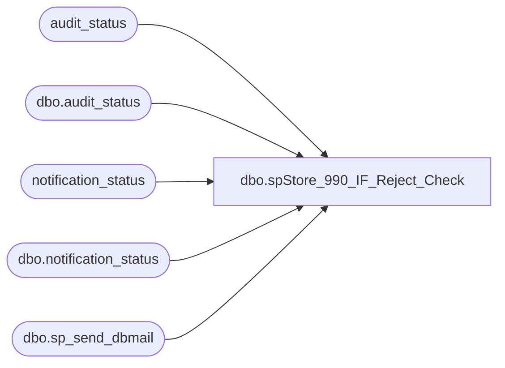

# dbo.spStore_990_IF_Reject_Check

**Database:** auditworks  
**Server:** bedrockdb01  

## Architecture Diagram



## Table Dependencies

| Referenced Table |
|---|
| audit_status |
| dbo.audit_status |
| notification_status |
| dbo.notification_status |
| dbo.sp_send_dbmail |

## Stored Procedure Code

```sql
--DROP PROC [dbo].[spStore_990_IF_Reject_Check]
--GO

CREATE PROC [dbo].[spStore_990_IF_Reject_Check]
-- =============================================================================================================
-- Name: [dbo].[spStore_990_IF_Reject_Check]
--
-- Description:	This is a validation only script.  If the IF Reject qty for store 990 is past a set threshold,
--				this validation will send an email alert so immediate action can be taken.
--
-- Input: N/A
--
-- Output: N/A
--
-- Dependencies: N/A
--
-- Revision History
--		Name:			Date:			Comments:
--		Paul Beckman	06/21/2011		Created SP
--		Paul Beckman	07/19/2015		Updated from POSDBSSA to BEDROCKDB01
--		Paul Beckman	08/31/2016		Updated profile_name from 'POSadmin' to 'SAAdmin'
--		Paul Beckman	01/18/2017		Updated email body to HTML
--		Paul Beckman	02/17/2017		Changed @alertrecipients from POSAlert to SAAlert
--		Paul Beckman	02/13/2018		Removed old non-HTML code for email body
--		Paul Beckman	01/02/2020		Changed SAAlert@buildabear.com to EnterpriseSystemsAlerts@buildabear.com
--		Paul Beckman	02/05/2020		Updated email profile to 'EntSysSupport'
--
-- exec spStore_990_IF_Reject_Check
-- =============================================================================================================
AS
SET NOCOUNT ON


DECLARE @sql VARCHAR(8000)
DECLARE @recipients VARCHAR(4000)
DECLARE @copy_recipients VARCHAR(4000)
DECLARE @Subject VARCHAR(80)
DECLARE @query VARCHAR(8000)
declare @text nvarchar(max)

--##############################################

IF (SELECT COUNT(*) FROM audit_status WHERE store_no = '990' AND if_reject_qty > 20) > 0
GOTO CHECKALERTSTATUS

--##############################################

CLEARALERTSTATUS:
	IF (SELECT COUNT(*) FROM notification_status WHERE reported = 1 AND notification_name = 'Store 990 IF reject count') = 1
	BEGIN
		UPDATE notification_status
		SET reported = 0,reported_cleared = CONVERT(VARCHAR(19),GETDATE(),120)
		WHERE notification_name = 'Store 990 IF reject count'
		
		SET @recipients = 'EntSysSupport@buildabear.com'
		SET @text = 
		'<font face =arial size = 2>' +
		'The IF Rejects for store 990 have been cleared. <br>' +
		'<br>' +
		'<table border="1">' + 
		'<font face =arial size = 2>' +
		'<tr bgcolor=#D5D5F7><th>Notification Name</th><th>First Reported</th><th>Reported Cleared</th></tr>' +
		CAST ( ( SELECT td = notification_name, '',
						td = CONVERT(VARCHAR(19),first_reported,120), '',
						td = CONVERT(VARCHAR(19),reported_cleared,120), ''
				FROM auditworks.dbo.notification_status
				WHERE notification_name = 'Store 990 IF reject count'
				FOR xml path ('tr'), type
		) AS NVARCHAR(MAX) ) +
		'</table>' +
		'<font face =arial size = 1 color="#C0C0C0">' +
		'<br><br><br><br>' +
		'Server:  BEDROCKDB01 <br>' +
		'Job Name:  Store 990 IF Reject Check <br>' +
		'Stored Proc:  BEDROCKDB01.auditworks.dbo.spStore_990_IF_Reject_Check <br>' +
		'Created by:  Paul Beckman <br>' +
		'Team Ownership:  Enterprise Systems <br>'

		SET @Subject = 'UPDATE - Store 990 IF Rejects have been cleared'
		EXEC msdb.dbo.sp_send_dbmail  
			@profile_name = 'EntSysSupport',
			@recipients = @recipients,
			@copy_recipients = @copy_recipients,
			@subject=@Subject, 
			@body = @text,
			@body_format = 'HTML'
	END
	
GOTO CHECKCOMPLETE

--##############################################

CHECKALERTSTATUS:
	IF (SELECT COUNT(*) FROM notification_status WHERE reported = 0 AND notification_name = 'Store 990 IF reject count') = 1
	BEGIN
		UPDATE notification_status
		SET reported = 1,first_reported = CONVERT(VARCHAR(19),GETDATE(),120),reported_cleared = NULL
		WHERE notification_name = 'Store 990 IF reject count'
		
		SET @recipients = 'EnterpriseSystemsAlerts@buildabear.com;EntSysSupport@buildabear.com'
		SET @text = 
		'<font face =arial size = 2 color="Red">' +
		'***  ACTION REQUIRED  *** <br>' +
		'<br>' +
		'The IF Reject Count for store 990 is TOO high.  This is often a result of a bad CL import.  Investigate and resolve immediately. <br>' +
		'<br>' +
		'<table border="1">' + 
		'<font face =arial size = 2 color="Black">' +
		'<tr bgcolor=#D5D5F7><th>Store Num</th><th>IF Reject Qty</th></tr>' +
		CAST ( ( SELECT td = store_no, '',
						td = SUM(if_reject_qty), ''
				FROM auditworks.dbo.audit_status
				WHERE store_no = '990'
				GROUP BY store_no
				FOR xml path ('tr'), type
		) AS NVARCHAR(MAX) ) +
		'</table>' +
		'<font face =arial size = 1 color="#C0C0C0">' +
		'<br><br><br><br>' +
		'Server:  BEDROCKDB01 <br>' +
		'Job Name:  Store 990 IF Reject Check <br>' +
		'Stored Proc:  BEDROCKDB01.auditworks.dbo.spStore_990_IF_Reject_Check <br>' +
		'Created by:  Paul Beckman <br>' +
		'Team Ownership:  Enterprise Systems <br>'

		SET @Subject = 'WARNING - Store 990 IF Rejects TOO high'
		EXEC msdb.dbo.sp_send_dbmail  
			@profile_name = 'EntSysSupport',
			@recipients = @recipients,
			@subject=@Subject, 
			@importance = 'High',
			@body = @text,
			@body_format = 'HTML'
	END

--##############################################

CHECKCOMPLETE:
```

