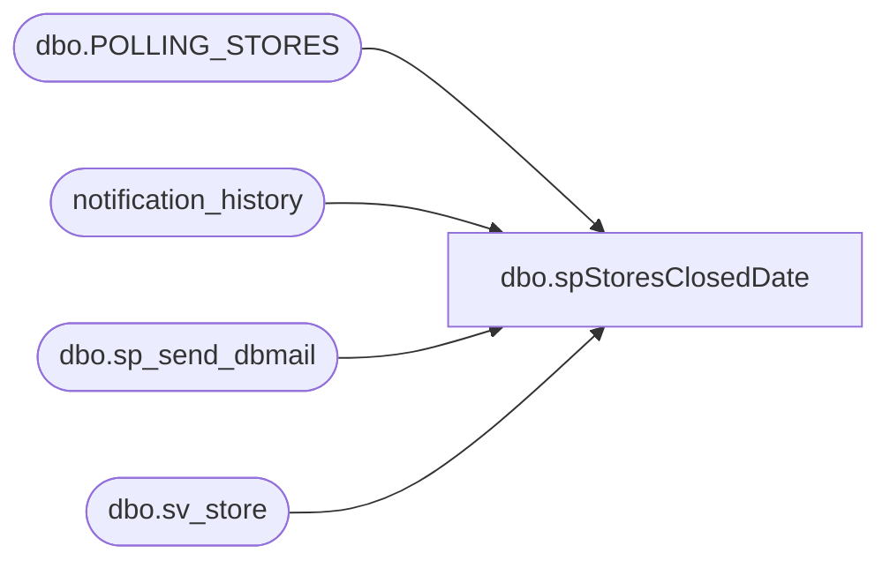

# dbo.spStoresClosedDate

**Database:** auditworks  
**Server:** bedrockdb01  

## Architecture Diagram



## Table Dependencies

| Referenced Table |
|---|
| dbo.POLLING_STORES |
| notification_history |
| dbo.sp_send_dbmail |
| dbo.sv_store |

## Stored Procedure Code

```sql
CREATE procedure [dbo].[spStoresClosedDate]
as
-- =====================================================================================================
-- Name: spStoresClosedDate
--
-- Description:	
--
-- Input:	
--			
--
-- Output: Resultset with the following columns:
--			
--
-- Dependencies: None
--
-- Revision History
--		Name:			Date:			Comments:
--		Paul Beckman	01/25/2018		Created stored procedure
--		Paul Beckman	03/22/2019		Added LisaM@buildabear.com to email notification
--		Paul Beckman	04/08/2019		Replaced ronw@buildabear.com with DawnGo@buildabear.com
--		Paul Beckman	04/11/2019		Added LisaWa@buildabear.com to email notification
--		Paul Beckman	10/18/2019		Updated to use notification_history table
--		Paul Beckman	02/05/2020		Updated email profile to 'EntSysSupport'
--		Paul Beckman	03/26/2020		Added line for specific store number exclusions
--
--  exec spStoresClosedDate
-- =====================================================================================================

declare @sql varchar(8000)
declare @recipients varchar(8000)
declare @copy_recipients varchar(8000)
declare @Subject varchar(80)
declare @query varchar(8000)
declare @text nvarchar(max)

SET @recipients = 'ScottP@buildabear.com;LisaWa@buildabear.com;LisaM@buildabear.com;DawnGo@buildabear.com'
--SET @recipients = 'paulb@buildabear.com'
SET @copy_recipients = 'EntSysSupport@buildabear.com;lindak@buildabear.com'

IF (Object_ID('tempdb..##StoreList') IS NOT NULL) DROP TABLE ##StoreList

--------------------------------------------------

SELECT a.STORE_NUM
	--,a.CLOSED_DATE
	--,b.closed_date
INTO ##StoreList
FROM auditworks.dbo.POLLING_STORES a
LEFT JOIN auditworks.dbo.sv_store b ON a.STORE_NUM = b.store_no
WHERE a.CLOSED_DATE IS NOT NULL
AND b.closed_date IS NULL
AND a.STORE_NUM NOT IN (464)

IF (SELECT COUNT(*) FROM ##StoreList) > 0
BEGIN

SET @text = 
	'<font face =arial size = 2 color="Black">' +
	'The following ' + CONVERT(VARCHAR(3),(SELECT COUNT(*) FROM ##StoreList)) + ' stores are closed and are missing a closed date in CRDM for Sales Audit.<br>' +
	'Please correct accordingly.  The Closed date may also need to be applied in Merchandising.<br>' +
	'<br>' +
	'<table border="1">' + 
	'<font face =arial size = 2>' +
	'<tr bgcolor=#D5D5F7><th>Store Num</th></tr>' +
	CAST ( ( SELECT td = STORE_NUM, ''
			FROM ##StoreList
			FOR xml path ('tr'), type
	) AS NVARCHAR(MAX) ) +
	'</table>' +
	'<font face =arial size = 1 color="#C0C0C0">' +
	'<br><br><br><br>' +
	'Server:  ' + @@servername + ' <br>' +
	'Job Name:  Store_CRDM_Dates_Check <br>' +
	'Stored Proc:  BEDROCKDB01.auditworks.dbo.spStoresClosedDate <br>' +
	'Created by:  Paul Beckman <br>' +
	'Team Ownership:  Enterprise Systems <br>'

	set @Subject = 'ALERT - (' + CONVERT(VARCHAR(3),(SELECT COUNT(*) FROM ##StoreList)) + ') Closed stores missing Closed Date'
	exec msdb.dbo.sp_send_dbmail
	@profile_name = 'EntSysSupport',
	@recipients = @recipients,
	@copy_recipients = @copy_recipients,
	@subject=@Subject, 
	@body = @text,
	@body_format = 'HTML'
	
	INSERT INTO notification_history
	(stored_proc_name,
	record_logged_datetime,
	issues_found,
	action_required,
	notification_sent,
	email_type,
	email_to,
	email_cc,
	email_subject,
	comment
	)
	VALUES (
	'spStoresClosedDate', --<< Stored Proc name
	GETDATE(),
	'Yes', --<< Issues found - Yes / No
	'Yes', --<< Action required - Yes / No
	'Yes', --<< Notification sent - Yes / No
	'Alert', --<< Email type - Notification Only / Alert / Warning
	@recipients, --<< Email TO
	@copy_recipients, --<< Email CC
	@Subject, --<< Email Subject
	'Stores are closed and are missing a closed date in CRDM for Sales Audit' --<< Comment
	)

END

DROP TABLE ##StoreList
```

