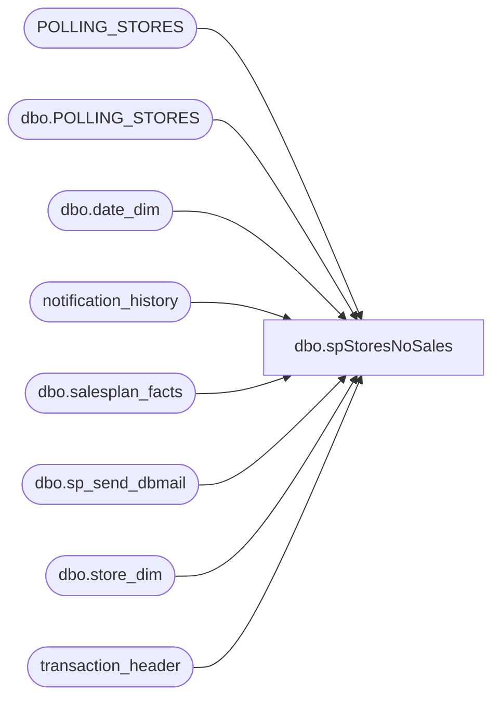

# dbo.spStoresNoSales

**Database:** auditworks  
**Server:** bedrockdb01  

## Architecture Diagram



## Table Dependencies

| Referenced Table |
|---|
| POLLING_STORES |
| dbo.POLLING_STORES |
| dbo.date_dim |
| notification_history |
| dbo.salesplan_facts |
| dbo.sp_send_dbmail |
| dbo.store_dim |
| transaction_header |

## Stored Procedure Code

```sql
CREATE procedure [dbo].[spStoresNoSales]
-- =====================================================================================================
-- Name: spStoresNoSales
--
-- Description:	Reports stores that are not showing Sale transactions in Sales Audit for today or 
--				yesterday and highlights any if no sales for more than the last two consecutive days
--
-- Input:	
--			
--
-- Output: Resultset with the following columns:
--			
--
-- Dependencies: None
--
-- Revision History
--		Name:			Date:			Comments:
--		Paul Beckman	07/18/2019		Created stored proc
--		Paul Beckman	07/22/2019		Added recipients after testing success over the past 3 days
--		Paul Beckman	10/17/2019		Updated to use notification_history table
--		Paul Beckman	10/29/2019		Added POLLING_VLDTN_DATE criteria for store list
--		Paul Beckman	11/12/2019		Updated email and profile to EntSysSupport
--		Paul Beckman	12/04/2019		Updated to use [PAPAMART].[dw].[dbo].[salesplan_facts] for store
--										that should have sales for selected day.
--		Paul Beckman	12/30/2019		Updated some email message body text.
--		Paul Beckman	01/02/2020		Changed SAAlert@buildabear.com to EnterpriseSystemsAlerts@buildabear.com
--		Paul Beckman	03/17/2020		Temporarily changed @alertrecipients to exclude EnterpriseSystemsAlerts@buildabear.com
--										Due to the amount of stores closed during the Coronavirus outbreak
--		Dan Tweedie		2023-04-19		Per new Jump Mind POS sales, add transaction_series 'P'to sales audit lookup
--
--  exec spStoresNoSales @DaysBack = 0  --<< For Today
--  exec spStoresNoSales @DaysBack = 1  --<< For Yesterday
-- =====================================================================================================
@DaysBack INT
AS

--####################################
-- Declare script variables
--####################################

--DECLARE @DaysBack INT
DECLARE @TwoDay INT
DECLARE @TodayYesterday VARCHAR(10)
DECLARE @sql VARCHAR(8000)
DECLARE @recipients VARCHAR(8000)
DECLARE @alertrecipients VARCHAR(8000)
DECLARE @Subject VARCHAR(80)
DECLARE @query VARCHAR(8000)
DECLARE @text NVARCHAR(MAX)

--SET @DaysBack = '0'
SET @TwoDay = ABS(@DaysBack + 1)
IF @DaysBack = '0' SET @TodayYesterday = 'Today'
IF @DaysBack = '1' SET @TodayYesterday = 'Yesterday'


--####################################
-- Temp Tables
--####################################

IF (Object_ID('tempdb..##StoresList') IS NOT NULL) DROP TABLE ##StoresList
IF (Object_ID('tempdb..##StoreDaysCount') IS NOT NULL) DROP TABLE ##StoreDaysCount
IF (Object_ID('tempdb..##CurrentDay') IS NOT NULL) DROP TABLE ##CurrentDay
IF (Object_ID('tempdb..##TwoConsecutive') IS NOT NULL) DROP TABLE ##TwoConsecutive
IF (Object_ID('tempdb..##StoresMissing') IS NOT NULL) DROP TABLE ##StoresMissing


--####################################
-- Set variables
--####################################

set @recipients = 'BIAdmin@buildabear.com;benb@buildabear.com;brandonh@buildabear.com;enjolia@buildabear.com;bradw@buildabear.com;juanp@buildabear.com' --'poll@buildabear.com;EntSysSupport@buildabear.com'
--set @alertrecipients = 'EnterpriseSystemsAlerts@buildabear.com;poll@buildabear.com;EntSysSupport@buildabear.com'
set @alertrecipients = 'BIAdminTextAlert@buildabear.com;benb@buildabear.com;brandonh@buildabear.com;enjolia@buildabear.com;bradw@buildabear.com;juanp@buildabear.com'--'poll@buildabear.com;EntSysSupport@buildabear.com'
IF @DaysBack = '1' SET @alertrecipients = @recipients --'poll@buildabear.com;EntSysSupport@buildabear.com'

--##########################################
-- Store Days Count
--##########################################

SELECT ps.STORE_NUM
	,0 AS TransDays
INTO ##StoresList
FROM [PAPAMART].[dw].[dbo].[salesplan_facts] sf
	JOIN [PAPAMART].[dw].[dbo].[date_dim] dd WITH (NOLOCK)
		ON sf.date_key=dd.date_key
	JOIN [PAPAMART].[dw].[dbo].[store_dim] sd WITH (NOLOCK)
		ON sf.store_key=sd.store_key
	JOIN auditworks.dbo.POLLING_STORES ps
		ON ps.STORE_NUM = sd.store_id
WHERE ps.POLLING_VLDTN = 1
AND ps.POLLING_VLDTN_DATE <= GETDATE()
AND ps.CLOSED_DATE IS NULL
AND CONVERT(VARCHAR(10),dd.actual_date,101) = DATEADD(DAY,-@DaysBack,CONVERT(VARCHAR(10),GETDATE(),101))
AND sf.amount > 0
--AND ps.STORE_NUM NOT IN (385)

--SELECT STORE_NUM
--	,0 AS TransDays
--INTO ##StoresList
--FROM POLLING_STORES
--WHERE CLOSED_DATE IS NULL
--AND POLLING_VLDTN = 1
--AND STORE_BRAND IN ('Workshop')
--AND OPEN_DATE <= DATEADD(DAY,+0,GETDATE())
--AND POLLING_VLDTN_DATE <= GETDATE()
----AND STORE_NUM NOT IN (385)


--##########################################
-- Store Days Count
--##########################################

SELECT a.STORE_NUM
	,COUNT(DISTINCT(b.transaction_date)) AS TransDays
INTO ##StoreDaysCount
FROM POLLING_STORES a
LEFT JOIN transaction_header b WITH(NOLOCK) ON b.store_no = a.STORE_NUM
WHERE b.transaction_date >= DATEADD(DAY,-@TwoDay,CONVERT(VARCHAR(10),GETDATE(),101))
AND b.transaction_series in ( ' ', 'P') -- Per Linda K, this was added for Jump Mind POS
AND b.transaction_category = 1
AND b.transaction_void_flag = 0
AND b.tender_total > 0
GROUP BY a.STORE_NUM
ORDER BY a.STORE_NUM

UPDATE ##StoresList
SET TransDays = a.TransDays
FROM ##StoreDaysCount a
JOIN ##StoresList b WITH(NOLOCK) ON b.STORE_NUM = a.STORE_NUM


--##########################################
-- Current Day
--##########################################

SELECT a.STORE_NUM
	,COUNT(DISTINCT(b.transaction_date)) AS TransDays
INTO ##CurrentDay
FROM POLLING_STORES a
LEFT JOIN transaction_header b WITH(NOLOCK) ON b.store_no = a.STORE_NUM
WHERE b.transaction_date = DATEADD(DAY,-@DaysBack,CONVERT(VARCHAR(10),GETDATE(),101))
AND b.transaction_series in ( ' ','P')
AND b.transaction_category = 1
AND b.transaction_void_flag = 0
AND b.tender_total > 0
GROUP BY a.STORE_NUM
ORDER BY a.STORE_NUM

SELECT a.STORE_NUM
	,a.TransDays
INTO ##StoresMissing
FROM ##StoresList a
WHERE a.STORE_NUM NOT IN (SELECT STORE_NUM
FROM ##CurrentDay)


IF (Object_ID('auditworks..tmpStoresZeroSales') IS NOT null) DROP TABLE tmpStoresZeroSales
select *
into tmpStoresZeroSales
from ##StoresMissing


DECLARE @listStr VARCHAR(MAX)
SET @listStr = ''
SELECT @listStr = @listStr + CONVERT(VARCHAR(10),STORE_NUM) + ','
FROM ##StoresMissing

--####################################
-- Send Email id applicable
--####################################

IF (SELECT COUNT(*) FROM ##StoresMissing) > 30
BEGIN

SET @text = 
	'<font face =arial size = 2 color="Red">' +
	N'<H3>** ACTION REQUIRED **</H3>' +
	'There are <b>' + CONVERT(VARCHAR(4),(SELECT COUNT(STORE_NUM) FROM ##StoresMissing)) + '</b> stores missing sales for ' + @TodayYesterday + ' (' + CONVERT(VARCHAR(10),DATEADD(DAY,-@DaysBack,CONVERT(VARCHAR(10),GETDATE(),101)),101) + ') in Sales Audit that were planned to have sales.<br>' +
	'If this is not a result of multiple stores being closed ' + @TodayYesterday + ' (' + CONVERT(VARCHAR(10),DATEADD(DAY,-@DaysBack,CONVERT(VARCHAR(10),GETDATE(),101)),101) + '), Retail Systems team needs to assist.<br>' +
	'<br>' +
	'The following stores have no Sales in Sales Audit for ' + @TodayYesterday + ':<br>' +
	'<br>' +
	'<table border="1">' + 
	'<font face =arial size = 2>' +
	'<tr bgcolor=#D5D5F7><th>Store No</th></tr>' +
	CAST ( ( SELECT CASE WHEN TransDays = 0 THEN 'red' ELSE 'white' END AS [@bgcolor],
				CASE WHEN TransDays = 0 THEN 'white' ELSE 'black' END  AS "font/@color",
				td = STORE_NUM, ''
			FROM ##StoresMissing
			FOR xml path ('tr'), type
	) AS NVARCHAR(MAX) ) +
	'</table>' +
	'<br>' +
	'<font face =arial size = 1 color="Red">' +
	'* Stores highlighted above in Red show no sales for last two days.' +
	'<br><br><br><br>' +
	'<font face =arial size = 1 color="#C0C0C0">' +
	'Server:  BEDROCKDB01 <br>' +
	'Job Name:  StoresNoSalesInSA or StoresNoSalesInSA_CurrentDay <br>' +
	'Stored Proc:  BEDROCKDB01.auditworks.dbo.spStoresNoSales <br>' +
	'Created by:  Paul Beckman <br>' +
	'Team Ownership:  Enterprise Systems <br>'

	SET @Subject = 'WARNING - ' + CONVERT(VARCHAR(4),(SELECT COUNT(STORE_NUM) FROM ##StoresMissing)) + ' Stores missing sales in Sales Audit for ' + @TodayYesterday
	EXEC msdb.dbo.sp_send_dbmail
	@profile_name = 'EntSysSupport',
	@recipients = @alertrecipients,
	@subject=@Subject, 
	@body = @text,
	@body_format = 'HTML'
	
	INSERT INTO notification_history
	(stored_proc_name,
	record_logged_datetime,
	issues_found,
	action_required,
	notification_sent,
	email_type,
	email_to,
	email_cc,
	email_subject,
	comment
	)
	VALUES (
	'spStoresNoSales', --<< Stored Proc name
	GETDATE(),
	'Yes', --<< Issues found - Yes / No
	'Yes', --<< Action required - Yes / No
	'Yes', --<< Notification sent - Yes / No
	'Warning', --<< Email type - Notification Only / Alert / Warning
	@alertrecipients, --<< Email TO
	NULL, --<< Email CC
	@Subject, --<< Email Subject
	'Too many stores missing sales for ' + @TodayYesterday --<< Comment
	)

END

IF (SELECT COUNT(*) FROM ##StoresMissing) BETWEEN 1 AND 30
BEGIN

SET @text = 
	'<font face =arial size = 2>' +
	'The following <b>' + CONVERT(VARCHAR(4),(SELECT COUNT(STORE_NUM) FROM ##StoresMissing)) + '</b> store(s) have no sales in Sales Audit that were planned to have sales for ' + @TodayYesterday + ' (' + CONVERT(VARCHAR(10),DATEADD(DAY,-@DaysBack,CONVERT(VARCHAR(10),GETDATE(),101)),101) + '):<br>' +
	'<br>' +
	'<table border="1">' + 
	'<font face =arial size = 2>' +
	'<tr bgcolor=#D5D5F7><th>Store No</th></tr>' +
	CAST ( ( SELECT CASE WHEN TransDays = 0 THEN 'red' ELSE 'white' END AS [@bgcolor],
				CASE WHEN TransDays = 0 THEN 'white' ELSE 'black' END  AS "font/@color",
				td = STORE_NUM, ''
			FROM ##StoresMissing
			FOR xml path ('tr'), type
	) AS NVARCHAR(MAX) ) +
	'</table>' +
	'<br>' +
	'<font face =arial size = 1 color="Red">' +
	'* Stores highlighted above in Red show no sales for last two days.' +
	'<br><br><br><br>' +
	'<font face =arial size = 1 color="#C0C0C0">' +
	'Server:  BEDROCKDB01 <br>' +
	'Job Name:  StoresNoSalesInSA or StoresNoSalesInSA_CurrentDay <br>' +
	'Stored Proc:  BEDROCKDB01.auditworks.dbo.spStoresNoSales <br>' +
	'Created by:  Paul Beckman <br>' +
	'Team Ownership:  Enterprise Systems <br>'

	SET @Subject = 'ALERT - Stores missing sales in Sales Audit for ' + @TodayYesterday
	EXEC msdb.dbo.sp_send_dbmail
	@profile_name = 'EntSysSupport',
	@recipients = @recipients,
	@subject=@Subject, 
	@body = @text,
	@body_format = 'HTML'
	
	INSERT INTO notification_history
	(stored_proc_name,
	record_logged_datetime,
	issues_found,
	action_required,
	notification_sent,
	email_type,
	email_to,
	email_cc,
	email_subject,
	comment
	)
	VALUES (
	'spStoresNoSales', --<< Stored Proc name
	GETDATE(),
	'Yes', --<< Issues found - Yes / No
	'No', --<< Action required - Yes / No
	'Yes', --<< Notification sent - Yes / No
	'Alert', --<< Email type - Notification Only / Alert / Warning
	@recipients, --<< Email TO
	NULL, --<< Email CC
	@Subject, --<< Email Subject
	'Stores ' + CONVERT(VARCHAR(8000),SUBSTRING(@listStr , 1, LEN(@listStr)-1)) + ' missing sales for ' + @TodayYesterday --<< Comment
	)
END

IF (SELECT COUNT(*) FROM ##StoresMissing) = 0 AND @DaysBack = 0
BEGIN
	INSERT INTO notification_history
	(stored_proc_name,
	record_logged_datetime,
	issues_found,
	action_required,
	notification_sent,
	comment
	)
	VALUES (
	'spStoresNoSales', --<< Stored Proc name
	GETDATE(),
	'No', --<< Issues found - Yes / No
	'No', --<< Action required - Yes / No
	'No', --<< Notification sent - Yes / No
	'ALL stores are showing Sales in Sales Audit for ' + @TodayYesterday --<< Comment
	)
END

IF (SELECT COUNT(*) FROM ##StoresMissing) = 0 AND @DaysBack = 1
BEGIN

SET @text = 
	'<font face =arial size = 2>' +
	'ALL stores are showing Sales in Sales Audit that were planned to have sales for ' + @TodayYesterday + ' (' + CONVERT(VARCHAR(10),DATEADD(DAY,-@DaysBack,CONVERT(VARCHAR(10),GETDATE(),101)),101) + ').<br>' +
	'<font face =arial size = 1 color="#C0C0C0">' +
	'<br><br><br><br>' +
	'Server:  BEDROCKDB01 <br>' +
	'Job Name:  StoresNoSalesInSA or StoresNoSalesInSA_CurrentDay <br>' +
	'Stored Proc:  BEDROCKDB01.auditworks.dbo.spStoresNoSales <br>' +
	'Created by:  Paul Beckman <br>' +
	'Team Ownership:  Enterprise Systems <br>'

	SET @Subject = 'ALL Stores show sales in Sales Audit for ' + @TodayYesterday
	EXEC msdb.dbo.sp_send_dbmail
	@profile_name = 'EntSysSupport',
	@recipients = @recipients,
	@subject=@Subject, 
	@body = @text,
	@body_format = 'HTML'
	
	INSERT INTO notification_history
	(stored_proc_name,
	record_logged_datetime,
	issues_found,
	action_required,
	notification_sent,
	email_type,
	email_to,
	email_cc,
	email_subject,
	comment
	)
	VALUES (
	'spStoresNoSales', --<< Stored Proc name
	GETDATE(),
	'No', --<< Issues found - Yes / No
	'No', --<< Action required - Yes / No
	'Yes', --<< Notification sent - Yes / No
	'Notification Only', --<< Email type - Notification Only / Alert / Warning
	@recipients, --<< Email TO
	NULL, --<< Email CC
	@Subject, --<< Email Subject
	'ALL stores are showing Sales in Sales Audit for ' + @TodayYesterday --<< Comment
	)
END

--####################################
-- Temp Table Cleanup
--####################################

IF (Object_ID('tempdb..##StoresList') IS NOT NULL) DROP TABLE ##StoresList
IF (Object_ID('tempdb..##StoreDaysCount') IS NOT NULL) DROP TABLE ##StoreDaysCount
IF (Object_ID('tempdb..##CurrentDay') IS NOT NULL) DROP TABLE ##CurrentDay
IF (Object_ID('tempdb..##TwoConsecutive') IS NOT NULL) DROP TABLE ##TwoConsecutive
IF (Object_ID('tempdb..##StoresMissing') IS NOT NULL) DROP TABLE ##StoresMissing

--####################################


/*

SELECT * FROM ##StoresList

SELECT * FROM ##StoresList
WHERE TransDays = 0

SELECT * FROM ##StoresMissing

SELECT * FROM ##StoreDaysCount

SELECT * FROM ##CurrentDay

*/
```

