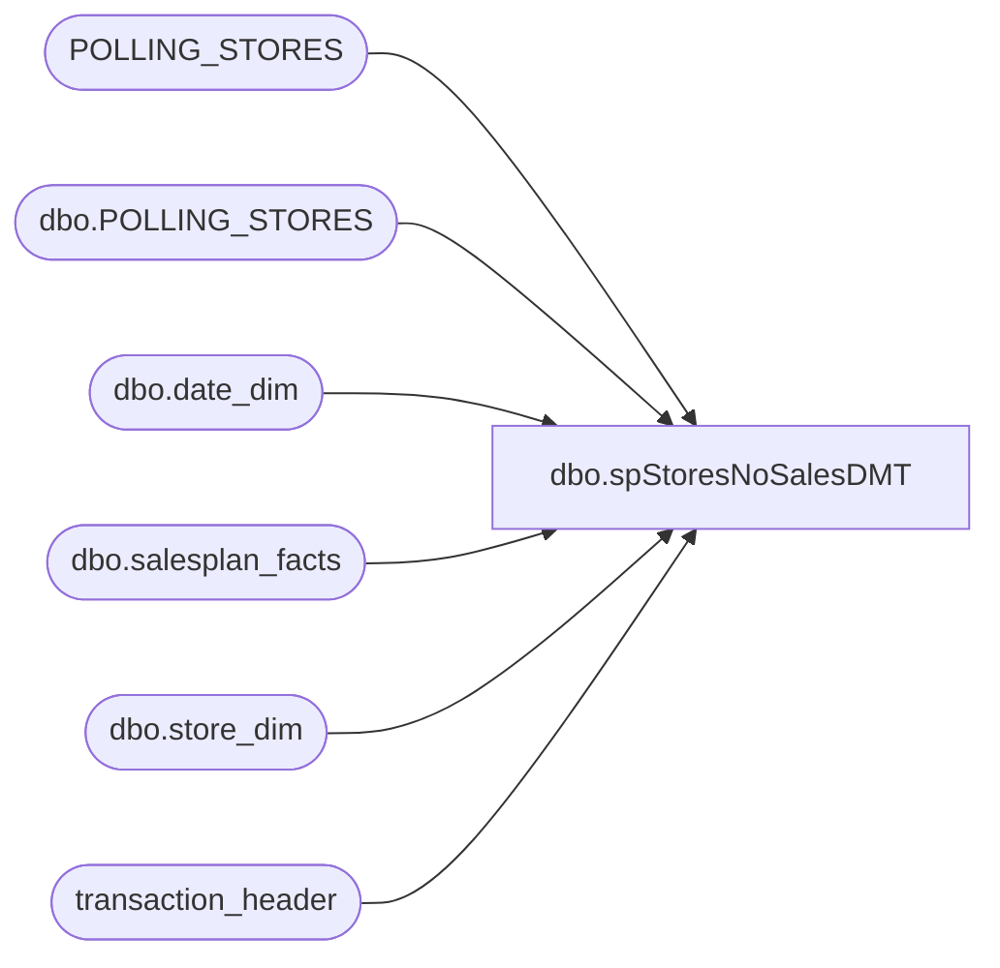

# dbo.spStoresNoSalesDMT

**Database:** auditworks  
**Server:** bedrockdb01  

## Architecture Diagram



## Table Dependencies

| Referenced Table |
|---|
| POLLING_STORES |
| dbo.POLLING_STORES |
| dbo.date_dim |
| dbo.salesplan_facts |
| dbo.store_dim |
| transaction_header |

## Stored Procedure Code

```sql
CREATE procedure [dbo].[spStoresNoSalesDMT]

@DaysBack INT
AS

--####################################
-- Declare script variables
--####################################

--DECLARE @DaysBack INT
DECLARE @TwoDay INT
DECLARE @TodayYesterday VARCHAR(10)
DECLARE @sql VARCHAR(8000)
DECLARE @recipients VARCHAR(8000)
DECLARE @alertrecipients VARCHAR(8000)
DECLARE @Subject VARCHAR(80)
DECLARE @query VARCHAR(8000)
DECLARE @text NVARCHAR(MAX)

--SET @DaysBack = '0'
SET @TwoDay = ABS(@DaysBack + 1)
IF @DaysBack = '0' SET @TodayYesterday = 'Today'
IF @DaysBack = '1' SET @TodayYesterday = 'Yesterday'


--####################################
-- Temp Tables
--####################################

IF (Object_ID('tempdb..##StoresList') IS NOT NULL) DROP TABLE ##StoresList
IF (Object_ID('tempdb..##StoreDaysCount') IS NOT NULL) DROP TABLE ##StoreDaysCount
IF (Object_ID('tempdb..##CurrentDay') IS NOT NULL) DROP TABLE ##CurrentDay
IF (Object_ID('tempdb..##TwoConsecutive') IS NOT NULL) DROP TABLE ##TwoConsecutive
IF (Object_ID('tempdb..##StoresMissing') IS NOT NULL) DROP TABLE ##StoresMissing


--####################################
-- Set variables
--####################################

IF @DaysBack = '1' 
--##########################################
-- Store Days Count
--##########################################

SELECT ps.STORE_NUM
	,0 AS TransDays
INTO ##StoresList
FROM [PAPAMART].[dw].[dbo].[salesplan_facts] sf
	JOIN [PAPAMART].[dw].[dbo].[date_dim] dd WITH (NOLOCK)
		ON sf.date_key=dd.date_key
	JOIN [PAPAMART].[dw].[dbo].[store_dim] sd WITH (NOLOCK)
		ON sf.store_key=sd.store_key
	JOIN auditworks.dbo.POLLING_STORES ps
		ON ps.STORE_NUM = sd.store_id
WHERE ps.POLLING_VLDTN = 1
AND ps.POLLING_VLDTN_DATE <= GETDATE()
AND ps.CLOSED_DATE IS NULL
AND CONVERT(VARCHAR(10),dd.actual_date,101) = DATEADD(DAY,-@DaysBack,CONVERT(VARCHAR(10),GETDATE(),101))
AND sf.amount > 0


--##########################################
-- Store Days Count
--##########################################

SELECT a.STORE_NUM
	,COUNT(DISTINCT(b.transaction_date)) AS TransDays
INTO ##StoreDaysCount
FROM POLLING_STORES a
LEFT JOIN transaction_header b WITH(NOLOCK) ON b.store_no = a.STORE_NUM
WHERE b.transaction_date >= DATEADD(DAY,-@TwoDay,CONVERT(VARCHAR(10),GETDATE(),101))
AND b.transaction_series in ( ' ', 'P') -- Per Linda K, this was added for Jump Mind POS
AND b.transaction_category = 1
AND b.transaction_void_flag = 0
AND b.tender_total > 0
GROUP BY a.STORE_NUM
ORDER BY a.STORE_NUM

UPDATE ##StoresList
SET TransDays = a.TransDays
FROM ##StoreDaysCount a
JOIN ##StoresList b WITH(NOLOCK) ON b.STORE_NUM = a.STORE_NUM


--##########################################
-- Current Day
--##########################################

SELECT a.STORE_NUM
	,COUNT(DISTINCT(b.transaction_date)) AS TransDays
INTO ##CurrentDay
FROM POLLING_STORES a
LEFT JOIN transaction_header b WITH(NOLOCK) ON b.store_no = a.STORE_NUM
WHERE b.transaction_date = DATEADD(DAY,-@DaysBack,CONVERT(VARCHAR(10),GETDATE(),101))
AND b.transaction_series in ( ' ','P')
AND b.transaction_category = 1
AND b.transaction_void_flag = 0
AND b.tender_total > 0
GROUP BY a.STORE_NUM
ORDER BY a.STORE_NUM

SELECT a.STORE_NUM
	,a.TransDays
INTO ##StoresMissing
FROM ##StoresList a
WHERE a.STORE_NUM NOT IN (SELECT STORE_NUM
FROM ##CurrentDay)


IF (Object_ID('auditworks..tmpStoresZeroSalesDMT') IS NOT null) DROP TABLE tmpStoresZeroSalesDMT
select *
into tmpStoresZeroSalesDMT
from ##StoresMissing
```

