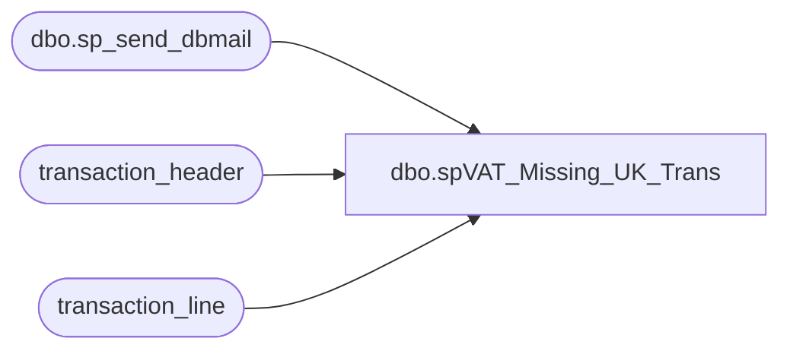

# dbo.spVAT_Missing_UK_Trans

**Database:** auditworks  
**Server:** bedrockdb01  

## Architecture Diagram



## Table Dependencies

| Referenced Table |
|---|
| dbo.sp_send_dbmail |
| transaction_header |
| transaction_line |

## Stored Procedure Code

```sql
--DROP PROC [dbo].[spVAT_Missing_UK_Trans]
--GO

CREATE PROC [dbo].[spVAT_Missing_UK_Trans]
-- =============================================================================================================
-- Name: [dbo].[spVAT_Missing_UK_Trans]
--
-- Description:	Sends email alert in the event this process finds UK sale transacation(s) with Merchandise 
--				item(s) sold and no VAT received line in the transaction.
--
-- Input: N/A
--
-- Output: N/A
--
-- Dependencies: N/A
--
-- Revision History
--		Name:			Date:			Comments:
--		Paul Beckman	04/03/2012		Created SP
--		Mike Pelikan	04/03/2012		Approved SP
--		Paul Beckman	01/29/2015		Modified store range high end from 2080 to 2399
--		Paul Beckman	07/19/2015		Updated from POSDBSSA to BEDROCKDB01
--		Paul Beckman	05/28/2016		Modified store range high end from 2399 to 3099
--
-- exec spVAT_Missing_UK_Trans
-- =============================================================================================================
AS
SET NOCOUNT ON


DECLARE @sql varchar(8000)
DECLARE @recipients varchar(4000)
DECLARE @Subject varchar(60)
DECLARE @query varchar(8000)
DECLARE @copy_recipients varchar(8000)

--SET @recipients = 'paulb@buildabear.com'
SET @recipients = 'lindak@buildabear.com'
SET @copy_recipients = 'posadmin@buildabear.com'

IF (Object_ID('tempdb..##vatmissing') IS NOT NULL) DROP TABLE ##vatmissing
SELECT a.store_no,CONVERT(VARCHAR(10),a.transaction_date, 101) AS transaction_date,a.register_no,a.transaction_no--,a.tender_total
INTO ##vatmissing
FROM transaction_header a (nolock),	transaction_line b (nolock)
WHERE a.transaction_id = b.transaction_id
AND a.transaction_id NOT IN 
(
	SELECT a.transaction_id
	FROM transaction_header a (nolock),	transaction_line b (nolock)
	WHERE a.transaction_id = b.transaction_id
	AND a.transaction_category = 1
	AND a.transaction_series = ' '
	AND a.tender_total > 1
	AND a.transaction_void_flag = 0
	AND a.tax_override_flag = 0
	AND b.line_void_flag = 0
	AND b.line_object = 1150
	AND b.line_object_type = 11
	AND b.line_action IN (13,21)
	AND a.store_no BETWEEN 2001 AND 2399
)

AND a.transaction_category = 1
AND a.transaction_series = ' '
AND a.tender_total > 1
AND a.transaction_void_flag = 0
AND a.tax_override_flag = 0
AND b.line_object = 1150
AND b.line_object = 100
AND b.gross_line_amount - b.pos_discount_amount > 1
AND a.store_no BETWEEN 2001 AND 3099

GROUP BY a.store_no,a.register_no,a.transaction_no,a.transaction_date,a.tender_total
ORDER BY a.store_no,a.register_no,a.transaction_no,a.transaction_date,a.tender_total

--SELECT * FROM ##vatmissing

IF (SELECT COUNT(*) FROM ##vatmissing) = 0
GOTO FINISH

SET @query = 
'
SET NOCOUNT ON
PRINT ''Transactions missing a VAT line in the transaction detail''
PRINT ''''
SELECT CONVERT (VARCHAR(8),store_no) AS Store_No,CONVERT(VARCHAR(16), transaction_date, 101) AS Sales_Date,CONVERT (VARCHAR(10),register_no) AS Register,CONVERT (VARCHAR(14),transaction_no) AS Trans_No FROM ##vatmissing
PRINT ''''
PRINT ''#################################''
PRINT ''''
PRINT ''''
PRINT ''''
PRINT ''Server:  BEDROCKDB01''
PRINT ''Job-Name:  VAT Missing on UK Trans''
PRINT ''Stored Proc:  BEDROCKDB01.auditworks.dbo.spVAT_Missing_UK_Trans''
PRINT ''Created by:  Paul Beckman''
PRINT ''Team Ownership:  POSadmin''
'

SET @Subject = 'ALERT - VAT line missing on UK transaction(s)'
	EXEC msdb.dbo.sp_send_dbmail  
		@profile_name = 'POSadmin',
		@recipients = @recipients,
		@copy_recipients = @copy_recipients,
		@subject=@Subject, 
		@query_result_width = 250,
		@query= @query


FINISH:
```

