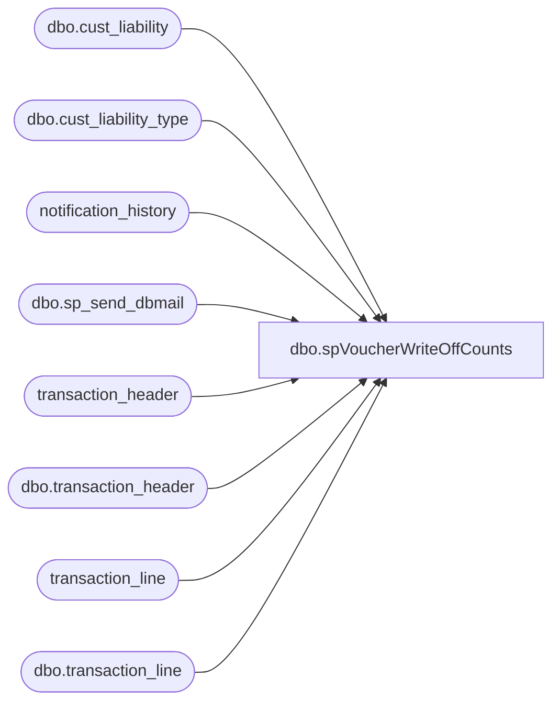

# dbo.spVoucherWriteOffCounts

**Database:** auditworks  
**Server:** bedrockdb01  

## Architecture Diagram



## Table Dependencies

| Referenced Table |
|---|
| dbo.cust_liability |
| dbo.cust_liability_type |
| notification_history |
| dbo.sp_send_dbmail |
| transaction_header |
| dbo.transaction_header |
| transaction_line |
| dbo.transaction_line |

## Stored Procedure Code

```sql
CREATE PROC [dbo].[spVoucherWriteOffCounts]
-- =============================================================================================================
-- Name: [dbo].[spVoucherWriteOffCounts]
--
-- Description:	Checks for vouchers that have been written off within the past 5 days
--
-- Input:	
--
-- Output: N/A
--
-- Dependencies: 
--
-- Revision History
--		Name:			Date:			Comments:
--		Paul Beckman	05/27/2010		Created process
--		Gary Derikito	08/26/2010		Change to db_mail to work on new POS server.
--		Paul Beckman	07/19/2015		Updated from POSDBSSA to BEDROCKDB01
--		Paul Beckman	08/31/2016		Updated profile_name from 'POSadmin' to 'SAAdmin'
--		Paul Beckman	01/23/2017		Updated email body to HTML
--		Paul Beckman	02/13/2018		Removed old non-HTML code for email body
--		Paul Beckman	01/11/2019		Updated message body text
--		Paul Beckman	10/18/2019		Updated to use notification_history table
--		Paul Beckman	02/05/2020		Updated email profile to 'EntSysSupport'
--
-- exec spVoucherWriteOffCounts
-- =============================================================================================================

AS

set nocount on  
declare @recipients varchar(8000)  
declare @Subject varchar(60)  
declare @msg varchar(1000)
declare @query varchar(8000)
DECLARE @text nvarchar(max)

--set @recipients = 'paulb@buildabear.com'
--set @recipients = 'posadmin@buildabear.com'
set @recipients = 'lindak@buildabear.com;EntSysSupport@buildabear.com'


IF (Object_ID('tempdb..##Voucher_WriteOff_Counts') IS NOT NULL) DROP TABLE ##Voucher_WriteOff_Counts
select count(transaction_line.transaction_id) as Transaction_Count
into ##Voucher_WriteOff_Counts
from transaction_header(nolock),transaction_line(nolock)
where store_no = '990'
and transaction_header.transaction_category = '248' -- C/L Write-off
and transaction_header.transaction_series = 'C' -- Customer Liability Maintenance
and transaction_header.transaction_date > convert(varchar,dateadd(day,-5,getdate()),111)
and transaction_line.line_object_type = '6' -- Tender
and transaction_line.line_action = '17' -- Forfeited
and transaction_line.reference_type in ('31','35')  -- (30=Party Deposit, 31=Loyalty Rewards, 35=Serialized Coupons)
and transaction_header.transaction_id = transaction_line.transaction_id
GROUP BY transaction_header.transaction_date
ORDER BY transaction_header.transaction_date

if (select count(*) from ##Voucher_WriteOff_Counts) > 0 

begin

set @text = 
		'<font face =arial size = 2>' +
		'Vouchers Written off <br>' +
		'<table border="1">' + 
		'<font face =arial size = 2>' +
		'<tr bgcolor=#D5D5F7><th>Voucher Type</th><th>Date</th><th>Count</th></tr>' +
		CAST ( ( SELECT td = tracking_id_description, '',
						td = convert(varchar(11), transaction_date, 101), '',
						[td/@align]='right',
						td = FORMAT(count(transaction_line.transaction_id),'#,###'), ''
				FROM auditworks.dbo.transaction_header(nolock),
					auditworks.dbo.transaction_line(nolock),
					auditworks.dbo.cust_liability_type
				WHERE store_no = '990'
				AND transaction_header.transaction_category = '248' -- C/L Write-off
				AND transaction_header.transaction_series = 'C' -- Customer Liability Maintenance
				AND transaction_header.transaction_date > convert(varchar,dateadd(day,-5,getdate()),111)
				AND transaction_line.line_object_type = '6' -- Tender
				AND transaction_line.line_action = '17' -- Forfeited
				AND transaction_line.reference_type IN ('31','35')  -- (30=Party Deposit, 31=Loyalty Rewards, 35=Serialized Coupons)
				AND transaction_header.transaction_id = transaction_line.transaction_id
				AND transaction_line.reference_type = cust_liability_type.reference_type
				GROUP BY cust_liability_type.tracking_id_description,transaction_header.transaction_date
				ORDER BY cust_liability_type.tracking_id_description,transaction_header.transaction_date
				FOR xml path ('tr'), type
		) AS NVARCHAR(MAX) ) +
		'</table>' +
		'<br><br>' +
		'<font face =arial size = 2>' +
		'Voucher totals still in SA <br>' +
		'<table border="1">' + 
		'<font face =arial size = 2>' +
		'<tr bgcolor=#D5D5F7><th>Voucher Type</th><th>Total Voucher Count</th></tr>' +
		CAST ( ( SELECT td = tracking_id_description, '',
						[td/@align]='right',
						td = FORMAT(count(reference_no),'#,###'), ''
				FROM auditworks.dbo.cust_liability,
					auditworks.dbo.cust_liability_type
				WHERE cust_liability.reference_type = cust_liability_type.reference_type
				GROUP BY tracking_id_description
				FOR xml path ('tr'), type
		) AS NVARCHAR(MAX) ) +
		'</table>' +
		'<font face =arial size = 1 color="#C0C0C0">' +
		'<br><br><br><br>' +
		'Server:  BEDROCKDB01 <br>' +
		'Job Name:  Voucher_WriteOff_Counts <br>' +
		'Stored Proc:  BEDROCKDB01.auditworks.dbo.spVoucherWriteOffCounts <br>' +
		'Created by:  Paul Beckman <br>' +
		'Team Ownership:  Enterprise Systems <br>'

	set @Subject = 'Voucher write-off Counts by date for past 5 days'
	
	exec msdb.dbo.sp_send_dbmail
		@profile_name = 'EntSysSupport',
		@recipients = @recipients,
		@subject=@Subject,
		@body = @text,
		@body_format = 'HTML'
	
	INSERT INTO notification_history
	(stored_proc_name,
	record_logged_datetime,
	issues_found,
	action_required,
	notification_sent,
	email_type,
	email_to,
	email_cc,
	email_subject,
	comment
	)
	VALUES (
	'spVoucherWriteOffCounts', --<< Stored Proc name
	GETDATE(),
	'No', --<< Issues found - Yes / No
	'No', --<< Action required - Yes / No
	'Yes', --<< Notification sent - Yes / No
	'Notification Only', --<< Email type - Notification Only / Alert / Warning
	@recipients, --<< Email TO
	NULL, --<< Email CC
	@Subject, --<< Email Subject
	'Voucher write-off Counts by date for past 5 days' --<< Comment
	)
		
end
```

