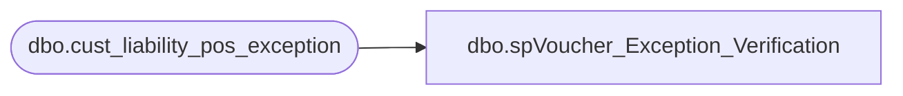

# dbo.spVoucher_Exception_Verification

**Database:** auditworks  
**Server:** bedrockdb01  

## Architecture Diagram



## Table Dependencies

| Referenced Table |
|---|
| dbo.cust_liability_pos_exception |

## Stored Procedure Code

```sql
--DROP PROC [dbo].[spVoucher_Exception_Verification]
--GO

CREATE PROC [dbo].[spVoucher_Exception_Verification]
-- =============================================================================================================
-- Name: [dbo].[spVoucher_Exception_Verification]
--
-- Description:	Flags serialized coupon customer liability exceptions as Verified if the sync flag is set to '0'
--				This eliminates the need for the Sales Audit team to do this from the front end application
--
-- Input: N/A
--
-- Output: N/A
--
-- Dependencies: N/A
--
-- Revision History
--		Name:			Date:			Comments:
--		Paul Beckman	04/10/2012		Created SP
--		Paul Beckman	08/24/2015		Created SP from auditworks.dbo.spVoucher_Exception_Verify_SerializedCpn
--		Paul Beckman	08/24/2015		Added reference types 30 (Party Deposit) and 31 (SFS Vouchers)
--
-- exec spVoucher_Exception_Verification
-- =============================================================================================================
AS
SET NOCOUNT ON

IF (SELECT COUNT(*) 
	FROM auditworks.dbo.cust_liability_pos_exception
	WHERE synch_flag = 0
	AND user_name is null
	AND verified = 0
	AND reference_type IN ('30','31','35')) = 0
GOTO FINISH

UPDATE auditworks.dbo.cust_liability_pos_exception
SET verified = 1,user_name = 'PaulB'
WHERE synch_flag = 0
AND user_name is null
AND verified = 0
AND reference_type IN ('30','31','35')

FINISH:
```

