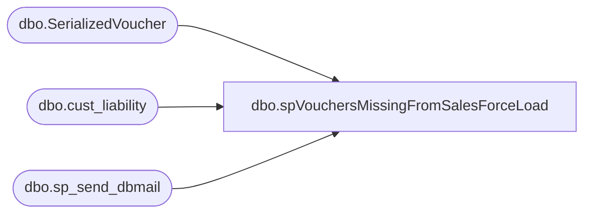

# dbo.spVouchersMissingFromSalesForceLoad

**Database:** auditworks  
**Server:** bedrockdb01  

## Architecture Diagram



## Table Dependencies

| Referenced Table |
|---|
| dbo.SerializedVoucher |
| dbo.cust_liability |
| dbo.sp_send_dbmail |

## Stored Procedure Code

```sql
CREATE PROC [dbo].[spVouchersMissingFromSalesForceLoad]
-- =============================================================================================================
-- =============================================================================================================
AS
SET NOCOUNT ON


DECLARE @sql VARCHAR(8000)
DECLARE @recipients VARCHAR(4000)
DECLARE @copy_recipients VARCHAR(4000)
DECLARE @Subject VARCHAR(80)
DECLARE @query VARCHAR(8000)
DECLARE @text nvarchar(max)

--SET @recipients = 'paulb@buildabear.com'
SET @recipients = 'ianw@buildabear.com'
SET @copy_recipients = 'ianw@buildabear.com'


IF (
select count(*) from PAPAMART.dw.[dbo].SerializedVoucher 
where cast(InsertDate as date)  >= cast(getdate()-60 as date)  
and cast(SerializedNumber as nvarchar) not in 
(select  reference_no  from [dbo].[cust_liability])
) = 0
GOTO FINISH

SET @text = 
		'<font face =arial size = 2>' +
		'Customer Liability records expected from SalesForce load. <br>' +
		'<br>' +
		'<table border="1">' + 
		'<font face =arial size = 2>' +
		'<tr bgcolor=#D5D5F7><th>Reference Type</th><th>Reference Number</th></tr>' +
		CAST ( ( select td = 'SerializedNumber', '',  [td/@align]='left', s.SerializedNumber 
				from PAPAMART.dw.[dbo].SerializedVoucher s 
				where cast(s.InsertDate as date)  >= cast(getdate()-60 as date)  
				and cast(s.SerializedNumber as nvarchar) not in 
				(
				select  reference_no  from [dbo].[cust_liability] 
				)
				FOR xml path ('tr'), type
		) AS NVARCHAR(MAX) ) +
		'</table>' +
		'<font face =arial size = 1 color="#C0C0C0">' +
		'<br><br><br><br>' +
		'Server:  BEDROCKDB01 <br>' +
		'Job Name:  Vouchers with Negative Balance <br>' +
		'Stored Proc:  BEDROCKDB01.auditworks.dbo.spVouchersMissingFromSalesForceLoad<br>' +
		'Created by:  Ian Wallace <br>' +
		'Team Ownership:  BIAdmin <br>'

SET @Subject = 'ALERT - Vouchers missing from SalesForce load'
	EXEC msdb.dbo.sp_send_dbmail  
	@profile_name = 'EntSysSupport',
	@recipients = @recipients,
	@copy_recipients = @copy_recipients,
	@subject=@Subject, 
	@body = @text,
	@body_format = 'HTML'
	
	
FINISH:
```

