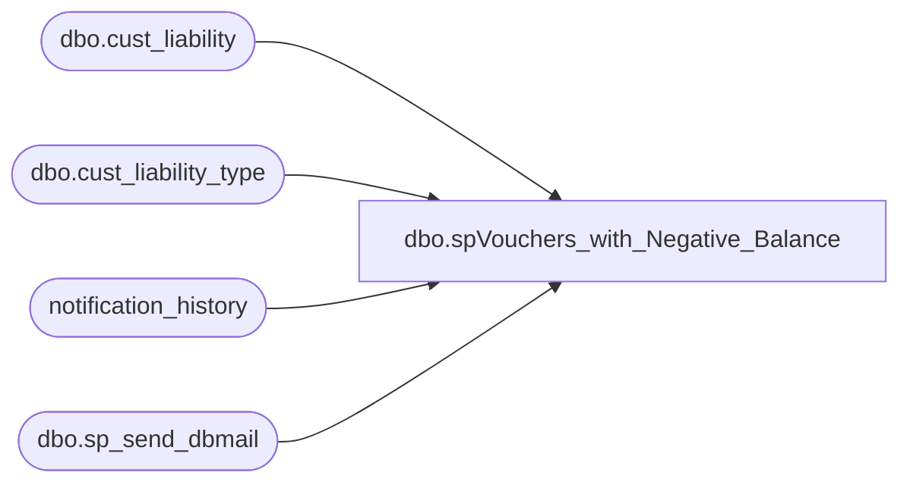

# dbo.spVouchers_with_Negative_Balance

**Database:** auditworks  
**Server:** bedrockdb01  

## Architecture Diagram



## Table Dependencies

| Referenced Table |
|---|
| dbo.cust_liability |
| dbo.cust_liability_type |
| notification_history |
| dbo.sp_send_dbmail |

## Stored Procedure Code

```sql
--DROP PROC [dbo].[spVouchers_with_Negative_Balance]
--GO

CREATE PROC [dbo].[spVouchers_with_Negative_Balance]
-- =============================================================================================================
-- Name: [dbo].[spVouchers_with_Negative_Balance]
--
-- Description:	Emails notification if vouchers are found with a negative balance 
--
-- Input: N/A
--
-- Output: N/A
--
-- Dependencies: N/A
--
-- Revision History
--		Name:			Date:			Comments:
--		Paul Beckman	04/10/2012		Created SP
--		Paul Beckman	07/19/2015		Updated from POSDBSSA to BEDROCKDB01
--		Paul Beckman	08/31/2016		Updated profile_name from 'POSadmin' to 'SAAdmin'
--		Paul Beckman	01/19/2017		Updated email body to HTML
--		Paul Beckman	08/21/2018		Removed old non-HTML code for email body
--		Paul Beckman	07/26/2019		Changed message body column from counts to reference numbers
--		Paul Beckman	10/14/2019		Changed receipient from lindaK to SalesAuditBears
--		Paul Beckman	10/18/2019		Updated to use notification_history table
--		Paul Beckman	02/05/2020		Updated email profile to 'EntSysSupport'
--
-- exec spVouchers_with_Negative_Balance
-- =============================================================================================================
AS
SET NOCOUNT ON


DECLARE @sql VARCHAR(8000)
DECLARE @recipients VARCHAR(4000)
DECLARE @copy_recipients VARCHAR(4000)
DECLARE @Subject VARCHAR(80)
DECLARE @query VARCHAR(8000)
DECLARE @text nvarchar(max)

--SET @recipients = 'paulb@buildabear.com'
SET @recipients = 'SalesAuditBears@buildabear.com'
SET @copy_recipients = 'EntSysSupport@buildabear.com'

--#########################################
-- DETAIL OF SFS VOUCHERS
--#########################################

IF (SELECT COUNT(reference_no)
--SELECT *
FROM auditworks.dbo.cust_liability
WHERE liability_amount < 0
AND reference_type IN (7,31,35,104)
AND reference_no != '0000000006.10E+16') = 0
GOTO FINISH

SET @text = 
		'<font face =arial size = 2>' +
		'Customer Liability records have been found with a negative liability amount balance. <br>' +
		'<br>' +
		'<table border="1">' + 
		'<font face =arial size = 2>' +
		'<tr bgcolor=#D5D5F7><th>Reference Type</th><th>Reference Number</th></tr>' +
		CAST ( ( SELECT td = b.tracking_id_description + ' (' + CONVERT(VARCHAR(5),a.reference_type) + ') ', '',
						[td/@align]='left',
						td = a.reference_no, ''
						--td = FORMAT(COUNT(a.reference_no),'#,###'), ''
				FROM auditworks.dbo.cust_liability a,
					auditworks.dbo.cust_liability_type b
				WHERE a.reference_type = b.reference_type
				AND liability_amount < 0
				AND a.reference_type IN (7,31,35,104)
				AND a.reference_no != '0000000006.10E+16'
				GROUP BY a.reference_type,b.tracking_id_description,a.reference_no
				FOR xml path ('tr'), type
		) AS NVARCHAR(MAX) ) +
		'</table>' +
		'<font face =arial size = 1 color="#C0C0C0">' +
		'<br><br><br><br>' +
		'Server:  BEDROCKDB01 <br>' +
		'Job Name:  Vouchers with Negative Balance <br>' +
		'Stored Proc:  BEDROCKDB01.auditworks.dbo.spVouchers_with_Negative_Balance <br>' +
		'Created by:  Paul Beckman <br>' +
		'Team Ownership:  Enterprise Systems <br>'

SET @Subject = 'ALERT - Vouchers found with negative balance'
	EXEC msdb.dbo.sp_send_dbmail  
	@profile_name = 'EntSysSupport',
	@recipients = @recipients,
	@copy_recipients = @copy_recipients,
	@subject=@Subject, 
	@body = @text,
	@body_format = 'HTML'
	
	INSERT INTO notification_history
	(stored_proc_name,
	record_logged_datetime,
	issues_found,
	action_required,
	notification_sent,
	email_type,
	email_to,
	email_cc,
	email_subject,
	comment
	)
	VALUES (
	'spVouchers_with_Negative_Balance', --<< Stored Proc name
	GETDATE(),
	'Yes', --<< Issues found - Yes / No
	'No', --<< Action required - Yes / No
	'Yes', --<< Notification sent - Yes / No
	'Alert', --<< Email type - Notification Only / Alert / Warning
	@recipients, --<< Email TO
	@copy_recipients, --<< Email CC
	@Subject, --<< Email Subject
	'Customer Liability records have been found with a negative liability amount balance' --<< Comment
	)

FINISH:
```

