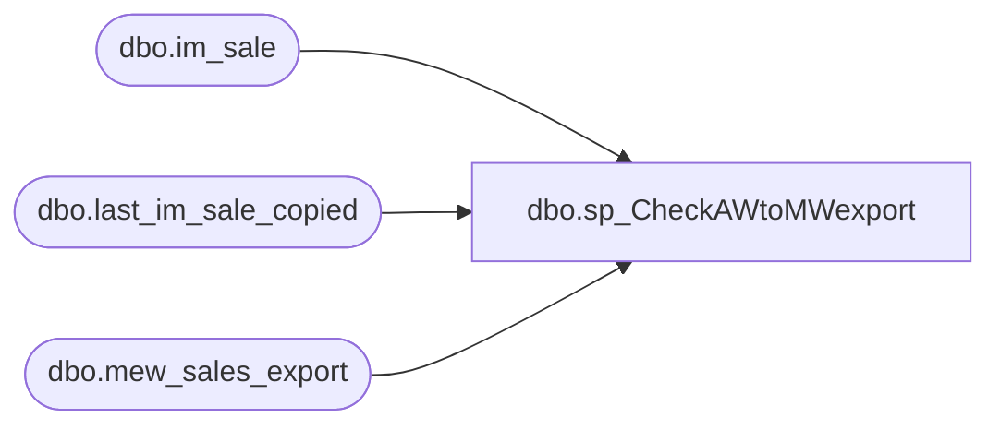

# dbo.sp_CheckAWtoMWexport

**Database:** auditworks  
**Server:** bedrockdb01  

## Architecture Diagram



## Table Dependencies

| Referenced Table |
|---|
| dbo.im_sale |
| dbo.last_im_sale_copied |
| dbo.mew_sales_export |

## Stored Procedure Code

```sql
CREATE  procedure [dbo].[sp_CheckAWtoMWexport]
as
-- =====================================================================================================
-- Name: sp_CheckAWtoMWexport
--
-- Description:	
--
-- Input:	
--			N/A		
--
-- Output: Resultset with the following columns:
--			N/A
--
-- Dependencies: None
--
-- Revision History
--		Name:			Date:			Comments:
--		?				08/24/2010		Initial version source control
--		GaryD			08/24/2010		Replace openrowset with linked server to eliminate need for account credentials in procedure
--		Keith L			10/31/2010		Made some description changes to reflect new SA DB server.
--		Paul Beckman	07/19/2015		Updated from POSDBSSA to BEDROCKDB01 and OURSMERCHDB01 to BEDROCKDB02
-- =====================================================================================================


/********************************************************************************************************/
/* last_im_sale_copied is a one row table that indicates the last row segment 115 has  processed from 
   the Auditworks export table.
   The im_sale_number that is returned from the sql statement should be verified against the 
   mew_sales_export table on OURSBLANC. This will indicate if there are sales transactions in
   Auditworks that have yet to post to Merchantworks. 							*/

declare @last_row decimal (24,0)
select @last_row= im_sale_number from BEDROCKDB02.me_01.dbo.last_im_sale_copied

/********************************************************************************************************/
/* mew_sales_export is updated via the SRMainExport. This includes all sales transactions that have
   been translated/edited.
   Segment 115 will read from this auditworks table and insert the same rows into MERCHANTWORKS IM_SALE 
   TABLE based on the last im_sale_number.  
   If you get a count greater than 0 then this means you have outstanding sales transactions that did not
   post to Merchantworks. If segment 115/116 are idle, then you can manually rerun these segments to
   post your sale transactions. Also note that the next scheduled run of segment 115/116 will pick up
   all outstanding sales transactions.									*/

declare @srmain_check int
select @srmain_check = count(*)
from auditworks.dbo.mew_sales_export msw
where msw.identity_no > @last_row
if @srmain_check = 0
	begin
		print '-----------------------------------------------------------------------------------------'
		print '*** POSTING from AUDITWORKS to MERCHANDISING IM_SALE TABLE SUCCESSFUL .'
		print 'The number of rows in the BEDROCKDB01.dbo.auditworks.mew_sales_export table to post to Merchantworks is:' 
		print @srmain_check
		print 'There are no posting errors from Auditworks to Merchantworks.'
		print '-----------------------------------------------------------------------------------------'
		print ''
		
	end
else
	begin
		print '**************************************************************************'
		print '*** THERE WERE ERRORS while POSTING from AUDITWORKS to MERCHANDISING IM_SALE TABLE'
		print 'The number of rows in the BEDROCKDB01.dbo.auditworks.mew_sales_export table to post to Merchantworks is:' 
		print @srmain_check
		print 'The posting from Auditworks to Merchantworks was NOT successful' 
		print 'Contact STS support for assistance.'
		print '**************************************************************************'
		print ''
	end

--Second part of SP:
/********************************************************************************************************/		
/* im_sale table is updated by running segment 115. Segment 116 will select rows from im_sale and 	 
   insert into the infobase tables.  									 
   Segment 116 will also delete each row from im_sale as it posts to infobase.			 
   The following sql statement should return 0 rows after segment 116 completes its job run. 		 
   Any left_over rows would indicate a validation posting error and should be reported to STS.		 
   Validation errors can consist of invalid store, style, or vendor-style 				*/


--Second part of SP:
/********************************************************************************************************/		
/* im_sale table is updated by running segment 115. Segment 116 will select rows from im_sale and 	 
   insert into the infobase tables.  									 
   Segment 116 will also delete each row from im_sale as it posts to infobase.			 
   The following sql statement should return 0 rows after segment 116 completes its job run. 		 
   Any left_over rows would indicate a validation posting error and should be reported to STS.		 
   Validation errors can consist of invalid store, style, or vendor-style 				*/

declare @im_sale_count int
select @im_sale_count = count(*) from BEDROCKDB02.me_01.dbo.im_sale


if @im_sale_count = 0
	begin
		print '-----------------------------------------------------------------------------------------'
		print '*** POSTING from MERCHANDISING IM_SALE TABLE to INFOBASE was SUCCESSFUL.'
		print 'The number of rows in the im_sale table to post to Infobase is:' 
		print @im_sale_count
		print 'There are no validation posting errors from IM_SALE TABLE to Infobase.'
		print '-----------------------------------------------------------------------------------------'
		print ''
	end
else
	begin
		print '**************************************************************************'
		print '*** THERE WERE VALIDATION ERRORS while POSTING from MERCHANDISING IM_SALE TABLE to INFOBASE'
		print 'The number of rows in the im_sale table to post to Infobase is:' 
		print @im_sale_count
		print 'The posting from IM_SALE TABLE to Infobase was NOT successful' 
		print 'Contact STS support for assistance.'
		print '**************************************************************************'
		print ''
	end

return
```

