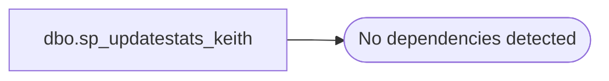

# dbo.sp_updatestats_keith

**Database:** auditworks  
**Server:** bedrockdb01  

## Architecture Diagram



## Table Dependencies

_No table dependencies detected._

## Stored Procedure Code

```sql
create PROCEDURE sp_updatestats_keith
@resample CHAR(8)='NO'
AS

	DECLARE @dbsid varbinary(85)

	SELECT  @dbsid = sid
	FROM master.dbo.sysdatabases
    WHERE name = db_name()

	/*Check the user sysadmin*/
	 IF NOT is_srvrolemember('sysadmin') = 1 AND suser_sid() <> @dbsid
		BEGIN
			RAISERROR(15247,-1,-1)
			RETURN (1)
		END

	if UPPER(@resample)<>'RESAMPLE' AND UPPER(@resample)<>'NO'
	begin
   		raiserror(N'Invalid option: %s', 1, 1, @resample)
		return (1)
	end

	-- required so it can update stats on on ICC/IVs
	set ansi_nulls on
	set quoted_identifier on
	set ansi_warnings on
	set ansi_padding on
	set arithabort on
	set concat_null_yields_null on
	set numeric_roundabort off


	DECLARE @exec_stmt nvarchar(540)
	DECLARE @tablename sysname
	DECLARE @uid smallint
	DECLARE @user_name sysname
	DECLARE @tablename_header varchar(267)
	DECLARE ms_crs_tnames CURSOR LOCAL FAST_FORWARD READ_ONLY FOR SELECT name, uid FROM sysobjects WHERE type = 'U'
	OPEN ms_crs_tnames
	FETCH NEXT FROM ms_crs_tnames INTO @tablename, @uid
	WHILE (@@fetch_status <> -1)
	BEGIN
		IF (@@fetch_status <> -2)
		BEGIN
			SELECT @user_name = user_name(@uid)
			SELECT @tablename_header = 'Updating ' + @user_name +'.'+ RTRIM(@tablename)
			PRINT @tablename_header
			SELECT @exec_stmt = 'UPDATE STATISTICS ' + quotename( @user_name , '[')+'.' + quotename( @tablename, '[') 
			SET @exec_stmt = @exec_stmt + ' WITH RESAMPLE'
			EXEC (@exec_stmt)
		END
		FETCH NEXT FROM ms_crs_tnames INTO @tablename, @uid
	END
	PRINT ' '
	PRINT ' '
	raiserror(15005,-1,-1)
	DEALLOCATE ms_crs_tnames
	RETURN(0) -- sp_updatestats
```

