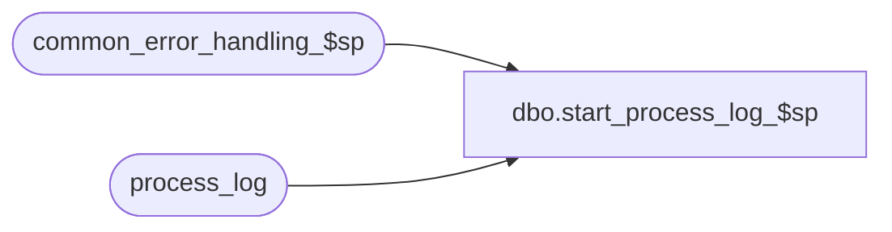

# dbo.start_process_log_$sp

**Database:** auditworks  
**Server:** bedrockdb01  

## Architecture Diagram



## Table Dependencies

| Referenced Table |
|---|
| common_error_handling_$sp |
| process_log |

## Stored Procedure Code

```sql
create proc dbo.start_process_log_$sp   @process_no 			smallint,
  @process_timestamp 		float 		OUTPUT,
  @errmsg 			nvarchar(2000)	OUTPUT,
  @batch_process_id 		tinyint = 0,
  @process_start_time		datetime = NULL,
  @file_name                    nvarchar(255) = NULL 
  AS
/* Version: 1.01 Date:1997/06/30
** Author: Phu, last modified by Paul S. on 1997/11/24
** Proc name: start_process_log_$sp
** Purpose:   Logs start time of a process in process_log
**            Called from dayend and other procs
** Unicode version.

  HISTORY:
Date		Name		Defect	Desc  
May11,16        Vicci         DAOM-730  Don't overlay timestamp passed in.
Apr19,02 	Winnie	       1-CD0IX	R3 error handling
Feb02,01	SHUZ	        6600    express_add,add file_name as input parameter and log
                                        it into process_log
**/				
DECLARE
	@current_date 			datetime,
	@errno 				int,
	@process_status_flag 		tinyint,
	@transaction_count 		numeric(12,0),
	@message_id		       	int,	
	@object_name			nvarchar(255),
  	@operation_name			nvarchar(100),
  	@process_name		       	nvarchar(100)
 

/* calculate process_timestamp as month-day-hour-min-sec-millisec */

SELECT @process_name = 'start_process_log_$sp',
       @message_id = 201068


IF @process_start_time IS NULL
SELECT @process_start_time = getdate()

SELECT
 	@current_date = @process_start_time,
	@process_status_flag = 1,
	@transaction_count = 0

IF @process_timestamp IS NULL OR @process_timestamp < 100000000000
BEGIN
SELECT 	@process_timestamp =  DATEPART ( mm, @current_date ) * 100000000000.0
		+ DATEPART ( dd, @current_date ) * 1000000000.0
		+ DATEPART ( hh, @current_date ) * 10000000.0
		+ DATEPART ( mi, @current_date ) * 100000.0
		+ DATEPART ( ss, @current_date ) * 1000.0
		+ DATEPART ( ms, @current_date )
END

INSERT process_log (
	process_no, 
	process_timestamp,
	process_start_time,
	process_end_time,
	transaction_count,
	process_status_flag,
	file_name,--defect 6600
	batch_process_id )
VALUES ( @process_no,
	@process_timestamp,
	@process_start_time,
	@process_start_time,
	@transaction_count,
	@process_status_flag,
	@file_name, --defect 6600
	@batch_process_id )

SELECT @errno = @@error
IF @errno <> 0
  BEGIN
	SELECT @errmsg = 'Unable to insert process_log',
  	       @object_name = 'process_log',
               @operation_name = 'INSERT'
	GOTO error
  END

RETURN

error:   /* Common error handler */

	EXEC common_error_handling_$sp @process_no, @errno, @errmsg, 0, @message_id, 
	@process_name, @object_name, @operation_name
	RETURN
```

